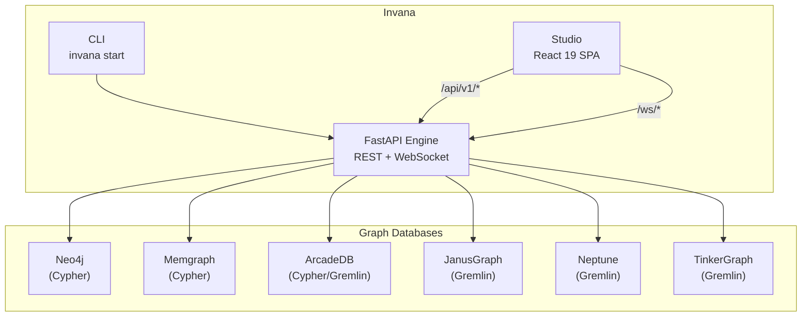
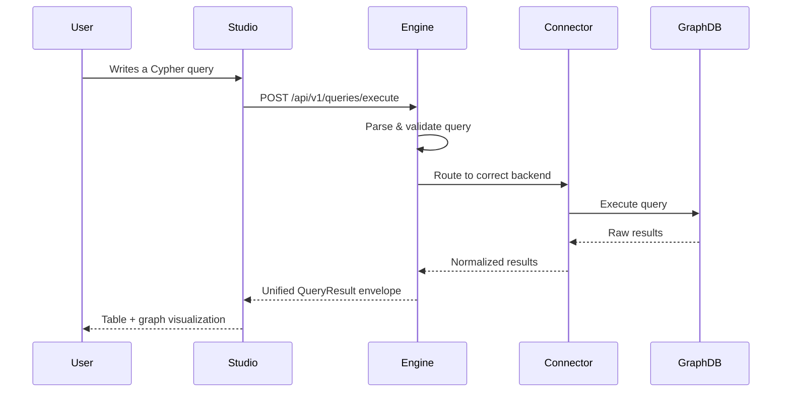

# Architecture

Invana is a monorepo containing two main components that are built together and distributed flexibly.

## Overview

## Components

### Engine (`engine/`)

The Python backend — the core of Invana. It handles:

- **API layer** — REST endpoints and WebSocket streams
- **Modelling** — Ontology definitions, schema versioning, constraints
- **Query Engine** — Async query execution with connection pooling
- **Connectors** — Database adapters for Cypher and Gremlin backends
- **Algorithms** — Graph algorithms (centrality, community detection, pathfinding)
- **Simulation** — Game theory, hypothesis testing, parameter sweeps
- **Storage** — App state persistence (saved queries, projects, configs)
- **Auth** — JWT + OAuth2/SSO

### Studio (`studio/`)

The React web UI. It consumes:

- `@invana/design-kit` — UI components (TailwindCSS 4 + shadcn)
- `@invana/canvas` — Graph visualization (PixiJS 8, WebGPU/WebGL)

Studio is a thin integration layer — it composes components from these packages, manages routing, and connects to the engine API.

## Distribution

Invana is distributed as a single Python package and Docker images:

| Method | Command | What you get |
|---|---|---|
| **pip** | `pip install invana` | Engine + bundled Studio |
| **Docker (all-in-one)** | `docker run invana/invana` | Engine + Studio in one container |
| **Docker (separate)** | `invana/engine` + `invana/studio` | Scale independently |

When installed via pip, Studio's built static files are bundled inside the Python package. FastAPI serves them alongside the API — one process, one port.

## Request Flow

## Tech Stack

| Layer | Technology |
|---|---|
| Engine framework | FastAPI + uvicorn (async) |
| Python packaging | uv |
| App state DB | SQLAlchemy async (SQLite dev / PostgreSQL prod) |
| Studio framework | React 19 + Vite |
| Studio packages | pnpm |
| UI components | `@invana/design-kit` |
| Graph rendering | `@invana/canvas` |
| Client state | Zustand |
| Server state | TanStack Query |
| Query editor | CodeMirror 6 |
