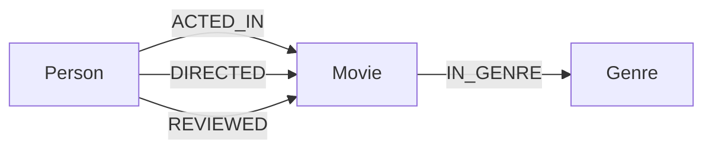

# Ontology Modelling

Invana uses ontologies to define the structure of your graph data — what types of nodes and edges exist, what properties they have, and what constraints apply.

## Why Ontologies?

Graph databases are schema-flexible, which is powerful but can lead to inconsistency. An ontology gives you:

- **Structure** — Clearly defined node types, edge types, and properties
- **Validation** — Enforce property types and required fields
- **Versioning** — Evolve your schema over time without breaking things
- **Documentation** — The ontology IS the documentation of your data model
- **Query assistance** — Studio uses the ontology for autocomplete and visualization styling

## Core Concepts

### Node Types

A node type defines a category of vertices in your graph.

```json
{
  "name": "Person",
  "description": "A human individual",
  "properties": [
    {"name": "name", "type": "string", "required": true},
    {"name": "born", "type": "integer"},
    {"name": "email", "type": "string", "unique": true}
  ]
}
```

### Edge Types

An edge type defines a relationship between node types.

```json
{
  "name": "ACTED_IN",
  "description": "A person acted in a movie",
  "source": "Person",
  "target": "Movie",
  "properties": [
    {"name": "roles", "type": "list[string]"},
    {"name": "year", "type": "integer"}
  ],
  "cardinality": "many-to-many"
}
```

### Property Types

| Type | Description | Example |
|---|---|---|
| `string` | Text | `"Alice"` |
| `integer` | Whole number | `1964` |
| `float` | Decimal number | `8.7` |
| `boolean` | True/false | `true` |
| `datetime` | ISO 8601 timestamp | `"2026-04-08T12:00:00Z"` |
| `list[T]` | Ordered list of type T | `["Neo", "Thomas Anderson"]` |
| `map` | Key-value pairs | `{"lat": 37.7, "lng": -122.4}` |
| `vector` | Float array (embeddings) | `[0.1, 0.2, ...]` |

### Constraints

Constraints enforce data integrity at the ontology level.

| Constraint | Applies to | Description |
|---|---|---|
| `required` | Property | Must be present on every instance |
| `unique` | Property | No two nodes of the same type share this value |
| `cardinality` | Edge type | `one-to-one`, `one-to-many`, `many-to-many` |
| `min`/`max` | Property | Numeric range constraints |
| `pattern` | Property | Regex pattern for strings |
| `enum` | Property | Restricted to a set of allowed values |

## Schema Versioning

Every ontology has a version following [SemVer](https://semver.org/):

```
1.0.0 → 1.1.0   (added a new node type — minor)
1.1.0 → 2.0.0   (removed a property — breaking change — major)
1.1.0 → 1.1.1   (fixed a description — patch)
```

When you update an ontology, Invana:

1. Validates the change against the previous version
2. Classifies it as major/minor/patch
3. Stores both versions — you can query against any version
4. Optionally generates migration guidance for breaking changes

## Serialization Formats

Ontologies can be imported and exported in standard formats:

| Format | Use case |
|---|---|
| **JSON** | Native Invana format. Used by the API. |
| **OWL** | W3C Web Ontology Language. Interop with semantic web tools. |
| **RDF/RDFS** | Resource Description Framework. Linked data. |
| **JSON-LD** | JSON for Linked Data. Web-friendly RDF. |
| **SHACL** | Shapes Constraint Language. Validation rules. |

## Example: Movie Domain



```json
{
  "name": "Movie Graph",
  "version": "1.0.0",
  "node_types": [
    {
      "name": "Person",
      "properties": [
        {"name": "name", "type": "string", "required": true},
        {"name": "born", "type": "integer"}
      ]
    },
    {
      "name": "Movie",
      "properties": [
        {"name": "title", "type": "string", "required": true},
        {"name": "released", "type": "integer"},
        {"name": "tagline", "type": "string"}
      ]
    },
    {
      "name": "Genre",
      "properties": [
        {"name": "name", "type": "string", "required": true, "unique": true}
      ]
    }
  ],
  "edge_types": [
    {"name": "ACTED_IN", "source": "Person", "target": "Movie"},
    {"name": "DIRECTED", "source": "Person", "target": "Movie"},
    {"name": "REVIEWED", "source": "Person", "target": "Movie"},
    {"name": "IN_GENRE", "source": "Movie", "target": "Genre"}
  ]
}
```

## What's Next?

- [Building an Ontology](../guides/building-ontology.md) — Step-by-step guide
- [Query Engine](query-engine.md) — Execute queries against your modelled data
- [Studio: Modelling](../studio/modelling.md) — Visual ontology designer
