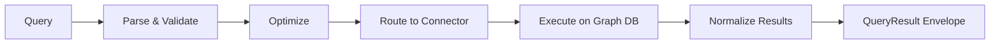

# Query Engine

Invana's query engine is a high-performance async execution layer that routes queries to the appropriate graph database and returns results in a unified format.

## How It Works



### 1. Parse & Validate

The engine detects the query language (Cypher or Gremlin), validates syntax, and extracts query parameters.

### 2. Optimize

Query plans are analyzed for potential optimizations:

- Parameter binding (prevents injection)
- Query caching for repeated patterns
- Pagination pushdown to the database

### 3. Route to Connector

Based on the active connection, the query is routed to the correct database connector.

### 4. Execute

The connector executes the query asynchronously against the graph database using the native driver with connection pooling.

### 5. Normalize Results

Raw database results are converted into a unified `QueryResult` envelope, regardless of which database was queried.

## Query Languages

### Cypher

Used by Neo4j, Memgraph, and ArcadeDB.

```cypher
MATCH (p:Person)-[:ACTED_IN]->(m:Movie)
WHERE m.released > 2000
RETURN p.name AS actor, m.title AS movie
ORDER BY m.released DESC
LIMIT 25
```

### Gremlin

Used by JanusGraph, Amazon Neptune, TinkerGraph, and ArcadeDB.

```groovy
g.V().hasLabel('Person')
  .outE('ACTED_IN').inV()
  .hasLabel('Movie')
  .has('released', gt(2000))
  .path()
  .limit(25)
```

## Unified Result Format

Regardless of the query language or database, results are returned in a consistent envelope:

```json
{
  "id": "qr_abc123",
  "status": "completed",
  "duration_ms": 42,
  "language": "cypher",
  "result": {
    "nodes": [
      {
        "id": "n1",
        "label": "Person",
        "properties": {"name": "Keanu Reeves", "born": 1964}
      },
      {
        "id": "n2",
        "label": "Movie",
        "properties": {"title": "The Matrix", "released": 1999}
      }
    ],
    "edges": [
      {
        "id": "e1",
        "label": "ACTED_IN",
        "source": "n1",
        "target": "n2",
        "properties": {"roles": ["Neo"]}
      }
    ],
    "records": [
      {"actor": "Keanu Reeves", "movie": "The Matrix"}
    ],
    "metadata": {
      "node_count": 2,
      "edge_count": 1,
      "record_count": 1
    }
  }
}
```

The result contains **both** the graph structure (nodes + edges) and the tabular records. Studio uses the graph structure for visualization and the records for the table view.

## Connection Pooling

Each database connection maintains an async connection pool:

| Setting | Default | Description |
|---|---|---|
| `pool_size` | `10` | Number of connections per pool |
| `max_overflow` | `20` | Additional connections under load |
| `pool_timeout` | `30s` | Wait time for a connection from the pool |
| `pool_recycle` | `3600s` | Recycle connections after this duration |

## Streaming Results

For large result sets, the query engine supports WebSocket streaming:

```
WS /ws/query-stream

→ {"action": "execute", "query": "MATCH ...", "connection_id": "..."}
← {"type": "metadata", "total_rows": 10000}
← {"type": "batch", "records": [...], "batch": 1, "of": 100}
← {"type": "batch", "records": [...], "batch": 2, "of": 100}
...
← {"type": "complete", "duration_ms": 1250}
```

## What's Next?

- [Connectors](connectors.md) — How database adapters work
- [Running Queries](../guides/running-queries.md) — Step-by-step guide
- [Studio: Query Workspace](../studio/query-workspace.md) — Visual query editor
