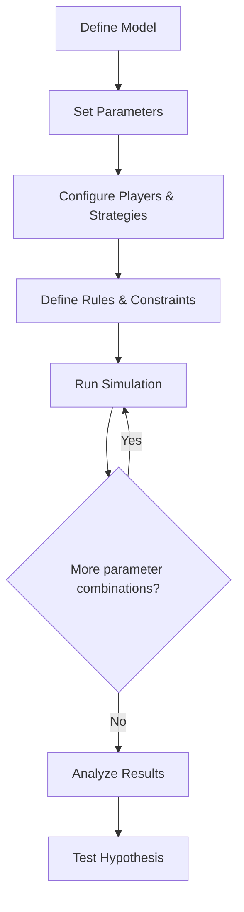

# Simulations

Invana's simulation engine lets you run decision models, game theory experiments, and hypothesis tests on your graph data. Define players, rules, strategies, and parameters — then simulate outcomes.

## Concepts

### The Simulation Loop



### Models

A simulation model defines the structure of the game or decision environment. It maps to your graph ontology — nodes are entities, edges are relationships, and the simulation evolves the graph state over time.

### Players

Players are agents that act within the simulation. Each player has:

- **Identity** — Name, type, attributes
- **Strategy** — How they make decisions
- **Objectives** — What they're optimizing for
- **Constraints** — What they can and cannot do

### Strategies

Strategies define how players make decisions:

| Strategy | Description |
|---|---|
| **Random** | Choose uniformly at random from legal moves |
| **Greedy** | Choose the move with the best immediate payoff |
| **Minimax** | Optimal play in zero-sum two-player games |
| **Nash Equilibrium** | No player can improve by changing only their strategy |
| **Custom** | Define your own decision function |

### Rules

Rules are declarative constraints evaluated on the graph state:

```json
{
  "name": "No self-loops",
  "condition": "source != target",
  "applies_to": "all_edges",
  "enforcement": "hard"
}
```

| Enforcement | Description |
|---|---|
| `hard` | Violation prevents the action |
| `soft` | Violation applies a penalty to the payoff |

### Parameters

Parameter spaces define the variables that change across simulation runs:

```json
{
  "parameters": [
    {
      "name": "cooperation_weight",
      "type": "range",
      "min": 0.0,
      "max": 1.0,
      "step": 0.1
    },
    {
      "name": "network_size",
      "type": "discrete",
      "values": [10, 50, 100, 500]
    }
  ]
}
```

Invana runs every combination (parameter sweep) and reports results for each.

## Example: Tic-Tac-Toe

A complete example of modelling a game in Invana.

### 1. Define the Model

```json
{
  "name": "Tic-Tac-Toe",
  "description": "3x3 grid, two players, first to three in a row wins",
  "node_types": [
    {"name": "Cell", "properties": [
      {"name": "row", "type": "integer"},
      {"name": "col", "type": "integer"},
      {"name": "state", "type": "string", "enum": ["empty", "X", "O"]}
    ]},
    {"name": "Board", "properties": [
      {"name": "turn", "type": "integer"},
      {"name": "status", "type": "string", "enum": ["playing", "X_wins", "O_wins", "draw"]}
    ]}
  ],
  "edge_types": [
    {"name": "HAS_CELL", "source": "Board", "target": "Cell"},
    {"name": "ADJACENT", "source": "Cell", "target": "Cell"}
  ]
}
```

### 2. Define Players

```json
{
  "players": [
    {"name": "Player X", "strategy": "minimax", "symbol": "X"},
    {"name": "Player O", "strategy": "random", "symbol": "O"}
  ]
}
```

### 3. Define Rules

```json
{
  "rules": [
    {
      "name": "Valid move",
      "condition": "cell.state == 'empty'",
      "enforcement": "hard"
    },
    {
      "name": "Win condition",
      "condition": "three consecutive cells with same symbol in row, column, or diagonal",
      "triggers": "set board.status to '{symbol}_wins'"
    },
    {
      "name": "Draw condition",
      "condition": "all cells filled and no winner",
      "triggers": "set board.status to 'draw'"
    }
  ]
}
```

### 4. Run Simulation

```bash
curl -X POST http://localhost:8000/api/v1/simulations/run \
  -H "Content-Type: application/json" \
  -d '{
    "simulation_id": "sim_abc",
    "runs": 1000,
    "parameters": [
      {"name": "player_o_strategy", "values": ["random", "greedy", "minimax"]}
    ]
  }'
```

### 5. Analyze Results

```json
{
  "simulation_id": "sim_abc",
  "total_runs": 3000,
  "results": [
    {
      "parameters": {"player_o_strategy": "random"},
      "outcomes": {"X_wins": 956, "O_wins": 12, "draw": 32},
      "avg_moves": 6.2
    },
    {
      "parameters": {"player_o_strategy": "greedy"},
      "outcomes": {"X_wins": 634, "O_wins": 198, "draw": 168},
      "avg_moves": 7.1
    },
    {
      "parameters": {"player_o_strategy": "minimax"},
      "outcomes": {"X_wins": 0, "O_wins": 0, "draw": 1000},
      "avg_moves": 9.0
    }
  ]
}
```

**Insight:** Minimax vs Minimax always draws — perfect play leads to a stalemate. This validates the game model.

## Hypothesis Testing

Formulate and test hypotheses against simulation results:

```json
{
  "hypothesis": "Minimax strategy wins more than 80% against random",
  "metric": "X_wins / total_runs",
  "condition": "> 0.80",
  "parameters": {"player_o_strategy": "random"},
  "result": {
    "observed": 0.956,
    "passes": true,
    "confidence": 0.99
  }
}
```

## Live Simulation Streaming

For long-running simulations, progress is streamed via WebSocket:

```
WS /ws/simulation-stream

→ {"action": "start", "simulation_id": "sim_abc"}
← {"type": "progress", "run": 100, "total": 1000, "elapsed_ms": 2400}
← {"type": "progress", "run": 200, "total": 1000, "elapsed_ms": 4800}
...
← {"type": "complete", "duration_ms": 24000, "results": {...}}
```

## What's Next?

- [Running Simulations](../guides/running-simulations.md) — Step-by-step guide
- [Tic-Tac-Toe Example](../guides/tic-tac-toe-example.md) — Full walkthrough
- [Algorithms](algorithms.md) — Use algorithms as simulation inputs
- [Studio: Simulation Dashboard](../studio/simulation-dashboard.md) — Visual builder
