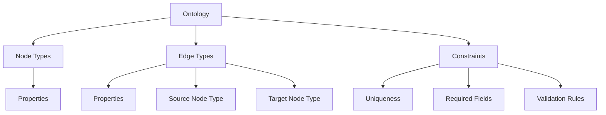

# Building an Ontology

An ontology defines the schema of your knowledge graph — the types of nodes, edges, properties, and constraints that govern your data. Invana's ontology system supports schema versioning, validation, and serialization to industry-standard formats.

## Ontology Concepts



## Design Principles

1. **Start small** — model the core domain first, extend later
2. **Use constraints** — enforce data quality at the schema level
3. **Version everything** — every schema change creates a new version
4. **Name consistently** — PascalCase for types, camelCase for properties

## Step 1: Define Node Types

Node types represent the entities in your domain.

### Via Studio

Navigate to **Modelling → Node Types → Add Node Type**.

### Via API

```bash
curl -X POST http://localhost:8000/api/v1/models/node-types \
  -H "Content-Type: application/json" \
  -d '{
    "label": "Person",
    "properties": [
      {"name": "name", "type": "string", "required": true},
      {"name": "email", "type": "string", "required": false},
      {"name": "age", "type": "integer", "required": false}
    ],
    "constraints": {
      "unique": ["email"]
    }
  }'
```

### Property Types

| Type       | Description              | Example                  |
|------------|--------------------------|--------------------------|
| `string`   | Text value               | `"Alice"`                |
| `integer`  | Whole number             | `42`                     |
| `float`    | Decimal number           | `3.14`                   |
| `boolean`  | True/false               | `true`                   |
| `datetime` | ISO 8601 timestamp       | `"2025-01-15T10:30:00Z"` |
| `list`     | Array of values          | `["a", "b", "c"]`       |
| `map`      | Key-value pairs          | `{"key": "value"}`       |
| `vector`   | Float array for embeddings | `[0.1, 0.2, ...]`     |

## Step 2: Define Edge Types

Edge types represent relationships between node types.

```bash
curl -X POST http://localhost:8000/api/v1/models/edge-types \
  -H "Content-Type: application/json" \
  -d '{
    "label": "WORKS_AT",
    "source": "Person",
    "target": "Company",
    "properties": [
      {"name": "since", "type": "datetime", "required": true},
      {"name": "role", "type": "string", "required": false}
    ],
    "cardinality": "many-to-one"
  }'
```

### Cardinality Options

| Cardinality    | Meaning                                  |
|----------------|------------------------------------------|
| `one-to-one`   | Each source connects to exactly one target |
| `one-to-many`  | Each source connects to many targets     |
| `many-to-one`  | Many sources connect to one target       |
| `many-to-many` | No restrictions (default)                |

## Step 3: Add Constraints

Constraints enforce data integrity rules.

```json
{
  "node_type": "Person",
  "constraints": {
    "unique": ["email"],
    "required": ["name"],
    "validation": [
      {
        "property": "age",
        "rule": "range",
        "min": 0,
        "max": 150
      },
      {
        "property": "email",
        "rule": "pattern",
        "regex": "^[\\w.-]+@[\\w.-]+\\.\\w+$"
      }
    ]
  }
}
```

## Step 4: Version Your Schema

Every schema modification creates a new version automatically:

```bash
curl http://localhost:8000/api/v1/models/versions
```

```json
{
  "versions": [
    {"version": 1, "created_at": "2025-01-15T10:00:00Z", "changes": 3},
    {"version": 2, "created_at": "2025-01-15T11:30:00Z", "changes": 1}
  ],
  "current": 2
}
```

### Viewing a Diff

```bash
curl http://localhost:8000/api/v1/models/versions/diff?from=1&to=2
```

```json
{
  "added": [],
  "removed": [],
  "modified": [
    {
      "type": "node_type",
      "label": "Person",
      "changes": [
        {"action": "add_property", "property": "email", "type": "string"}
      ]
    }
  ]
}
```

## Step 5: Export Your Ontology

Invana supports exporting ontologies to standard formats:

=== "JSON"

    ```bash
    curl http://localhost:8000/api/v1/models/export?format=json -o ontology.json
    ```

=== "OWL"

    ```bash
    curl http://localhost:8000/api/v1/models/export?format=owl -o ontology.owl
    ```

=== "JSON-LD"

    ```bash
    curl http://localhost:8000/api/v1/models/export?format=jsonld -o ontology.jsonld
    ```

=== "SHACL"

    ```bash
    curl http://localhost:8000/api/v1/models/export?format=shacl -o ontology.shacl.ttl
    ```

## Example: Movie Domain

A complete ontology for a movie database:

```json
{
  "name": "MovieDomain",
  "node_types": [
    {
      "label": "Person",
      "properties": [
        {"name": "name", "type": "string", "required": true},
        {"name": "born", "type": "integer"}
      ]
    },
    {
      "label": "Movie",
      "properties": [
        {"name": "title", "type": "string", "required": true},
        {"name": "released", "type": "integer"},
        {"name": "tagline", "type": "string"}
      ]
    },
    {
      "label": "Genre",
      "properties": [
        {"name": "name", "type": "string", "required": true}
      ],
      "constraints": {"unique": ["name"]}
    }
  ],
  "edge_types": [
    {
      "label": "ACTED_IN",
      "source": "Person",
      "target": "Movie",
      "properties": [{"name": "roles", "type": "list"}]
    },
    {
      "label": "DIRECTED",
      "source": "Person",
      "target": "Movie"
    },
    {
      "label": "HAS_GENRE",
      "source": "Movie",
      "target": "Genre",
      "cardinality": "many-to-many"
    }
  ]
}
```

## Next Steps

- [Running Queries](running-queries.md) — query your modelled graph
- [Ontology Concepts](../concepts/ontology-modelling.md) — deep dive into the modelling system
- [Connectors](../concepts/connectors.md) — how ontologies map to different backends
