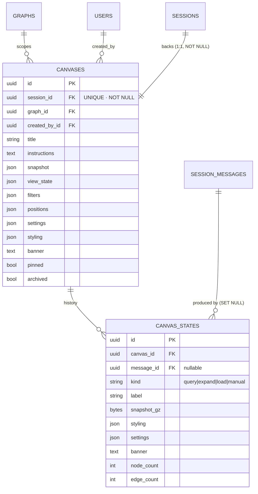
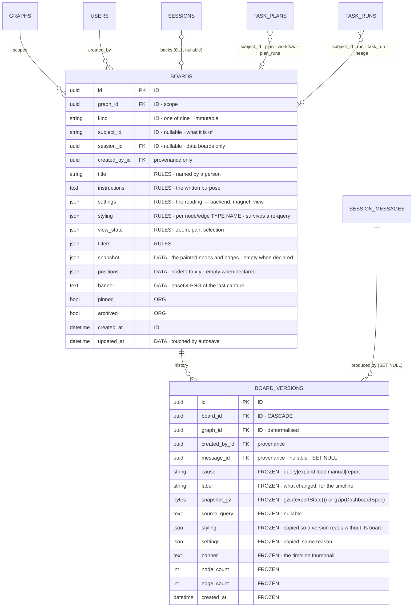
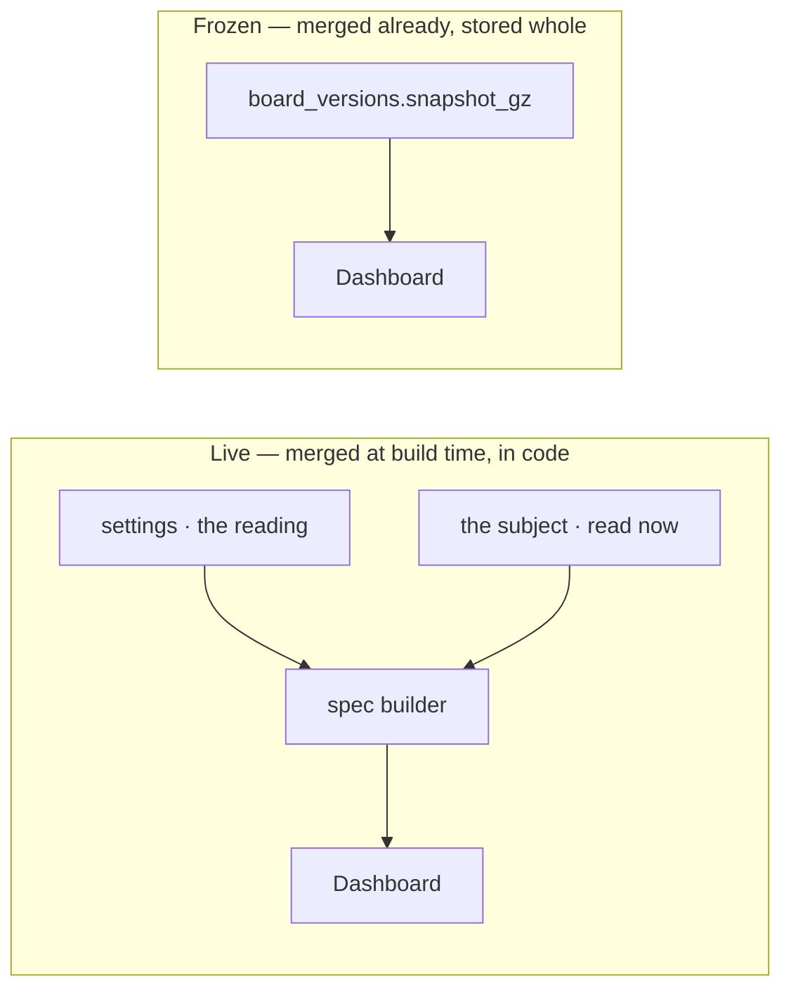
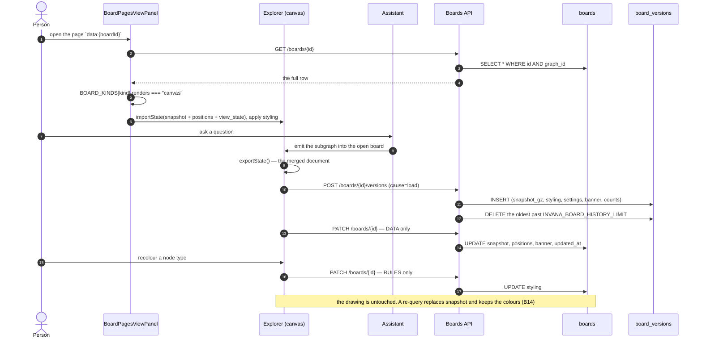
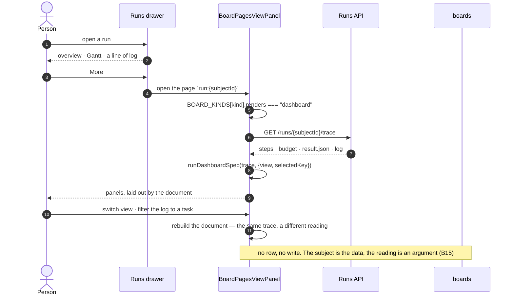
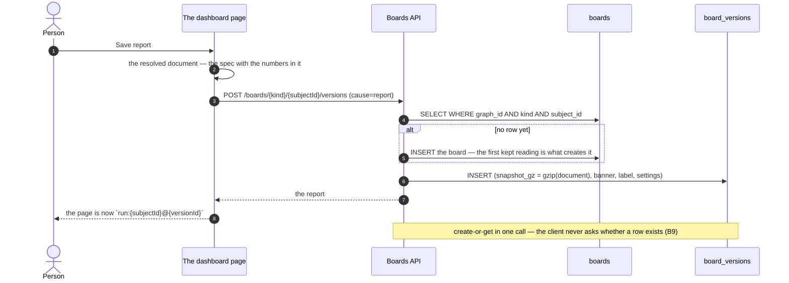
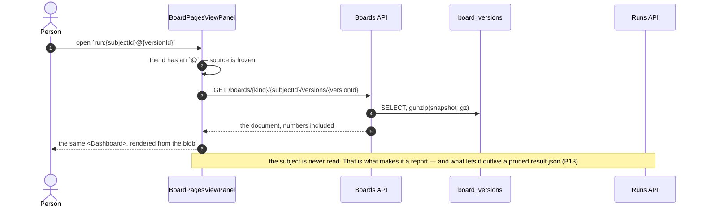
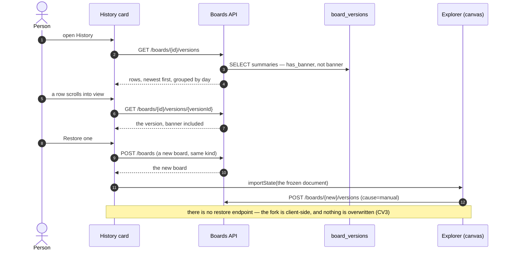

# Boards migration

**`canvases` becomes `boards`, and a board declares one `kind`.** A board is either *drawn* —
elements at positions, a camera, layers, a layout engine — or *declared*: tiles from a closed set
bound to one record. They share the record, the page host, the tab strip, naming and versioning;
they share no drawing code.

| | |
|---|---|
| Feature | [4.2 Canvases](../modules/explore/features/boards.md) → renamed **Boards** by B1 |
| Words | [terminology.md](../terminology.md) — **canvas** keeps its one meaning: *the rendered, pannable drawing surface* (`@invana/canvas`). The saved record is a **board** |
| Supersedes | [CV12](../modules/explore/features/boards.md) — `artboard` is retired before it is built, and `kind` stays the one axis it already is ([B3](#9-decisions)) |
| Package shape | [migration-plan.md](migration-plan.md) — `apps/boards/` + `server/boards/`. **Orthogonal to this file** |
| Not in scope | what a dashboard tile *is*, the closed tile set, `dashboard.yml`'s grammar — that is its own feature file ([§ 10](#10-not-building)) |

---

## 1. Why

| Problem today | What boards fix |
|---|---|
| **One word, three meanings.** `canvas` is the renderer (`@invana/canvas`), the drawing surface, *and* the saved row. `canvas.kind = dashboard` is a canvas that is not drawn on a canvas | The record is a **board**. The renderer and the surface stay **canvas**. The board drawn on one has `renders = canvas` |
| **`artboard` is a fourth word** for the thing the rail, the breadcrumb and the e2e locators already call a canvas | No fourth word. The kinds keep the names they have |
| **`canvases.session_id` is `NOT NULL UNIQUE`** — only a `data` board can exist. A model, plan or dashboard board has no backing session and cannot be saved | `session_id` is nullable provenance, not identity |
| **`kind` is in the doc and nowhere in the schema.** The table has no `kind` at all | One `kind` column, stated at creation, never changed |

---

## 2. The shape change, in one table

| Today | Becomes | Note |
|---|---|---|
| `canvases` | **`boards`** | + `kind` · `subject_id`; `session_id` relaxes to nullable |
| `canvas_states` | **`board_versions`** | the product word is *version*; the engine word stops being `state` ([B6](#9-decisions)) |
| `canvas_states.kind` | **`board_versions.cause`** | `kind` now means the board's kind. A version's `query · expand · load · manual` is a *cause* |
| `Canvas` · `CanvasState` | **`Board`** · **`BoardVersion`** | `apps/boards/models.py` |
| `apps/canvases/` · `server/canvases/` | **`apps/boards/`** · **`server/boards/`** | whole folders, imports follow |
| `…/canvases*` | **`…/boards*`** | `…/boards/{board_id}/versions*` |
| `canvas.created · updated · restored · deleted` | **`board.*`** | same four |
| `INVANA_CANVAS_HISTORY_LIMIT` | **`INVANA_BOARD_HISTORY_LIMIT`** | `settings.canvas_history_limit` → `board_history_limit` |
| `CanvasKind` (six) · `canvasKinds.ts` | **`BoardKind` (nine)** · **`boardKinds.ts`** | the same registry, three rows longer ([§ 5](#5-the-kind-registry)) |
| **unchanged** | `@invana/canvas` · `@invana/canvas-ui` · `BoardPagesViewPanel` · `canvas.exportState()` | the renderer is not renamed and is not ours ([B5](#9-decisions)) |

---

## 3. ER

### 3.1 Today

### 3.2 Target

Every column is tagged with its **lifetime** ([§ 5.4](#54-what-is-stored--three-lifetimes-not-two-halves)):
`ID` identity · `RULES` survives a data replacement · `DATA` replaced by the next query · `ORG`
organisation · `FROZEN` immutable once written.

**What is not an FK.** `subject_id` is a string, not a foreign key — it points at three different
tables by `kind`, and a polymorphic FK is a constraint that cannot be declared. A deleted subject
leaves a board that reads *this run is gone* ([B8](#9-decisions)).

**What is not a column.** `canvas | dashboard` is not stored. It is `renders`, a **property of the
kind**, declared once in the registry — the same way `hasLayers` and `writesFromGesture` already are
([B3](#9-decisions)).

**What is not a row.** A *live* dashboard has none. It is derived from its subject on every open, so
`boards` holds a row only for a board that has something of its own to keep: a drawing, or a frozen
report ([§ 5.2](#52-live-and-frozen) · [B9](#9-decisions)).

### 3.3 The same table, three rows

What actually sits in the columns, for each of the three things a board can be.

| Column | A data canvas | A run dashboard, never frozen | A run dashboard with one report |
|---|---|---|---|
| `id` | `9f2c…` | *no row* | `7d10…` |
| `kind` | `data` | — | `run` |
| `subject_id` | `null` | *(computed:* `41ab…`*)* | `41ab…` |
| `session_id` | `c81e…` | — | `null` |
| `title` | `Suppliers in APAC` | — | `Run 41ab` |
| `settings` | `{backend, magnet}` | *(in the client)* | `{view: "dashboard"}` |
| `styling` | `{nodeTypes: {...}}` | — | `{}` |
| `snapshot` | `{items: [...]}` | — | `{}` |
| `positions` | `{n1: {x,y}, ...}` | — | `{}` |
| `board_versions` | one per meaningful change | **none** | one, `cause=report` |

The middle column is the one to read twice: **a live dashboard stores nothing at all.** It is a page
id and a fetch.

### 3.4 How it is accessed

| Read | Route | Returns | Cost |
|---|---|---|---|
| The boards list | `GET …/boards` | summaries — no `snapshot`, no `positions`, no `banner` | one indexed scan on `(graph_id, archived)` |
| One board | `GET …/boards/{id}` | the full row | one row |
| A live dashboard | *(no board route)* `GET …/runs/{id}/trace` | the subject | one trace |
| The history card | `GET …/boards/{id}/versions` | summaries — `has_banner`, not `banner` | index on `board_id, created_at` |
| One version's thumbnail | `GET …/boards/{id}/versions/{v}` | the version, blob inflated | one row, per timeline row that has one |
| A report | `GET …/boards/{kind}/{subjectId}/versions/{v}` | the resolved document | one row, no fetch of the subject |

| Write | Route | Touches |
|---|---|---|
| Autosave a drawing | `PATCH …/boards/{id}` | `snapshot` · `positions` · `banner` · `updated_at` |
| Recolour | `PATCH …/boards/{id}` | `styling` **only** — the drawing is not rewritten |
| Change a reading | `PATCH …/boards/{id}` | `settings` **only** |
| A meaningful change | `POST …/boards/{id}/versions` | inserts one, prunes to the limit |
| Save a report | `POST …/boards/{kind}/{subjectId}/versions` | creates the board if absent, inserts one version |

**Every heavy column is opt-in.** `snapshot`, `positions`, `banner` and `snapshot_gz` are absent from
every list shape, which is why a graph with 200 boards lists in one query and a timeline of 30
versions loads 30 rows and 0 images until a row asks for one.

---

## 4. Tables, column by column

### 4.1 `canvases` → `boards`

| Today | Becomes | |
|---|---|---|
| `id` · `graph_id` · `created_by_id` | same | |
| `session_id` `NOT NULL UNIQUE` | **nullable**, unique **where not null** | a model, plan or dashboard board has no session. Partial unique index on PostgreSQL; SQLite ignores NULLs in a unique index already |
| — | **`kind`** | NOT NULL, one of the nine in § 5, no default, immutable after insert ([B1](#9-decisions)). Indexed with `graph_id` |
| — | **`subject_id`** | nullable string. Required for every kind whose registry row says so — for a declared kind it is the whole identity |
| `title` · `instructions` | same | |
| `snapshot` · `view_state` · `filters` · `positions` · `styling` | same | drawn kinds write them; declared kinds leave them empty — a report's document lives on the version, not here |
| `settings` · `banner` · `pinned` · `archived` · `created_at` · `updated_at` | same | both kinds use them |

### 4.2 `canvas_states` → `board_versions`

| Today | Becomes | |
|---|---|---|
| `canvas_id` | **`board_id`** | CASCADE, unchanged |
| `kind` (`query…manual`) | **`cause`** | renamed so `kind` means one thing in this module |
| `snapshot_gz` | same | still gzipped. On a drawn kind it is `canvas.exportState()`; on a declared kind it is the resolved spec + binding |
| `graph_id` · `created_by_id` · `message_id` · `label` · `source_query` · `styling` · `settings` · `banner` · `node_count` · `edge_count` | same | |

Retention is unchanged: newest `INVANA_BOARD_HISTORY_LIMIT` (default 30, `0` = keep all), pruned on
insert.

---

## 5. The kind registry

**`kind` is one flat axis of nine values, and `renders` is a column of the registry, not of the
table.** `canvasKinds.ts` already works this way — it is a table of kinds where each row declares
its traits (`writesFromGesture`, `hasLayers`, `panel`, `footer`, what the nodes and edges stand for).
`renders` is one more trait. The file becomes `boardKinds.ts`, the type becomes `BoardKind`, and the
six rows that exist today are unchanged.

| `kind` | `renders` | `subject_id` | Legend · tools · inspector | Owning module |
|---|---|---|---|---|
| `data` | `canvas` | — | records · relationships | [Explore](../modules/explore/spec.md) |
| `model` | `canvas` | — | node types · edge types | [Connect and model](../modules/connect-and-model/spec.md) |
| `plan` | `canvas` | a `task_plans.id` | tasks · dependencies | [Work](../modules/work/spec.md) |
| `workflow` | `canvas` | a `task_plans.id` | steps · order + bindings | [Workflows](../modules/workflows/spec.md) |
| `envelope` | `canvas` | an agent id | allowed / disallowed steps | [Agents](../modules/agents/spec.md) |
| `lineage` | `canvas` | a root `task_runs.id` | agents · people · tasks | Agents |
| `run` | `dashboard` | a root `task_runs.id` | panels, from the closed set | [Operate](../modules/operate/spec.md) |
| `task_run` | `dashboard` | a child `task_runs.id` | panels | Operate |
| `plan_runs` | `dashboard` | a `task_plans.id` | panels | Workflows |

There is no `dataset` kind — records are imported *into a model* and Dataset is a retired noun
([terminology.md](../terminology.md)). `plan` and `plan_runs` are the same record seen two ways — the plan **drawn** as its task graph, and
the plan **reported on** across its runs. Two kinds, not one kind twice, which is exactly why the
axis stays flat ([B3](#9-decisions)).

### 5.1 The registry row

The spec type is a discriminated union on `renders`, so a drawn kind keeps today's shape and a
declared kind never carries fields it has no meaning for.

| Field | `renders: "canvas"` | `renders: "dashboard"` |
|---|---|---|
| `label` · `icon` | ✅ | ✅ |
| `panel` | ✅ which panel holds its detail block | ✅ which drawer opens it |
| `subjectRequired` | per row | always `true` |
| `nodes` · `edges` · `footer` | ✅ the legend's lines | — |
| `writesFromGesture` · `hasLayers` | ✅ | — |
| `panels` | — | ✅ which of the closed set it may use |

`renders` is what the page host branches on, and it is the **only** place it branches:
`BOARD_KINDS[board.kind].renders === "dashboard"` picks the body. Everything else — tabs bar, legend,
inspector, click behaviour — keeps reading `kind` exactly as it does today.

**The registry is the engine's, and Studio mirrors it.** `invana.apps.boards.kinds` holds the same
nine rows; the API rejects an unknown `kind`, `tests/golden/openapi.json` pins the enum, and Studio's
union is checked against it.

### 5.2 Live and frozen

**`renders` says which body draws the board. `source` says where that body gets its data.** They are
two different questions, and keeping them apart is what stops *report* from becoming a third
renderer that draws the same pixels as the second.

| | Drawn · live | Drawn · frozen | Declared · live | Declared · frozen |
|---|---|---|---|---|
| The reading | the canvas you are working on | a **version** in History | the **dashboard** | the **report** |
| `renders` | `canvas` | `canvas` | `dashboard` | `dashboard` |
| `source` | `live` | `frozen` | `live` | `frozen` |
| Data from | the engine, autosaving | a `board_versions` row | the subject, read now | a `board_versions` row |
| Changes | as you draw | never | as the subject does | never |
| Row in `boards` | yes | yes (its board) | **no** | yes — created when the report is saved |

**A report is a version of a dashboard.** Not a new table, not a new renderer, not a `kind`: the same
`board_versions` row that holds `canvas.exportState()` for a drawn board holds the **resolved
dashboard document** for a declared one — the spec with the numbers already in it. So the report
renders through the same `<Dashboard>` with no fetch and no branch, and [B6](#9-decisions) holds
in both directions: a version is a version, above and below.

**Why a report is worth having**, when a finished run's live dashboard already never changes:

| Reason | |
|---|---|
| Retention | a run's `result.json` is pruned; the report is the board's own copy and outlives it |
| A run still going | freezing says *this is what it looked like at 14:20*, which a live page cannot |
| Naming and pinning | a report has a title someone chose, and sits in the list; a derived page has neither |

### 5.3 Page ids

One parser, one rule: **`kind:id` is the live board, `kind:id@version` is a frozen reading of it.**

| Page id | What opens |
|---|---|
| `data:9f2c…` | a drawn board, live |
| `data:9f2c…@v7` | one of its versions, read-only |
| `run:41ab…` | a run's dashboard, live — no row, derived from the run |
| `run:41ab…@v2` | a saved report of it |

Editing from a frozen page **forks**, on both renderings — a new board, hydrated from the frozen
document ([CV3](../modules/explore/features/boards.md)). Nothing is ever restored in place.

### 5.4 What is stored — three lifetimes, not two halves

**Do not split a board into *structure* and *data*. Split it by how long each part lives.**
Structure-and-data is the wrong seam because in a `DashboardSpec` the data *is* the structure —
a panel's numbers live in its `options`, so the two cannot be cut apart without inventing a parallel
key space and a merge that fails silently when a key is missing.

The seam that pays is **lifetime**, and the canvas already draws it: `styling` is a separate column
from `snapshot` because a re-query replaces every node and **must not** discard the colours. That is
the test for every part of a board:

> Does this survive the next time the data is replaced?

| Part | Drawn board | Declared board | Stored | Lives |
|---|---|---|---|---|
| **Rules** — how to draw, what to show | `styling` · `settings` · `view_state` | which panels, their order, the open view | a column on `boards` | across every data change |
| **Data** — what is drawn | `snapshot` · `positions` | **nothing** — the subject is the data | a column / not at all | until the next query or poll |
| **A frozen reading** | `canvas.exportState()` | the resolved `DashboardSpec` | one gzipped blob on `board_versions` | forever, unchanged |

### 5.5 The rule for a spec builder

`runDashboardSpec(trace, { view, selectedKey })` has exactly two arguments, and that is the whole
answer:

| The argument | What it is | Where it belongs |
|---|---|---|
| `trace` | the subject, read now | nowhere — it is fetched |
| `{ view, selectedKey }` | the person's reading of it | `boards.settings` |
| the return value | the resolved document | `board_versions.snapshot_gz`, **only when frozen** |

**Anything that is an argument to the spec builder other than the subject is `settings`. Everything
else is derived and is never stored.** A dashboard that grows a *hide this panel* or a *reorder* is
one more field in that argument, not one more column.

**A frozen reading is never re-merged.** The report stores the document with the numbers already in
it, so it renders through the same `<Dashboard>` with no fetch, no builder and no branch. Splitting a
report back into structure + data would mean re-merging it against *today's* builder — panels the
data has nothing for, and data for panels that no longer exist, six months on
([B13](#9-decisions) · [B15](#9-decisions)).

The same holds on the canvas: a version is one `exportState()` blob, not a re-merge of
`snapshot` + `positions` + `styling`. `board_versions` still carries `styling` and `settings` beside
the blob, and that is a **deliberate copy**, not a split — it is what lets a version be listed and
read without loading its board.

---

## 6. Who touches this

| Actor | Reads | Writes | Why |
|---|---|---|---|
| **Explorer** (Studio) | the open `data` board | autosave, banner, versions | the working surface |
| **The assistant** ([Ask](../modules/ask/spec.md)) | the open board's id | appends emitted elements, writes a `load` version | an answer draws where you are working ([CV5](../modules/explore/features/boards.md)) |
| **Connect and model** | the `model` board | draft geometry, layout | the model is drawn |
| **Work · Workflows** | `plan` · `workflow` boards | dependency edges, layout | drawing an edge *is* the datum |
| **Agents** | `envelope` · `lineage` | layout only | lineage is a record, not an editor |
| **Operate** | `run` · `task_run` | nothing, until someone saves a report | `More` opens a derived page; the row appears only when a reading is kept ([SR13](../modules/operate/features/see-what-ran.md)) |
| **Boards API** (engine) | — | the row, the versions, the prune | the only writer of the table |
| **`@invana/canvas-ui`** | rows handed to it | nothing | `BoardPagesViewPanel` and `CanvasVersionsViewPanel` are presentational ([CU1](../building-studio/canvas-ui-coverage.md)) |
| **The runtime** | — | nothing directly | a canvas expansion is a TaskRun whose *emission* lands on the board ([SR23](../modules/operate/features/see-what-ran.md)) |

### 6.1 A drawn board — open, draw, autosave, version

Which columns each write touches is the point of this one: **a recolour does not rewrite the
drawing**, and a version is an insert, never an update ([§ 3.4](#34-how-it-is-accessed)).

### 6.2 A declared board, live — nothing is stored

### 6.3 Saving a report — where the row comes from

### 6.4 Opening a report — the frozen read path

### 6.5 Going back — restore forks

---

## 7. Surfaces that rename

| Layer | Today | Becomes |
|---|---|---|
| Engine app | `apps/canvases/` | `apps/boards/` |
| Engine server | `server/canvases/` | `server/boards/` |
| Models | `Canvas` · `CanvasState` | `Board` · `BoardVersion` |
| Schemas | `Canvas{Create,Update,Summary,Detail}` · `CanvasState*` | `Board*` · `BoardVersion*` |
| Engine registry | *(none)* | `apps/boards/kinds.py` — the nine rows |
| Routes | `…/canvases` · `…/canvases/{id}/states` | `…/boards` · `…/boards/{id}/versions` · `…/boards/{kind}/{subjectId}/versions` (create-or-get, § 6.3) |
| Tests | `engine/tests/canvases/` | `engine/tests/boards/` |
| Studio types | `studio/src/types/canvas.ts` | `studio/src/types/board.ts` |
| Studio API | `services/api/canvases.ts` · `canvasStates.ts` | `services/api/boards.ts` · `boardVersions.ts` |
| Studio hooks | `useCanvases` · `useCanvasStates` | `useBoards` · `useBoardVersions` |
| Studio feature | `features/canvases/` | `features/boards/` |
| Studio registry | `canvasKinds.ts` · `CanvasKind` · `CANVAS_KINDS` · `specFor` | **`boardKinds.ts`** · `BoardKind` · `BOARD_KINDS` · `specFor` — same file, four rows and one `renders` field longer |
| Studio files | `CanvasFormDialog` · `CanvasHistoryPanel` · `DataCanvasPage` | `BoardFormDialog` · `BoardHistoryPanel` · `DataBoardPage` |
| Docs | `modules/explore/features/boards.md` | `modules/explore/features/boards.md` |

**Not renamed:** `ExplorerCanvas` · `ModelCanvas` · `SchemaCanvas` · `captureBanner` · `canvasTheme`
— they name the *drawing surface*, which keeps its word.

---

## 8. Slices

| # | Slice | Done when |
|---|---|---|
| **B1** | Docs first — feature file → `boards.md`, [README](../README.md) row 4.2, [terminology](../terminology.md), [the-screens](../the-screens.md), [code-shape](../building-studio/code-shape.md) §4.1b | No doc says `artboard`; every doc that says *canvas* means the surface |
| **B2** | Migration `000000000040_canvases_are_boards` — rename both tables, add `kind · subject_id · spec`, relax `session_id`, rename `canvas_states.kind` → `cause` | `alembic upgrade head` then `downgrade` is clean on SQLite and PostgreSQL; existing rows land as `kind='data'` |
| **B3** | Engine — `apps/boards/` + `server/boards/`, `kinds.py`, schemas, routes, admin, settings key | `engine/tests/boards/` green; `tests/golden/openapi.json` regenerated with the nine-value enum |
| **B4** | Studio — types, API clients, hooks, `features/boards/`, `boardKinds.ts` with `renders` | `pnpm build` · `check-types` · `lint` green; the Explorer board opens, autosaves and versions as before |
| **B5** | Declared kinds as **pages** — `boardPageId` · `declaredPage`, the host branching on `renders`, `More` opening one | A run's `More` opens a `run` page; nothing is written; reload reopens it from `?page=` |
| **B6** | **Reports** — `POST …/boards/{kind}/{subjectId}/versions`, create-or-get the row, the `report` cause, `kind:id@version` in the parser | Saving a report on a running run, then reopening it an hour later, shows the numbers as they were |

B5 lands the live reading; B6 lands the kept one. What a dashboard panel *is* stays open (§ 10).

---

## 9. Decisions

| # | Decision |
|---|---|
| B1 | **A board's `kind` is set at creation and never changes.** A drawn board and a declared board share no state; a kind flip would be a delete and a create wearing one id. Supersedes [CV1](../modules/explore/features/boards.md) with the same rule under the new word. |
| B2 | **`artboard` is retired.** The product, the rail, the breadcrumb and the e2e locators all say *canvas* for the drawn surface; inventing a fourth word for it would make one thing answer to two. |
| B3 | **`kind` is one flat axis, and `canvas \| dashboard` is a property of the kind, not a second column.** Two columns would make `kind=canvas, subject=run` representable and meaningless — an illegal state a CHECK constraint would have to chase. One column of nine values makes it unrepresentable, keeps `canvasKinds.ts` the one registry it already is, and leaves every consumer that branches on `kind` today reading the same field. `renders` joins `hasLayers` and `writesFromGesture` as a trait of the row, and the page host is the only code that reads it. |
| B4 | **`session_id` is nullable provenance, not identity.** The 1:1 backing was the reason only `data` boards could be saved. A board is identified by `(graph_id, kind, subject_id)`; a session is what happened to create one. The CASCADE stays for the boards that have one. |
| B5 | **The renderer keeps the word `canvas`.** `@invana/canvas`, `@invana/canvas-ui`, `BoardPagesViewPanel` and `canvas.exportState()` are not ours to rename, and they name the surface, not the record. The seam is deliberate: **board** is what is saved, **canvas** is what it is drawn on. |
| B6 | **A version is a version, above and below.** [CV11](../modules/explore/features/boards.md) kept the engine word `state` because `canvas.exportState()` is the engine's own noun — that argument only ever covered drawn boards, and a declared one has no `exportState`. The table is `board_versions`, the route is `…/versions`, and the product word and the engine word finally agree. |
| B7 | **`canvas_states.kind` becomes `cause`.** Two `kind` columns in one module, meaning different things, is a bug waiting for a join. |
| B8 | **`subject_id` is a string, not a foreign key.** It points at three tables by `kind`. A deleted subject leaves a board that reads *this run is gone* — an honest empty state, not a cascade that silently removes what someone pinned. |
| B9 | **A live dashboard has no row.** It is derived from its subject on every open, so creating one would be a row that duplicates `task_runs` and a write before every read. `(graph_id, kind, subject_id)` is still its identity — it is just an identity the page computes rather than one the table stores. The row is created lazily, by the first act that keeps something: a saved report ([§ 6.3](#63-saving-a-report--where-the-row-comes-from)). |
| B10 | **`plan` and `plan_runs` are two kinds.** The same TaskPlan drawn as a task graph and reported on across its runs share a record, not a renderer, a legend or a tile set. Collapsing them into one kind with a mode flag is the two-column model wearing a different hat. |
| B11 | **A report is a frozen version of a dashboard, not a third rendering.** `renders` answers *which body*, `source` answers *live or frozen*, and they are orthogonal: a drawn board has both readings too — the canvas you are editing, and a version in History. Making `report` a third value of `renders` would mean two renderers drawing the same pixels from different fetches, and the day a third frozen thing appears the axis has to be split anyway. |
| B12 | **A frozen reading is a page id, not a mode flag.** `kind:id` is live, `kind:id@version` is frozen, one parser, and the URL carries which you are looking at. A `?frozen=true` beside the id would be the same fact in two places, and the two would disagree the first time a link was shared. |
| B13 | **The frozen document is the resolved one.** A report stores the spec **with the numbers in it**, not the spec plus a subject id to re-read — re-reading is what makes it live. That is also what lets a report outlive its run's pruned `result.json`, which is the reason to keep one. |
| B14 | **A board is split by lifetime, not by structure vs data.** In a `DashboardSpec` the data *is* the structure — a panel's numbers are its `options` — so cutting the two apart needs a parallel key space and a merge that renders an empty panel when a key goes missing. The seam that pays is the one the canvas already draws: `styling` is its own column because a re-query must replace every node and keep the colours. One test for every part: *does this survive the next time the data is replaced?* ([§ 5.4](#54-what-is-stored--three-lifetimes-not-two-halves)) |
| B15 | **Whatever the spec builder takes besides the subject is `settings`.** `runDashboardSpec(trace, {view, selectedKey})` has two arguments and they are the two lifetimes: the subject is fetched and never stored, the reading is stored and never fetched. A new *hide this panel* is one more field in that argument, not one more column — and nothing else about a live dashboard is persisted at all. |
| B16 | **A frozen reading is stored merged and never re-merged.** Re-merging a report against today's builder gives panels the data has nothing for, and data for panels that no longer exist. A version is one blob; the `styling` and `settings` beside it on `board_versions` are a deliberate copy so a version lists and reads without its board, not a split of the blob. |

---

## 10. Not building

| Not building | Because |
|---|---|
| The dashboard tile set, `dashboard.yml`'s grammar, tile binding | Its own feature file. This migration lands the **record**, not the renderer |
| A `kind` conversion (drawn → declared) | B1 |
| A stored `renders` / `is_dashboard` column | B3 — a denormalised duplicate that can disagree with the registry |
| A row for every dashboard opened | B9 — a table that mirrors `task_runs` and is written before every read |
| Autosave on a declared board | there is nothing of its own to save. A dashboard changes because its subject did; a report is saved deliberately, once |
| A report of a report | it is already frozen. Re-saving one is the fork CV3 describes |
| Back-compat aliases on `…/canvases*` | Studio and the engine ship together; a redirect that outlives the rename is how two names survive |
| Folders of boards | Unchanged from [canvases](../modules/explore/features/boards.md) — a list with search |
| Renaming `@invana/canvas*` | B5 |
