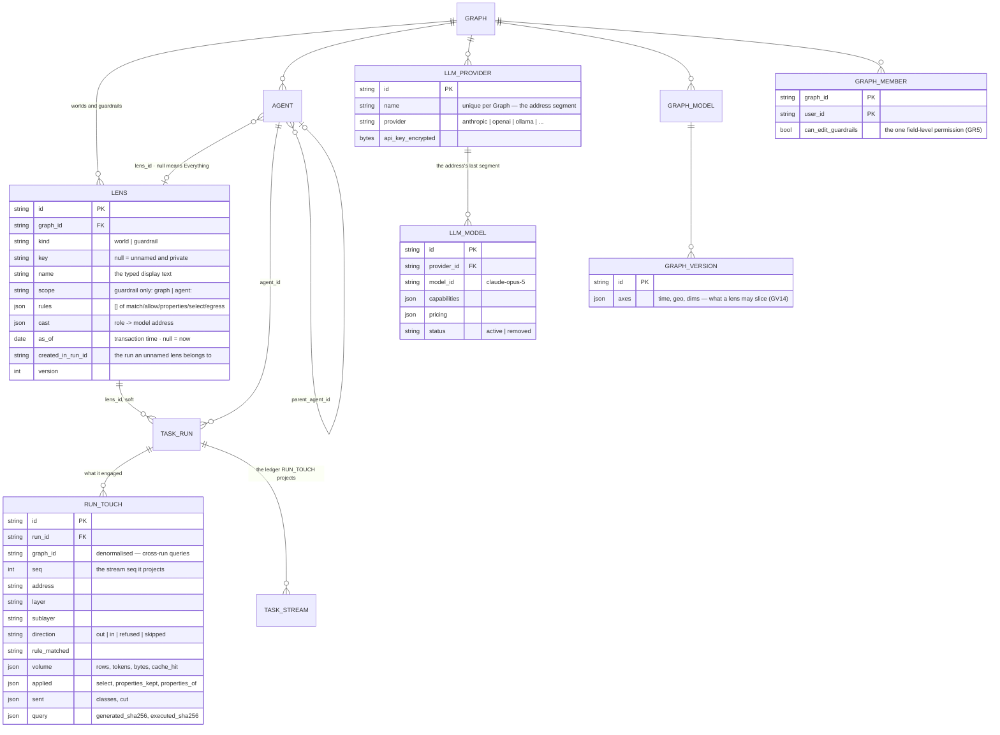

# Govern and Agents — the data model the designs need

What the [Govern, Agents and Skills canvas](https://claude.ai/artifact/VrdrR5iKGfqsjhCouQDTbc) draws
on its `Govern › Worlds`, `Govern › Guardrails`, `Govern › what a world did` and `Agents` pages, and
the engine shapes that have to exist before any of it can be built.

> **Status — both halves are built.** The Agents half landed with migration `53`; the paragraphs
> below read newest-last, so the split is the final entry.
>
> **Status — the Govern half is built, read *and written* by Studio.** Migrations `49` · `50` · `51`
> are on disk, `apps/govern` holds the record and its resolvers, `server/govern` serves them, and 68
> tests cover the grammar, the ladder, the refusals, the catalogue over real `model_links` rows, the
> authoring routes over HTTP and the freeze at run open. Every Govern screen renders — W1 · W2 · W3 ·
> W4 · G1 · G2 · R1 · R2 · R3 · R4. **The Agents half (§ 5.2, the provider split) is not**, and is
> deliberately last — see § 9.
>
> **The half that bites is built** ([GV28–GV32](../modules/govern/spec.md)). `runtime/governing.py`
> carries the frozen lens as the thing that decides and records; `catalogue/contract.py` owns the two
> crossings, so an entry module still reaches one app and the code-shape guard still holds;
> `apps/govern/query_lens.py` compiles the snapshot into the `QueryLens` the connector already knew
> how to enforce. A run now refuses a participant by rule and records it, composes the slice into the
> query it executes, rewrites a whole-node return to the permitted projection, cuts the prompt to
> `may_send` before the prompt exists, and writes one `touch` frame per engagement with one
> `run_touches` row projected from its `seq`. The three-grains claim in
> [govern § 2](../modules/govern/spec.md) has tests now: `tests/govern/test_enforcement.py`.
>
> **Three things the build settled**, and each is a decision rather than an implementation detail.
> Egress bounds a crossing only where a rule states it ([GV30](../modules/govern/spec.md)) — `[]`
> with nothing stated is *nobody wrote a rule*, not *send nothing*, which is the only reading under
> which [GV7](../modules/govern/spec.md) and [GV12](../modules/govern/spec.md) are both true. A
> refusal ends the run **only** for the model it thinks with and the version it is grounded on
> ([GV29](../modules/govern/spec.md)), and it ends it as *cannot answer*, never as an error. And
> `freeze_lens` now runs at every run open, not only a session ask: a Task's run, a skill draw and a
> re-run were each opening under an empty snapshot, which made enforcement fail open on three of the
> five ways a run starts.
>
> **Running it against `admin/airways` found the one fail-open**, exactly as driving the CLI and the
> routes each found theirs. A world that closes a layer and allow-lists inside it was being satisfied
> by a *guardrail's* broader allow: `Nothing leaves` closes `llm` and names one local model, and the
> Graph's `llm/** allow` was admitting the hosted model straight through it. `compose` had flattened
> every contributor into one rule list, which loses the *that lens's* half of
> [GV23](../modules/govern/spec.md) and loses it **open**. Each contributor's closure is now kept
> whole — `Effective.closures`, written into `lens_snapshot` as `closures[]` so a run can still answer
> *whose allow-list was this* months later — and a snapshot without the key is read as one closure
> over its own rules, which is what those runs were actually dispatched under. Three tests hold it.
> The same lesson a third time: what a fixture builds by hand is what the fixture cannot check.
>
> **An authored model is now a bound, not only a label** ([GV33](../modules/govern/spec.md)). A run
> is grounded on the introspected `global` mirror — the one model whose types cover what an arbitrary
> query can reach — and every world in the demo names the **authored** models instead, so their rules
> matched an address no run ever engages. `Deals@*` froze into the snapshot and narrowed nothing, and
> a world that closed `graph_data` refused every read as *cannot answer*. `apps/govern/query_lens.py`
> now resolves a rule's model address into the types that version declares and applies them to the
> grounding version, slicing along **that** model's axes; `open_graph` compiles before it decides, so
> a closed layer naming four models is a bound rather than a refusal. Only a closed-layer refusal is
> rescued — a rule that denies the grounding version by name still wins ([GV5](../modules/govern/spec.md)).
> Five tests in `tests/govern/test_enforcement.py` hold it.
>
> **The stitches had to come with them.** An edge that crosses two models belongs to neither, so a
> world naming all four of a Graph's models still could not traverse between them — ten crossing edge
> types fell to the grounding version and a closed layer left them out. A stitch is its own
> participant ([GV24](../modules/govern/spec.md)), so it is its own binding, bounding the one edge
> type it writes. `demos/airways/govern.json`'s *EU · H1 2026* names `graph_data/stitch/**` as well as
> its four models, which took it from 34 of 44 types in view to all 44.
>
> **The catalogue was offering stitches nothing could engage.** `stitch_names` filtered on the link's
> own status and not on its endpoints', so a model that republishes left its old stitches behind,
> bound to archived versions — declarations a run can never reach, and the *second* way two rows
> collide on one address after [GV24](../modules/govern/spec.md) removed the first: the address
> carries no version, so a stitch re-declared against a new version lands on its predecessor's name.
> Both are gone by joining the endpoint versions and requiring them active. Found by running
> `invana stitches apply` on a Graph whose eleven stitches all pointed at archived versions — which
> is a repair the demo walkthrough performs without saying so.
>
> **`rows_available` is gone, and so is the sentence it was for** ([WO19](../modules/govern/features/worlds.md)).
> Knowing what the unsliced query would have returned means running it without its predicate — an
> unbounded cost on exactly the reads a bound exists to keep small, paid on every governed read. The
> touch carries `rows`, W1 prints it, and what narrowed the read is answered by the world, the rule
> and the slice on the touch ([WO17](../modules/govern/features/worlds.md)) rather than by a number
> nobody can act on.
>
> **The lens is frozen, and that half is done** ([GV26](../modules/govern/spec.md)).
> `runtime.services.freeze_lens` composes the Graph's guardrails, the agent's and the world the
> asker picked into one `Effective`, and writes `task_runs.lens_id` and `task_runs.lens_snapshot` at
> run open. `SendMessage.lens_id` carries the chip's pick; `TraceRead.lens_name` reads the frozen
> name back, out of the snapshot's contributors rather than off the row, so a rename cannot rewrite
> what a past run says it ran under ([GV27](../modules/govern/spec.md)). Step 5a therefore *reads* a
> document that is already there rather than having to compose one first.
>
> **Two fields were added for the screens**, both because a value the resolver computes correctly
> and the view never puts on the wire is a value the screen cannot draw:
> `LensListResponse.may_edit_guardrails` ([GR11](../modules/govern/features/guardrails.md)) and
> `LensRead.cast_resolved` ([WO12](../modules/govern/features/worlds.md), R4). Both have route
> tests, for the same reason the 500 below had none.
>
> Two things the build settled that this file did not: `Lens.closed_layers`
> ([GV23](../modules/govern/spec.md)), and the migration numbering below.
>
> **Run against a live Graph.** `govern apply | list | show` and the participant resolver have
> now been driven against `admin/airways` on Postgres and Neo4j: guardrails then worlds, idempotent
> on a re-run, both authoring refusals naming their bound, and the catalogue resolving 23
> participants across five layers. It found one thing 45 unit tests could not, because they all
> built their `Catalogue` by hand — two links between the same pair of types shared one address
> ([GV24](../modules/govern/spec.md)). Fixed, with the first test that reads `model_links` rather
> than a fixture.
>
> **Run over HTTP.** All nine routes have now answered a browser, authenticated, against the same
> Graph — the read routes by drawing the Govern panel, the authoring ones by hand. That found what
> the live CLI run could not: `POST …/lenses/validate` answered **500 on every call**, refusal or
> not, because the view built `ValidationRead` from `r.__dict__` and `Refusal` is a `slots=True`
> dataclass. 45 tests stopped at the resolver, and a resolver test cannot see a serialization
> fault. Fixed, with `tests/govern/test_routes.py` — the first Govern test that goes through a
> view.
>
> The same lesson twice now, in two layers: the thing a test built by hand is the thing the test
> cannot check. It was a hand-built `Catalogue` for [GV24](../modules/govern/spec.md); it was a
> hand-called manager here.
>
> **The ledger is no longer empty.** Four asks were driven through a signed-in browser against
> `admin/airways`, and `run_touches` went from **0 rows, ever** to a run per world. What the three
> worlds each did is now something observed rather than something argued:
>
> | World | The ask | What it did |
> |---|---|---|
> | `EU · H1 2026` | *How many airports are in the graph?* | allowed, 44/44 types, digests **identical** — `airport` is in `AirRoutes`, which the world names with no `select`, so nothing was composed and the query ran byte-identical ([GV7](../modules/govern/spec.md)) |
> | `EU · H1 2026` | *How many deals are there in total?* | `MATCH (d:Deal) RETURN count(d)` → **1,283**, the slice's own count and the only number recorded ([WO19](../modules/govern/features/worlds.md)). `applied.composed = ["Deal.d"]`, `applied.select` carries the compiled slice per type ([WO17](../modules/govern/features/worlds.md)), `applied.models` names the four authored versions and thirteen stitches, digests **differ** |
> | `Nothing leaves` | *How many deals are there in total?* | refused at `understand`, before dispatch: nothing was spent, nothing left. `succeeded / cannot_answer`, never an error ([GV29](../modules/govern/spec.md)) |
> | `Price-blind` | *Show me 5 deals with all their details* | `RETURN d` rewritten to the permitted projection; `revenue` and `contract_value` are absent from the result, and it is still a node |
>
> **The two digests differ, and the step dashboard says so in words.** *The executed query is not the
> generated one — the lens was composed into it before it ran* is on screen against a real touch. So
> is *This run's lens — EU · H1 2026, as frozen at open*, and the six-band strip over three touches.
> Until this pass all three panels had only ever drawn their *nothing recorded* state.
>
> **And the fourth ask failed, which is the point of driving it.** `Price-blind`'s projection rewrite
> emitted invalid Cypher — `… AS dLIMIT 5`. A return item's span runs to the **next clause's
> keyword**, so the last item owns the whitespace in front of `LIMIT` / `ORDER BY` / `SKIP`, and
> replacing that span whole welded the alias to the keyword. Every projection test wrote a query that
> ended at its `RETURN`, so 34 of them agreed the rewrite was right. Any real question with a `LIMIT`
> — which is most of them — was a syntax error the moment a world excluded a property. Fixed in
> `graph/connectors/cypher/lens.py` (`_rstrip_to`), with the two tests whose queries do not end at
> the `RETURN`. **The same lesson a fourth time**, now in the connector: what the fixture builds by
> hand is what the fixture cannot check.
>
> **Four things the ledger shows that no panel reads.** Each is a decision; the second is now closed:
>
> | What | Why it is invisible |
> |---|---|
> | **The slice that was applied** | `applied.select` is written from `Verdict.select`, and a [GV33](../modules/govern/spec.md) world has none — the per-type selects compile into `QueryLens.bounds`. `StepTouchPanel`'s `SliceSummary` branch is therefore dead on exactly the shape a world is authored in. `applied.composed` names the binding, never the bound |
> | **The executed query's text** | ✅ **closed** ([GV34](../modules/govern/spec.md)). The step records `generated_query` and `executed_query` when — and only when — the lens rewrote the query, and the dashboard draws *The query that ran* under **Input**, showing both and saying which one the graph answered. On the step and never on the touch, so `run_touches` stays an index into the trace rather than a second copy of it. Equal digests record nothing: there the resolved request already is what ran |
> | **What a bound read cost** | `cost_usd` is `null` on every LLM touch, so `COST` reads *tokens only*. That is [OB4](../modules/operate/features/observability.md) working: the demo provider is `claude_agent_sdk` on an `oauth_token`, a **subscription** — not metered per token and not free, so neither number is true and there is none. Correct, and it means the local stack cannot exercise a per-run cost ceiling; an api-key provider can |
> | **Two worlds that read the same rows** | R4 diffs **addresses**. `EU · H1 2026` against `Price-blind` reads *touched 2 · shared 2 · differed 0* and says so honestly — *whatever differs in the answers does not come from what grounded them* — but one of those two runs sliced `Deal` to 1,283 rows and the other rewrote its projection, and both differences are sitting in `applied` on the shared touch. Compare points the reader at the worlds instead of reading the field that holds the answer |

> **A2 and A5 are built, and the two bounds beside the Graph's ceiling are real.**
> `agents.budget` carries all six ceilings now: `max_cost_usd` became
> `max_cost_usd_month` and both names are read for one release (§ 8 #4), `max_cost_usd_run` and
> `max_fanout` and `max_concurrent_runs` joined it, and every one of them rides
> `GET …/runs/{id}/trace` rather than the two that did — a ceiling the wire does not carry is one
> A2 cannot draw.
>
> `runtime/contention.py` now holds three bounds where it held one, and the point is that they are
> **not the same bound**:
>
> | Bound | Scope | At the ceiling |
> |---|---|---|
> | `GraphSlots` | runs at once, per Graph | the Graph's `concurrency_policy` — queue with a position, or refuse |
> | `AgentSlots` | runs at once, per **agent** | refuses, naming the agent's ceiling ([EB3](../modules/agents/features/envelope-and-budget.md)) |
> | `PoolSlots` | crossings at once, per pool | refuses, naming the pool ([CC8](../modules/agents/features/concurrency-and-contention.md)) |
>
> **An agent at its own ceiling is refused, never queued** — checked *before* the Graph's, so it is
> told about its own bound rather than waiting behind one it was never going to reach. `queue` and
> `refuse` are a policy stated on the Graph about the Graph's ceiling ([CC2](../modules/agents/features/concurrency-and-contention.md));
> an agent has no such column, and a second queue with its own precedence would make *why am I
> waiting* two answers instead of one.
>
> **A pool slot is held across one crossing, not one run**, so a run waiting five seconds on a model
> is not also holding a database connection it is not using — and it is taken *after* the lens has
> spoken, so a call this world refuses does not first consume a slot somebody else could have used.
> It is given back by `close_model` / `close_graph`, and swept at settle by `release_run`: a crossing
> that raises between its two halves would leak one, and a pool that only ever shrinks is worse than
> no pool at all.
>
> **Two things were deliberately not built**, and each would have been scaffolding:
>
> | Not built | Because |
> |---|---|
> | `heavy` as a call site | it is for graph algorithms and nothing dispatches one. It stays configured and empty, listed by the route with `in_use: 0` — [CC8](../modules/agents/features/concurrency-and-contention.md) names three pools and two of them have work |
> | Enforcing `max_cost_usd_run` mid-run | [EB2](../modules/agents/features/envelope-and-budget.md) — the envelope is checked **before** dispatch, never during, and pausing at a spend ceiling is [orchestration § 0.10](../orchestration.md)'s budget approval. The ceiling is declared, carried and drawn against; stopping on it is a different feature |
>
> `max_fanout` is in the same family as the second: it is declared, and it is refused *at validation*
> — but nothing dispatches a fanned-out node yet, so there is no fan-out to bound. It lands with lane
> dispatch, which is also where `tasks.map_over` and `tasks.max_parallel` stop being columns
> `steps_of` emits and `PlanStep` drops.
>
> **The provider split landed, as migration `53`.** Slot `52` was taken by Skills' `task_plans.uses`
> while this waited on its § 8 sign-offs, which is what *everything additive lands first* is for: an
> unrelated module shipped through the queue the split was holding. `llm_providers` now holds a
> `name` that **is** the address segment and `llm_models` holds what each endpoint offers; the
> catalogue reads the column instead of deriving one from the vendor kind.
>
> **Dropping `is_default` and `agents.llm_config_id` in one migration removes both existing answers
> to *which model answers this*, so the cast had to become load-bearing on the same commit.** Three
> call sites resolved through them and all three now go through one resolver beside `freeze_lens`,
> off the same composed lens — so *which model answered* and *what it was allowed to see* cannot
> disagree. The unit of a call is an `LLMEndpoint`, a provider row **and** one of its models
> ([PM13](../modules/agents/features/providers-and-models.md)), which is why the five `apps/llm`
> callables were not rewritten: it reads as the row it replaces, and adds the one read they could
> not do before — its address.
>
> **Two things the build settled that § 5.2 did not.** `capabilities` carries `cost_rank` ·
> `power_rank` · `local` alongside the three the file named: `shipped_cast` is the column's only
> reader and those are what it asks for, and a column holding only what a vendor states would leave
> the ranking re-derived at resolve time from a price list a release corrects — so it would move
> under a Graph that changed nothing ([PM12](../modules/agents/features/providers-and-models.md)).
> And a child agent now inherits its parent's `lens_id`, which is how *LLM ⊆ its parent's*
> ([DG7](../modules/agents/features/delegation.md)) survives a world where an agent binds no model —
> and closes the one dimension in which a spawned agent was **wider** than the agent that spawned it.
>
> **Writing a test that runs the migration over rows found two things the schema golden cannot.**
> `alembic upgrade head` on an empty database proves the chain runs; this migration is almost
> entirely data, and an empty database inserts no lens. First: `cast` is a reserved word, so the
> seeded-guardrail `INSERT` was a syntax error on every Graph that had a default — invisible to a
> golden that never seeds one. Second, and the real one: a Graph with two endpoints of one vendor
> addressed them `llm/anthropic-3f9c2b17/*`, because the interim name had to disambiguate and only
> an id could. The readable name is `anthropic-2`, and those two strings cannot both be the address —
> so every authored rule and cast naming the old one is rewritten to the new one in the migration.
> Leaving a world pointed at a participant that no longer exists would widen it, which is the
> opposite of what a bound is for. **The same lesson a fifth time**, now in a migration.
>
> **The down path is lossy and says so**: `model_id` is rebuilt from the first model per provider and
> a provider that grew a second cannot be un-split. The seeded guardrail is **left standing**, and
> every address moves back to the interim name — a downgrade that removed a bound would widen every
> Graph it touched, and so would one that kept the row while its addresses stopped resolving
> ([PM20](../modules/agents/features/providers-and-models.md)).
>
> **The third bound was a column nobody could read, write or run inside.** `agents.lens_id` has
> existed since `49`, `ON DELETE RESTRICT` and all, and A1 draws it as one of the three bounds — but
> `AgentRead` never carried it, `AgentUpdate` never took it, and `freeze_lens` composed the Graph's
> guardrails and the asker's pick and **not the agent's own world**. So the bound narrowed nothing:
> a world set on an agent would have held only on the runs somebody remembered to pick it for, which
> is not a bound at all. Three changes close it, and they are the shape step 10 needed before a
> agent row could draw anything: the agent's world is a contributor to every run it opens (beside
> the guardrails, for the same reason — it is in force whatever world is asked); `AgentRead` carries
> `lens_id` **and** `lens_name`, because a list that resolves four ids to four names draws none of
> them; and `AgentUpdate` reads *set-ness* rather than None-ness, so null means *Everything,
> chosen* and an update about a description cannot widen an agent on the way past. A guardrail is
> refused as an agent's bound — it is already in force on every run this agent opens, so binding one
> would read as a second bound that changes nothing. The move has its own event, `agent.lens_set`:
> widening an agent back to *Everything* is the line of the audit somebody comes looking for.
>
> **Studio is one release stale on this surface, deliberately.** Nothing breaks at compile time —
> Studio's LLM types are hand-written and `tsc` cannot see an API move — so the staleness is only
> visible once a database has been migrated. What step 10 inherits is tabled in
> [govern-and-agents-panels § 6](../building-studio/govern-and-agents-panels.md).

This file is the design record the implementation is reviewed against —
[rule 1](../../../CLAUDE.md): the decision lands in a document before the code.

| | |
|---|---|
| Draws | [14.1 Worlds](../modules/govern/features/worlds.md) · [14.2 Guardrails](../modules/govern/features/guardrails.md) · [5.1–5.7 Agents](../modules/agents/spec.md) |
| Slice | **S16** for Govern; it **reopens** 5.1 · 5.2 · 5.3 · 5.7 in [§5](../README.md#5--agents) |
| Companion | [building-studio/govern-and-agents-panels.md](../building-studio/govern-and-agents-panels.md) — the same 16 artboards, read as components |
| Migrations | `000000000049` · `50` · `51` · `53` **built**. `52` is Skills' `task_plans.uses`, landed while the split waited on its sign-offs |

---

## 1. What each artboard needs, and whether it has it

Sixteen artboards. The Govern engine is built, so the ten Govern rows are ✅ **in the engine** —
which is not the same as being on screen: every one of them is still `Studio 🔵`, and the
components they need are in
[building-studio/govern-and-agents-panels.md § 3](../building-studio/govern-and-agents-panels.md).

| Artboard | Needs | Exists? |
|---|---|---|
| W1 · the drawer | a `Lens` row, `kind = world`, listable per Graph | ✅ `lenses`, `GET …/govern/lenses` |
| W1 · what the world did | rows returned per run, and what narrowed them | ✅ `rows` per read, with the world, the rule and the compiled slice beside it ([WO17](../modules/govern/features/worlds.md)); there is no second number ([WO19](../modules/govern/features/worlds.md)) |
| W2 · five layer sections | `rules[]` grouped by layer, with `select` and `egress` | ✅ the grammar, validated at save |
| W2 · the cast | `cast` role → model address | ✅ `cast.py` — innermost wins, then checked |
| W2 · `as_of` | transaction time on the lens | ✅ column |
| W3 · authoring | a **participant catalogue** to pick from | ✅ `catalogue.py`, `GET …/govern/participants` |
| W3 · refusal, undeclared axis | `time` · `geo` · `dims` declared on a published model version | ✅ `graph_versions.axes`, refused naming model **and** axis |
| W4 · the ladder | `key` null → named → `kind = guardrail` | ✅ naming publishes, promoting is one field |
| W4 · usage | run count · last use · who, per lens | ✅ `TaskRunQuerySet.lens_usage`, grouped — no counter column |
| G1 · impact of a save | revalidate every world, name what each loses | ✅ `impact.py`, `POST …/govern/lenses/impact` |
| G1 · who may edit | one field-level permission on the Graph | ✅ `graph_members.can_edit_guardrails`, owner backfilled |
| G2 · what this would match | resolve a pattern against the catalogue, live | ✅ `?match=` on the catalogue route |
| R1 · the layer strip | a **touch** per engagement, in `seq` order | ✅ `runtime/governing.py` writes one per engagement, projected from the frame it carries the `seq` of |
| R2 · generated vs executed | both query digests on the touch | ✅ the connector returns `ComposedQuery`; `close_graph` records both as `generated_sha256` · `executed_sha256` |
| R3 · compare | two runs' touches, diffed | ✅ `GET …/govern/compare` |
| R4 · the cast is checked | resolve innermost-wins, then test against effective rules | ✅ refused before the run opens, naming role · model · rule |
| A1 · the agent's lens | `agents.lens_id` | ✅ column, `ON DELETE RESTRICT`, delete refused naming the agents; read and written as `AgentRead.lens_id` · `lens_name` · `AgentUpdate.lens_id`, and composed into every run the agent opens |
| A1 · the cast, resolved | read through the lens, not the agent | ❌ `agents.llm_config_id` still exists |
| A1 · spend this month | `SUM(cost_usd)` per agent per window | 🟡 needs a composite index |
| A2 · ceilings | fan-out · clarifications · replans · concurrent runs | ✅ all six in `DEFAULT_BUDGET`, all six on the trace. `max_concurrent_runs` is **enforced** at admission; `max_fanout` is declared and unread until something dispatches a `map_over` |
| A5 · pools | `llm` · `graphdb` · `heavy` slot counts | ✅ `PoolSlots` holds one slot per **crossing**; `llm` and `graphdb` have call sites and `heavy` has none. `GET …/concurrency` lists every configured pool, busy or quiet |
| A6 · a provider holds models | one provider row, N models | ❌ one row **is** one model |
| A6 · no default | `is_default` dropped | ❌ still there, with its partial unique index |

---

## 2. The ER, after

`LENS` is the new centre. Everything a run was allowed to do hangs off it, and everything it
actually did hangs off `RUN_TOUCH`.



### What is deliberately **not** a table

| Not a table | Where it lives | Why |
|---|---|---|
| A rule | `lenses.rules[]` jsonb | One enforcement path, one document frozen onto a run ([GV1](../modules/govern/spec.md)). A rule with its own row is a rule an auditor has to reassemble |
| The cast | `lenses.cast` jsonb | Four keys, and it is not a bound — it resolves within the rules |
| Lens usage | a grouped read over `task_runs` | *34 runs · last 2h · by ravi, sam, 2 others* is one `GROUP BY lens_id`. A counter column can disagree with the runs it counts |
| The participant catalogue | a resolver over published versions, `llm_models`, cache kinds and roles | It is a view of what the Graph already declares. A copy of it goes stale the moment a model publishes |
| The run queue | the process that owns the runtime ([CC7](../modules/agents/features/concurrency-and-contention.md)) | A restart fails what was in flight and drops what was waiting — the story in-flight runs already have |
| A governance audit log | `core/events` | Every lens edit is an ordinary audited write ([GR7](../modules/govern/features/guardrails.md)) |

### The one thing that is a table, and had to be argued for

`run_touches` is a **materialised projection of `task_stream`**, not a second source of truth — the
same relationship `emissions` already has to the same ledger. It exists because three of the
artboards ask a question a JSON scan cannot answer:

| Question | Artboard | Why the stream alone does not do it |
|---|---|---|
| *allowed 11 · touched 7 · refused 2* | R1 | needs the touches grouped by address, for one run, on open |
| *what B touched that A did not* | R3 | a join across two runs |
| *which worlds name `claude-sonnet-5`* | A6 | a cross-run, cross-lens lookup on an address |

**The invariant that keeps it honest:** every `run_touches` row is derived from exactly one
`task_stream` row, carries its `seq`, and the table is rebuildable from the ledger by a command
(`invana rebuild-touches`). If they disagree, the ledger wins. ⚠ **Needs sign-off** — see §8.

---

## 3. `lenses` — the new table

Migration `000000000049`.

| Column | Type | Null | Notes |
|---|---|---|---|
| `id` | `String(36)` | no | PK |
| `graph_id` | `String(36)` FK `graphs` CASCADE | no | indexed |
| `kind` | `String(16)` | no | `world` · `guardrail` |
| `key` | `String(128)` | **yes** | the slug. Null = unnamed and private to its run. **Naming is the write that publishes** ([WO1](../modules/govern/features/worlds.md)) |
| `name` | `String(255)` | yes | the typed display text — `EU · H1 2026`. Null iff `key` is null |
| `scope` | `String(64)` | yes | guardrail only: `graph` or `agent:<id>` |
| `rules` | `JSON` | no | default `[]` |
| `cast` | `JSON` | no | default `{}` |
| `closed_layers` | `JSON` | no | default `[]`. The layers this lens allow-lists ([GV23](../modules/govern/spec.md)) — a layer named here admits only what its rules allow |
| `as_of` | `DateTime(tz)` | yes | transaction time. Null = now ([GV15](../modules/govern/spec.md)) |
| `created_in_run_id` | `String(36)` | yes | no FK — a run may be pruned while the lens it created stays |
| `created_by_id` | `String(36)` FK `users` SET NULL | yes | |
| `version` | `Integer` | no | bumped on every `rules`/`cast` edit, so a snapshot names what it froze |
| `created_at` · `updated_at` | `DateTime(tz)` | no | |

| Constraint | Shape |
|---|---|
| `uq_lens_graph_key` | UNIQUE `(graph_id, key)` — plain, not partial: SQL NULLs are distinct, so many unnamed lenses coexist on both SQLite and Postgres |
| `ck_lens_guardrail_scope` | `kind = 'guardrail'` ⟹ `scope IS NOT NULL`; `kind = 'world'` ⟹ `scope IS NULL` |
| `ck_lens_guardrail_named` | `kind = 'guardrail'` ⟹ `key IS NOT NULL` — a guardrail is never unnamed |
| `ix_lens_graph_kind` | `(graph_id, kind)` — the two drawers are two reads |

### Why `key` and `name` are two columns

[GV2](../modules/govern/spec.md) says naming publishes, and the field reads *Name it to add it to
Worlds*. A person types `EU · H1 2026`; the route, the refusal messages and the uniqueness check all
want `eu-h1-2026`. One column would make the URL carry a middle dot, or the list carry a slug.
**The slug is derived from the name on first naming and then frozen** — a rename changes `name`
only, because [WO1](../modules/govern/features/worlds.md) already says only the first naming
publishes, and a moving slug would break every schedule that pinned one.

### A rule

```json
{
  "match": "graph_data/model/Routes@v4",
  "allow": true,
  "properties": { "exclude": ["revenue", "contract_value"] },
  "select": {
    "time": { "axis": "observed_at",  "from": "2026-01-01", "to": "2026-06-30" },
    "geo":  { "axis": "country_iso",  "vocab": "iso2", "in": ["IE", "DE", "FR"] },
    "dims": { "channel": ["direct"] }
  },
  "egress": { "may_send": ["type_names", "the_question"] },
  "options": { "max_age_s": 300, "max_rounds": 3 }
}
```

| Key | Required | Layers it is legal on | Grain |
|---|---|---|---|
| `match` | ✅ | all five | `*` = one segment · `**` = the rest |
| `allow` | ✅ | all five | `true`/`false`. **Deny wins at any specificity** ([GV5](../modules/govern/spec.md)) |
| `properties.exclude[]` | | `graph_data` | structural — the property does not exist in this world |
| `select` | | `graph_data` | extensional — composed into the predicate. Only on **declared** axes ([GV14](../modules/govern/spec.md)) |
| `egress.may_send[]` | | any destination that crosses the boundary | per destination, on the rule that matched ([GV12](../modules/govern/spec.md)) |
| `options.max_age_s` | | `cache` | how stale a hit may be — `0` is *walk it fresh* |
| `options.max_rounds` | | `human` | how many times a run may come back to a person |

`options` exists so the top level stays the same five keys on every layer. A third party carries no
`select` and no `properties` ([GV13](../modules/govern/spec.md)) — a rule that sets them is refused
at save, naming the layer.

**Egress classes — a closed set.** `type_names` · `property_names` · `the_question` ·
`property_values` · `record_ids` · `aggregates` · `everything`. Closed because an open list is a
list nobody can audit, and `[]` is the default for an unmatched crossing.

### The cast

```json
{ "extract": "llm/anthropic-prod/claude-haiku-4.5",
  "decide":  "llm/anthropic-prod/claude-opus-5",
  "judge":   "llm/ollama-local/llama-3.3",
  "embed":   null }
```

Four roles, fixed: `extract` · `decide` · `judge` · `embed`. A null role falls to the **shipped
default cast** ([PM4](../modules/agents/features/providers-and-models.md)).

| Step | What happens |
|---|---|
| 1 | Innermost wins — Todo over plan over agent. **The cast does not intersect** ([GV6](../modules/govern/spec.md)) |
| 2 | The resolved address is checked against the *effective rules* |
| 3 | Denied ⟹ **the run is refused before it opens**, naming the role, the model and the rule |

Resolution lives in `invana/apps/govern/cast.py`; the shipped default in
`invana/apps/govern/default_cast.py`, resolving *cheapest that reads* · *most capable configured* ·
*a local model where one exists* · *the only embedding model, or none* against `llm_models`.

---

## 4. `run_touches` — what actually happened

Migration `000000000050`.

| Column | Type | Null | Notes |
|---|---|---|---|
| `id` | `String(36)` | no | PK |
| `run_id` | `String(36)` FK `task_runs` CASCADE | no | indexed |
| `graph_id` | `String(36)` | no | denormalised, indexed — *which runs touched this address* |
| `seq` | `Integer` | no | the `task_stream.seq` this projects. UNIQUE `(run_id, seq)` |
| `step_key` | `String(64)` | yes | `execute_query` |
| `address` | `String(512)` | no | indexed. **The only identifier** ([GV4](../modules/govern/spec.md)) |
| `layer` | `String(16)` | no | `graph_data` · `llm` · `third_party` · `cache` · `human` · `agent` (the spine) |
| `sublayer` | `String(64)` | no | `model` · `stitch` · `dataset` · a provider name · `api` · `app` · `db` · `agent` · `person` · `role` |
| `participant` | `String(255)` | no | the last segment, for a list that does not re-parse |
| `direction` | `String(16)` | no | `out` · `in` · `refused` · `skipped` |
| `rule_matched` | `String(512)` | yes | the `match` that decided it — so a refusal names its rule ([GR4](../modules/govern/features/guardrails.md)) |
| `why` | `String(255)` | yes | one readable sentence, on `refused` |
| `volume` | `JSON` | no | `{rows, tokens_in, tokens_out, bytes, cache_hit, age_s}` |
| `applied` | `JSON` | no | `{select, properties_kept, properties_of}` |
| `sent` | `JSON` | no | `{to, classes[], cut[]}` |
| `query` | `JSON` | no | `{generated_sha256, executed_sha256}` — **both**, so the rewrite is visible, not silent |
| `cost_usd` | `Float` | yes | |
| `duration_ms` | `Integer` | yes | |
| `at` | `DateTime(tz)` | no | |

Indexes: `(run_id, seq)` unique · `(graph_id, address)` · `(run_id, direction)`.

**`rows` is one number, and there is no second one** ([WO19](../modules/govern/features/worlds.md)).
Composing a predicate does not tell you what the query would have returned without one, so *1,284 —
not 4,902* costs an unsliced execution on every governed read. W1 prints `rows` and answers *what
narrowed it* from the world, the rule and the slice the connector composed.

**`volume` carries `tokens_in` and `tokens_out`, never one `tokens`.** A run that read a lot and
wrote a little is a different run from its mirror, and they price differently; the step dashboard
adds them for its one-line readout rather than the record losing the difference.

**The query digests are digests, not queries.** The full text lives on the step; `run_touches`
carries SHA-256 so *the bound acted* is checkable without duplicating every query in a second table.

---

## 5. Agents — what changes

### 5.1 `agents`

Migration `000000000049` (the lens) and `000000000053` (the provider).

| Change | Column | Why |
|---|---|---|
| **add** | `lens_id` `String(36)` FK `lenses` **ON DELETE RESTRICT**, nullable | The third bound (A1). Null = *Everything*, inside the guardrails. RESTRICT, because deleting a world an agent carries is the same seam as deleting one a schedule uses ([WO6](../modules/govern/features/worlds.md)) |
| **drop** | `llm_config_id` | [PM1](../modules/agents/features/providers-and-models.md) — an agent binds no provider. The cast names the model and the Graph resolves the credential |
| **extend** | `budget` JSON | three new keys, below |
| **index** | `task_runs (agent_id, started_at)` | *$1.84 of $40.00 this month* is a windowed `SUM(cost_usd)`, not a counter column. Built in `53` — `ix_task_runs_agent_id` alone made the window a scan of every run the agent has ever done |

`DEFAULT_BUDGET` gains three keys and keeps the five it has:

| Key | Default | Artboard | Bounds |
|---|---|---|---|
| `max_cost_usd` | `5.0` | A1 `$40.00` | per **month** — rename to `max_cost_usd_month` |
| `max_cost_usd_run` | `2.0` | A2 | per run. A plan may set less, never more |
| `max_fanout` | `200` | A2 | a `map_over` beyond it is refused at validation |
| `max_clarifications` | `3` | A2 | `understand` stops asking |
| `max_replans` | `1` | A2 shows `2` | a `verify` cannot loop forever |
| `max_concurrent_runs` | `3` | A2 · A5 | per agent, across every run it is working |
| `max_children` · `max_depth` | `3` · `2` | A3 | delegation, unchanged |
| `max_steps` · `max_tokens` | unchanged | | |

Renaming `max_cost_usd` → `max_cost_usd_month` is a JSON key change in `DEFAULT_BUDGET`, and
`effective_budget` reads both for one release so old rows keep their ceiling.

### 5.2 `llm_providers` splits in two

Migration `000000000053`. **This is the breaking one.** Today one row is one *provider + model*;
A6 draws one row as one *configured endpoint* holding many models, because the address
`llm/anthropic-prod/claude-opus-5` has a provider segment and a model segment and they are not the
same thing ([GV9](../modules/govern/spec.md)).

| `llm_providers` | Change |
|---|---|
| **add** `name` `String(64)` NOT NULL | unique per Graph — **it is the address segment** |
| **drop** `model_id` | moves to `llm_models` |
| **drop** `is_default` | with its partial unique index ([PM4](../modules/agents/features/providers-and-models.md) · D19) |
| keep | `provider` · `base_url` · `api_key_encrypted` · `credential_kind` · `guardrails` · `last_ping_*` |

`llm_models` (new):

| Column | Type | Null | Notes |
|---|---|---|---|
| `id` | `String(36)` | no | PK |
| `provider_id` | `String(36)` FK `llm_providers` CASCADE | no | indexed |
| `model_id` | `String(255)` | no | the vendor's id — the address's last segment. UNIQUE `(provider_id, model_id)` |
| `display_name` | `String(255)` | yes | |
| `capabilities` | `JSON` | no | `{context_window, supports_tools, embedding, cost_rank, power_rank, local}` — what the default cast resolves against. The last three are what `shipped_cast` actually reads ([PM12](../modules/agents/features/providers-and-models.md)); the backfill seeds them from `apps/llm/pricing.py` and the provider kind |
| `pricing` | `JSON` | no | `{input_per_mtok, output_per_mtok}`; falls back to `apps/llm/pricing.py` |
| `status` | `String(16)` | no | `active` · `removed`. Removing one a cast names is **refused, naming the worlds** (A6) |
| `created_at` · `updated_at` | | no | |

**The backfill, and its one real risk.** Each existing `llm_providers` row becomes one provider plus
one model. The provider's `name` is its kind, suffixed when a Graph has two of the same kind
(`anthropic`, `anthropic-2`). Agents lose `llm_config_id` — and with it the only record of which
model they used. So the migration **seeds a `cast` on each Graph** from the row that was
`is_default = true`, written as a `kind = guardrail`, `scope = graph` lens if the Graph has none:

```
decide  → llm/<default provider name>/<its model_id>
extract → the same
judge   → the same
embed   → null
```

A Graph with no default provider gets no seeded cast and falls to the shipped default. ✅ Signed off — §8.

**What the split costs the runtime, which is the half a schema diff does not show.** Dropping
`is_default` and `agents.llm_config_id` in one migration removes *both* existing answers to
*which model answers this*, so the cast has to be load-bearing on the same commit or nothing
answers. Three call sites resolve through them today and all three move to one resolver:

| Was | Now |
|---|---|
| `runtime/services.py::_agent_provider` — `agent.llm_config_id` → the Graph's default | `resolve_endpoint(db, graph_id=…, effective=…)` beside `freeze_lens`, off the same composed lens |
| `SessionManager._resolve_provider` — explicit id → default → 422 | explicit `llm_models` id → the cast → the shipped cast → the same 422, now naming `Agents › LLMs` |
| `AgentManager.seed_agents` — binds the default onto each seeded agent | binds nothing. A seeded agent carries `lens_id = NULL`, and *Everything, inside the guardrails* resolves through the shipped cast |

The resolver returns an **`LLMEndpoint`** — a provider row plus one of its models
([PM13](../modules/agents/features/providers-and-models.md)) — which is a drop-in for every
current read of an `LLMProvider` in the call path (`.provider` · `.model_id` · `.base_url` ·
`.api_key_encrypted` · `.credential_kind` · `.guardrails`) and adds the one read they could not
do before: `.address`. `apps/llm/pricing.py` prices an endpoint rather than a provider, for the
same reason — a rate is a fact about a *model*, and until now the row that carried the rate was
the row that carried the key.

`task_runs.params` carries `llm_model_id` and reads `llm_provider_id` for one release
([PM15](../modules/agents/features/providers-and-models.md)), so a run queued before the split
still dispatches.

### 5.3 `graphs` — the pools

Migration `000000000051`.

| Change | Column | Default | Artboard |
|---|---|---|---|
| **add** | `pools` `JSON` | `{"llm": 20, "graphdb": 50, "heavy": 4}` | A5 |
| exists | `max_concurrent_runs` `Integer` | `4` (A5 draws `3`) | A5 |
| exists | `concurrency_policy` `String(8)` | `queue` | A5 |

The live queue itself is **not** stored ([CC7](../modules/agents/features/concurrency-and-contention.md)) —
`GET …/graphs/{id}/concurrency` reads the runtime process and returns what is running, what is
queued, each waiter's position and why it is where it is.

### 5.4 `graph_members` — the one permission

Migration `000000000049`.

| Change | Column | Notes |
|---|---|---|
| **add** | `can_edit_guardrails` `Boolean` NOT NULL default `false` | [GR5](../modules/govern/features/guardrails.md). Not a role — members stay binary |

**The invariant:** at least one member of a Graph holds it, and the Graph's owner holds it by
default. Revoking the last one is refused, naming the holder — *the last person with the permission
leaves* is already a seam in `guardrails.md`, and this is what makes it enforceable.

### 5.5 `graph_versions` — declared axes

Migration `000000000051`. Owned by
[domain-models](../modules/connect-and-model/features/domain-models.md), needed here.

| Change | Column | Default |
|---|---|---|
| **add** | `axes` `JSON` | `{}` |

```json
{ "time": { "property": "observed_at" },
  "geo":  { "property": "country_iso", "vocab": "iso2" },
  "dims": ["channel", "segment"] }
```

`{}` means nothing is selectable, which is the right default: a lens asking to slice a model that
declared no axis is **refused naming the model and the axis** ([GV14](../modules/govern/spec.md)),
and *Airports@v1 · none declared · whole — cannot slice* is what W3 draws.

---

## 6. The resolvers — code, not tables

| Resolver | Module | Answers |
|---|---|---|
| `ParticipantCatalogue` | `apps/govern/catalogue.py` | every addressable participant in a Graph — published model versions, stitches, datasets, `llm_models`, cache kinds, roles. Feeds W3's pickers and G2's *what this would match, right now* |
| `effective(agent, plan, todo)` | `apps/govern/resolve.py` | allow **intersects**, deny **accumulates**, selectors **intersect**, cast **innermost wins** ([GV6](../modules/govern/spec.md)). Computed once at run open, frozen into `lens_snapshot`, never recomputed |
| `validate(lens, against=guardrails)` | `apps/govern/validate.py` | W3 and G1's refusals — at **save**, not at run ([WO3](../modules/govern/features/worlds.md)) |
| `impact(proposed_guardrail)` | `apps/govern/impact.py` | G1's *saving this would change 2 of 4 worlds*, and what each one loses |
| `usage(lens)` | `apps/govern/usage.py` | one grouped read over `task_runs` — count, last use, distinct actors |
| `default_cast(graph)` | `apps/govern/default_cast.py` | the shipped cast, over `llm_models` |
| `diff(run_a, run_b)` | `apps/govern/compare.py` | R3's *what B touched that A did not* — a join over `run_touches` |

**Enforcement stays where it already is:** the interpreter checks the participant and the egress
before dispatch; the connector composes the predicate and rewrites the projection at execution.
Never in Studio, and never as a filter over results that came back.

---

## 7. Routes and events

| Verb | Route | For |
|---|---|---|
| `GET` `POST` | `…/graphs/{gid}/lenses?kind=&scope=` | the two drawers. `kind = guardrail` never appears under `kind = world` ([GR1](../modules/govern/features/guardrails.md)) |
| `GET` `PATCH` `DELETE` | `…/lenses/{id}` | naming is a `PATCH` setting `key` + `name` |
| `POST` | `…/lenses/{id}/promote` | `kind = guardrail` + `scope`. The guardrail permission only |
| `POST` | `…/lenses/{id}/duplicate` | W2's `Duplicate` |
| `POST` | `…/lenses/validate` | a draft against the effective guardrails, before save |
| `GET` | `…/graphs/{gid}/lenses/impact?rules=` | G1's preview |
| `GET` | `…/graphs/{gid}/lenses/{id}/usage` | runs · last · actors |
| `GET` | `…/graphs/{gid}/participants?layer=&match=` | the catalogue, and G2's live match |
| `GET` | `…/runs/{id}/touches` | R1 · R2 |
| `GET` | `…/runs/compare?a=&b=` | R3 |
| `GET` `POST` `PATCH` `DELETE` | `…/graphs/{gid}/llm-providers` | **no `set-default`** |
| `GET` `POST` `DELETE` | `…/llm-providers/{id}/models` | A6 |
| `POST` | `…/llm-providers/{id}/ping` | unchanged — still a TaskRun ([PM3](../modules/agents/features/providers-and-models.md)) |
| `GET` | `…/graphs/{gid}/concurrency` | A5, live from the runtime |
| `PATCH` | `…/graphs/{gid}/members/{uid}/guardrail-permission` | grant · revoke, refusing the last revoke |

| Event | Payload carries |
|---|---|
| `lens.created` · `updated` · `deleted` | before and after, so *who loosened what* is readable ([GR7](../modules/govern/features/guardrails.md)) |
| `lens.named` | the key and the name — the write that published |
| `lens.promoted` | the scope it took |
| `llm_provider.created` · `updated` · `pinged` · `deleted` | **`default_set` is retired** |
| `llm_model.added` · `removed` | the worlds that named it, on a removal |
| `agent.lens_set` | from and to |
| `graph.guardrail_permission_granted` · `revoked` | |

---

## 8. Four decisions, all four signed off

**All four are decided** — 1 and 2 shipped with migrations `49`–`51`, and 3 and 4 were signed off on
2026-09-20, which is what unblocks migration `53`. They are stated here in present tense; the
alternative column is kept because it says what each decision is *not*, which is the part a reader
six months out needs.

| # | Decision | The alternative, and why it was not taken |
|---|---|---|
| **1** ✅ | **`run_touches` is a materialised projection**, rebuildable from `task_stream`, with the ledger authoritative on disagreement | Deriving it on every read. Rejected because R3's compare and A6's *named by 3 casts* are joins, not scans — but this is the one shape that brushes against *no second record for governing*, so it is the one to say yes or no to |
| **2** ✅ | **`key` and `name` are two columns**, slug frozen at first naming | One column. Rejected because the route and the refusal text want a slug and the list wants the typed text, and a slug that moves on rename breaks pinned schedules |
| **3** ✅ | **The provider split backfills a seeded `cast` from `is_default`.** The migration reads each Graph's current default provider and writes it into `cast` explicitly, so a Graph keeps answering with the model it answers with today. | Dropping `is_default` with no cast seeded. Rejected because a Graph with providers and no cast runs the shipped default, which may name a model that Graph is not credentialed for — a silent change to what produces an answer |
| **4** ✅ | **`max_cost_usd` is renamed `max_cost_usd_month`**, and both names are read for one release, so nothing configured today breaks on the hop. | Leaving the name. Rejected because A2 puts a per-run and a per-month ceiling side by side and one of them has to be unambiguous |

---

## 9. Migration order

| # | Adds | State |
|---|---|---|
| `49` | `lenses` · `agents.lens_id` · `graph_members.can_edit_guardrails` (owner backfilled as first holder) | ✅ built. Purely additive |
| `50` | `run_touches` | ✅ built |
| `51` | `graph_versions.axes` · `graphs.pools` | ✅ built |
| `52` | `task_plans.uses` · `tasks.source_plan_key` | ✅ built — Skills' work, not this pass's. The slot was taken while the split waited on its sign-offs |
| `53` | `llm_providers.name` · `llm_models` · backfill · seeded cast · **drop** `model_id` · `is_default` · `agents.llm_config_id` | ✅ built. Both directions are exercised against a scratch database by `tests/golden/test_provider_split.py` |

**The provider split moved from `50` to `53`, and that is the point.** It is the one irreversible
step, so everything additive lands first and Govern ships without touching Agents at all. Until it
does, the catalogue derives a provider row's name from its kind and disambiguates by id — the
address shape is already final, so the rules written against it survive the split, which is the
property that matters.

`53` is the only one that is not reversible without loss: the down-migration rebuilds
`llm_providers.model_id` from the first `llm_models` row per provider, but a provider that grew a
second model cannot be un-split. **The down path runs, and what it costs is pinned by a test rather
than described** — `test_the_way_back_down_rebuilds_one_model_and_keeps_the_bound` seeds the
pre-split rows, migrates up, grows a second model, comes back down and reads what survived. There is
no confirm to gate it on: `invana migrate` goes to head and there is no *down* verb, so the only way
back is `alembic downgrade` run by hand against a database somebody already decided to move.

**The slot number is not the order.** `52` is Skills' `task_plans.uses`, landed while the split
was still gated on §8 — which is exactly what *everything additive lands first* buys: an
unrelated module shipped through the queue the split was holding.

SQLite stays a dev target and not a migration target
([engine test baseline](skills-pass.md)) — `49`–`53` are written with `batch_alter_table` so a fresh
SQLite checkout still builds.

---

## Not building

| Not building | Because |
|---|---|
| A `lens_rules` table | one enforcement path, one document an auditor reads ([GV1](../modules/govern/spec.md)) |
| Counter columns for lens usage | a counter can disagree with the runs it counts, and the grouped read is one query |
| A `third_party_endpoints` catalogue | a deny needs no catalogue, and G2's match preview says *no third-party endpoints are configured* until one is. When third parties get credentials of their own, that is the feature that brings the table |
| A queue table | the queue belongs to the process that owns the runtime ([CC7](../modules/agents/features/concurrency-and-contention.md)) |
| Model catalogues fetched from the provider | a typed model id is enough and does not break when a vendor's catalogue moves ([providers-and-models](../modules/agents/features/providers-and-models.md)) |
| `lens_snapshot` normalisation | it is frozen on purpose. A snapshot that resolves through live rows is not a snapshot |
