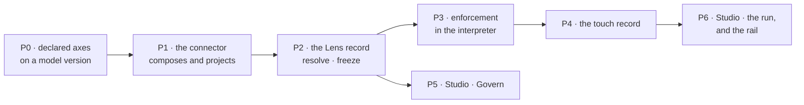

# The lens — what to build, in what order

**Slice S16.** The decisions are settled ([govern/spec.md](../modules/govern/spec.md) GV1–GV18,
[worlds](../modules/govern/features/worlds.md) WO1–WO6, [guardrails](../modules/govern/features/guardrails.md)
GR1–GR7, and [governance.md](../governance.md) D1–D19 as the record). This file is the build order
and nothing else — no decision is made here.

| | |
|---|---|
| Sibling to | [task-model-migration.md](task-model-migration.md) · [boards-migration.md](boards-migration.md) |
| Ships | [14.1 Worlds](../modules/govern/features/worlds.md) · [14.2 Guardrails](../modules/govern/features/guardrails.md) · [10.5](../modules/operate/features/see-what-ran.md) |
| Drawn in | `claude.ai/artifact/8591piJHezfLsUoSZXn3z8` (7 artboards) · `claude.ai/artifact/7c565h2z9irbFBwu1S1ebH` (6) |

---

## 0. What already exists

Check this before writing anything — two columns are already there and nothing reads them.

| Thing | State |
|---|---|
| `task_runs.lens_id` · `task_runs.lens_snapshot` | **exist**, migration `000000000039_a_step_is_a_run`. Never written, never read |
| `lenses` table | does not exist |
| Anything that resolves or freezes a lens | does not exist |
| Latest migration | `000000000043_canvases_are_boards` — the next is `44` |
| The catalogue | `engine/src/invana/runtime/catalogue/registry.py` |
| The interpreter | `engine/src/invana/runtime/` |
| Connectors | `engine/src/invana/graph/connectors/` |
| Studio features | `studio/src/pages/graphs-detail/features/<module>/` |
| The shell | `studio/src/pages/graphs-detail/shell/GraphDetail.tsx` |

---

## 1. The order, and why it is this order

**P1 gates everything.** Until the connector composes the predicate and rewrites the projection, a
lens is a display filter wearing a bound's name — the exact failure
[§4](../governance.md#4-sub-worlds--narrowing-what-a-decision-may-rest-on) names. Nothing above it
can be honestly demonstrated, so it is the first thing to schedule and the first thing to slip.

**P5 can start once P2 lands** — the panels need the record, not the enforcement.

---

## P0 · A model version declares its axes

Without this a selector has nothing legal to name ([GV14](../modules/govern/spec.md)).

| | |
|---|---|
| Changes | `engine/src/invana/apps/modeller/` — the published model version gains `axes` |
| Shape | `{"time": {"property": "observed_at"}, "geo": {"property": "country_iso", "vocab": "iso2"}, "dims": [{"property": "channel", "type": "str"}]}` |
| Migration | `44_a_model_declares_its_axes` |
| Studio | the model editor gains an **Axes** section — declaring one is a modelling act, not a lens one |
| Feature file | [domain-models](../modules/connect-and-model/features/domain-models.md) — add the capability and a decision |

**Done when** a published version carries axes, a draft can declare them, and a lens asking for an
axis the model never declared is refused **naming the model and the axis** rather than ignored.

---

## P1 · The connector composes and projects

**The whole enforcement story.** Two halves, both required — rewriting alone does not stop
`avg(d.revenue)`, and rejection alone does not stop `RETURN d`.

| Half | What |
|---|---|
| **Compose** | `run_query` folds the effective `select` into the dialect — a Cypher `WHERE`, a Gremlin `has()` — before execution |
| **Project** | a whole-node return is rewritten into the permitted property set — Cypher map projection, Gremlin `valueMap` with keys |
| **Reject** | the validator refuses any query naming an excluded property anywhere |

| | |
|---|---|
| Changes | `engine/src/invana/graph/connectors/` — every connector; the contract itself in `graph/types` |
| Feature file | [the-connector-contract](../modules/graph-connectors/features/the-connector-contract.md) |
| Trace | `query.generated` and `query.executed` recorded as two digests, so the rewrite is visible rather than silent ([D3](../governance.md#14-decisions-settled)) |

**Done when**, with `Deal.revenue` excluded: no query returns it, no aggregate reveals it, `RETURN d`
comes back without it, and the trace shows both queries. **Test against a real database** — this is
exactly the case CLAUDE.md rule 7 exists for.

---

## P2 · The Lens record

| | |
|---|---|
| New app | `engine/src/invana/apps/govern/` — `models.py` · `managers/` · `querysets/` · `schemas.py`, matching the app pattern |
| Table | `lenses` — `graph_id` · `key` (unique per graph, nullable) · `kind` · `scope` · `name` · `rules` jsonb · `cast` jsonb · `as_of` |
| Migration | `45_a_lens_bounds_five_layers` |
| Resolution | `effective = agent ∩ plan ∩ todo` — allow intersects, deny accumulates, selects intersect per model, `cast` innermost-wins then checked ([§0.9](../orchestration.md#09-grounding-a-run--the-lens)) |
| Freezing | computed **once at run open**, written to `task_runs.lens_snapshot`. Never recomputed mid-run |
| Routes | `GET · POST · PATCH · DELETE …/lenses` · `POST …/lenses/{id}/promote` · `GET …/lenses/guardrail/impact` |
| Events | `lens.created · updated · named · promoted · deleted` |

**Two behaviours that are easy to miss:**

| | |
|---|---|
| **Naming publishes** ([WO1](../modules/govern/features/worlds.md)) | `PATCH` setting `key` is the write that moves a lens from private to the Graph's list |
| **A world is validated at save** ([WO3](../modules/govern/features/worlds.md)) | against the effective guardrails — not at run time |

**Done when** a run opens with a lens, freezes it, and a second run under a different world freezes a
different one. `lens_id`/`lens_snapshot` stop being dead columns.

---

## P3 · Enforcement in the interpreter

| Where | What |
|---|---|
| Before dispatch | the participant's address is matched against the effective rules. `third_party` and `llm` refusals happen **here** — nothing spent, nothing sent |
| `graph_data` | out-of-lens means a link does not resolve; the run continues and the answer is *outside the lens* |
| Egress | the payload is cut to `egress.may_send` for the rule that matched the destination. An unmatched crossing sends **nothing** |
| The cast | a plan's `role` resolves through `lens.cast`; `Task.role` is the new column ([GV10](../modules/govern/spec.md)) |
| Binding | `agent_skills` gains the lens check beside the envelope check ([BN5](../modules/skills/features/bindings.md)) |

**Done when** a guardrail denying `third_party/**` refuses before the call, a cast naming a denied
model is refused by name, and a prompt carrying `property_values` under an `egress` that forbids them
is cut before it leaves.

---

## P4 · The touch record

| | |
|---|---|
| Complete ledger | `TaskStream` — every touch, spine dispatches included, in `seq` order ([D12](../governance.md#14-decisions-settled)) |
| Readable projection | `result.json → touches[]` — the five governed layers plus the spine's `when`/`until`/`loop` evaluations, assembled by the interpreter at settle |
| Fields | `at` · `dir` (incl. `refused`) · `why` · `select` · `role` · `volume` · `sent` · `query`/`ref` — **addresses, never payloads** |
| Trace | `GET …/runs/{id}/trace` carries `touched_layers[]` per step and rolled up per run |
| Retention | spine frames age out on their own schedule |

**Done when** a run's `touches[]` names every participant it read, called, refused and sent to — and
`touches ⊆ lens_snapshot` holds, which is the check that makes the record proof rather than logging.

---

## P5 · Studio — Govern

| | |
|---|---|
| New feature dir | `studio/src/pages/graphs-detail/features/govern/` |
| Contributes | one `GraphFeature` — a `leftSection` component, no page kinds ([govern/spec.md §5](../modules/govern/spec.md)) |
| Panel | a stack: `Worlds` · `Guardrails` |
| URL | `?panel=govern&drawer=worlds\|guardrails`, drill-in `&world=` ([G31](../building-studio/graph-detail-page.md)) |
| Artboards | `GovWorlds` · `GovWorld` · `GovGuardrails` · `GovCompare` |

**The world chip goes in `header.right`**, not the composer — a run opened from a schedule has no
composer ([WO5](../modules/govern/features/worlds.md)).

---

## P6 · Studio — the run, and the rail

Two things, and they are independent of each other.

**The run dashboard** — `TaskLayerFlow`, a new component over a new kit primitive:

| | |
|---|---|
| Primitive | the frozen-label-column horizontal scroller → `@invana/ui` ([D13](../governance.md#14-decisions-settled)) |
| Component | `TaskLayerFlow` — six bands, `graph data` and `llm` expanded, band caps at `+ n more`, refusals struck in place, role badges, no height encoding |
| Default | the run dashboard opens on it; Gantt, tree and sequence are toggles over one trace ([D16](../governance.md#14-decisions-settled)) |
| Bands | `Touches` · `Slice` · `Egress` · `Attempts` · `Model` · `Cache` on the step page; `Layers touched` · `This run's lens` + **Retune** at run level |
| `TaskGantt` | **not widened** — two components over one primitive |

**The rail** — a reshape that touches every panel:

| Move | From | To |
|---|---|---|
| Tasks splits | one panel, 3 drawers | `Runs` (a list) + `Library` (`Plans` · `Catalogue` · `Templates`) |
| Templates | its own icon | Library, drawer 3 — `TemplatesPanel.tsx` moves |
| LLMs | Graph settings tab | Agents, drawer 2 — `LLMsPanel.tsx` moves |
| Guardrails | — | Govern, drawer 2 |
| Skills | bottom group | top group |
| Agents | top group | bottom group |
| Settings | 4 tabs | `Basic` · `Graph` |

**Retired keys are deleted, not redirected** — `?panel=tasks` · `imports` · `workflows` · `thoughts`
([G31](../building-studio/graph-detail-page.md)).

---

## What to settle before the first route is written

**Route versus `?panel=`.** [code-shape §5.2](../building-studio/code-shape.md) settles it in favour
of the query string — a plan is `?panel=library&drawer=plans&plan=<key>` and a path to it is not
offered. The route map in that file names the same sections for the router's sake. **Read that
before touching `router.tsx`.**

---

## Gates

| | |
|---|---|
| Per CLAUDE.md | a changeset per user-facing change · 80% coverage · few positive and negative tests, not many random ones · **no mocks — test against real graph databases** |
| Per slice | don't start P*n+1* until P*n* is reproducible from a clean checkout |
| Per module pass | the module's artboards reconciled into its documents **before any code** (README › *How a module gets built*) |
| The four hooks | ruff · ruff format · import-linter (engine bands) · biome — all ran clean on the squash commit, keep them that way |

## Not in this slice

| Not building | Because |
|---|---|
| A second record for governing | every fact is a key in `result.json` or a field on `Lens` |
| Redaction or masking of what leaves | egress governs **whether**, not a transformation |
| Selectors on third-party systems | [GV13](../modules/govern/spec.md) — permitted or denied, and `egress` governs the call |
| Retroactive application to past runs | `lens_snapshot` is what makes an answer reconstructible ([GR3](../modules/govern/features/guardrails.md)) |
