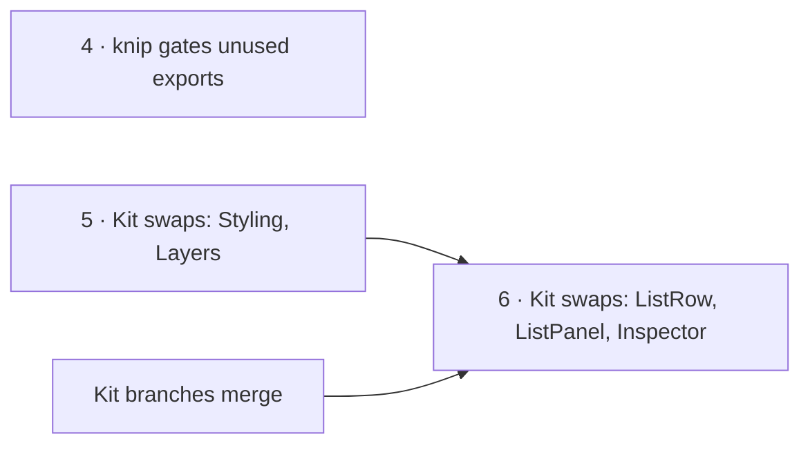

# Studio cleanup — what is left

Studio reaches the shape in [code-shape.md](code-shape.md) by moves and renames, never by rewriting
behaviour. [refactor-plan.md](refactor-plan.md) says *how* a move is made safely; this file is the
list of what has not moved yet, with its size today and where each item is specified. When an item
is done, remove its row and update the Status line in the doc it points to.

**Measured at `fe890d9a`.**

## The order

Items 7–12 are independent of that chain and can land in any order.

## Items

| # | Cleanup | Size today | Specified in | Changes behaviour |
|---|---|---|---|---|
| 13 | `shared/` imports modules — the dashboard widget registry (`dashboardWidgets.ts`, `dashboards/shared.ts`) and `StepRules` reach into `lenses` · `plans` · `skills` · `runs`, so `shared/` is not yet the leaf the direction needs | 3 files | [code-shape.md](code-shape.md) §4 | no — the registry moves to the shell, `StepRules` to `skills` |
| 4 | knip gates unused exports and types, not only dead files | 217 | [code-shape.md](code-shape.md) §8 | no |
| 5 | Kit swaps with no kit change: `StylingPanel` → `StylingViewPanel`, `LayersPanel` → `LayersViewPanel` | 2 files; no e2e covers either | [module-structure.md](../module-structure.md) §4 | **yes** — swatches and sliders; Layers gains Groups and loses Refresh |
| 6 | Kit swaps that need kit work: `ListRow` → `Item size="xs"`, `ListPanelChrome` · `ListFilterMenu` → `PanelContent`, `InspectorViewPanel` → `ElementInspectorViewPanel` | three kit extensions with stories, then a release | [module-structure.md](../module-structure.md) §4 | **yes** — row density; the Inspector reads the canvas |
| 7 | Decision ids in code comments and docstrings | about 1,100 in `src/` | CLAUDE.md rule 12 · [module-structure.md](../module-structure.md) §5b | no |
| 8 | Guardrails §8 names that do not exist: `scripts/check-kit-overlap.mjs`, the tokens-only check, the no-PixiJS check | 10 `hsl(` or hex literals in `src/` today | [code-shape.md](code-shape.md) §8 | no — clear the 10 literals, then add the checks to `check-names.mjs` |
| 9 | Control heights hard-coded instead of read from the density tokens | 54 `h-7` · `h-8` · `h-9`, some of them icon sizes | Design rules — *density is a token* | visual only |
| 10 | No coverage gate on Studio's unit tests | 20 tests; CI runs `--coverage` without a threshold | CLAUDE.md rule 6 (80%) | no — needs tests before a gate |
| 11 | e2e does not run in CI | the specs need the live stack | — | no |

## How to measure

| Item | Command (from `studio/`) |
|---|---|
| 2 | count `from "@/pages/graphs-detail/features/<m>/…"` outside `<m>`, excluding `<m>` and `<m>/index` |
| 3 | `grep -rl 'graphs-detail/shell/' src/pages/graphs-detail/features` |
| 4 | `pnpm exec knip --include exports,types` |
| 7 | `grep -rEc '\b(G\|SR\|AD\|WO\|LB\|MP\|SK\|SD\|RU\|PT\|AG\|GV\|B\|CV\|GC\|DS)[0-9]{1,3}\b' src` |
| 8 | `grep -rEo 'hsl\(\|#[0-9a-fA-F]{6}\b' src` |
| 9 | `grep -rEo '\bh-(7\|8\|9)\b' src` |

## Not in this cleanup

| Item | Why |
|---|---|
| The docs-wide vocabulary sweep (phase W) | its own phase ([module-structure.md](../module-structure.md) §9) |
| Engine package renames (R5) | waits on M4; `check-names.mjs` maps each Studio module to today's engine folder, so R5 is one line per module there |
| Stored renames | [module-structure.md](../module-structure.md) §7 — a migration, not a move |
