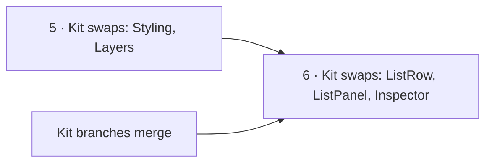

# Studio cleanup — what is left

Studio reaches the shape in [code-shape.md](code-shape.md) by moves and renames, never by rewriting
behaviour. [refactor-plan.md](refactor-plan.md) says *how* a move is made safely; this file is the
list of what has not moved yet, with its size today and where each item is specified. When an item
is done, remove its row and update the Status line in the doc it points to.

**Measured at `fe890d9a`.**

## The order

Items 7–12 are independent of that chain and can land in any order.

## Items

| # | Cleanup | Size today | Specified in | Changes behaviour |
|---|---|---|---|---|
| 5 | Kit swaps with no kit change: `StylingPanel` → `StylingViewPanel`, `LayersPanel` → `LayersViewPanel` | 2 files; no e2e covers either | [module-structure.md](../module-structure.md) §4 | **yes** — swatches and sliders; Layers gains Groups and loses Refresh. **Blocked on a decision:** `StylingViewPanel` paints a patch only while it is mounted and does not export its painting hook, so dropping Studio's own painting (as §4 says) would lose a board's styling whenever the card is closed. Either keep Studio's painting (`apply={false}`) or export the hook from canvas-ui first |
| 6 | Kit swaps that need kit work: `ListRow` → `Item size="xs"`, `ListPanelChrome` · `ListFilterMenu` → `PanelContent`, `InspectorViewPanel` → `ElementInspectorViewPanel` | three kit extensions with stories, then a release | [module-structure.md](../module-structure.md) §4 | **yes** — row density; the Inspector reads the canvas |
| 9 | Control heights hard-coded instead of read from the density tokens | 54 `h-7` · `h-8` · `h-9`: about 45 controls (28px buttons, inputs, triggers), the rest icon and skeleton sizes | Design rules — *density is a token* | visual only. **Blocked on the kit:** `--control-h` is not defined in `@invana/styling` yet — the kit reads it ahead of the token landing — and no kit `Button` size is 28px |
| 10 | No coverage gate on Studio's unit tests | 20 tests; **1.37%** of statements over all of `src/` (`pnpm test --coverage`) | CLAUDE.md rule 6 (80%) | no — needs tests before a gate, and a decision on what 80% is measured over |
| 11 | e2e does not run in CI | `nightly.yml` has an E2E job, but it starts the engine with no graph database, no demo data and no `E2E_GRAPH_PATH`, so the specs cannot pass there | — | no |

## How to measure

| Item | Command (from `studio/`) |
|---|---|
| 2 | count `from "@/pages/graphs-detail/features/<m>/…"` outside `<m>`, excluding `<m>` and `<m>/index` |
| 3 | `grep -rl 'graphs-detail/shell/' src/pages/graphs-detail/features` |
| 9 | `grep -rEo '\bh-(7\|8\|9)\b' src` |

## Not in this cleanup

| Item | Why |
|---|---|
| The docs-wide vocabulary sweep (phase W) | its own phase ([module-structure.md](../module-structure.md) §9) |
| Engine package renames (R5) | waits on M4; `check-names.mjs` maps each Studio module to today's engine folder, so R5 is one line per module there |
| Stored renames | [module-structure.md](../module-structure.md) §7 — a migration, not a move |
