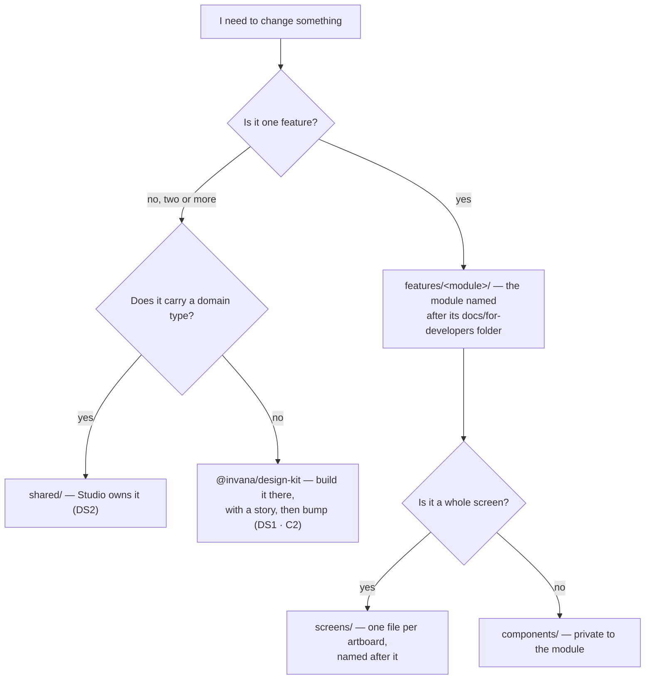

# Recommendation — building the 42 screens in Studio

How to get from today's Studio to forty-two screens composed from `@invana/design-kit`, without the
codebase becoming unmaintainable on the way. Scope: `studio/`. The screen list, the artboard → route
map and the build order live in [`design-kit-coverage.md`](design-kit-coverage.md) §4a; this document
is about the *shape of the code* those screens land in.

**Status**: a recommendation, not yet a decision. What it proposes becomes durable in two places once
accepted — the rules become `DS` rows in
[design-system.md](../modules/platform/features/design-system.md), and the module
layout becomes `studio/README.md`, which is what a new contributor reads.

---

## 1. The short version

| # | Problem | Today | After |
|---|---|---|---|
| 1 | **One route hosts the product** | `ExplorerPage.tsx` is 2,222 lines and renders Agents, Projects, Tasks, Skills, Workflows, Model, Links, Datasets, Templates, the canvas and the assistant. Every noun is a value in a 19-member `?panel=` union | One route per screen, one folder per feature module. No file over ~400 lines |
| 2 | **A parallel component layer** | 20 Studio components share an exact name with a kit export; `PanelChrome` (564) · `WorkRow` (138) · `CanvasTabsBar` (269) · the answer surface (717) all predate the kit's | Deleted. `@invana/ui` is the only component layer (DS1 · DS17) |
| 3 | **Dead code** | 2,462 lines in 9 files are unreachable from `main.tsx` — `ModellerPage.tsx` alone is 1,031 | Deleted, with a lint gate so it cannot come back |
| 4 | **Imports are positional** | No path alias; `../../../services/api/client` appears throughout. Moving a file rewrites its neighbours | `@/` alias + a per-module public surface. A move is a move |
| 5 | **The dependency list disagrees with the rules** | CodeMirror 6 is a direct dep though `@invana/editor` owns it; `@invana/tables` and `@invana/canvas-ui` are absent though the screens need them; `rbush` · `d3-force` · `immer` are imported nowhere | Deps match what the code imports and what the rules allow |

Doing 1–5 **before** the screens is the whole recommendation. Forty-two screens built on today's
shape would multiply every row in that table by forty-two.

---

## 2. What the audit found

Measured on `feature/agent-conversation`, `design-kit@0.0.23`.

| Measure | Value |
|---|---|
| Source files | 186 (`.ts`/`.tsx`) |
| Lines | 41,829 |
| Unreachable from `main.tsx` | ~~9 files · 2,462 lines~~ → ✅ **0** (Phase 1 deleted 8; the 9th, `telemetry/setup.ts`, is a side-effect import the detector cannot see) |
| Studio components whose name is also a kit export | **20** |
| Files over 500 lines | 14 |
| `text-[10px]` / `[11px]` / `[12px]` — absolute type, bypassing the ladder (D7) | **30 sites** |
| Raw `hsl(` / hex / Tailwind palette colours, against tokens-only | 22 sites |
| Unit tests | **0** (2 Playwright specs, no Vitest) |
| `pnpm build` | ~~red — 26 pre-existing type errors~~ → ✅ **green** (Phase 1) |
| `pnpm check-types` | ~~checks nothing — `tsconfig.json` is `{"files": []}`~~ → ✅ **`tsc -b --noEmit`** (Phase 1) |

### 2.1 Dead — delete in one commit

| Lines | File | Why it is dead |
|---|---|---|
| 1,031 | `pages/graphs/modeller/ModellerPage.tsx` | The `/modeller` route became a redirect. Already listed under **Retiring** in the index |
| 430 | `pages/graphs/explorer/components/CanvasesPanel.tsx` | Superseded by the canvas tab strip |
| 398 | `pages/graphs/explorer/components/SchemaOverview.tsx` | Superseded by the Model panel |
| 243 | `pages/graphs/modeller/components/SchemaNav.tsx` | Only `ModellerPage` imported it |
| 189 | `pages/graphs/modeller/components/ModelListPanel.tsx` | Only `ModellerPage` imported it |
| 102 | `services/telemetry/setup.ts` | Side-effect import from `main.tsx` — **keep**, the detector cannot see it. Listed so nobody deletes it |
| 41 | `pages/graphs/components/GraphStatusBadge.tsx` | No importer |
| 15 | `stores/ui.store.ts` | No importer |
| 13 | `.../SchemaCanvasPlaceholder.tsx` | No importer |

Net deletion: **2,360 lines**. `ModellerPage.tsx`'s siblings under `modeller/components/` are *not*
dead — the Model panel composes them, and they move to `features/connect-and-model/` in §4.

### 2.2 Duplicating the kit — delete against a kit import

Each row is a component Studio grew before `0.0.23` shipped its equivalent. This is DS1, and DS17
now dates it.

| Lines | Studio | Kit replacement |
|---|---|---|
| ~~564~~ | ~~`work/PanelChrome.tsx`~~ | ✅ **deleted** — the fourteen redistributed, and the four kit gaps it surfaced, are in [design-kit-coverage.md](design-kit-coverage.md) §6a |
| 323 | `explorer/components/emissions/TemplatesPanel.tsx` | `TemplatePicker` |
| 269 | `explorer/components/CanvasTabsBar.tsx` | `TabbedPanel variant="strip"` (needs A5) |
| 225 | `explorer/components/emissions/EmissionCard.tsx` | `EmissionCard` + `EmissionHeader` + `CitationMarker` |
| 193 | `work/WorkCanvasChrome.tsx` | `Legend` + `LegendItem` + `CanvasMessageBar` (canvas-ui) |
| 169 | `explorer/components/emissions/NotAnAnswer.tsx` | `CannotAnswerCard` + `DiagnosisCard` + `RepairNote` + `RetryNote` |
| 167 | `work/DetailRows.tsx` | `PropertyList` + `PropertyRow` |
| 138 | `work/WorkRow.tsx` | `Item size="xs"` + `StatusDot` + `Badge tone` |
| 83 | `explorer/components/ResultsTable.tsx` | `Table density="compact"`, or `DataTable` from `@invana/tables` |
| 48 | `graphs/components/GraphStatusBar.tsx` | `AppStatusBar` |

**~2,180 lines replaced by imports.** Two are gated: `CanvasTabsBar` waits on the kit's
`variant="strip"` (§4a A5), and `WorkCanvasChrome` waits on a canvas release (§5.3).

**Not duplication, keep them.** `ConfirmDialog` and `ThemeMenu` are thin domain wrappers that already
compose `AlertDialog` and `ThemeSelector` — exactly what DS2 asks for. Judge by what a file *contains*,
not by whether the kit has a component with a similar job.

### 2.3 Probably duplicating — verify, then delete

Each needs one read against the kit before it is cut. Named so the pass is finite, not open-ended.

| Lines | Studio | Likely kit replacement |
|---|---|---|
| 646 | `explorer/components/LayersPanel.tsx` | `LayersViewPanel` (canvas-ui) — **unblocked**, canvas `0.0.12` is published |
| 418 | `explorer/components/ExpandFineTunePanel.tsx` | `CanvasFiltersViewPanel` · `FindInCanvasViewPanel` (canvas-ui) — verify |
| 415 | `modeller/components/PropertyEditor.tsx` | `PropertiesEditor` (canvas-ui) |
| 269 | `explorer/components/CanvasTabsBar.tsx` | `BoardPagesViewPanel` (canvas-ui) — strip **and** bodies in one column, `keepMounted` |
| 193 | `work/WorkCanvasChrome.tsx` | `CanvasMessageBar` + `GraphLegendLayerEditorPanel` (canvas-ui) |
| 178 | `explorer/components/InspectorPanel.tsx` | `InspectorPanel` · `NodeDetailView` · `EdgeDetailView` (canvas-ui) |
| — | `explorer/lib/visibility.ts` | The store's native API — `hideNodes` · `showNodes` · `isNodeHidden` · `hideNodesByPredicate` · `showAllHidden` |
| 686 | `explorer/components/SessionComposer.tsx` | `ChatSessionComposer` + `ChatSessionContextChip`; the CodeMirror half → `@invana/editor` |
| 89 fields, 11 files | hand-written form markup — ProfileSettings · LLMs · NodeType · EdgeType · Skills · PropertyKey · Model · DeclareLink · Login · CanvasForm · Concurrency | `ObjectField` from `@invana/forms`, driven by a `FieldConfig[]` (DS18). **Gated on the kit gaining field validation** — see refactor-plan §2.5 |
| 520 | `explorer/components/SessionTurn.tsx` | `ChatSessionMessage` + `ChatSessionPromptRow` + `EmissionCard` |
| 398 | `explorer/components/SessionSteps.tsx` | `ChatSessionTaskRow` + `ChatSessionTaskGroup` + `ChatSessionDisclosure` + `ChatSessionActivitySubLine` |
| 388 | `explorer/components/TraceDialog.tsx` | `Sheet` + `TimelineList` + `PropertyList` + `StatusDot` |
| 343 | `explorer/components/SessionList.tsx` | `Item size="xs"` + `SectionHeader` |
| 329 | `explorer/components/ListPanel.tsx` | `Item size="xs"` + `FilterBar` |

---

### 2.4 The build is red, and the check that should have caught it is a no-op

Two findings from the `0.0.12` bump, both pre-existing and neither caused by it.

| Finding | Detail |
|---|---|
| `pnpm check-types` compiles nothing | `tsconfig.json` carries `"files": []` and two `references`. `tsc --noEmit` with no `-b` honours that literally and checks zero files, so the script has always passed |
| `pnpm build` (`tsc -b`) has 26 errors | 15 are canvas API drift never followed through (style props that no longer take functions, `GraphStore.getNodes` → `nodes`, `ILayer.getBounds`), 8 are Studio bugs (`run.store.ts` duplicate spread keys, a `Map<string, X>` / `Map<string, X[]>` mismatch, `useAuth().accessToken`), 3 are `react-hook-form` `Control<T>` variance |

**Both are fixed** (Phase 1): the 26 are cleared and `check-types` is `tsc -b --noEmit`, verified by
planting a deliberate type error and watching it fail. `refactor-plan.md` §1.1 records what each of
the 26 turned out to be — 16 of them were one wrong type annotation, written twice.

---

## 3. The dependency list

| Action | Package | Reason |
|---|---|---|
| **Add** | `@invana/tables` | `DataTable` with `density="compact"` and `groupBy` — batches 3–7 are mostly tables |
| **Add** | `@invana/editor` | `CodeBlock` + `MarkdownEditorBlock`. Owns CodeMirror so Studio does not (D6) |
| ✅ **Added** | `@invana/canvas-ui@0.0.14` | Canvas chrome. Published, installed, build at parity |
| ✅ **Added** | `@invana/renderer-pixijs` · `graph-layer-d3-contour` · `graph-layer-maplibre` · `graph-layout-d3-sankey`, all `@0.0.14` | **Required by `canvas-react`**, which statically imports all five layer/renderer packages. Four are declared *optional* peers, but an optional peer that is imported at the top level is not optional — Vite fails to pre-bundle `canvas-react` without them (`Could not resolve "@invana/graph-layer-d3-contour"`). Verified with a cold `.vite` cache. **They cost node_modules, not bytes**: Rollup tree-shakes `maplibre-gl` and the unused layers out entirely — they do not appear in `dist/` |
| **Remove** | `@codemirror/{commands,language,legacy-modes,state,view}` | One consumer (`SessionComposer.tsx`). `@invana/editor` replaces it; five direct deps for one editor is the thing D6 exists to prevent |
| ✅ **Removed** | `rbush` · `d3-force` · `immer` · `@types/d3-force` | Zero imports in `src/` |
| **Keep, do not "clean up"** | `pixi.js` · `pixi-viewport` | Zero imports, but `vite.config.ts` pins them so a local canvas checkout does not load PixiJS twice (DS11). Rule 10 forbids PixiJS *code*, not the pin |
| **Keep** | `elkjs` | Two real consumers (`ExplorerCanvas`, `WorkGraphCanvas`) |
| **Add (dev)** | `vitest` · `@testing-library/react` · `knip` | §8 and §9 — not yet added |

---

## 4. The target shape

One folder per **feature module**, named after the module in
[`docs/for-developers/modules/`](../modules/). The product's words are already the
directory names, so a developer holding a feature file knows where the code is without being told
(CLAUDE.md › *Use the product's words*).

```
studio/src/
  router.tsx                  route table only
  routes.ts                   every path as a named constant — one place a URL is written
  App.tsx  providers.tsx  ProtectedRoute.tsx  ErrorPage.tsx
  pages/
    auth/  graphs/  platform/  settings/    the routes that are not graph-scoped
    graphs-detail/
      GraphDetailPage.tsx     the one graph-scoped page — AppLayoutV2, ten features
      shell/                  its regions: leftNav, the open pages, the status bar
      features/
        connect-and-model/    1.x — models, the model canvas, links
        bring-data-in/        2.x — datasets, import runs
        ask/                  3.x — the answer surface, emissions, projections, the trace
        explorer/             4.1 · 4.3 · 4.4 — the canvas, what is selected on it, the console
        canvases/             4.2 — the page host in `mainSection`, and the canvas behind a tab
        agents/               5.x — agents, envelope, lineage, lifecycle, stats
        skills/               6.x — skills, bindings, usage, rules
        workflows/            7.x — the library, plan selection, promote
        memory/               8.x — proposals, consolidation
        work/                 9.x — projects, tasks, the plan, review
        operate/              10.x — schedules, audit and activity, observability
        graph-settings/       the Graph's own configuration — Info, Connection, LLMs
  shared/
    api/                      the HTTP client and one file per engine resource
    hooks/  lib/  stores/  types/  telemetry/
  ui/                         ONLY components the kit cannot own (DS2) — a domain type in the props
```

The graph-scoped modules live **under the page that hosts them**, because that is what they are:
ten `leftSection` components and their page kinds, composed by one `GraphDetailPage`.
[graph-detail-page.md](graph-detail-page.md) is the contract between them — read it before moving a
file into `features/`. Identity and access (11.x) is not graph-scoped and stays in `pages/auth/` and
`pages/settings/`; the Graph as an object stays in `pages/graphs/`.

`features/graph-settings/` is the one folder without a docs module of its own. Graph settings is
[1.1](../README.md#1--connect-and-model)'s Info and Connection plus the LLM providers, and it is a
`leftNav` item like any other, so it takes a module folder even though the docs file it against
connect-and-model. Named exception, documented here, not a precedent.

### 4.1 Inside a feature module

A **graph-scoped** module has no `routes.tsx` and no `screens/` — it has one `leftSection`
component and the page kinds it opens, both declared in its `index.ts` as a `GraphFeature`
([graph-detail-page.md](graph-detail-page.md) §4). The rest of this section still holds.

```
features/agents/
  index.ts                    the public surface — the ONLY file another module may import
  routes.tsx                  this module's route objects, lazy-loaded
  api.ts                      endpoints for 5.x, on shared/api/client
  types.ts                    the engine shapes this module reads
  queries.ts                  TanStack Query hooks
  screens/                    one file per artboard: AgentsScreen · AgentScreen · AgentStatsScreen
  components/                 private. Never imported from outside this folder
  panels/                     surfaces that render into a shell region rather than a route
```

| Rule | Detail |
|---|---|
| `index.ts` is the border | A module exports its routes, its panels and its query hooks. Nothing else. A deep import into another module's `components/` is a lint error (§8) |
| One screen file per artboard | `screens/AgentStatsScreen.tsx` ↔ `AgentStatsHiFi`. The name is the map — no index needed to find the code for a drawing |
| `components/` is private and small | If two modules need it, it goes to `shared/` if domain-free or `@invana/ui` if domain-free *and* general (DS2). Two modules importing the same private component is the signal, every time |
| A module owns its API calls | `features/agents/api.ts`, not a shared `services/api/work.ts` that four modules edit. Merge conflicts in a community project are mostly one shared file |
| No module imports `app/` | Dependency direction is `app → features → shared`. A feature that needs the router takes a prop or a hook from `shared/` |

### 4.1b A module's folder is its docs module; a sub-folder is one of its features

A module folder big enough to need structure takes it from `docs/for-developers/modules/<m>/`, not
from whichever of its features is most used.

| Rule | Detail |
|---|---|
| **The folder is the module, never a feature of it** | `features/ask/`, because [Ask](../modules/ask/spec.md) is the docs module. Naming it `features/assistant/` would promote one feature (3.10) over the module's other eight, and file `TemplatesPanel` — which is projections (3.4) — under a word that does not describe it |
| **A sub-folder is a feature, named after its file** | `ask/assistant/` ↔ `the-assistant.md` · `ask/answer-surface/` ↔ `the-answer-surface.md` · `ask/projections/` ↔ `projections.md`. A reader who knows the docs already knows the tree |
| **Never a shape word** | `templates/`, `components/`, `renderers/`, `views/` say how the code is built. `answer-surface/` says which feature it is, and the docs page it answers to |
| **Check the module's vocabulary before coining a folder name** | `template` was already Ask's word for a versioned, person-authored projection template ([projections.md](../modules/ask/features/projections.md) §3). `ask/templates/` holding `EmissionCard` beside `TemplatesPanel` would put two unrelated things under one word in one module |
| **A feature every module fills is promoted to its own folder** | `features/canvases/` ↔ [boards.md](../modules/explore/features/boards.md). The page host in `mainSection` holds six kinds owned by three modules — a data canvas (Explore), a model canvas (Connect and model), four work canvases (Work). Filing it under Explore would make two other modules deep-import Explore's private tree, which §4.1's border forbids. A feature only its own module uses stays a sub-folder; one every module fills is promoted |
| **The module folder then takes the screen's name** | `features/explorer/` ↔ [terminology.md](../terminology.md) *Explorer*. With canvases promoted out, what is left is one screen — the canvas and what is selected on it — and Explorer is the word the rail, the breadcrumb and the artboards already use for it. `explore/` named a module that no longer maps one-to-one onto a folder |
| **A sub-folder may name a screen that spans several features** | `connect-and-model/model/` holds 1.2 · 1.3 · 1.4 · 1.5 · 1.7, because one screen — the Model panel and the model canvas — draws all five, and `ModelPanel` assembles them in one file. Four sub-folders named after four feature files would split one screen four ways and put its assembler in whichever one won. The test is the screen, not the file count: `stitch/` is its own folder because [stitch-models](../modules/connect-and-model/features/stitch-models.md) is a different subject with its own page kind, not because it is a different docs row |

The last one is the general rule and the cheapest check there is: a folder name is a product word, so
[terminology.md](../terminology.md) and the module spec's Vocabulary table decide it, not the shape
of the files going in.

### 4.1c The two Explore folders, file by file

Explore is two folders, and the line between them is **subject, not shape**: `explorer/` is what is
drawn and what is selected on it; `canvases/` is the host that mounts it and the saved record behind
the tab ([boards.md](../modules/explore/features/boards.md) CV7 · CV8).

```
features/
  explorer/                      4.1 graph-canvas · 4.3 selection-and-the-panel · 4.4 the-console
    index.ts                     the border — canvases/ imports only from here
    ExplorerCanvas.tsx           the canvas + ExplorerHeaderToolbar
    ExplorerTypesPanel.tsx       the leftSection: node types · relationships · selected
    InspectorPanel.tsx           the ?right=inspector occupant
    LayersPanel.tsx              CV6 card — what is painted        (deleted in phase 4)
    StylingPanel.tsx             CV6 card — how it is painted
    ExpandFineTunePanel.tsx      expand, with filters and a sort
    useExpandNode.ts             the expand mutation
    canvasTheme.ts               theme tokens → engine colours
    typeColor.ts                 type → palette slot, so legend and drawing agree
    visibility.ts                the hidden cascade            (deleted in phase 4)

  canvases/                      4.2 canvases — the page host, and the record behind a tab
    index.ts                     the border
    BoardPages.tsx              mainSection: builds pages[], renders BoardPagesViewPanel
    usePages.ts                  activePageId · selectPage · closePage · pageHeaderActions
    useCanvasTabs.ts             openTabs · openCanvasTab · closeCanvasTab
    DataBoardPage.tsx           one data canvas and its cards — the `data` page body
    CanvasFormDialog.tsx         create / rename a canvas
    CanvasHistoryPanel.tsx       CV6 card — the version timeline
    useCanvasStates.ts           contents · seed · styling · selection, keyed by canvas
    captureBanner.ts             the tab's and the version's thumbnail
    canvasKinds.ts               the six kinds, and which two write from a gesture
```

| Rule | Detail |
|---|---|
| One direction | `canvases → explorer`. The host mounts the canvas; the canvas never reaches for the strip. A control on the strip that must act on a page body goes through `BoardPageHandle` ([graph-detail-page.md](graph-detail-page.md) G12), not an import |
| No `utils/`, no `lib/` | `canvasTheme` · `typeColor` · `captureBanner` · `visibility` are engine **adapters** — PixiJS needs concrete values, not classes. Four small files at the top of the folder, because a shape-word folder is banned above and a bag named `utils/` is the shape word that hides the most |
| The other kinds stay home | `ModelCanvas` stays in `connect-and-model/`, `WorkCanvas*` in `work/`. `canvases/` holds the **host**, not every body it can mount — it takes them as a registered page kind |

### 4.1d The two Connect-and-model folders, file by file

Connect and model is two folders, and the line is **subject** again: `model/` is a model authored on
its own — its types, its draft, its versions, and the file it travels in; `stitch/` is what happens
*between* two published models ([stitch-models.md](../modules/connect-and-model/features/stitch-models.md)
ST1 · ST8 · ST11).

```
features/connect-and-model/
  index.ts                     the border — GraphDetailPage imports only from here
  CompatibilityBanner.tsx      graph-connectors capabilities.md — neither feature's, so neither owns it

  model/                       1.2 introspect · 1.3 domain-models · 1.4 model-editor · 1.5 share · 1.7 starters
    ModelPanel.tsx             the leftSection occupant — the version bar, the type lists, the staged bar
    ModelCanvas.tsx            the `model` page kind, mounted by canvases/
    types.ts                   ModelSelection · SelectedItem · ModelEditCtx — this module's own shapes
    propertyTypes.ts           the connector's property types, with a fallback
    components/                private — 16 files: the canvas, the detail column, the forms, the tables

  stitch/                      1.6 stitch-models
    StitchesSection.tsx        the Stitches section of the Model panel — both kinds declared from one `add` (ST13)
    GlobalModelPage.tsx        the `global-model` page kind — the derived union, owned by no one model
    AllModelsCanvas.tsx        the `all-models` page kind — every model as a group frame (ST14), zoom as altitude (ST15)
    allModels.ts               the data build: frames, members, crossings. Pure — no queries, no style
    useAllModels.ts            the fan-out: models + each active version + model-links (ST16)
    components/
      DeclareStitchDialog.tsx  anchor or relationship, pre-filled from the selected type
```

| Rule | Detail |
|---|---|
| One direction | `model → stitch`. `ModelPanel` renders `StitchesSection`; nothing in `stitch/` imports `model/` except its `ModelSelection` type. A link is declared *from* a selected type, so the arrow points the way the gesture does |
| The assembler is named for its region, not its folder | `ModelPanel` occupies `leftSection`, so it is a Panel (§4.1a). `StitchesSection` is a section *inside* that panel, so it is a Section — `StitchPanel` would claim a region it does not have. Not every feature folder ends in a `*Panel` |
| `types.ts`, never `utils.ts` | The module-local shapes collect in `model/types.ts`. The connector's property-type list is `propertyTypes.ts` — named for what it holds, because §4.1c bans the bag that hides the most |
| `hooks/` when there are hooks | `useModels` · `modelsApi` · the model shapes are still in `shared/`. They have no importer outside this module and §4.1 says they should move in, but that is its own commit — `model/hooks/` appears when it does, not as an empty folder now |
| A banner that belongs to another module stays at the root | `CompatibilityBanner` answers to [capabilities.md](../modules/graph-connectors/features/capabilities.md) and renders in the Model panel. Filing it under `model/` would say the model owns the connection's version window. It sits at the module root until graph-connectors has a folder to take it |

### 4.1a How a symbol is named

The folder already says who owns it. A name repeats nothing the path carries, and claims nothing the
engine has not granted.

| Rule | Detail |
|---|---|
| **The folder is the prefix** | Inside `features/ask/assistant/`, everything is the assistant's. `AssistantSessionList` distinguishes nothing from `SessionList`; the prefix is only worth adding to a name that is ambiguous **at its call site**, not to one that is ambiguous in isolation |
| **A noun belongs to whoever the engine says owns it** | A session belongs to the *graph* — the route is `/sessions`, the client is `sessionsApi`, and the same hook serves two surfaces. So it is `useSessions`, never `useAssistantSessions`: the prefix would claim an ownership the engine does not grant, and would be wrong at one of the two call sites |
| **A panel is named for its occupant, not its contents** | `AssistantPanel`, because the occupant of the region is the Assistant and sessions are what it holds ([the-shell.md](the-shell.md)). `SessionsPanel` named the contents, and the name stopped being true the moment the panel moved |
| **A name that has stopped being true is a bug** | `closeSessions` closed the *left* panel and was handed to nine panels, none of them Sessions. Rename on sight — a lying name costs more than an unfashionable one, and an unfashionable one costs nothing |
| **A hook that names a region lives with the shell** | `useRightSection` sits in `shell/`, beside `useSettingsPanel`, not inside `features/ask/assistant/`. The region is the shell's question; the assistant is only one of the things that can answer it |

The test for a rename is whether the name is **false**, not whether it is **unprefixed**. Renaming
`SessionsPanel` was worth it (the occupant is not "sessions"); renaming `SessionList` inside it
would not be.

### 4.2 Where today's files go

For the graph-scoped modules this table is superseded by
[graph-detail-page.md](graph-detail-page.md) §6, which names every file and its destination
under `pages/graphs-detail/`.

| From | To |
|---|---|
| `pages/graphs/explorer/components/model/*` · `pages/graphs/modeller/components/*` | `features/connect-and-model/` |
| `pages/graphs/explorer/components/datasets/*` | `features/bring-data-in/` |
| `pages/graphs/explorer/components/emissions/{EmissionCard,EmissionBodies,NotAnAnswer}` · `ResultBlock` · `ResultsTable` · `TraceDialog` · `lib/emissions.ts` | `features/ask/answer-surface/` |
| `pages/graphs/explorer/components/emissions/TemplatesPanel` | `features/ask/projections/` |
| `pages/graphs/explorer/*` (canvas, types panel, inspector, layers, styling, type colour, theme) | `features/explorer/` |
| `pages/graphs/explorer/*` (the page host, the canvas record, its versions, its contents) | `features/canvases/` |
| `pages/graphs/explorer/*` (sessions, assistant) | `features/ask/assistant/` — the assistant is Ask's surface on every left panel, not one of Explore's ([the-assistant.md](../modules/ask/features/the-assistant.md) AD12) |
| `pages/graphs/work/AgentsPanel` · `AgentDetail` | `features/agents/` |
| `pages/graphs/work/SkillsPanel` · `components/settings/sections/SkillsSection` | `features/skills/` |
| `pages/graphs/work/WorkflowsPanel` · `PromoteDialog` | `features/workflows/` |
| `pages/graphs/work/ProjectsPanel` · `TasksPanel` · `TaskActivityTree` · `WorkCanvas*` | `features/work/` |
| `components/settings/sections/Events*` · `event*.ts` · `pages/platform/PlatformEventsPage` | `features/operate/` |
| `pages/auth/LoginPage` · `pages/settings/ProfileSettingsPage` · `hooks/useAuth` · `stores/auth.store` | `features/identity-and-access/` |
| `pages/graphs/GraphsListPage` · `GraphCreatePage` · `GraphForm` · `GraphDetail` · `components/settings/*` | `features/graphs/` |
| `components/Theme*` · `Saturation*` · `studioThemes` · `AppVersion` | `app/shell/` |
| `services/api/*` · `hooks/queries/*` · `lib/*` · `types/*` · `stores/*` | `shared/`, then split into each module's `api.ts` / `types.ts` as that module is touched |

The last row is deliberate: `shared/api/` and `shared/types/` are a **staging area**, not the
destination. A module moves its slice out when its screens are built. Doing all of it up front is a
6,000-line diff nobody can review.

### 4.3 Path alias

`@/` → `src/`. One line in `vite.config.ts` and `tsconfig.json`, and `../../../` stops appearing in
review diffs. Within a module, relative imports stay — `./components/AgentRow` is correct and says
"this is mine".

---

## 5. Routing — a route per screen

### 5.1 Why the `?panel=` param cannot carry 42 screens

Today every graph-scoped surface is a value in one union and a branch in one component:

```
/u/:username/:graphSlug?panel=agents&right=assistant
```

That decision was right when the vocabulary was *canvas, model, sessions* — the panels all painted on
one canvas, so one page was honest. It stops being honest at Review, Schedules, Rules, Agent stats and
Project plan, which paint on nothing and simply *are* screens. The costs compound: one 2,222-line
component, one chunk, no per-screen code splitting, a back button that does not work, and a URL that
cannot be linked to a colleague.

### 5.2 The route map

```
/u/:username/:graphSlug/
  /                             the graph page (graph-detail-page.md G15) — the root, not a redirect
  explorer                      the canvas — panels stay as ?panel= (they do paint on it)
  model            model/:modelId           links
  runs             runs/:runId
  library          library/:planId          library/entries/:entryKey
  govern           govern/:lensId
  agents           agents/:agentId          agents/:agentId/stats   agents/llms/:providerId
  projects         projects/:projectId      projects/:projectId/plan
  skills           skills/:skillId          skills/rules/:ruleId
  review           review/:itemId
  schedules        schedules/:scheduleId
  settings/*       events
```

**`?panel=` is the vocabulary inside the graph page; these are its routes' names, not a second
scheme.** A panel is reached as `?panel=<name>`, its open drawer as `&drawer=<name>`, and the record
drilled into by a key named for the record ([G31](graph-detail-page.md)). The paths above name the
same sections for the router's sake — they do **not** give a plan two spellings.

| Why the query string wins | |
|---|---|
| The breadcrumb reads the URL back **literally** ([G16](graph-detail-page.md)) | `owner › graph › panel › object` is the query string's shape, not a path's |
| One key per region, and the occupant is its value | `?panel=` · `?page=` · `?right=` · `?drawer=` · `?tab=` already describe **every** region this way. A path for one of them would be the exception that needs explaining |
| `mainSection` is `keepMounted` and holds several pages at once | a path names one thing; the region holds many, so `?page=` is the only honest spelling |
| A deep link must survive a panel switch | dropping `&plan=` when `?panel=` moves ([G35](graph-detail-page.md)) is a query-string operation |

**So a plan is `?panel=library&drawer=plans&plan=nl-single@4`, and nothing else.** A path to it is not
offered, not redirected and not kept working.

**Retired names, deleted not redirected** (G31): `datasets` · `tasks` · `workflows` · `imports` ·
`thoughts`. `rules` moves under `skills`, `templates` under `library`.

| Rule | Detail |
|---|---|
| The rail switches routes, not a param | One rail key ↔ one path. The active state comes from the router, not from app state mirroring it |
| A panel is still a panel | `?panel=layers` and `?right=assistant` stay params — they modify the surface you are on. A *screen* is a path; a *view of a screen* is a param |
| Old links keep working | Every `?panel=<key>` redirects to its new path. The index's **Retiring** table takes a row, with a major-version removal date |
| Lazy per module | `features/<m>/routes.tsx` is one dynamic import. Today the whole product is in the Explorer chunk |

---

## 6. What the kit already gives you

Before writing a component for a batch, check this. Everything named is in `@invana/ui@0.0.23`.

| Batch | Screens need | Kit component |
|---|---|---|
| **all** | shell · rail · header · status bar · context bar | `AppLayoutV2` · `NavVertical` · `NavHorizontal` · `AppStatusBar` · `ContextBar` |
| **all** | list rows, section bands, filter chips, empty states | `Item size="xs"` · `SectionHeader` · `FilterBar` · `EmptyState` · `EmptyStateLock` |
| **all** | key/value detail | `PropertyList` + `PropertyRow` |
| 1 · Explorer | legend, type dots, canvas chrome | `Legend` · `StatusDot` · canvas-ui |
| 1 · Answers | emission, cannot-answer, diagnosis, clarify, projection switch, citations | `EmissionCard` · `EmissionHeader` · `CannotAnswerCard` · `DiagnosisCard` · `RepairNote` · `RetryNote` · `ClarifyCard` · `TemplatePicker` · `CitationList` |
| 2 · Model / data | schema tables, property editor, import runs | `DataTable density="compact"` · `@invana/forms` `inputSize="sm"` · `TimelineList` |
| 3 · Agents | the agents, envelope, lineage, **the stats screen** | `Item` · `AgentChip` · `TreeView` · `MetricGrid` + `MetricTile` · `BarChartV` · `HeatStrip` · `Progress size="sm"` |
| 4 · Work | projects, the plan, tasks, step lists | `DataTable groupBy` · `ChatSessionTaskRow` · `ChatSessionTaskGroup` · `StatusDot` |
| 5 · Review / memory | the queue, a proposal, diffs, rating | `ProposalCard` · `DiffList` + `DiffRow` · `RatingControl` + `DotRating` |
| 6 · Skills / rules / workflows | markdown authoring, versioned blocks, diffs | `@invana/editor` `MarkdownEditorBlock` · `CodeBlock` · `DiffList` |
| 7 · Operate | schedules, firings, the CLI transcript | `HeatStrip` · `TimelineList` · `Terminal` + `TerminalLine` |

**One gap in the whole set**: `SubgraphPreview` (coverage map §2.7 row 52). Everything else on the
board has a component.

**Charts carry a caveat.** `BarChartH` · `BarChartV` · `DivergingBar` · `HeatStrip` · `Sparkline` are
built but marked TODO in design-kit — the form inventory is unsettled, and `AgentStatsHiFi` is their
first real consumer. Expect to change the kit while building batch 3, and treat that as the point of
the exercise rather than a delay.

---

## 7. Order of work

Each phase is independently shippable and leaves the tree green. Phases 1–4 are prerequisites; the
screens start at 5.

| Phase | Work | Done when |
|---|---|---|
| ✅ **1 · Sweep** | Delete §2.1. Add the `@/` alias. Drop `rbush` · `d3-force` · `immer`. Clear the 26 build errors and point `check-types` at `tsc -b --noEmit` (§2.4) | **Done.** `pnpm build`, `pnpm check-types` and `pnpm lint` green; `pnpm dev` serves; −2,538 lines. Outstanding: `vitest` and `knip` are not installed, and the e2e specs need the engine to run |
| **2 · De-duplicate** | §2.2 in one commit per row, each replacing a Studio component with a kit import at its call sites | No Studio component shares a name with a kit export. −2,180 lines |
| **3 · Move** | §4.2 — mechanical moves, no logic changes, one commit per module. `shared/` is staging | `git log --stat` shows renames only. `ExplorerPage.tsx` is under 400 lines |
| **4 · Route** | §5.2 — the rail drives the router; `?panel=` becomes redirects; per-module lazy routes | Every current surface has a URL; a reload lands on the same screen; the Explorer chunk shrinks |
| **5 · Shell** | §4a A2–A4 — `GraphDetail` drives `AppLayoutV2`'s regions; the Explorer composes to the contract; the console lands | A panel toggle does not remount the canvas. S12f closes |
| **6 · Kit gaps** | §4a A5 — `NavVertical` `active`, `TabbedPanel variant="strip"`, 38/25 defaults → release → drop the overrides both sides | No `!` override in Studio or in the `ExplorerShell` story |
| **7 · Screens** | §4a A6, batches 1–7. One module at a time, its whole hi-fi reconciled into its documents first | Every artboard has a route and is ✅ or 🖼 in the index |

Phases 1–4 touch roughly 5,000 lines and add no feature. That is the price of forty-two screens, and
it is far cheaper now than after twenty of them are built on the current shape.

---

## 8. Guardrails

A convention a community project cannot enforce is a convention it does not have.

| Guard | How |
|---|---|
| No component shadowing a kit export | `scripts/check-kit-overlap.mjs` — reads `@invana/ui`'s `.d.ts`, greps Studio's exported component names, fails on a collision. Runs in `pnpm lint` |
| No cross-feature deep imports | Biome `noRestrictedImports`: `src/features/*/!(index.ts)` is not importable from another feature |
| No canvas-ui fork | A canvas panel, toolbar, card, menu or status strip is `@invana/canvas-ui`'s. [canvas-ui-coverage.md](canvas-ui-coverage.md) is the map, read before writing one; a surface listed there is consumed, never reimplemented |
| No dead files | `knip` in CI |
| Tokens only | Extend the check script to fail on `hsl(` · `#rrggbb` · `bg-{palette}-{n}` in `src/` — the same rule `.design/board/build.mjs` enforces (§5.4) |
| The type ladder | Fail on `text-[Npx]`. **30 sites today** — fix them in Phase 1, then the gate holds (D7 · DS13) |
| No PixiJS | Fail on any `pixi` import in `src/` (rule 10). The `vite.config.ts` pin is exempt |
| File size | Warn over 400 lines. A warning, not an error — some canvas files earn it |
| One `TooltipProvider`, in the shell | `main.tsx` mounts it around the router with `delayDuration={300}`. A screen never declares its own — a second provider is a second delay to keep in step, and the one that wins depends on where a component happens to sit. Kit components that provide one internally are unaffected: nesting is legal, and theirs wins inside them |
| Nothing interactive in a `PanelStack` title | A section header **is** its collapse `<button>`, so a `<button>` in the title is a button inside a button — invalid HTML, and it steals the collapse click. A drill-in's trail is text and its *back* is a `headerActions` item ([SK27](../modules/skills/features/authoring-a-skill.md#decisions)); `TaskDrawer` and `SkillsPanel` both do it that way |

Each is a few dozen lines and pays for itself the first time a contributor's PR is corrected by CI
instead of by a reviewer.

---

## 9. Testing, proportionate

CLAUDE.md asks for few tests, positive and negative, and 80% coverage. Today: **zero unit tests.**
Chasing 80% across 42 screens would be its own project, so the recommendation is narrower.

| Layer | What is tested | Not tested |
|---|---|---|
| Vitest + Testing Library | Per module: the query hooks, the reducers, the URL ↔ state mapping, and one render of each screen's empty and error states | A screen's happy-path markup — that is what the kit's stories already cover |
| Playwright | The two specs today, plus one per journey as its module closes | Every screen |
| The guardrails in §8 | Structure — which is where a 42-screen codebase actually rots | |

Add `vitest` in Phase 1 so the harness exists before there is anything to test.

---

## 10. What a contributor sees



Three files carry the whole map, and each is short:

| File | Answers |
|---|---|
| `studio/README.md` | Where does my code go — §4, §4.1, this flowchart |
| `app/routes.ts` | What screens exist |
| [`the-screens.md`](../the-screens.md) | Which artboard is which screen, whether it is built, and whether it is on the kit |

---

## 11. Risks and open questions

| # | Risk | Handling |
|---|---|---|
| R1 | Phases 1–4 are ~5,000 lines of churn with no visible feature | One commit per row and per module; every phase leaves the tree green and both e2e specs passing. Reviewable in pieces, revertable in pieces |
| R2 | Route-per-screen contradicts the "one page" decision in [explore/spec.md](../modules/explore/spec.md) | It narrows it, and the narrowing is real: the canvas surfaces stay one page, the screens that paint on nothing get paths. **Write it into `explore/spec.md` before Phase 4** — that decision is the reason the union exists |
| R3 | A 🖼 screen encodes a guess about an API that does not exist | DS15 — a 🖼 screen is layout plus `EmptyState`, nothing data-shaped. That is the ceiling, not a guideline |
| R4 | The kit's charts are unsettled and batch 3 is their first consumer | Expect to change design-kit while building `AgentStatsHiFi`. Budget it as kit work, not as a Studio delay |
| R5 | `PanelChrome` and the session components carry behaviour, not just markup | §2.3 is *verify then delete*, one read each. Where behaviour survives the kit component, it becomes a hook in the module, not a fork of the component |

| # | Open question | Needed by |
|---|---|---|
| ~~Q1~~ | ~~Release `@invana/canvas` `0.0.12`?~~ — **answered: released.** All `@invana/*` canvas packages are on npm at `0.0.12`, Studio is pinned there, and `canvas-ui` ships `LayersViewPanel` · `BoardPagesViewPanel` · `CanvasControlsToolbar` · `CanvasMessageBar` · `GraphStatusBar` · `InspectorPanel` · `SchemaViewPanel` · `PropertiesEditor` and every editor panel. `@invana/graph` carries the native visibility API. §2.3 is unblocked | ✅ |
| Q4 | `@invana/forms` — F1 `useForm` re-export, F2 `ObjectField` generic in `TFieldValues`, F3 `FieldConfig` validation (`required` · `rules` · `disabled` · `readOnly`). F3 is what gates converting eleven hand-written forms | Phase 2 |
| Q2 | Does `features/graphs/` keep that name, or do its surfaces distribute into `connect-and-model` and `identity-and-access`? | Phase 3 |
| Q3 | `shared/api/` as a staging area, or split every resource into its module in Phase 3? Staging is proposed; splitting up front is a 6,000-line diff | Phase 3 |

## Container queries: never pair one with a base utility

A container-query variant and the plain utility it is meant to override have the **same
specificity**, so whichever Tailwind emits later wins — and it emits `@container` blocks *before* the
plain utility layer. `hidden @3xl:flex` therefore resolves to `display: none` at every width, which
is a blank region with no error anywhere.

| Don't | Do |
|---|---|
| `hidden @3xl:flex` | `@max-3xl:hidden @3xl:flex` |
| `@3xl:hidden` beside a base `block` | `@max-3xl:block @3xl:hidden` |
| `flex-col @2xl:flex-row` | `@max-2xl:flex-col @2xl:flex-row` |
| `w-[260px] @max-2xl:w-full` | `@2xl:w-[260px] @max-2xl:w-full` |

The rule: **a property a container query sets must be set only by container queries.** `@max-*` and
`@min-*` are mutually exclusive, so order stops mattering entirely. This cost two rounds on the
onboarding wizard — once as a blank island, once as a body that would not go two-column.
