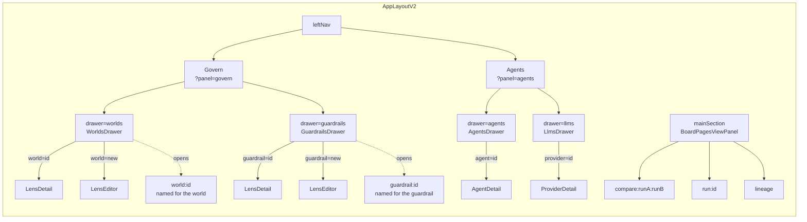

# Govern and Agents — the panels, and the components that build them

The sixteen artboards of the [Govern, Agents and Skills
canvas](https://claude.ai/artifact/VrdrR5iKGfqsjhCouQDTbc) read as components: which already exist
in `@invana/design-kit`, which have to be built there first, and what each one is wired to.

**Every Govern screen on this page is built** — W1 · W2 · W3 · W4 · G1 · G2 · R1 · R2 · R3 · R4,
against a seeded Graph, with their seams — **and the half that makes them bite is built too**
(§ 6 step 5a): the interpreter checks an address before dispatch, the connector is handed the
narrowing, and every engagement writes a touch. R1 · R2 · R3 read the real ledger. The Agents
screens here are still `Studio 🔵`. Its engine half
([building-engine/govern-and-agents-data-model.md](../building-engine/govern-and-agents-data-model.md))
**is**, for Govern: the record, the grammar, the resolvers and the routes exist, so the components
below have something real to read. The two are reviewed together, because a component with no engine
shape is a drawing and an engine shape with no component is a table.

| | |
|---|---|
| Draws | [14.1 Worlds](../modules/govern/features/worlds.md) · [14.2 Guardrails](../modules/govern/features/guardrails.md) · [5.1–5.7 Agents](../modules/agents/spec.md) |
| Shell | [the-shell.md](the-shell.md) — one `AppLayoutV2`, every screen fills its regions |
| Kit | [design-kit-coverage.md](design-kit-coverage.md) is the board-wide map; this is the Govern and Agents slice of it |
| Rule | A component Studio needs and the kit lacks is **built in design-kit with a story**, never inlined here ([rule 9](../../../CLAUDE.md)) |

---

## 1. The two panels

Both are `leftSection` stacks. Agents owns no page kind of its own; Govern owns three — **`world`**, **`guardrail`** and **`compare`**. A world's drill-in opens its board beside the drawer, titled with the world's own name ([WO15](../modules/govern/features/worlds.md) · [GR14](../modules/govern/features/guardrails.md)).

| Route | Opens | Artboard |
|---|---|---|
| `?panel=govern&drawer=worlds` | the worlds list, guardrails strip locked above it | W1 · W4 |
| `?panel=govern&drawer=worlds&world=<id>` | the drill-in, header `‹ WORLDS / EU · H1 2026`, **and the board `world:<id>` in `mainSection`** | W2 |
| `?panel=govern&drawer=worlds&world=new` | the authoring form — the same `LensEditor` the guardrail uses ([WO10](../modules/govern/features/worlds.md)) | W3 |
| `?panel=govern&drawer=guardrails` | the guardrails in force | G1 |
| `?panel=govern&drawer=guardrails&guardrail=<id>` | that guardrail's rules, grouped by layer, **and the board `guardrail:<id>`** | G1 |
| `?panel=govern&drawer=guardrails&guardrail=new` | the same editor, with the rule builder and its live match preview | G2 |
| `header.right` chip, `?lens=<id>` | which world the next question is asked under | W1 |
| `?panel=agents&drawer=agents` | the agents, the LLMs drawer beneath it | A1 |
| `?panel=agents&drawer=agents&agent=<id>` | the agent, its three bounds, its cast, its ceilings | A1 · A2 · A4 |
| `?panel=agents&drawer=llms` | the endpoints, each a group over the models it offers | A6 |
| `?panel=agents&drawer=llms&provider=<id>` | one endpoint: its fields, its ping, its models | A6 |
| `?panel=agents&drawer=llms&provider=new` | configuring one — the same drill-in a world's `new` is | A6 |
| `?panel=settings&tab=agents` | the Graph's run ceiling, and its pools busy or quiet | A5 |
| page `run:<id>` | the layer strip, and *this run's lens* | R1 · R2 |
| page `compare:<runA>:<runB>` | two runs, side by side, touches diffed | R3 |
| page `world:<id>` · `guardrail:<id>` | one lens as the auditor's document — what it narrows, how it is used, every rule as a row, the cast resolved | W2 · G1 |
| page `lineage` | who spawned whom, on what run | A3 |
| page `concurrency` (or the drawer's footer) | running · queued · every ceiling | A5 |

**The world chip is not in either panel.** It lives in `header.right`, beside the nodes-in-view
readout ([WO5](../modules/govern/features/worlds.md)) — a run opened from a schedule has no composer
to carry it. Its param is **`?lens=`**, not `?world=`: the drill-in key is dropped whenever `?panel=`
moves, and what a question is asked under must not be ([WO11](../modules/govern/features/worlds.md)).

**There is no `?rule=` param.** A rule is an element of `rules[]`, never a record
([govern § 6](../modules/govern/spec.md)), so G2 is the guardrail's own editor with the builder
inside it — the same `LensEditor` W3 opens. A key for a thing with no id would be a fourth stack
param naming an array index.

---

## 2. What the kit already has

Checked against `~/Projects/invana/design-kit` at `0.0.23`. Thirteen of the artboards' elements need
no new component at all.

| Element | Component | Package |
|---|---|---|
| The drawer stack, and a drawer's header | `PanelStack` · `PanelBox` · `PanelContent` · `SectionHeader` | `@invana/ui` |
| A list row that opens something | `Item` · `MenuItem` | `@invana/ui` |
| The list header's search and filters | `SearchInput` · `FilterBar` | `@invana/ui` |
| The drill-in trail `‹ WORLDS / EU · H1 2026` | `Breadcrumb` · `RecordHeader` | `@invana/ui` |
| `$1.84 of $40.00 this month` | `MetricTile` with `meter` | `@invana/ui` |
| `Touches 23 · refused 2 · sent out 0` | `MetricTile` · `MetricGrid` | `@invana/ui` |
| The envelope's `bound` column | **`BoundChip`** — the nine bounds, already a closed vocabulary | `@invana/ui` |
| An agent on a row or in a trace | **`AgentChip`** | `@invana/ui` |
| Pinged green / red | `StatusDot` | `@invana/ui` |
| A refusal that names its bound and carries the recourse | **`CannotAnswerCard`** — *this run cannot open* is exactly its shape | `@invana/ui` |
| A failure — a provider that would not answer | `DiagnosisCard` | `@invana/ui` |
| `Routes@v4 · 11 of 12 properties` | `PropertyList` | `@invana/ui` |
| What B touched that A did not | `DiffList` | `@invana/ui` |
| The lineage nesting | `TreeView` | `@invana/ui` |
| Model and property pickers, the name field | `Field` · `Input` · `Checkbox` · `Select` · `RichSelect` | `@invana/forms` |
| The rule tables, the ceilings table | `DataTable` | `@invana/tables` ⚠ **not installed in Studio yet** |
| The empty world list, *nobody has made a world* | `EmptyState` | `@invana/ui` |
| Confirm before a pause or a guardrail save | `AlertDialog` | `@invana/ui` |

**Two install chores first** ([design-kit-coverage.md](design-kit-coverage.md) already names them):
`@invana/tables` and `@invana/editor` are not in Studio's dependencies, and half these rows are
tables.

---

## 3. What has to be built in design-kit first

Eleven components. All are **Invana-domain compositions of primitives**, so they go in
`packages/ui/src/components/ui-extended/` with one story each, not into `studio/`.

| # | Component | Draws | Props, in outline | Artboards |
|---|---|---|---|---|
| K1 | ✅ `LayerChip` | one of the five layers, or the spine | `layer: "graph_data" \| "llm" \| "third_party" \| "cache" \| "human" \| "agent"` · `count?` · `dim?` | every Govern board |
| K2 | ✅ `AddressChip` | `graph_data/model/Routes@v4` with its segments visually split, truncating in the **middle** so the participant stays readable | `address` · `tone: "allowed" \| "denied" \| "refused" \| "untouched"` · `onOpen?` | W2 G1 G2 R1 R2 R3 R4 A6 |
| K3 | ✅ `RuleRow` | a match, allow or deny, and its selectors and egress as sub-lines | `match` · `allow` · `properties?` · `select?` · `egress?` · `readOnly?` | W2 G1 G2 |
| K4 | ✅ `LayerSection` | a titled band of `RuleRow`s for one layer, with the layer's own summary line | `layer` · `summary` · `children` | W2 G1 |
| K5 | ✅ `LensRow` | a world in a list: name · the chips it narrows by · `used in 34 runs · last 2h ago` | `name` · `narrows: Narrowing[]` · `usage?` · `selected?` | W1 W4 R3 |
| K6 | ✅ `LensChip` | the `header.right` chip and the agent-row chip; reads **`Everything`** when null | `lens?` · `onPick?` | W1 A1 |
| K7 | ✅ `CastTable` | `role → resolves to → why this one`, four fixed rows | `cast` · `resolved?` · `readOnly?` | W2 A1 R4 |
| K8 | ✅ `SliceSummary` | `time 2026-01-01 → 06-30 · axis observed_at` — **the axis is always named** | `select` · `declaredAxes` · `variant: "line" \| "block"` | W2 W3 R2 |
| K9 | ✅ `MatchPreview` | what an address pattern matches **right now**, resolved against the catalogue | `pattern` · `matches: {address, matched: boolean}[]` · `loading` | G2 W3 |
| K10 | ✅ `EgressList` | per destination: what may be sent, and what was cut | `to` · `classes` · `cut?` | G1 R2 |
| K11 | ✅ `LayerStrip` | the six-band drawing, as a **gantt** — time across, layers and their participants down, a task a bar, refusals struck in place ([D20](../governance.md)) | `bands: LayerBand[]` (each with `parts`) · `items: LayerItem[]` · `scale: "seq" \| "elapsed"` · `brackets` · `seams: LayerSeam[]` (the gates — LB28) · `onSelectItem` · `collapsed`/`defaultCollapsed` + `onCollapsedChange` · `hoverDetail`/`itemDetail` · `frozenLabels` | R1 · P1 · P4 · S3 |

### The two that need a decision about where they live

| Component | The question | Recommendation |
|---|---|---|
| **K11 `LayerStrip`** | It is a drawing over a time axis with frozen row labels, scroll, and a selection — which is canvas chrome's shape, not a card's | **`@invana/ui-extended`, not `@invana/canvas-ui`.** It renders DOM over a fixed grid, binds to no canvas store, and R1 puts it in `mainSection` where no canvas exists. `canvas-ui` peer-depends on `ui`, so if it later needs a canvas variant that one consumes this ([canvas-ui-coverage.md](canvas-ui-coverage.md)'s direction), never the reverse |
| **K1 `LayerChip` vs `BoundChip`** | Both are a fixed vocabulary with one hue per value | **Two components.** A *bound* is what a callable may spend; a *layer* is a class of participant. They co-occur on A2 and would be unreadable sharing a palette. `LayerChip` takes the data-palette slots `BoundChip` left — `data-1 · 3 · 6 · 8`, which is four against six layers, so two are deliberate: `llm` takes `data-7`, the slot `BoundChip` gives the **llm bound**, because two hues for one idea is the confusion worth avoiding; and `agent` takes `muted-foreground`, because the spine is never governed and must not read as a bound somebody could set |

### What is explicitly **not** a new component

| Tempting | Use instead |
|---|---|
| `SpendBar` | `MetricTile` already takes `meter` |
| `RefusalCard` | `CannotAnswerCard` — the bound named plus the recourse actions is what it is for |
| `GuardrailsStrip` | `PanelBox` + `LayerChip` + a link. One composition, used twice, in Studio |
| `CeilingTable` · `QueueList` | `DataTable`, once it is installed |
| `LineageTree` | `TreeView` with `AgentChip` as the node |
| `ProviderRow` · `ModelRow` | `Item` + `StatusDot` + `AddressChip` |

---

## 4. Studio, screen by screen

Feature modules under `studio/src/pages/graphs-detail/features/`, following
[code-shape.md](code-shape.md). `agents/` exists (`AgentsPanel` · `AgentDetail`); `govern/` now does, and W1 · W2 · G1 are built.

| Screen | Studio file | Composes | Reads |
|---|---|---|---|
| W1 Worlds drawer | `govern/WorldsDrawer.tsx` ✅ | `GuardrailsStrip` (the locked strip) · `LensRow` · `EmptyState` | `useLensesQuery()`, split by `kind` — **one query, not two** (GV1) |
| W2 A world | `govern/LensDetail.tsx` ✅ — **one body for both kinds** (GV1), so a guardrail and a world are never two layouts | `PanelBox` · `LayerSection` · `RuleRow` · `CastTable` | the row already in the list; no second fetch |
| W3 Authoring | `govern/LensEditor.tsx` ✅ — **one editor for both kinds** ([WO10](../modules/govern/features/worlds.md)), with `govern/RuleBuilder.tsx` as the control set and `govern/addressing.ts` composing the three picks into one pattern | `Input` · `Checkbox` · `RichSelect` · `SliceSummary` · `CannotAnswerCard` | `useParticipantsQuery()` · `useValidateLensMutation()` |
| W4 The ladder | The locked strip is `govern/GuardrailsStrip.tsx` ✅; the rungs are `govern/LensActions.tsx` ✅ — name · rename · duplicate · promote · delete, each refusal naming what holds it | `PanelBox` · `LayerChip` · `AlertDialog` · `CannotAnswerCard` | `useUpdateLensMutation` · `usePromoteLensMutation` · `useDuplicateLensMutation` · `useDeleteLensMutation` |
| The chip | `govern/WorldChip.tsx` ✅ — `header.right`, `?lens=` ([WO11](../modules/govern/features/worlds.md)). Reads `Everything` when none is set, and refuses a world naming an unpublished version ([GR13](../modules/govern/features/guardrails.md)) | `LensChip` · `DropdownMenu` | `useLensesQuery` · `useParticipantsQuery` |
| G1 Guardrails | `govern/GuardrailsDrawer.tsx` ✅ — readable by everyone, authoring absent without the permission ([GR12](../modules/govern/features/guardrails.md)). The impact confirm is `govern/ImpactDialog.tsx` ✅, owned by the panel because it stands in front of the save | `LensList` · `LensDetail` · `AlertDialog` · `DiffList` | the same one query, which also carries `may_edit_guardrails` ([GR11](../modules/govern/features/guardrails.md)) · `useGuardrailImpactMutation` |
| G2 Add rule | `govern/RuleBuilder.tsx` ✅ — **the same builder W3 uses** (GR8: one grammar over five layers) | `Select` · `RadioGroup` · `MatchPreview` · `SliceSummary` · `EgressList` | `useParticipantsQuery()`, matched locally so the preview answers per pick |
| R1 The run's layers | `govern/runLayers.ts` ✅ — a **composer, not a panel**: the kit's `layers` panel draws it (`RUN_PANELS`), and this file is the one thing the kit cannot know — how a `TouchesResponse` and a trace become bands and bars. Govern owns what a touch means; Operate hosts the band; neither draws a strip of its own | the kit's `layers` panel → `LayerStrip` | `useRunTouchesQuery(runId)`, read by `RunDashboardPage` |
| R1 This run's lens | `govern/runLens.ts` ✅ — a composer for the kit's `lens` panel: **one section per layer, a `ParticipantRow` per address**, which is what [SR53](../modules/operate/features/see-what-ran.md#decisions) draws and three verdict buckets never were. The layer is the address's first segment, so a participant allowed and never touched — which has no ledger row — still lands in its band. `Retune` is a **header** act now, not a control inside the band: it opens `?panel=govern` and acts on the next run. `govern/RunLensPanel.tsx` survives as a **legacy renderer for frozen reports** that already name `runLens` | the kit's `lens` panel → `LayerSection` · `ParticipantRow` | the same query, plus `trace.lens_name` — the name **as frozen** ([GV27](../modules/govern/spec.md)) |
| R2 One step | `govern/StepTouchPanel.tsx` ✅ — registered as `stepTouch` on the step dashboard; generated vs executed digests, the slice composed in, and what egress cut | `PropertyList` · `SliceSummary` · `EgressList` · `CannotAnswerCard` | the run's whole ledger, keyed on `step_key` |
| R3 Compare | `govern/ComparePage.tsx` ✅ — a **page kind**, `compare:<a>:<b>`; reached by `Compare…` on a finished run ([WO13](../modules/govern/features/worlds.md)), picked in `govern/CompareDialog.tsx` | `DiffList` · `AddressChip` · `MetricTile` · `RecordHeader` | `useCompareRunsQuery(a, b)` |
| R4 The cast | part of `LensDetail` ✅ — the resolved cast is a **second read** ([WO12](../modules/govern/features/worlds.md)), so the record never waits on it | `CastTable` · `CannotAnswerCard` | `useLensQuery(id)` → `cast_resolved` |
| A1 Agents · agent | `agents/AgentsStackPanel.tsx` (the panel) · `agents/AgentsDrawer.tsx` · `AgentDetail.tsx` ✅ — the row draws its **lens chip**, not a model; the detail's *Bindings* is *Bounds*, and the cast is read **through** the lens | `LensChip` · `CastTable` | `useAgentsQuery` · `useLensesQuery` · `useLensQuery(agent.lens_id)` |
| A2 Ceilings | `agents/CeilingsTable.tsx` ✅ — inside `AgentDetail`'s *Ceilings* section rather than a section of its own: the envelope's allow-list is already there, and a second surface would split the three bounds ([AG6](../modules/agents/features/author-an-agent.md)) | `DataTable` | the agent's own `budget` |
| A3 Lineage | `agents/LineagePage.tsx` | `TreeView` · `AgentChip` | `useAgentLineageQuery` — **exists** |
| A4 Lifecycle | `agents/LifecycleDialog.tsx` | `AlertDialog` · `DataTable` (what pausing would do) | `useRetirePreviewQuery` — **exists**, needs a pause twin |
| A5 Concurrency | `agents/PoolsTable.tsx` ✅ — rendered by `graph-settings/ConcurrencyFields.tsx`, **where the ceiling that causes the contention is set** ([C8](../modules/agents/features/concurrency-and-contention.md)); no page kind of its own | `DataTable` | `GET …/contention`, polled while the tab is open |
| A6 LLMs | `agents/LlmsDrawer.tsx` ✅ · `ProviderDetail.tsx` ✅ · `ProviderForm.tsx` ✅ | `StatusDot` · `AddressChip` · `PropertyList` · `CannotAnswerCard` | `useLLMProvidersQuery` · `useLensesQuery` (who casts each address) |

### What changed shape, and what was deleted

| File | Change |
|---|---|
| `agents/AgentsPanel.tsx` | **deleted.** Its body is `agents/AgentsDrawer.tsx`, a drawer of the stack; a panel that drew its own `ListPanelChrome` cannot be one of two in a column |
| `graph-settings/LLMsPanel.tsx` (733 lines) | **deleted.** `LlmsDrawer` · `ProviderDetail` · `ProviderForm` replace it, and none of them is a tab of Settings ([PM6](../modules/agents/features/providers-and-models.md)) |
| `agents/AgentDetail.tsx` | *Bindings → LLM* is *Bounds → Works in*, with the cast read **through** the lens; *Budget*'s five inputs are the ten-row ceilings table |
| `hooks/queries/useLLMProviders.ts` | a provider holds models; `setDefault` is gone and `addModel` · `removeModel` answer in its place |
| `shell/useAgentsPanel.ts` | new — `?drawer=agents\|llms`, `&agent=`, `&provider=`, the same grammar Govern's two drawers use |
| `shell/useSettingsPanel.ts` | `agents` is a stack; `llms` is an **alias** onto it rather than a section; and `setSection(s, t)` names a *drawer* where the section is stacked and a *tab* where it is not |

---

## 4a. One rule that came out of rendering these

**An `Eyebrow` is a label; a reading is a sentence.** `Eyebrow` uppercases, and four of these
surfaces first shipped a whole sentence through it — *THE RUN CONTINUED WITHOUT IT — THE ANSWER SAYS
SO*, *THE EXECUTED QUERY IS NOT THE GENERATED ONE*, *NOTHING IN THIS GRAPH MATCHES `third_party/**`
RIGHT NOW*. In caps each one reads as an alarm rather than as the note it is, and the two that are
*warnings* then look identical to the two that are *explanations*.

The shape that works is **a short eyebrow beside a normal-case line**: `REFUSED  the run continued
without it — the answer says so`. Everything longer than three words goes in the line, and a warning
takes `text-warning` there rather than being shouted.

---

## 5. The seams every screen owes

A feature drawn only on its happy path is not drawn, so each of these has a state in the design and
needs one in the code.

| Seam | Where | What shows |
|---|---|---|
| Nobody has made a world | W1 | `EmptyState`; the chip reads *Everything*; the guardrails strip still shows |
| The world names an unpublished version | W1 · W2 | the row carries a warning naming the version; picking it is refused before a run opens |
| A world would widen a guardrail | W3 | `CannotAnswerCard` naming the guardrail rule — **at save** |
| Slicing an undeclared axis | W3 | refused, naming the model **and** the axis, with *Open Airports@v1* |
| Read-only guardrails | G1 | the rules render, every control is absent — a bound nobody may read is a bound nobody can work within ([GR5](../modules/govern/features/guardrails.md)) |
| No guardrails set | G1 | a **sentence**, never an empty table ([GR6](../modules/govern/features/guardrails.md)) |
| A save that narrows live worlds | G1 | the impact list, named, before the write |
| Nothing configured for a layer | G2 | *no third-party endpoints are configured* inside `MatchPreview` |
| A run that touched nothing in a layer | R1 | the band renders **dark**, not hidden |
| A refusal | R1 | struck **in place**, in `seq` order — never filtered out |
| The cast resolves to a denied model | R4 | the run does not open; `CannotAnswerCard` with *Use the world's cast* · *Pick another world* |
| A retired agent | A1 · A3 | rendered normally, marked retired, still selectable |
| A model no cast names | A6 | *named by nothing — safe to remove*; removing one a cast names is refused, naming the worlds |
| Queued behind a schedule | A5 | position, and *a person is waiting* as the reason |

---

## 6. Build order

Each step is reviewable on its own, and nothing downstream starts before the kit step lands.

| # | Step | Done when |
|---|---|---|
| 1 | **design-kit**: K1–K10, one story each | Storybook on `:6009` shows ten new stories; `0.0.24` published |
| 2 | ~~**Studio**: install `@invana/tables` and `@invana/editor`~~ | ✅ **done.** `@invana/editor` was already in; `@invana/tables@0.0.29` is now beside it, on the host and in the container (its `node_modules` is a volume, so a host install alone never reaches the dev server). **Profile › Access tokens** is the first list off hand-rolled `Table`/`TableRow` markup and onto `DataTable` — six columns, `Actions` unsortable, the empty state passed as `emptyState` so the list and its absence are one render rather than two branches |
| 3 | ~~**Engine**: `lenses` + `run_touches`, the grammar, the routes~~ | ✅ **done.** Migrations `49`–`51`; `GET …/govern/lenses` · `…/participants` · `…/runs/{id}/touches` · `…/compare` answer; 45 tests |
| 4 | ~~**Studio**: W1 · W2 · G1 read-only, `govern/` feature module~~ | ✅ **done.** `?panel=govern` is a rail item over a two-drawer `PanelStack`; both drawers and both drill-ins render `admin/airways`' four worlds and its guardrail, which is also the first time the nine `/govern/*` routes have been called over HTTP |
| 5 | ~~**Engine**: axes and pools; the resolvers; validate and impact~~ | ✅ **done.** W3's two refusals are real, and `POST …/lenses/impact` names what each world loses |
| 5b | ~~**Engine**: freeze the lens at run open~~ | ✅ **done.** `runtime.services.freeze_lens` composes the Graph's guardrails, the agent's and the picked world into one `Effective` and writes `lens_id` + `lens_snapshot` on the run ([GV26](../modules/govern/spec.md)). `SendMessage.lens_id` carries the chip's pick; `TraceRead` reads the frozen name back |
| 5a | ~~**Engine**: the interpreter checks an address before dispatch and writes a touch; the connector composes the predicate and rewrites the projection~~ | ✅ **done.** `runtime/governing.py` holds the frozen lens as the thing that decides and records; `catalogue/contract.py` owns the two crossings (`open_model`/`close_model`, `open_graph`/`close_graph`) so an entry stays a view over one app; `apps/govern/query_lens.py` compiles the snapshot into the `QueryLens` the connector already knew how to enforce. A run now refuses by rule, cuts the prompt to `may_send`, and writes a `touch` frame with one `run_touches` row projected from it ([GV28–GV32](../modules/govern/spec.md)) |
| 6 | ~~**Studio**: W3 · G2 authoring~~ | ✅ **done.** One `LensEditor` for both kinds, one `RuleBuilder` for the grammar, the impact confirm in front of a guardrail save, and the ladder — name · rename · duplicate · promote · delete |
| 7 | ~~**design-kit**: K11 `LayerStrip`~~ | ✅ **done** — shipped in `0.0.29` with the other ten. Since then it ships **no hues**: a layer's colour is the caller's, and Studio states it once in `src/ui/layerPalette.ts` ([DS19](../modules/platform/features/design-system.md)) |
| 8 | ~~**Studio**: R1 · R2 · R3 · R4~~ | ✅ **done, and now read against a real ledger.** Three registry panels on the two run dashboards and one page kind. Four asks driven through a signed-in browser took `run_touches` from **0 rows, ever** to a run per world: R1 draws *EU · H1 2026 — as frozen at open* over allowed 24 / touched 2 / refused 0, R2's strip draws three touches across `graph data · 1` and `llm · 2`, and its step detail prints the two digests and the sentence that explains them. See the [data-model status block](../building-engine/govern-and-agents-data-model.md) for what each world did |
| 9 | ~~**Engine**: migration `53` — the provider split, the backfill, the seeded cast~~ | ✅ **done.** `llm_providers` holds a `name` that *is* the address segment and `llm_models` holds what it offers; `is_default` and `agents.llm_config_id` are gone, so the `cast` is the only thing that picks a model ([PM14](../modules/agents/features/providers-and-models.md)). Slot `52` was taken by Skills while the split waited on its sign-offs, so it is `53`. The migration carries the **rows**, not only the schema: each default becomes an explicit graph-scoped guardrail, and rules written against the interim id-suffixed address are rewritten to the readable name. `POST …/llm/{id}/set-default` is retired; `…/llm/{id}/models` answers in its place. 608 engine tests |
| 10 | ~~**Studio**: A1 · A2 · A6 rework; A5 concurrency~~ | ✅ **done.** Agents is a stack — Agents over the LLMs (PM6) — the agent row draws its lens chip and no model, `AgentDetail` picks the world and reads the cast through it, the ceilings are a table that says which of them anything enforces (EB7), and the pools list busy or quiet where the ceiling is set (C8). `AgentsPanel.tsx` and `LLMsPanel.tsx` are deleted. Driving it through a signed-in browser found what the build could not — see below |
| 11 | **design-kit**: `LayerStrip` becomes the gantt; **Studio**: the three call sites move onto it | **Two of three done.** The kit's strip is the gantt on `main`, and Studio no longer waits for a release to see it: all seven design-kit packages are **linked** from `studio/package.json` ([DS3](../modules/platform/features/design-system.md) · [DS10](../modules/platform/features/design-system.md)), which is what made the migration land at all. ✅ `runLayers.layersOptions` projects `run_touches` into `items`, taking each touch's window from the **step it belongs to** on the trace — and falling back to `seq` for the whole strip when any touch cannot be placed, because half a wall clock is a lie about both halves ([DS15](../modules/platform/features/design-system.md)). ✅ The Library › Plans drawer detail mounts the same component on `scale="seq"`, bands shut, over `depth` ([LB31](../modules/workflows/features/the-library.md#decisions)). ⬜ `SkillFlowTab` still hand-draws six bands with its own `bg-success`/`bg-info` dots — a parallel component layer ([DS1](../modules/platform/features/design-system.md)) over the same `{layer, depth, form, task}` shape the other two now pass, so it is a substitution and not a design. It also carries the one thing neither of the others has: the dashed **composed** marking off `source_plan_key` ([SK34](../modules/skills/features/authoring-a-skill.md)), which becomes a `LayerItem.state` of its own |

Steps 1–8 are additive: the engine keeps `llm_providers` as it is and Govern ships without touching
Agents. **Step 9 is the only irreversible one**, which is why it is last and not first — the
migration numbering was changed to match, so the provider split is `53` rather than `50`.

### What step 10 inherits

Step 9 landed engine-whole, so Studio is **one release stale on this surface** until step 10 lands.
Nothing breaks at compile time — Studio's LLM types are hand-written and `tsc` cannot see an API
move — so the staleness is only visible once a database has been migrated.

| Studio reads | Was | Is |
|---|---|---|
| `LLMProvider` | `model_id` · `is_default` | `name` · `models[]`, each with its `address` |
| `llmProvidersApi.setDefault` | `POST …/{id}/set-default` | **gone.** The cast picks; there is nothing to set |
| Adding a provider | one form, one model | `LLMProviderCreate` takes `name` + `models[]`, so one round trip still configures one |
| Adding or removing a model | — | `GET · POST …/{id}/models` · `DELETE …/{id}/models/{model_row_id}`, the delete refused while a world casts it, **naming the worlds** ([PM11](../modules/agents/features/providers-and-models.md)) |
| `SendMessage.llm_provider_id` | picked the provider | ignored, kept for one release. `llm_model_id` is an explicit pick, and it still does not bypass the lens |
| `AgentRead.llm_config_id` | the agent's model | **gone.** An agent binds no provider ([PM1](../modules/agents/features/providers-and-models.md)); A1 draws `lens_id` as the third bound instead |

The files: `studio/src/types/llm.ts`, `studio/src/services/api/llm.ts`,
`studio/src/pages/graphs-detail/features/graph-settings/LLMsPanel.tsx` (733 lines, and A6 is where
it moves into the Agents stack), plus `AgentDetail.tsx` and `SessionComposer.tsx`.

**Steps 1, 2, 3, 4, 5, 5a, 5b, 6, 7 and 8 are done — Govern is whole, and read against a real
ledger.** Every surface is on screen, every write answers, and a run is now actually bounded by the
lens it froze: the participant is checked before dispatch, the slice and the projection are composed
into the query rather than filtered out of its result, and what crossed the boundary is recorded in
both halves — four asks through a signed-in browser proved each of those, and found the one thing 34
compiler tests could not. **Only steps 9 and 10 remain** (the provider split, the Agents rework), and
both are Agents' work, not Govern's.

### What step 10 found

**Three things the engine owed A1, and the build stayed green through all of them.** `tsc` cannot
see an API move, and it cannot see a column nobody reads either:

| Owed | What was there | What it is now |
|---|---|---|
| A1's third bound, over HTTP | `agents.lens_id` since migration `49`, read and written by **nothing** | `AgentRead.lens_id` + `lens_name`, `AgentCreate`/`AgentUpdate.lens_id`, `agent.lens_set` ([AG8 · AG9](../modules/agents/features/author-an-agent.md)) |
| That bound, in force | `freeze_lens` composed the guardrails and the asker's pick, never the agent's own world | it composes, on every run the agent opens ([AG7](../modules/agents/features/author-an-agent.md)) |
| A model's ranks, at add | seeded by the backfill, `{}` for anything added after | derived from the published rate in `LLMEndpointManager` ([PM17](../modules/agents/features/providers-and-models.md)) |

**A bound that is not composed is not a bound**, and a list that draws one is worse than a list
that does not: it says a narrowing is in force that no run would have honoured. That is the one
finding of this step worth carrying — the column, the read and the composition are three separate
pieces of work and only the last of them makes the first two true.

**Two things the live stack cannot exercise**, and both are the demo's provider rather than the
code: `cost_usd` is `null` on every LLM touch because a `claude_agent_sdk` subscription is neither
metered nor free ([OB4](../modules/operate/features/observability.md)), and for the same reason a
model added to it ranks at the **middle** — a subscription publishes no per-token rate for PM17 to
read. An api-key endpoint exercises both.

**The spend meter is the fourth thing the engine owed**, and it landed with the rest:
`AgentListResponse.spend_this_month` is a `{agent_id: usd}` sidecar over the calendar month, read
once for the whole list on `ix_task_runs_agent_started`. The row states `$1.84 of $40.00 this
month` and the summary draws the meter against the ceiling — **only against a real one**, because a
bar under a number with no ceiling invents a limit nobody set. On this stack every agent is absent
from that map, which is [OB4](../modules/operate/features/observability.md) working rather than a
gap: the meter itself is the one thing here a subscription cannot exercise.

**And the edit form opened a hole the split had closed.** `ProviderForm`'s Edit path puts the
endpoint's `name` in front of a person, and the `name` *is* the address segment — so a rename moved
`llm/<name>/*` while every rule and cast naming the old address stayed where it was, pointing at a
participant that no longer exists. It is the exact widening migration `53` rewrote addresses to
prevent, reachable with two keystrokes. **`PATCH …/llm/{id}` now refuses a rename a named lens still
names**, listing them, the same shape as removing a cast model
([PM18](../modules/agents/features/providers-and-models.md)) — and the form says so under the field
rather than at the save. A control that exposes an address is a bound to check, not a field to bind.

---

## Not building

| Not building | Because |
|---|---|
| A Govern page kind other than `compare:` | a world is read in its drawer and applied to a question, never opened as a page ([govern spec §5](../modules/govern/spec.md)) |
| A fifth rail icon for the run's lens | *this run → its world → retune → run again* stays in one column ([SR12](../modules/operate/features/see-what-ran.md)) |
| A Studio copy of any of K1–K11 | rule 9 — the kit owns them, with stories |
| A world picker in the composer | the chip is in `header.right` ([WO5](../modules/govern/features/worlds.md)) |
| A guardrail control anywhere in Graph settings | Govern is its own `leftNav` item ([GV17](../modules/govern/spec.md)) |
