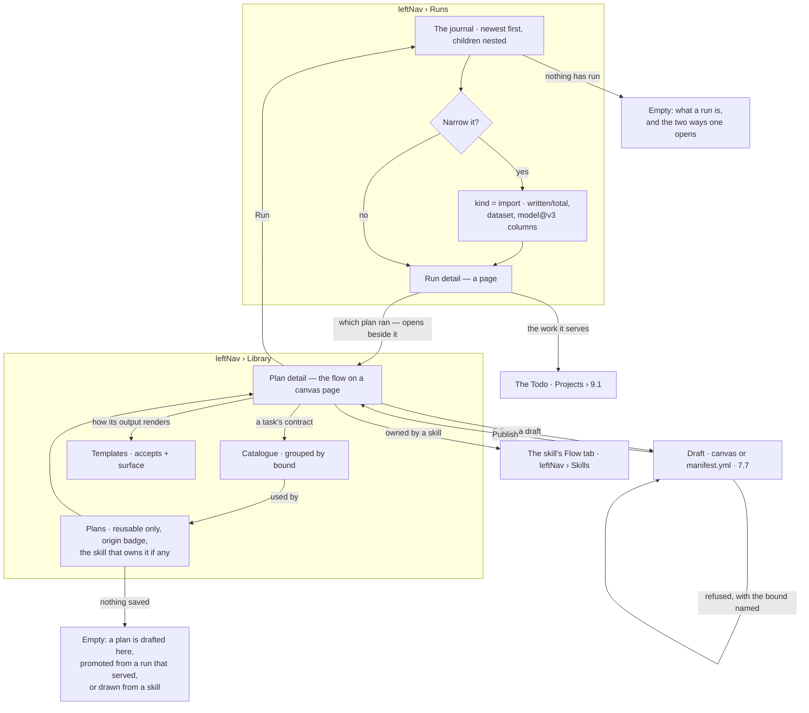
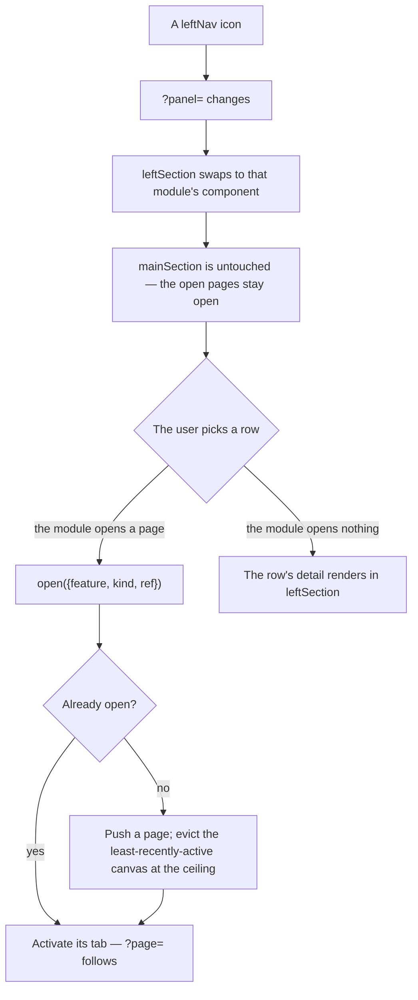
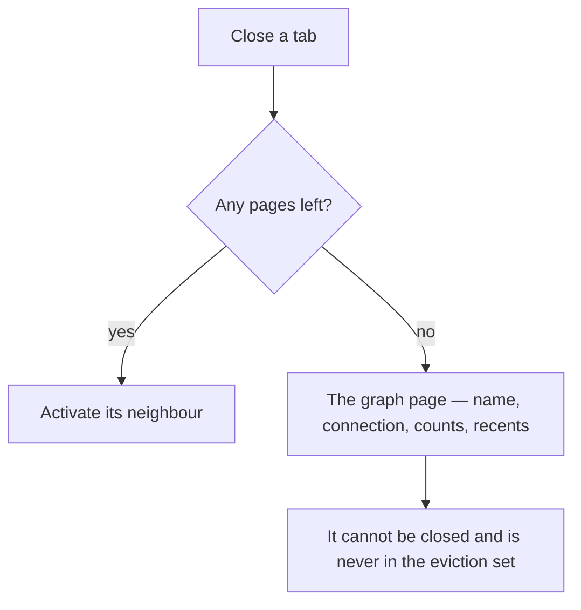

# GraphDetailPage — one page, ten features

Every graph-scoped surface is one route and one component: **`GraphDetailPage.tsx`**. It composes
`AppLayoutV2` exactly as `canvas-ui/apps/AppLayoutV2` does in the canvas Storybook, and it knows
nothing about any feature by name. The features register themselves.

This is [the-shell.md](the-shell.md) made concrete for the graph page, and it supersedes
[code-shape.md](code-shape.md) §4 on where the feature folders live.

---

## 1. Decisions

| # | Decision |
|---|---|
| G1 | There is one graph-scoped page component, `GraphDetailPage.tsx`. It composes `AppLayoutV2` and imports no feature module by name |
| G2 | **`leftNav` carries one icon per `leftSection`, in two groups.** Top — *what you work in*: `Info · Explorer · Model · Skills · Projects · Runs · Library · Govern`. Bottom — *who it runs as, and what on*: `Agents · Events · Settings`, then `UserMenu`. Info leads because it is the graph itself and everything after it is something *in* the graph (G20); that it renders through `SettingsPanel` is an implementation fact. A module with several surfaces contributes several icons; `features/` groups the **code**, not the icons. An icon earns its place by being something a person *goes to*, which is why there is no Stitches item (G14) and no Templates item (G38) |
| G3 | `leftSection` is the active item's own component. Every create, edit, delete and list CTA for that item happens there |
| G4 | `mainSection` is always `BoardPagesViewPanel`. Nothing else ever renders there |
| G5 | `rightSection` is the Assistant while it is open, and the Inspector otherwise |
| G6 | With no page open, `mainSection` shows **the graph page** — a page that cannot be closed, carrying the graph's name, connection state, counts and what was open recently |
| G7 | A module contributes exactly two things: a `leftSection` component, and the page kinds it can open. Both come through one `GraphFeature` object |
| G8 | The feature tree lives under `src/pages/graphs-detail/features/`; the shell that hosts it lives under `src/pages/graphs-detail/shell/` |
| G9 | Names come from `@invana/design-kit`. The regions are `leftNav` · `leftSection` · `mainSection` · `rightSection` · `bottomSection` · `header` · `footer` — there is no second word for any of them |
| G17 | **A symbol is renamed when its name is false, not when it is unprefixed** ([code-shape.md](code-shape.md) §4.1a). The folder is the prefix; a noun belongs to whoever the engine says owns it |
| G10 | A file moving between folders keeps its filename. Only two names change: `ExplorerPage` → `GraphDetailPage`, and `graphs-detail/work/` splits into the four modules it actually held |
| G11 | `GraphDetailPage` is **`Themes/AppV2 › ExplorerShell`**, composed region for region. The single difference is `mainSection`, which is `BoardPagesViewPanel` instead of a hand-built strip over a canvas sibling |
| G12 | `headerActions` on the strip is **strip-level, not per-page** (`BoardHeaderAction.onClick` takes no page id). The shell composes it per render from the active page's own actions plus its three region toggles |
| G13 | `bottomSection` carries `bottomSpan: 'main'` — it spans the canvas only, so `leftSection` and `rightSection` stay full height. Its **occupant is per board kind**: the **console** on `data` · `model` · `lineage` · `envelope`, and **parameters** — the selected task's form, contract and validation — on `plan` · `workflow` ([DP11](../modules/workflows/features/draft-a-plan.md#decisions)). A region is a slot, not a thing: the console is one occupant of this one, not its owner |
| G16 | **One param per region, and its value is the occupant**: `?panel=` is the left column's open section, `?page=` is what fills `mainSection`, `?right=` is who holds `rightSection` — `assistant` · `inspector`, absent means closed, and on a draft board it defaults to `assistant` ([DP12](../modules/workflows/features/draft-a-plan.md#decisions)) — `?bottom=` is who holds `bottomSection` — `console` · `parameters`, absent means closed. The breadcrumb reads the URL back literally — `owner › graph › panel › object`, the panel crumb being the `?panel` value verbatim. A page that is **inside** another draws both — a step under its run, `… › runs › run:7d3184f1 › step:9b1c40e2 execute_query` ([SR54](../modules/operate/features/see-what-ran.md#decisions)). `?settings=` was this param's first name and is still **read**, never written; so are `?ai=` and `?inspector=open` |
| G15 | **The graph's URL is the graph**: `/u/:username/:graphSlug` renders the page. There is no `/explorer` screen to be on — Explorer is one `leftNav` item of eight, and a URL that names it describes the page by whichever item happened to be first. `/explorer` and `/modeller` redirect to the root, carrying their query string |
| G45 | **Opening a session opens its canvas and makes it the active page.** Every entry — a row in the assistant's list, a row in the Info panel's recent sessions (G22) — goes through `handleOpenSession`: a canvas already open as a tab is focused, one that exists but is closed is loaded as a tab, and a session with no canvas yet gets one created for it (the restore effect then paints its last query). Whatever page was in front — a declared board, a model, a work canvas, All models — steps behind it; nothing is closed. A session whose canvas cannot be loaded or created still opens its thread, with a toast |
| G44 | **A panel's status bar says where you are and what the panel means; the count slot is for what the drawers do not already print.** `PanelStatusBar` has three slots and they are not interchangeable — `left` is the crumb trail inside the panel, `middle` is a live count a reader would otherwise have to click each row to discover, and `right` is the one-line rule for the surface. The Library's old bar read *Library · Promoted (0) · 9 workflows · authoring: post-MVP*: counts in the crumb slot, and two of them already printed in the drawer headers a few pixels above. So the Library's bar carries `Library` — plus the plan it drilled into, because `&plan=` is where you are ([G42](#1-decisions)) — and *a plan composes the catalogue; a template renders what it produced*, with `middle` deliberately empty. **A status bar belongs to the panel, never to a drawer inside it**: one of three drawers drawing its own was what made the Library the only stacked panel with no bar of its own once that one was removed. |
| G43 | **A drilled-in drawer's body is the record, and nothing else.** The drill-in replaces the drawer's body ([G33](#1-decisions)) — it does not sit under the list it came from, and the list's own chrome goes with it. `Plans` was drawing the record *beneath* all nine rows, under a footer of acts and a status bar, so the one thing the reader had asked for was the last thing in a scrolling column. Three rules settle it, and `Skills` already follows all three: the body is the detail alone; a list's acts belong to the list, so **Promote a plan…** is a header action on the list and gone while drilled in ([SK27](../modules/skills/features/authoring-a-skill.md)); and an act on the open record — **Export YAML** — sits beside `‹ Back` in the header rather than in the body, because the header is where a drill-in's acts live. **A drawer never draws a status bar.** One belongs to the panel, in `footer.left`; `Plans` carried its own — *Library · Promoted (0) · 9 workflows* — which put panel chrome inside one drawer of three, and repeated the count its own header already shows. |
| G42 | **Picking a plan draws it — the canvas follows `&plan=`, and there is no *draw it* step to discover.** Every work panel owns a canvas kind and selecting a row is the gesture that opens it; Library's `Plans` drawer was the one that did not obey, so a plan drilled in beside a `mainSection` still reading *Pick a plan to draw the flow it will run* — the empty state describing the gesture the reader had just made. One fact has one home: the drawer names what it drilled into in `&plan=`, and the canvas reads that rather than a second piece of page state a button has to set. The canvas follows the drill-in, which is what [G40](#1-decisions) already says — *a plan's detail opens on the canvas* — and what [G31](#1-decisions) requires of a link: `?panel=library&drawer=plans&plan=<key>` reopens the drawing as well as the drawer. **Clearing `&plan=` goes back to the list and leaves the canvas alone**: a panel opens a canvas and never closes one, so closing stays the tab's `X` — and re-picking the row in the list draws it again. |
| G41 | **Execution and definition are two panels: `Runs` and `Library`.** `Runs` is the journal and nothing else ([SR1](../modules/operate/features/see-what-ran.md)); `Library` holds `Plans` · `Catalogue` · `Templates` — what can be run, the closed vocabulary it is written in, and how its output renders. Three levels of one idea, which is what a library is. **This supersedes the three-drawer Tasks stack**, and with it [SR12](../modules/operate/features/see-what-ran.md)'s argument that the drill path *run → plan → callable* needs drawer adjacency: that premise predates the pages model. A run's detail is a page (`run:<run_id>`, [SR36](../modules/operate/features/see-what-ran.md)), a plan's main view is a canvas page (G34), and `mainSection` is `keepMounted` — so opening the plan a run ran keeps the run open beside it. The drill path lives in `mainSection`; a drawer was only ever needed for browsing. It also fixes the real cost: four drawers in a 420px column was the heaviest surface in the product. |
| G37 | **The two rail groups mean different things, and that is what decides placement.** The top group is a surface a person *lives in*; the bottom is configuration they *visit*. The test is frequency of deliberate use, not importance — which is why **Skills moved up** (an NL query is a skill, so this is where flows are authored) and **Agents moved down** (checking the agents or pinging a provider is occasional). An item whose group is arguable is an item to test against how people actually work, never to place by how important it sounds. |
| G38 | **Templates has no `leftNav` item; it is the third drawer of Library.** A projection template is to an answer what a plan is to a run — both are definitions, both are promoted from what served ([projections C7](../modules/ask/features/projections.md)) — so it sits beside `Plans` and `Catalogue`, which are the other two things a run is composed from. It is the same rule G14 applies to Stitches: a library you open while authoring is not a place you go |
| G39 | **Settings holds only what belongs to no other panel — `Basic` and `Graph`.** LLMs went to Agents ([GV18](../modules/govern/spec.md)), Guardrails to Govern ([GV17](../modules/govern/spec.md)), the agent ceiling to Agents. Each move is the same rule — *a surface belongs to the panel that owns its subject* — applied four times rather than four separate judgement calls. What is left is the Graph's own identity and its database connection. |
| G40 | **A skill reads as prose; a plan reads as an address — and typography carries it.** Both list flows two icons apart, so the difference is made in the row rather than left to the reader. A **skill** row leads with the name a person wrote, set in the body face, over its *when to use*, and carries **offered / applied** — the gap that is the whole signal ([skills/spec.md §2](../modules/skills/spec.md)). A **plan** row leads with its `key` in **mono**, over its *intent*, and carries an **origin** badge plus the skill that owns it when one does ([LB16](../modules/workflows/features/the-library.md)). Sans-over-mono is the tell: a playbook is written, a plan is addressed. The same split runs through the panels — a skill's detail opens on **Playbook**, a plan's opens on the **canvas** |
| G14 | **Stitching has no `leftNav` item.** Declaring a link starts from a type already selected, so it lives in the Model panel with that type pre-filled as the source; a model's own links list there too. The **global model** is a page, because it belongs to no single model. A surface whose normal state is empty does not get an icon |
| G18 | **A control that describes the open canvas is on the strip, not in `leftNav`.** Help · Layers · Styling · History are the active page's `headerActions`, and each opens a card floating over the canvas, top right — one at a time, since they share the anchor ([canvases.md](../modules/explore/features/boards.md) CV6). `Layers` was a `leftNav` item and a `?panel` key; it is neither now, and a stale `?panel=layers` lands on Explorer |
| G19 | **A page-owned panel is declared in two places, and both are load-bearing**: the `?panel` branch in `GraphDetailPage` that renders it, and `PAGE_OWNED_SECTIONS` / `ALL_NATIVE_SECTIONS` in `GraphDetail`. Miss the second and the shell hands the column to `SettingsPanel`, which draws nothing for a key it does not know — the rail lights, the URL is right, and the panel is blank. Imports and Templates were both dead this way |
| G20 | **The graph info panel is the rail's first icon, and answers “which graph am I in, and is it ready?” — nothing else.** Three bands: the graph's name and description, the setup timeline *while setup is unfinished*, and the recent sessions. Three things are deliberately not there. `owner / slug` — the breadcrumb above the panel already reads it (G16). The connection's URI and latency — that is the footer's `ConnectionStatusBar`, on screen whatever panel is open, and *whether* a database is attached is the timeline's first step. Counts of LLM providers, Skills and Members — each is one click away in the panel that owns it, and a number with no row under it is trivia. The setup band disappears the moment the required sections are done — a finished checklist is the only checklist worth removing |
| G21 | **Setup reads as a timeline, not a form.** `TimelineList variant="rail"` with a `StatusDot` per step, because the panel is 420px and a step's title wraps. It draws what the engine derived ([connect-and-model](../modules/connect-and-model/spec.md) CM8) — the only actions on a row are `Skip` on an optional step, `Undo` on a skipped one, and the arrow that opens the panel the step is about |
| G22 | **A row in the Info panel's recent sessions opens that session**, the same as a row in the assistant's own list: the assistant takes `rightSection` and the session becomes active. The panel cannot reach the page's `handleOpenSession` through the shell, so `useOpenSessionRequest` carries the id — one subscribable in `shell/`, the shape `useSettingsPanel` already uses for `expanded` |
| G23 | **Settings is three tabs, and the tab is the group.** `Basic` (name · description · instructions · archive) · `Graph` (the connection) · `Agents` (the Graph's run ceiling, and the pools it holds — A5). In that order: what the graph is, what it reads, how hard it may run. The providers are not here: they are the `LLMs` drawer of the Agents panel (G29). No tab wraps its fields in a collapsible section: a group that is the only thing in its tab is a title over a title, with a disclosure arrow that hides the tab's whole reason for existing. What survives of the group header is its one-line rule, and the connection's state chip beside it. **Instructions are a Basic field**, saved with the name and the description — what a graph is called, what is in it and what it is for are the same answer written at three lengths, so they are one form with one Save |
| G24 | **A tabbed panel says which tab through `?tab=`**, so a setup step opens the field it is asking for rather than the panel and a second click — *Connect a database* lands on `Graph`, *Write the instructions* on `Basic`. It is dropped whenever the section changes without naming one, so a stale tab never leaks into the next panel. Settings is the only tabbed section; every other multi-list panel is a stack (G33) |
| G26 | **Setup is what the graph page shows until the Graph is ready** — not a second page kind, and not a modal. The graph page (G6) is already pinned, uncloseable and where a new Graph lands, so setup is its *content* while any step is outstanding and the identity card is what is left when none is. Two uncloseable pages would be clutter, and a `?page=setup` that could be closed would have nowhere to reopen from. It stays reachable after that through the **graduation cap in `header.right`** ([13.7](../modules/platform/features/setup.md) SU19), because undoing a skip, reading a `broken` step and re-reading a concept are things only the wizard can do, and the Info band is gone by then (G20). The strip tab and the last breadcrumb crumb read **Setup** while the wizard is on it and the graph's slug after — a page names what it is showing, and a tab named for the container over a wizard of groups names the wrong thing. The page *id* does not follow the title: it stays `graph`, so `?page=graph` keeps resolving. [13.7](../modules/platform/features/setup.md) SU7 |
| G27 | **The onboarding wizard and the Info band are one sequence, two renderings.** The wizard is where a step is done and where it is explained — the stepper, the lesson, the terminal line, *What next*. The band is where it is remembered — `TimelineList variant="rail"`, and it disappears on completion (G20 · G21). Neither owns a form: both route into the panel that does, with its tab named (G24) |
| G28 | **A gated surface says which gate opens it, in its own empty state.** `EmptyState locks` — *"Ask opens when an LLM provider is configured"* — per surface, which retires `SetupRequiredBanner`: one banner could say the graph was not ready and never what for ([13.7](../modules/platform/features/setup.md) SU13) |
| G29 | **LLM providers are the `LLMs` drawer of the Agents panel**, not a Settings tab and not a rail icon of their own ([PM6](../modules/agents/features/providers-and-models.md)). An agent binds no provider ([PM1](../modules/agents/features/providers-and-models.md)) — what it resolves against is its lens's `cast`, and an endpoint is what that cast names — so the endpoints are read one drawer below the agents that read them. A provider row is a configured endpoint and its models are the rows under it (PM9), which is a two-level list a tab of a settings form has nowhere to put. `?panel=llms` still resolves, now onto `agents`, so every bookmark and the setup step land on the panel that holds them |
| G30 | **The rail's work group is three icons: Projects, Runs and Library.** Projects owns **Todos** — what a person wrote ([9.1](../modules/work/features/projects-and-tasks.md)). Runs owns **execution** — the journal, and nothing else. Library owns **definition** — `Plans` · `Catalogue` · `Templates` (G41). **Imports and Workflows have no icons.** An import is a `kind` of TaskRun and a workflow is a reusable TaskPlan ([SR5](../modules/operate/features/see-what-ran.md) · [SR7](../modules/operate/features/see-what-ran.md)), so each was an icon for a *filter* of a list that already exists, and an icon per filter is how one journal became four panels |
| G31 | **The panel keys are `?panel=runs` and `?panel=library&drawer=plans\|catalogue\|templates`**, with `&run=` · `&plan=` · `&entry=` · `&template=` naming the thing drilled into. Runs takes no `?drawer=` — it is a list, not a stack (G33). **The retired keys are deleted, not redirected** — `?panel=tasks`, `?panel=imports`, `?panel=workflows` and `?panel=thoughts` name surfaces that no longer exist. A stale link lands on the graph page, which is what an unknown `?panel` has always done. No backward compatibility is kept anywhere in this refactor; a redirect table is a second vocabulary to maintain for links that are weeks old |
| G33 | **A panel is a stack when its lists answer different questions about one subject; otherwise it is a list.** Stacks: **Library** (`Plans` · `Catalogue` · `Templates`), **Projects** (`Projects` · `Todos`), **Govern** (`Worlds` · `Guardrails`), **Agents** (`Agents` · `LLMs`), **Skills** (`Skills` · `Rules`), **Models** (`Models` · `Stitches` · `Global model`, and once drilled in `Models / <name>` · `Node types` · `Edge types` · `Stitches` · `Staged`). Lists: **Runs**, **Events**. A stack has **no panel header above its drawers** — the first drawer header is the top of the column, and the breadcrumb already says which panel is open (G16). Each drawer carries its own **search** and **filter**, because the lists filter on different columns and one shared bar would be re-offered per list anyway. A drill-in replaces that drawer's body and turns its header into `‹ PLANS / nl-single@4`; the others keep their place |
| G34 | **`mainSection` for a *draft* is the canvas** — a plan is authored by placing tasks and wiring them, and there is no list gesture for that ([7.7](../modules/workflows/features/draft-a-plan.md)). Whether **reading** a run, a plan or a catalogue entry is also a canvas or a document is **open** (§3b). Either way it is one component per record, not two: the canvas paints status onto the plan it drew, and the document renders the same fields as blocks |
| G32 | **A drawer owns its header; the panel owns the status bar.** Each drawer draws its own title, count, search and filter, and a drill-in stays inside it (G33). What is shared is one status bar in `footer.left` and one column width — so the stack has three headers and no panel chrome above them, rather than one header and three tab strips under it |
| G35 | **A stacked panel says which drawer through `?drawer=`, and every stack shares that one key.** Library, Projects, Govern, Agents and Skills are all stacks (G33), and every one of them names the drawer the column **opens on** with `?drawer=` — never `?libraryDrawer=` and `?projectsDrawer=`. It is the *opening* split: `PanelStack` reads `defaultSize` at mount, so the URL decides where a deep link lands and the reader owns the drag after that. **A drill-in is the one thing that overrides the drag** — it calls `stackRef.expand(drawer)`, because a detail rendered into a drawer the reader collapsed ten minutes ago is invisible, and the click appears to have done nothing. The expand fires when the focus moves *or* when the drilled-into id changes, since arriving at a plan from the canvas leaves `?drawer=plans` untouched and moves only `&plan=`. It never re-asserts a *size* — the drawer is opened, not resized, so the reader's column shape survives. `?panel=` is single-open, so the key never has two owners, and one hook (`useDrawerStack`) describes the vocabulary once. The drill-in keys are named for the **record**, not for the drawer — `&run=` · `&plan=` · `&entry=` · `&template=` · `&project=` · `&todo=` · `&world=` · `&agent=` · `&skill=` — so a link says what it opens. Every one of them is **dropped when `?panel=` moves to a section that does not own it**, exactly as `?tab=` is (G24): a run left in the URL under a different rail icon names a drawer that is not on screen |
| G36 | **A drawer header carries four things, and nothing above it carries any of them: the label, the count, the drawer's own `+`, and its search and filter.** The count is always visible rather than revealed on hover — a stack of three quiet headers hides exactly the controls that make a drawer readable while it is collapsed. The `+` is there because every create CTA for an item happens in the section that owns it (G3), so `New project` belongs to the Projects drawer and `New todo` to the Todos drawer, not to a panel header serving both. A **drilled-in** drawer shows none of the four: it is displaying one record, so a control that narrows a list which is not on screen has no subject |
| G37 | **A page's *reading* is a fifth param, and it belongs to the page, not to a region.** `?read=` names how the active `?page=` is being read — `in_order` · `layers` · `flow` · `lens` on a run, `overview` · `touched` · `log` on a step ([SR60](../modules/operate/features/see-what-ran.md#decisions)) — and absent is that page kind's default. It is not a sixth region: `mainSection` still holds one page, and a reading is a state *of* it, which is why one key serves every page kind and the vocabulary is the page's own. Like `&run=` and `&plan=` (G35), it is **dropped when `?page=` moves**, so a reading never survives onto a record that has no such reading. A page kind with one reading writes nothing. |
| G25 | **One inset for every docked panel body: `p-4`.** LLMs, the Model panel, Imports, Templates, Agents, Workflows, the Inspector and Settings all start their content at the same x, so switching rail icons moves the panel's *content*, not its edges. Rows are the exception and own their own padding — a list row is full-bleed so its hover highlight reaches both edges |

## 2. The regions

| Region | Holds | Owner |
|---|---|---|
| `header.left` | wordmark · `Breadcrumb` — `owner › graph › active page` | shell |
| `header.center` | the camera toolbar, when the active page is a canvas | the active page |
| `header.right` | theme · the Assistant toggle | shell |
| `leftNav` | ten icons, one per module, plus the settings group and the profile menu | shell, read from the registry |
| `leftSection` | the active module's component | the module |
| `mainSection` | `BoardPagesViewPanel` — the open pages, `keepMounted` | shell |
| `rightSection` | Assistant, else Inspector | `explore` |
| `bottomSection` | the console ([4.5](../modules/explore/features/the-console.md)) | `explore` |
| `footer` | `GraphStatusBar` · the active page's own readout · `AppVersion` | shell + the active page |

## 2a. Composed from ExplorerShell

The reference implementation is
`design-kit/apps/storybook/stories/themes/app-v2/explorer-shell.stories.tsx`. It is taken region for
region; only `mainSection` changes.

| Region | ExplorerShell ships | `GraphDetailPage` |
|---|---|---|
| `header.className` | `!h-[38px]` | unchanged |
| `header.left` | wordmark · `Separator` · `Breadcrumb` — `ravi-merugu › stock-market-graph › Explorer` | unchanged; the last crumb is the **active page's** title |
| `header.centerNavItems` | the camera toolbar — zoom out · level · zoom in · fit · centre · magnet | supplied by the **active page**, absent when it is not a canvas. It reads the live camera, which is why it sits in the header and not in the strip |
| `header.rightNavItems` | nodes-in-view readout · `ThemeMenu` · **Assistant** | unchanged; the readout comes from the active page, and Assistant toggles `rightSection` |
| `leftNav` | `railItem()` × 10 top · 5 bottom · avatar at `bottom` | the same helper, its items read from the registry; the avatar is `UserMenu` |
| `leftSection` | `TabbedPanel` wrapping `PanelStack` — *Node types · Relationships · Selected* — with a summary line at the bottom and `headerActions` refresh · search · collapse | this **is** Explore's `leftSection`. Every other module composes the same way: one `TabbedPanel`, `PanelStack` sections, its own `headerActions` |
| **`mainSection`** | a 30px `TabbedPanel` strip with `bodyClassName="hidden"`, and the canvas as a **sibling** below it | **`BoardPagesViewPanel`** — strip and bodies in one component, `keepMounted` |
| `rightSection` | `TabbedPanel` — *Properties · Design* | the Inspector; the Assistant replaces it while open (G5) |
| `bottomSpan` · `bottomSection` | `'main'` · the console — *Records · Query* — with a `ContextBar` under it | unchanged ([4.5](../modules/explore/features/the-console.md)) |
| `footer` | `!h-[25px]` · `StatusDot` + state + counters · label + version | `GraphStatusBar` on the left, `AppVersion` on the right |
| `mainClassName` | `h-[calc(100vh-63px)]` | unchanged — header 38 + footer 25 |

### Why the strip swap is not cosmetic

ExplorerShell keeps the canvas as a **sibling** of the strip precisely so a tab click cannot remount
it — a hand-built workaround for the thing `keepMounted` does properly. One sibling can hold one
canvas; `BoardPagesViewPanel` holds as many as are open, each with its own engine, camera and
selection. That is the whole reason for the swap.

### Where the strip's controls go

ExplorerShell puts nine buttons on its strip, and they do not all belong to the same owner:

| ExplorerShell strip control | In `GraphDetailPage` | Owner |
|---|---|---|
| `+` New canvas | `onAdd` | shell |
| Help — *what can I do here?* | `headerActions` | shell |
| Layers · Styling · History · Find in canvas | `headerActions`, contributed by the **active page** | the page kind |
| Hide/show `leftSection` · `bottomSection` · `rightSection` | `headerActions` | shell |
| — | `pageMenuItems`: rename · duplicate · remove | shell |

Because `BoardHeaderAction` carries no page id (G12), a page kind declares its actions in the
registry and the shell concatenates them:

```tsx
headerActions: [
  ...FEATURES[activePage.feature].pages[activePage.kind].headerActions?.(activePage.ref) ?? [],
  { id: "left",   label: leftOpen   ? "Hide the panel"     : "Show the panel",     icon: …, onClick: … },
  { id: "bottom", label: bottomOpen ? "Hide the console"   : "Show the console",   icon: …, onClick: … },
  { id: "right",  label: rightOpen  ? "Hide the inspector" : "Show the inspector", icon: …, onClick: … },
]
```

A model page therefore never offers *Find in canvas*, and the graph page (G6) offers none of the
three — which is the test that the split is in the right place.

## 3. `leftNav` — one icon per `leftSection`

**Seven on top, three below, `UserMenu` at the very bottom.** The two groups are not cosmetic: the
top group is a surface you live in, the bottom is configuration you visit (G37).

| `leftNav` | `leftSection` | Module that owns the code | Page kinds it opens |
|---|---|---|---|
| **Info** | the graph itself — three bands (G20) | `graph-settings/` | — |
| **Explorer** | Node types · Relationships · Selected | `explorer/` | `data` — hosted by `canvases/` |
| **Model** | Models · Links | `connect-and-model/` — `model/` and `stitch/` | `model` · `global-model` |
| **Skills** | **Skills · Rules** | `skills/` | `plan` — a skill version's own flow |
| **Projects** | Projects · Todos | `work/` | `plan` |
| **Runs** | the journal, children nested | `operate/` | `run` |
| **Library** | Plans · Catalogue · Templates | `workflows/` · `ask/projections/` | `plan` |
| **Govern** | Worlds · Guardrails ([GV17](../modules/govern/spec.md)) | `govern/` | — |
| **Agents** | Agents · **LLMs** ([GV18](../modules/govern/spec.md)) | `agents/` | `envelope` · `lineage` |
| **Events** | every write, by principal | `operate/` | — |
| **Settings** | tabs: `Basic` · `Graph` | `graph-settings/` | — |

One icon can therefore be fed by more than one module (`Library` draws on `workflows/` for plans and
the catalogue and on `ask/projections/` for templates), and one module can own more than one icon. That is
intended: the folder is where the code lives, and `leftNav` is what a person reaches for. They do
not have to be the same shape.

**Datasets and Workflows are not items** (G30). A dataset is what an import run wrote and a workflow
is a reusable plan — each was an icon onto a *filter* of a list that already exists.

**Layers is not one of them** (G18). It describes the canvas in front of you rather than a noun you
browse, so it rides the strip with Help, Styling and History and floats over the canvas.

## 3a. Runs and Library — execution, and what it is built from

Two icons, because they answer two different kinds of question. **Runs** is history; **Library** is
definition (G41).

| Panel | Shape | Record | Answers | Filters offered |
|---|---|---|---|---|
| **Runs** | a list | `TaskRun` | *what ran, how did it end, what did it cost* | kind · role · status · outcome · trigger · agent · time |
| **Library › Plans** | drawer 1 | `TaskPlan` where `reusable` | *what can I run, and what has it been good for* | origin (`builtin` · `authored` · `promoted`) · kind · has a skill |
| **Library › Catalogue** | drawer 2 | the callables ([§ 0.6](../../orchestration.md#06-the-catalogue--what-a-plan-may-name)) | *what may a plan name at all* | bound |
| **Library › Templates** | drawer 3 | `projection_templates` ([3.4](../modules/ask/features/projections.md)) | *how does what it produced get rendered* | kind (`prompt` · `result`) · surface |

**Library still reads as one sentence going down the page.** A plan is a composition of catalogue
entries, and a template renders what the plan produced — each drawer is the definition of the one
above it, which is why they are stacked rather than given three icons.

**The step that crosses panels is `run → plan`, and `mainSection` carries it.** A run's detail is a
page (`run:<run_id>`, [SR36](../modules/operate/features/see-what-ran.md)), a plan's main view is a
canvas page (G34), and `mainSection` is `keepMounted` — so opening the plan a run ran adds a tab and
keeps the run where it was. That is the property [SR12](../modules/operate/features/see-what-ran.md)
was protecting when it asked for drawer adjacency, and pages protect it better: the two are open at
once rather than one above the other in a 420px column.



**Todos are not here.** A Todo is what a person wrote; it lives under Projects, because a Todo
without its project is a to-do list and the project is the thing it is for
([9.1](../modules/work/features/projects-and-tasks.md)). A Todo's own runs are reachable from it —
the same journal, filtered to one `todo_id`.

**A skill's plan is not in the library either.** It is owned 1:1 by a skill version
([§0.8](../../orchestration.md#08-a-skill-drawn-as-a-flow)) and reached from the skill's Flow tab.
The Plans drawer lists `reusable: true` only, and a row says which skill owns it when one does — a
library of things you can select should not hold things that are granted by binding.

**The layout is the stack.** Drawn on the
[*Skills and the left rail* canvas](https://claude.ai/artifact/7c565h2z9irbFBwu1S1ebH) —
G33 states it, and the tabbed alternative is not built.

| | Library, as a stack |
|---|---|
| The panel's top | **the first drawer header** — no panel header above it; the breadcrumb answers *where am I* |
| On screen | all three lists, each drawer collapsible and resizable |
| Search and filter | **two icons in every drawer header**, opening that drawer's own search row and filter chips |
| A drill-in | happens **inside its drawer** — the header becomes `‹ PLANS / nl-single@4`, and the other two stay where they were (G36) |
| `mainSection` | a canvas page — a plan's flow, or a draft being edited |

| | Runs, as a list |
|---|---|
| The panel's top | one header — label, count, search, filter |
| A drill-in | replaces the panel body; the header becomes `‹ RUNS / orders.csv` |
| `mainSection` | the run dashboard page, defaulting to the layer strip ([D16](../modules/govern/spec.md)) |

**G36 · Every drawer control is a `headerActions` item, and none of them is drawn in the title.**
`PanelStack` renders a section's `title` **inside** the header's collapse button and its
`headerActions` in a sibling beside it. A control drawn in the title is therefore a `<button>`
inside a `<button>` — invalid markup, and a click on it toggles the drawer as well as doing its own
job: opening search collapsed the drawer over the box it had just opened, and so did the filter and
each drawer's own `+`. So search, filter, a drawer's actions and **back** are all `headerActions`.

The cost is the back chevron's place: the artboard draws the drilled header as `‹ RUNS /
orders.csv`, and the left of that bar belongs to the collapse button. It reads `RUNS /
orders.csv` with `Back to RUNS` on the right of the same bar until `PanelStack` offers a slot ahead
of its own chevron — a small addition to `@invana/ui`, after which the row moves back and nothing
else changes.

## 3b. `mainSection` — canvas or document (open)

Both are drawn, on the two pages of the
[*The Tasks Panel* canvas](https://claude.ai/artifact/9sAby5rPvkjMLb9BcdCom4): page 1 renders a run,
a plan and an entry **as a canvas**, page 2 renders the same three **as a document**. The panel is
the stack in both; only the main column and where the detail lives differ.

| | A · canvas + dashboard (page 1) | B · document (page 2) | **C · all in the drawer (page 3)** |
|---|---|---|---|
| The drawer | **light** — what it is, the Gantt, a line of log per task, then `More` ([SR13](../modules/operate/features/see-what-ran.md)) | stays a list, row selected | **three bands** — Stats · Performance (the Gantt) · Log, the log taking every pixel left |
| The main column | an **artboard** (the flow, status painted on) or a **dashboard** (`More` — tiles, Gantt, task table, log) | blocks: outcome · tasks · reported · log · chain | whatever you were already on — the run needs nothing from it |
| Answers *what shape was this* | yes, on the artboard | only as a sentence | no — the Gantt answers *when*, not *what shape* |
| Answers *what exactly happened* | yes, on the dashboard — and it is a page you opened, not a column you are already in | all of it at once, whether you asked or not | the log does, live and filterable — but 420px wide, so lines truncate |
| Cost | two surfaces to build, and a `More` click | a 40-task plan is a long scroll with no shape | no room for a task table or *What landed*; a 40-task Gantt is a scroll inside a band |
| Reuses | `@invana/canvas` — plus `TaskGantt`, which all three need | the kit's blocks and tables, plus `TaskGantt` | `TaskGantt` + `Terminal` + six `MetricTile`s — **nothing new beyond the Gantt** |

**C is the cheapest of the three and the one that ships soonest.** It needs no dashboard kind, no
second surface and no `More`: three bands in the column a person is already in, answering the three
questions a run is opened with — *what happened* (stats), *where did the time go* (the Gantt), *why*
(the log, filterable to one task). Picking a Gantt row filters the log to that Task, which is the
whole debugging loop in one column. What it gives up is room: the task table, *What landed* and the
reported breakdown have nowhere to live, and the log truncates at 420px.

**C and A are not exclusive.** C is the drawer; A's dashboard is `More` for when 420px is not enough.
Shipping C first costs nothing if the dashboard follows, because the Gantt, the stats and the log
band are the same components either way.

**Drafting is not part of this choice.** A draft is authored on the canvas or as `manifest.yml`
([7.7](../modules/workflows/features/draft-a-plan.md) DP2) whichever way reading goes — dragging a
catalogue entry onto a list is not a gesture.

**What would settle it:** how long a plan gets. Under ~12 tasks the canvas reads better and the
document is a list of eight rows; past ~40, the canvas needs a minimap and the document needs a
scrollbar, and the scrollbar is the cheaper one.

## 4. The two seams

A module is one object, and the shell reads only this:

```ts
// features/agents/index.ts — the only file the shell imports
export const agents: GraphFeature = {
  key: "agents",
  nav: { label: "Agents", icon: Bot, group: "top", order: 5 },
  LeftSection: AgentsPanel,
  pages: {
    lineage:  { title: (r) => `Lineage · ${r.agentId}`,  icon: GitBranch, render: (r) => <LineageCanvas {...r} /> },
    envelope: { title: (r) => `Envelope · ${r.agentId}`, icon: Shield,    render: (r) => <EnvelopeCanvas {...r} /> },
  },
};
```

```tsx
// shell/GraphDetailPage.tsx
const { section, setSection } = useSettingsPanel();              // ?panel=agents
const { pages, activeId, open, close, select } = useOpenPages(); // ?page=<id>
const LeftSection = FEATURES[feature].LeftSection;

<AppLayoutV2
  idPrefix="graph-detail"
  leftNav={useGraphLeftNav(FEATURES, feature, setFeature)}
  header={header}
  leftSection={{ defaultSize: "300px", minSize: "240px", maxSize: "900px",
                 content: <LeftSection {...graphRef} onOpen={open} /> }}
  mainSection={{ defaultSize: "600px", minSize: "300px",
                 content: <BoardPagesViewPanel pages={pages.map(renderPage)}
                                                activeId={activeId} onSelect={select}
                                                pageMenuItems={…} headerActions={…} /> }}
  rightSection={right.key ? rightSections[right.key] : undefined}
  footer={footer}
/>
```

`open({ feature: "agents", kind: "lineage", agentId })` replaces the page-level `workKind`,
`selectedModelId`, `selectedProjectKey`, `selectedWorkflowKey` and `selectedAgentId`, the four-branch
`mainSection` ternary, and `canvasEmptyHint`.

### A module's internals

```
features/agents/
  index.ts        the GraphFeature object — the only importable file
  AgentsPanel.tsx the leftSection. Owns its selection and every CTA
  pages/          one file per page kind it opens
  components/     private
  api.ts  queries.ts  types.ts
```

A module large enough to need structure inside it takes that structure from its **features**, not
from the shape of the files ([code-shape.md](code-shape.md) §4.1b). Ask is the one that needs it:

```
features/ask/
  assistant/       AssistantPanel · Session* — the-assistant.md (3.10)
  answer-surface/  EmissionCard · EmissionBodies · emissions.ts · ResultBlock
                   ResultsTable · NotAnAnswer · TraceDialog
                   — the-answer-surface.md (3.3), with when-it-cannot-answer (3.8)
                     and reasoning-trace (3.7) rendering inside a reply
  projections/     TemplatesDrawer + TemplatesPanel — projections.md (3.4),
                   Library's third drawer (G38)
```

`projections/` is not `templates/`: **template** is already Ask's word for a versioned,
person-authored projection template, and a folder that reused it would put two unrelated things
under one word in one module.

## 5. Journeys





## 6. Where today's files go

| Today, under `src/pages/graphs-detail/` | Moves to `features/` |
|---|---|
| `explorer/components/model/*` · `modeller/components/*` | `connect-and-model/` |
| `explorer/components/datasets/*` | `bring-data-in/` |
| `explorer/components/emissions/{EmissionCard,EmissionBodies,NotAnAnswer}` · `ResultBlock` · `ResultsTable` · `TraceDialog` · `lib/emissions.ts` | `ask/answer-surface/` |
| `explorer/components/emissions/TemplatesPanel` | `ask/projections/` |
| `explorer/components/{ExplorerCanvas,ExplorerTypesPanel,InspectorPanel,LayersPanel,ExpandFineTunePanel,StylingPanel}` · `hooks/useExpandNode` · `lib/{canvasTheme,typeColor,visibility}` | `explorer/` — what is drawn, and what is selected on it |
| `explorer/pages/CanvasPage` · `components/{CanvasHistoryPanel,CanvasFormDialog}` · `hooks/useCanvasStates` · `lib/captureBanner` · `canvasKinds` · the `pages[]` / `activePageId` / `selectPage` / `closePage` block in `ExplorerPage.tsx` | `boards/` — the page host, and the board record behind a tab |
| `explorer/components/Session*` · `SessionsPanel` → **`AssistantPanel`** · `sessionCapabilities` · `hooks/useSessions` | `ask/assistant/` — the assistant is Ask's surface on every left panel, not one of Explore's ([the-assistant.md](../modules/ask/features/the-assistant.md) AD12) |
| `hooks/useAssistantDrawer` → `useRightSection` | `shell/useRightSection.ts` — it names a **region**, so it lives with the shell beside `useSettingsPanel`, not inside one of the region's occupants |
| `work/{AgentsPanel,AgentDetail}` · `WorkCanvas`'s `EnvelopeCanvas` + `LineageCanvas` | `agents/` |
| `work/SkillsPanel` · `components/settings/sections/SkillsSection` | `skills/` |
| `work/{WorkflowsPanel,PromoteDialog}` · `WorkCanvas`'s `WorkflowCanvas` | `workflows/` |
| `work/{ProjectsPanel,TasksPanel,TaskActivityTree,WorkGraphCanvas}` · `WorkCanvas`'s `PlanCanvas` | `work/` |
| `components/settings/sections/{EventsSection,EventTypeFilter,eventCatalog,eventSearch,eventStatus}` · `pages/platform/PlatformEventsPage` | `operate/` |
| `components/settings/SettingsPanel` · `sections/{GraphInfoPanel,RecentSessions,ConnectionFields,ConcurrencyFields,LLMsPanel,SettingsGroup,SettingsSection}` | `graph-settings/` — the left column's content is a `*Panel`, so `InfoSection` is `GraphInfoPanel`; `SetupWizard` became `SetupTimeline` because a wizard is something you walk and this is something you read (G21). `SetupTimeline` then moved on to `features/setup/` beside the board it shares its rows with, and `SetupRequiredBanner` is gone (G28) |
| — | `memory/` — not created; 8.x is not built, and an empty folder is not a placeholder |
| `work/{PanelChrome,WorkRow,DetailRows,statusTone}` · `explorer/components/ListPanel` | `shared/` — **staging only**, emptied by phase 1 |

| Today | Moves to `shell/` |
|---|---|
| `explorer/ExplorerPage.tsx` | `GraphDetailPage.tsx` — renamed |
| `components/GraphDetail.tsx` | dissolved into it |
| `components/GraphStatusBar.tsx` · `components/header/useAppHeader` | unchanged, moved |
| `components/settings/useGraphLeftNav.tsx` | reads the registry instead of a section list |
| `components/settings/useSettingsPanel.ts` | splits into the panel hook (`?panel=`) + `useOpenPages` (`?page=`) |
| — | `openPages.store.ts` · `pageRegistry.tsx` · `GraphPage.tsx` (G6) |

`components/GraphForm.tsx` belongs to `pages/graphs/` — it creates a Graph, and there is no graph to
detail yet when it runs.

## 7. Order of work

| # | Phase | Status | Done when |
|---|---|---|---|
| 1 | **De-duplicate the shared chrome** against `StatusDot` · `Badge` · `FilterBar` · `FilterChip` · `SectionHeader` · `AgentChip` · `MetricTile` | 🟡 | 8 of 12 kit-name collisions cleared; 4 left, all in the answer surface |
| 2 | **Move** — `git mv` into `features/`, `@/` everywhere | ✅ | 103 renames · 372 imports on the alias · `build`, `check-types`, `lint` green |
| 3 | **The page host** — `BoardPagesViewPanel` in `mainSection`; the four-branch ternary, `CanvasTabsBar` and `canvasEmptyHint`'s dead region gone; `GraphHomePage` lands | 🟡 | `keepMounted` is still `false` — flipping it is phase 5 |
| 4 | **The registry** — `useGraphLeftNav` reads `FEATURES`; `?page=` lands beside `?panel=` | 🟡 | `?panel=` shipped (G16); the registry and `?page=` have not |
| 5 | **Push selection down** — each `leftSection` owns its selection; each canvas page owns its engine, so `keepMounted` goes to `true` | ⬜ | `GraphDetailPage.tsx` under 300 lines; a tab switch keeps the camera |
| 6 | **Routes** — [code-shape.md](code-shape.md) §5, and the console | ⬜ | every page has a URL; a reload lands on it |

### What phase 2 did, and the order it did not keep

Phase 1 was specified first, because `PanelChrome`, `WorkRow`, `DetailRows`, `ListPanel` and
`statusTone` are imported by five to eight modules each — moving before deleting them puts a
cross-module import in every feature folder on day one. The move ran first anyway, so those five sit
in **`pages/graphs-detail/shared/`**: a staging folder, named so it is obviously not a destination,
and emptied by phase 1. No file may be added to it.

`features/work/WorkCanvas.tsx` is the other knot — one file exporting `PlanCanvas`, `WorkflowCanvas`,
`EnvelopeCanvas` and `LineageCanvas`, which belong to three modules. It splits in phase 5, when each
becomes a page of its own.

### What phase 1 did

| Was | Now |
|---|---|
| **Three** `StatusDot` implementations — `shared/WorkRow`, `TraceDialog`'s own, and the kit's | one: the kit's. The pulse is its `running` tone, not a Studio `live` prop |
| **Five** tone unions — `statusTone.Tone`, `DetailStatus`, `StatusCount`, `WorkTone`, `ImportsPanel.toneFor` | one: `statusTone.Tone`, defined as the kit's `StatusDotProps["tone"]`, so a resolved status goes straight to `StatusDot`, `Badge` or the canvas with no second table |
| `DetailStatus` — hand-rolled badge markup | composes `Badge`; keeps the domain mapping, which is the half Studio owns |
| `PanelChrome.FilterChip` · `ToggleChip` · `FilterChipRow` | compose `FilterChip` / `FilterBar`. The select-backed one is `FilterSelect`, because the kit owns the name `FilterChip` |
| `PanelChrome.MetricTile` | deleted — the kit's, outright |
| `PanelChrome.PanelSection` | composes `SectionHeader` |
| `DetailRows.AgentChipRow` | composes `AgentChip` |
| **25** `text-[10px]`/`[11px]`/`[12px]` sites | `text-meta`. The ladder has two content steps and neither is a pixel value (D7 · DS13) |
| **12** components shadowing a kit export | **4** — `ThemeToggle`→`ModeToggle`, `GraphStatusBar`→`ConnectionStatusBar`, `SettingsSection`→`GraphSettingsSection`, `CanvasPage`→`DataBoardPage`, `TableBody`→`TableEmissionBody` |

**`PanelStatusBar` is not a duplicate and stays.** `AppStatusBar` is the 25px application bar that
describes *the session*; a panel's own footer line describes *the panel*, and the-shell.md is
explicit that an `AppStatusBar` must never be nested inside the footer. Judged by what the file
contains, not by whether the kit has a component with a similar job.

**Four collisions remain**, all real rewrites rather than renames: `EmissionCard`,
`CannotAnswerCard` and `DiagnosisCard` against the kit's own, and `InspectorPanel` against
canvas-ui's. They are code-shape.md §2.3 rows — *verify, then delete* — and each needs the answer
surface reconciled, not a find-and-replace.

**Dead code: there is none.** All 180 source files are reachable from `main.tsx`. The 117 exported
symbols with no cross-file reference are almost all types used inside their own module — over-exported,
not dead — and stripping `export` from them is churn with no reader benefit.

### What phase 3 did

`mainSection` is `BoardPagesViewPanel` over a page list: the graph page, one page per open canvas,
the model, and the work canvas a panel drove. `DataBoardPage` no longer owns a strip — it exposes
`BoardPageHandle` (`openHelp` · `toggleLayers` · `toggleStyling` · `toggleHistory` · `openRename`) and the shell
builds `headerActions` from it (G12). `keepMounted` is explicitly `false`, which reproduces today's
behaviour exactly: only the active body is mounted, as the ternary did. Flipping it to `true` is the
payoff, and it is unsafe until each canvas page owns its own engine rather than sharing one
`useCanvasStates` — that is phase 5, and it is the real work the-shell.md describes.

## 8. Seams

| Seam | What must be true |
|---|---|
| **The canvas ceiling** | `keepMounted` is one WebGPU context per open canvas page. Eight open canvas pages; the least-recently-active is evicted at the ceiling. Non-canvas pages and the graph page do not count |
| **A hidden page keeps state, not traffic** | `refetchInterval` paused and any SSE stream closed while a page is hidden |
| **A page that cannot exist** | A deleted model, a retired workflow — the page closes and routes to its neighbour rather than rendering an error into the strip |
| **The graph page is never empty and never closed** | It is the resting state of `mainSection`, not a tab |
| **Switching `leftNav` opens nothing** | `?panel=` changes `leftSection` only. Pages open on an explicit row action |
| **No `?panel=` means no left column** | Every panel is a key, the Explorer's own included; closing one gives the width back to `mainSection` rather than falling back to a resting panel (selection-and-the-panel.md SP10) |
| **Without access** | The module is absent from `leftNav`, and a direct `?panel=` link renders `EmptyStateLock` |

## 8a. Stitching, and why it has no icon

`Links` had a `leftNav` icon and its own panel with three sections. Opening it showed nothing, and
nothing was its correct state: every section is empty until a graph has **two published models**,
which most do not. Worse, the one thing it could always show — the derived union — sat behind
`isLoading || !derived`, so a failed `GET /global-model` span forever with no error.

The verbs pull in different directions, and splitting by verb is the fix:

| Verb | Lives | Because |
|---|---|---|
| **Declare** a link | Model panel, on the selected node type | one side is already chosen. `add` names both kinds — anchor or relationship — and `DeclareLinkDialog` takes a `sourceKey` and arrives pre-filled either way; before this it opened from one place with both dropdowns empty, asking a question the user had just answered |
| **See a model's links** | Model panel, `Stitches` section | listed from **either** side: `Article ≡ Stock` is the same fact whichever model you are looking at |
| **See the union** | `GlobalModelPage`, in `mainSection` | it spans every model, so no model's panel can own it |

**The union is not drawn.** `GlobalType` carries `name`, `models` and `anchored` and **no
endpoints** — an edge type in the union does not say what it connects, so there is no graph to lay
out. The page states the union instead of inventing a shape for it (DS15). Drawing it needs
`source`/`target` on the engine's global-model payload, which is an engine change, not a Studio one.

`?panel=links` aliases onto `model`, so a bookmark lands on the panel that now holds it.

## 8b. The graph's URL is the graph

`/u/:username/:graphSlug` used to redirect into `/u/:username/:graphSlug/explorer`, and that was
honest while the page *was* the Explorer. It stopped being honest when the same component grew to
host ten features (G1): the model, datasets, templates, projects, tasks, agents, workflows and the
global model are all reached without the URL changing, so `/explorer` named the page after whichever
`leftNav` item happened to be first rather than after anything on screen.

| Route | Renders | Why |
|---|---|---|
| `/u/:username/:graphSlug` | `GraphDetailPage` | The page is the graph. Everything on it is a `leftNav` item or an open page, and both are query params |
| `/u/:username/:graphSlug/explorer` | redirect to the root | It shipped and it is bookmarked. Its query string is carried, so `?panel=agents` survives the hop |
| `/u/:username/:graphSlug/modeller` | redirect to the root with `?panel=model` | Same reason, one hop instead of the two it used to take through `/explorer` |

The redirects preserve `location.search`. That is the whole point of keeping them: a bookmark or a
link a colleague was sent is a URL *plus* its params, and dropping the params lands the reader on an
empty state rather than the thing the link was about.

**The name goes with the route.** "Explorer" was in three more places, each of them describing the
page by one of its ten items:

| Was | Is | Because |
|---|---|---|
| `owner › graph › Explorer › <canvas>` | `owner › graph › <panel> › <canvas>` | The crumb after the graph is the open panel, read verbatim from `?panel=` (G16). `Explorer` named the page after one of its ten items; the panel names what is actually on screen |
| `GraphDetailSection` = `overview \| explorer \| modeller`, and `NATIVE_SECTIONS[sectionId]` | `PAGE_OWNED_SECTIONS`, one flat list | One page, so a record keyed by page with one key filled in was a lookup that could only ever return the same answer |
| `SetupRequiredBanner pageLabel="Explorer"` — *"Explorer isn't ready yet"* | `SetupLock gate="connected" surface="Explorer"` — *"Explorer opens when a database is connected"* | The banner named the graph, which was right against a `pageLabel` that named a screen — and still could not say **what** was missing. The gate can (G28) |

`App.tsx` also carried Explorer and Modeller `leftNav` items behind a `/u/:username/:graphSlug` path
test. No route under that shell is graph-scoped — every graph URL is `GraphDetailPage`, which owns
its own `AppLayoutV2` — so the test never passed and the items never drew. Both are gone.

**This does not pre-empt [code-shape.md](code-shape.md) §5.2.** That route map gives each of the 42
screens its own path, and it still should — a screen that paints on nothing is a screen, not a
param. What changes here is only the *default*: the root is the page rather than a redirect into a
name for it. When §5.2 lands, `/explorer` comes back as the canvas's own route and the root routes
to it; until then there is no screen by that name.

## 8c. One param per region

The page has three independent axes, and each is one search param. Nothing about the page's state
lives anywhere else, so a URL is the whole of it — a reload, a bookmark and a link sent to a
colleague all land on the same screen.

| Param | Names | Example |
|---|---|---|
| `?panel=` | the open section of `leftSection` — the whole `leftNav` is one single-open accordion | `?panel=model` |
| `?page=` | what fills `mainSection` (the open pages strip) | `?page=global-model` |
| `?right=` | who holds `rightSection` — `assistant` · `inspector`. Absent means the right side is closed | `?right=assistant` |
| `?console=` | the console in `bottomSection` — **designed, not shipped** ([the-console.md](../modules/explore/features/the-console.md) CO3) | `?console=queries` |
| `?tab=` | the open tab inside a tabbed `?panel` section — Settings only, so far (G24) | `?tab=agents` |

`?settings=` was `?panel=`'s first name, from when every value in it was a settings section. Most
are not: Model, Datasets, Templates and the four work surfaces are the page's own panels, and
naming the param after the group that used to fill it made every other value read like a mistake.
The param is named for the **region** it drives instead. The old name is still read — a bookmark
keeps working — and never written; a write sets `?panel=` and drops `?settings=` in the same step,
so the two can never disagree about which panel is open.

**`?right=` names the region, not the occupant's own flag.** The right side had two occupants and
two mechanisms — `?ai=1` for the assistant, a component-local `inspectorClosed` for the inspector —
so nothing in the URL said which of them was on screen, and the inspector did not survive a reload.
One param settles it: the value *is* the occupant, absent *is* closed, and a third occupant is one
more value rather than one more flag. `?ai=` and `?inspector=open` are still read, once, and
normalised onto `?right=` on the next write.

Opening one occupant replaces the other; closing closes the region. The right side does not
remember what was there before — a region that restores a previous occupant needs a second piece of
state to hold it, which is the thing this param exists to remove.

**The breadcrumb reads the URL back.** `owner › graph › panel › object`, where the panel crumb is
the `?panel` value verbatim — lowercase, exactly as it appears in the address bar. The two crumbs
before it are identifiers too, the username and the slug, so the trail is a literal reading of the
URL rather than three registers of prose. With no panel open it is `owner › graph`, and with a
canvas open on top of a panel it is all four.

**A page inside another draws both.** A step opens under its run, so its trail is five: `ravi › finance › runs › run:7d3184f1 › step:9b1c40e2 execute_query` — the parent crumb links to `?page=run:<run_id>`, the last one is the page, and each carries the **eight characters** the journal addresses a row by ([SR54](../modules/operate/features/see-what-ran.md#decisions)). The `?page=` param keeps the record's shape (`task_run:<step_id>`); the crumb reads the subject.

## 9. Answered

| # | Was | Answer |
|---|---|---|
| Q1 | `leftNav`: one icon per module, or one per panel as `ExplorerShell` draws it? | **Per panel.** The story is the implementation; `features/` groups code, not icons (G2) |

## Not building

| Not this | Why |
|---|---|
| A second page component for any graph-scoped surface | G1. One page, ten features |
| Grouping `leftNav` by module | G2. The story's ten icons are the ten icons |
| Anything but `BoardPagesViewPanel` in `mainSection` | G4 |
| A `features/memory/` scaffold | 8.x is not built; an empty folder is not a placeholder |
| Renaming components that already carry the right name | G10. `InspectorPanel`, `LayersPanel`, `ModelPanel` keep their names. `SessionsPanel` is the exception: it was named for its contents, and the occupant is the Assistant |
