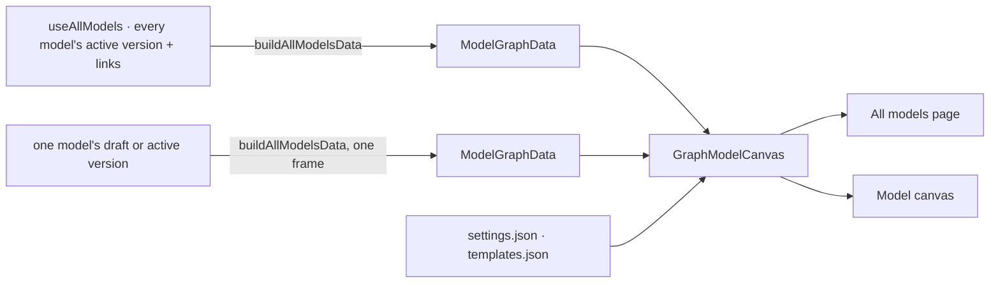

# GraphModelCanvas — models as frames, stitches across them

Every model drawn as a group frame holding its node types. A model's own edge types stay inside its
frame, and the stitches between models are the only edges that cross one. It is the modeller's only
canvas: *All models* ([stitch-models.md](../modules/connect-and-model/features/stitch-models.md) ST57) draws every model on it, and the model canvas ([model-editor.md](../modules/connect-and-model/features/model-editor.md) ME26) draws one.

The reference is the canvas Storybook story `usecases/by-casestudies/global-model/GlobalModel`
(`~/Projects/invana/canvas/apps/storybook/stories/usecases/by-casestudies/global-model/`). The
component is that story, copied: its behaviours, layouts, header, footer, hover cards, settings and
templates. What is Studio's own: the JSON names no model and no type, because the story's names the
demo's; the colours are Studio's palette, and each frame wears its model's hue; and every stitch is
dashed.

## Where it lives

```
studio/src/canvases/
  model/
    GraphModelCanvas.tsx    the component — the story's render, plus selection in and out
    settings.json           the story's CanvasConfig, starting on Medium — no model or type named
    templates.json          { high, medium, low } — the story's detail-templates.json
    config.ts               fills the JSON in: bindings per type, schema cards, live hues
    style.ts                the frame's hue and the dashed stitch
    preview.tsx             renderNode / renderEdge → NodePreviewCard / EdgePreviewCard
    types.ts                ModelGraphData · ModelTypeData · ModelEdgeData · Detail · LayoutId
    index.ts                exports the component, the two JSON files and the types
```

The component follows the rules in [task-flow-canvas.md](task-flow-canvas.md) § *Where it lives*. It does
not know its callers, it takes data, settings and templates as props, and each caller keeps its own adapter.
It takes **no children**: a host adds nothing to the canvas but its opt-in stitch gesture (GM2, GM12).

## The component

```tsx
<GraphModelCanvas
  data={data}                      // ModelGraphData
  settings={graphModelSettings}
  templates={graphModelTemplates}
  title="All models"
  selected={{ kind: "node", id }}  // optional
  onSelect={(s) => …}              // optional
/>
```

| Prop | Type | Required | What it does |
|---|---|---|---|
| `data` | `ModelGraphData` | ✅ | frames, types and edges. Stitches get their dash in `style.ts`, then it goes to `<GraphLayer data>` |
| `settings` | `CanvasConfig` | ✅ | the whole config |
| `templates` | `Record<Detail, Partial<CanvasConfig>>` | ✅ | each Detail level's patch: frame padding, the `model.type` binding, ELK spacing |
| `title` | `string` | — | the header title. `Global model` by default |
| `message` | `string` | — | shown once in `CanvasMessageBar`. The story's by default |
| `initialDetail` | `Detail` | — | `medium` by default. *All models* passes `high` (circles); a single model takes the default, cards (GM4) |
| `selected` | `{ kind: 'node' \| 'edge', id } \| null` | — | the node or edge drawn selected |
| `onSelect` | `(selection) => void` | — | one node or edge clicked, or `null` on an empty click |
| `height` | `number` | — | for a host that gives no height of its own |
| `stitching` | `{ onStitch, panel, onClosePanel }` | — | turns on the stitch gesture (GM12). Left out, there is no Stitch tool |
| `backend` | `'webgpu' \| 'webgl'` | auto | the page's render backend (GM13); a change remounts the canvas |

`stitching`:

| Field | Type | What it does |
|---|---|---|
| `onStitch` | `(sourceId, targetId) => string \| null` | a drag landed. Return the refusal the message bar says, or `null` to accept and set `panel` |
| `panel` | `ReactNode \| null` | the declare card while one is open. Non-null opens the dock on it; back to `null` closes the dock |
| `onClosePanel` | `() => void` | the dock closed without the card closing itself |

### Data shape

| Field | Type | Note |
|---|---|---|
| frame `id` | `string` | *All models* and the model canvas use `model:<modelId>` |
| frame `type` | `model` · `model.empty` | `model.empty` for a model with no types: a sized frame, not a group (ST29) |
| frame `data` | `{ name, description, version, hue }` | `name` is the tab; `hue` is the `--color-data-N` slot, `1`–`8` |
| type `type` | `Model.Type` | the key its expanded binding is written under |
| type `parentId` | `string` | its frame |
| type `data` | `ModelTypeData` | `label` · `model` · `hue` · `description` · `icon` (`lucide/<name>`) · `propertyCount` · `stitchCount` · `identity` · `anchored` · `properties[]` |
| `properties[]` | `{ name, type, identity?, stitches? }` | `identity` when a stitch keys on it |
| edge `type` | `string` | the edge type, `SAME_AS` for an anchor |
| edge `data.kind` | `edge` · `anchor` · `relationship` | decides the stroke (GM9) |
| edge `data` | `title` · `model?` · `staged?` · `description?` · `rule?` | the hover card |

### The three Detail levels

| Level | Member structure | ELK node size |
|---|---|---|
| **High** | `labelDot`: an icon circle ringed in its model's hue | 60 × 84 |
| **Medium** | `labelCard`: icon, name, model, two-line description, `N properties · key x`, *anchored* chip | 264 × 116 |
| **Low** | `schema:<Model.Type>`: a header, then one row per property (type chip, name, `key`, type) | 300 × 240 |

A Detail, Layout, data or theme change runs one sequence: `stopLayout` → `update(detailPatch(...) +
activeLayout)` → `runLayout(layout, { fitCamera })`. `layout:run:end` redraws the layer (ME25).

### What it renders

Everything the story renders, and nothing else:

| Part | |
|---|---|
| Layers | `BackgroundLayer`, `GraphLayer` |
| Theme | `ThemeBehaviour`, `CanvasThemeSync` |
| Behaviours | pan, wheel zoom, drag node, hover activate, click select, `CollapseExpandBehaviour`, `TextResolutionLODBehaviour`, `TextLODBehaviour`, `HoverElementPreviewBehaviour` |
| Layouts | `ElkLayout` (`elk`, the default) and `D3ForceLayout` (`force`) |
| Header | title · `GraphControlsToolbar` (layout section off) · **Detail** · **Layout** · Settings dock · theme toggle |
| With `stitching` | a drag moves a type, as in the story; **Shift**-drag arms `DrawEdgeBehaviour` (its dashed rubber band) and turns node drag off while Shift is held. A **Stitch mode** toggle after the toolbar's own items makes that sticky. The declare card docks on the right when a drag is accepted, with no toggle of its own |
| Footer | `GraphStatusBar` · `CanvasMessageBar` |

## The callers



| Surface | File | Around the canvas, never on it |
|---|---|---|
| *All models* | `connect-and-model/stitch/AllModelsCanvas.tsx` | a staged bar with **Commit** / **Discard**, and a bar for stitches bound to an older version. It turns `stitching` on, refuses a drag inside one model or onto a model with nothing published, and docks `DeclareStitchPanel` |
| Model canvas | `connect-and-model/model/ModelCanvas.tsx` | the model bar (**Node type**, **Edge type**), the selected type's form beneath, the read-only footer |

## Decisions

| # | Decision |
|---|---|
| GM1 | **The modeller's one canvas is the global model story, copied.** Its behaviours, layouts, header, footer, hover cards, settings and templates are the story's; only the colours are Studio's (GM7, GM8). Both modeller surfaces draw on it, so a model reads the same alone and among the others |
| GM2 | **A host adds nothing to the canvas.** No children, no toolbar items, no camera hooks. What a page needs beyond the drawing (a staged bar, a type form) sits outside the canvas, in the page's own layout. Selection is one channel in and out; the stitch gesture (GM12) is the other, and it is the canvas's own |
| GM3 | **ELK and d3-force, as the story has them.** ELK `layered` is the default; the Layout switch offers force with the story's settings, whose frames can overlap |
| GM4 | **Detail is High, Medium or Low, and each is a template patch.** `templates.json` is the story's `detail-templates.json`. A patch carries the frame padding, the member binding and both layouts' spacing for its node size, and the layout re-runs after it. The caller picks the opening Detail: *All models* opens on High — circles, the landscape at a glance — and a single model on Medium — cards, the story's default |
| GM5 | **The JSON names no model and no type.** The story binds each qualified type name. Studio's types are the user's own, so the JSON carries one placeholder binding, `model.type`, and `config.ts` expands it into one binding per `Model.Type` in the data |
| GM6 | **Low's schema cards are built from the data.** The story writes one card per type by hand. `schemaCard()` writes the same layout from the type's own properties: a 300px card, 22px rows, the story's type chips. A card's height is its row count |
| GM7 | **Hues are slots, read live from `--color-data-N`.** The story's colour lookups bind `data.model`; here they bind `data.hue` (`1`–`8`) and `config.ts` refills them from the tokens whenever the theme changes, because the light and dark palettes differ |
| GM8 | **A frame is the story's `modelFrame`, washed in its model's hue.** `model` binds the `modelFrame` structure and styling: a tabbed rect, the name on the tab, the collapse toggle hidden. `model.empty` is the same frame without `group`. The hue is each frame's own style (a 10% wash and a 60% border in `--color-data-N`), because a styling template cannot bind a colour to a field, and the neutral wash the story ships disappears on a light background. `GraphLayer.applyTheme` writes the palette's card and divider colours over every group node's style on each theme change, so the canvas puts each frame's hue back after that pass. |
| GM9 | **Every stitch is dashed; a model's own edge type is solid.** A stitch, anchor or relationship, joins two models' types by a rule, and a dash keeps it from reading as an edge the model declares. A staged stitch is dashed in `--color-success`. The dash is set per edge, because a resolver has to return *some* dash for every edge and cannot return "none". It is the one style the story does not have |
| GM10 | **Every run fits the camera, gliding with the nodes.** As the story: `fitCamera` on each run the canvas starts. The canvas starts a run on new data, a Detail or Layout switch, and a theme change |
| GM11 | **The theme toggle is the story's.** It switches Studio's own theme, which `CanvasThemeSync` carries back into the canvas, so the canvas and the page never disagree |
| GM12 | **Stitching is the canvas's own gesture, switched on by the host.** A stitch is the one edge this canvas exists to show crossing a frame, so declaring one belongs on it — without taking the story's drag away. A plain drag moves a type, exactly as in the story; **Shift**-drag from one type onto another draws a stitch (`DrawEdgeBehaviour` armed, node drag off, both start on pointer-down), and the **Stitch mode** toggle — the header's one link icon — keeps that on without Shift. `settings.json` keeps the story's `drag-node: { enabled: true }`, so the canvas re-asserts node drag's on/off after the config lands. A drag from one type onto another asks the host, and the host either refuses in words (the message bar) or hands back the declare card, which docks on the right. The dock has no header toggle of its own: it opens on an accepted drag and closes when the card does (staged or cancelled). The drag never adds an edge to the store; a stitch is a declared row that returns as data, dashed and staged. Docked, not modal, because the two frames the stitch is about stay in view while the keys are named (ST34) |
| GM13 | **The canvas starts on the page's render backend.** Both hosts pass the graph page's `backend` through, the one Explorer draws on, so a user who pins WebGL gets it here too. The backend is fixed at init, so the canvas is keyed on it |
| GM14 | **The mount config is handed to the live instances once the canvas is ready.** Under React StrictMode (Studio's root; the Storybook has none) the engine is created, destroyed and created again, and on the second one the behaviours register after the root applied `config` — so they keep their constructor defaults: `collapse-expand` loses `relayoutOnToggle` and `countBadge` (a collapsed frame leaves a hole instead of the graph re-flowing), `hover` its degree, `text-lod` its band. The canvas's definition holds the right config; `GraphModelCanvas` calls `canvas.update(config)` when it gets a canvas, which is what makes it behave as the story does. The root cause sits in `@invana/canvas-react`'s root and is fixed there in time; until then this is one idempotent call |

## Not building

| Not building | Why |
|---|---|
| Host children, host toolbar items, host camera logic | GM2 |
| Writing a model from a canvas gesture — drag-to-connect an edge type, add on the canvas, a context menu | GM2. The model canvas's bar and form write (ME1). The stitch drag declares a stitch, not a model (GM12) |
| Zoom-driven collapse or an altitude track | GM1. Detail is how the drawing changes altitude (ST15) |
| A per-type icon chosen by the canvas | the API carries no icon for a type yet. Every type is `lucide/box` until one does |
| The global-model *page* drawn on this canvas | it is stated, not drawn (ST6, ST16) |
