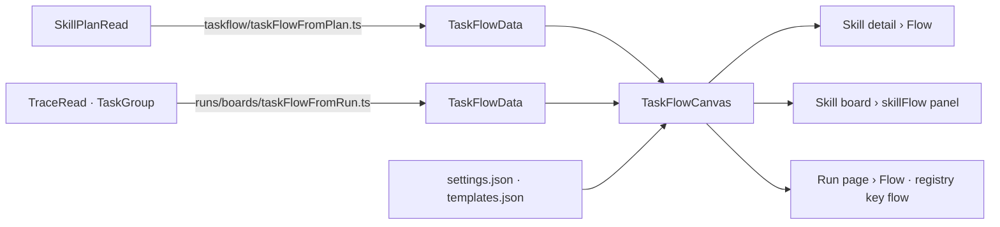

# TaskFlowCanvas — one canvas for every drawing of a plan

A plan's tasks and their `depends_on` edges, drawn on `@invana/canvas` with ELK, in one of two
templates: **Circles** or **Cards**. It is the only flow drawing Studio has. The skill's Flow tab and
the run page's Flow tab both render it, with their own data.

The reference is the canvas Storybook story `usecases/by-casestudies/workflow/WorkflowPlan`
(`~/Projects/invana/canvas/apps/storybook/stories/usecases/by-casestudies/workflow/`). Its settings,
templates, behaviours and header are copied as they are. The only thing taken out is the layout
choice.

## Where it lives

```
studio/src/canvases/
  taskflow/
    TaskFlowCanvas.tsx      the component — GraphCanvasApp, behaviours, <ElkLayout>, the Detail switcher
    settings.json           the whole CanvasConfig, starting on Circles (the story's, minus `force`)
    templates.json          { circles, cards } — the two patches (the story's, minus `force`)
    preview.tsx             renderNode / renderEdge → NodePreviewCard / EdgePreviewCard
    types.ts                TaskFlowData · TaskNodeData · TaskEdgeData · Detail
    index.ts                exports the component, the two JSON files and the types
```

| Rule | Detail |
|---|---|
| `studio/src/canvases/` holds canvases that no single module owns | A canvas that two or more feature modules render lives here, not in either module's folder. It is **not** `features/canvases/` (4.2, the page host in `mainSection`). That one is a module; this one is a component |
| The component does not know its callers | No import from `pages/`, no query hooks, no engine types. It takes `GraphData` and draws it |
| The data, the settings and the templates are all props | A caller imports `settings.json` and `templates.json` from `@/canvases/taskflow` and passes them in with its data. A caller that needs a different config passes a different one, and the component stays the same |
| Adapters live with the caller | Each caller turns its own engine shape into `TaskFlowData`, in its own module (below). The component never learns what a `SkillPlanRead` or a `TraceRead` is |

## The component

```tsx
<TaskFlowCanvas
  data={data}              // TaskFlowData — GraphData with typed node/edge data
  settings={settings}      // CanvasConfig — from settings.json
  templates={templates}    // Record<Detail, Partial<CanvasConfig>> — from templates.json
  title="nl-compare@1"
  onOpenNode={(id) => …}
/>
```

| Prop | Type | Required | What it does |
|---|---|---|---|
| `data` | `TaskFlowData` | ✅ | the nodes and edges to draw. Passed straight to `<GraphLayer data>` |
| `settings` | `CanvasConfig` | ✅ | the whole config. `activeLayout` is always `elk` |
| `templates` | `Record<Detail, Partial<CanvasConfig>>` | ✅ | the patch each Detail level applies: the node-type bindings, plus the ELK spacing its node size needs |
| `title` | `string` | — | the header title. `Flow` by default |
| `message` | `string` | — | shown once in `CanvasMessageBar` when the canvas is ready |
| `initialDetail` | `Detail` | — | `circles` by default, which is what `settings.json` starts on |
| `selectedId` | `string \| null` | — | the node drawn selected (a ring, no drag handles — [SR52](../modules/operate/features/see-what-ran.md#decisions)) |
| `onOpenNode` | `(id: string) => void` | — | click on a node. Leave it out and a click only selects |
| `height` | `number` | — | for a host that gives no height of its own — a board panel body is content-height. Left out, the canvas fills its parent. The run's `TaskFlowWidget` measures the room left in the board's scroller and passes that, never less than 360px, so the Flow tab takes the whole page |

`Detail` is `'circles' | 'cards'`.

### Data shape

| Field | Type | Note |
|---|---|---|
| `node.id` | `string` | the task's key in the plan, or the step run's id on a run |
| `node.type` | `task.llm` · `task.graph_read` · `task.none` | picks the node type in `settings.json`, and so the ring and icon colour |
| `node.data.title` | `string` | the label |
| `node.data.bound` | `string` | the real bound or layer, shown as text on a card. It can be finer than `type` |
| `node.data.icon` | `string` | `lucide/<name>` |
| `node.data.summary` | `string` | the card's two-line body |
| `node.data.stepKey` | `string` | the catalogue entry |
| `node.data.ordinal` | `number` | order in the plan, or `seq` on a run |
| `node.data.rows` | `PreviewCardRow[]` | extra rows for the hover card (args, *from nl-single@1*, status, duration) |
| `edge.data.kind` | `binding` · `require` · `sequence` | the badge on the edge's hover card |
| `edge.data.description` | `string` | the edge card's subtitle |

### What it renders

| Part | From the story | Here |
|---|---|---|
| `BackgroundLayer`, `GraphLayer`, `ThemeBehaviour`, `CanvasThemeSync` | ✅ | ✅, with `useStudioCanvasTheme` in place of `CanvasThemeSync` (TF7) |
| Pan, wheel zoom, drag node, hover activate, click select | ✅ | ✅ |
| `TextResolutionLODBehaviour`, `NodeLabelLODBehaviour` | ✅ | ✅ |
| `HoverElementPreviewBehaviour` (node and edge cards) | ✅ | ✅ |
| `ElkLayout` (`layered`, `RIGHT`) | ✅ | ✅, and it is the only layout |
| `D3ForceLayout` and the **Layout** select | ✅ | ❌ |
| Header centre: `GraphControlsToolbar` | layout section off | layout, history, style, edit and grid off: select mode, fit and lock remain (TF9) |
| Header right: the **Detail** select (Circles · Cards) | ✅ | ✅ |
| Header right: the Settings dock (`CanvasSettingsEditorPanel`) | ✅ | ✅ |
| Header right: the theme toggle | ✅ | ❌. Studio's theme drives the canvas through `useStudioCanvasTheme` (TF7) |
| Footer: `GraphStatusBar` · `CanvasMessageBar` | ✅ | ✅ |

The canvas runs ELK itself whenever its data changes, and redraws the layer on `layout:run:end` (`activeLayout` alone does not lay out a graph seeded before the layout registers). elkjs' worker comes from Vite's `?worker` import, as in `AllModelsCanvas`. After a run the camera never stays past 100%: a fit would frame a five-step plan at 2x on a wide page.

When the Detail select changes: `stopLayout` → `update(templates[detail])` → `runLayout('elk', { fitCamera: { padding: 60 } })`. A new node size needs new positions.

## The two callers



| Surface | File | Data | Edges |
|---|---|---|---|
| Skill detail › **Flow** tab | `features/skills/SkillFlowTab.tsx`: a one-line header (steps · layers declared), the canvas, then **Composed** | `taskFlowFromPlan(plan)`: the current version's plan | the plan's own `edges`. `binding` stays `binding`, `order` becomes `require` |
| Skill board › `skillFlow` panel | `features/skills/boards/SkillFlowWidget.tsx` | the same `SkillFlowTab` | the same |
| Run page › **Flow** tab | `shared/boards/TaskFlowWidget.tsx`, still registered as `flow` | `taskFlowFromRun(groups)`: one node per task group, with its status in the hover rows | `sequence`, in `seq` order, until `plan_snapshot` is on the trace ([SR32](../modules/operate/features/see-what-ran.md#decisions)) |

### Mapping to the three node types

`settings.json` colours three node types, as the story does. The adapter picks the type and keeps the
real value in `data.bound`.

| Source value | `node.type` |
|---|---|
| bound `llm` · layer `llm` | `task.llm` |
| bound `graph_read` · `graph_write` · `schema_write` · `ingest` · layer `graph data` | `task.graph_read` |
| everything else — `plan_write`, `work_write`, `none`, and the layers `third party`, `cache`, `human`, `agent` | `task.none` |

## Decisions

| # | Decision |
|---|---|
| TF1 | **One flow canvas for plans and runs, and it lives in `studio/src/canvases/taskflow/`.** Two modules render it, so neither module owns it. It stays in Studio instead of `@invana/canvas-ui` because its templates are Invana's plan vocabulary (bounds, step keys, ordinals). `canvas-ui` is general graph chrome, and it already ships every part this canvas is built from |
| TF2 | **Data, settings and templates are passed in; the component fetches and adapts nothing.** The JSON files ship next to the component, and each caller imports them and passes them in. The component stays a pure drawing of `GraphData` + `CanvasConfig`, and a caller can change one without forking it |
| TF3 | **ELK `layered`, left to right, is the only layout.** A plan is a DAG, and a layered drawing is what a reader expects of one. A force layout moves the same plan differently each time and has no direction. No layout switcher and no `D3ForceLayout` are registered |
| TF4 | **Detail is Circles or Cards, and each is a template patch.** `templates.json` holds both. The patch carries the node-type bindings and the ELK spacing its node size needs, then the layout re-runs. The canvas opens on Circles |
| TF5 | **The story's settings and templates are used exactly as the story ships them, minus `force`.** That includes its numeric colour lookups. They are canvas config, which `@invana/canvas` reads as numbers. They are not Studio CSS, so the tokens-only rule covers the chrome around the canvas, not these values |
| TF6 | **Three node types; the adapter maps to them and keeps the real value on the node.** `task.llm` · `task.graph_read` · `task.none` as in the story. The finer bound or layer stays in `data.bound` and is printed on a card. **Colour reads `data.tone`** (`llm` · `graph_read` · `none`, from `taskToneOf`), never `data.bound` — a raw layer such as `graph data` or `code` matches no lookup key and would draw the node with no border and a black icon |
| TF7 | **No theme toggle on the canvas, and every colour it paints is Studio's.** Studio has one theme. `useStudioCanvasTheme` (`studio/src/canvases/theme.ts`) hands the canvas's `ThemeBehaviour` one theme, `studio`, whose palette is the live tokens — backdrop `--color-background`, cards `--color-card`, text `--color-foreground`, hairlines and dots `--color-border`, rings `--color-ring`, the categorical ramp `--color-data-N` — and the resolved kind, on every theme change. `CanvasThemeSync` is not used: it picks the canvas library's palette for the family, whose navy disagrees with the page. A second toggle would let the canvas disagree with the page it sits in. The header is Studio's 30px bar (`!h-[30px]`), the height of the kit's tab strip, not canvas-ui's 40px |
| TF8 | **A composed step is a row on its hover card, not a different drawing.** `from nl-single@1` goes in `data.rows`. The skill's **Composed** block ([SK34](../modules/skills/features/authoring-a-skill.md#decisions)) stays under the canvas, naming each plan once |
| TF9 | **The header toolbar carries only what a read-only canvas uses.** Undo/redo, edge-routing style, erase and the grid toggle edit or restyle the drawing, which neither surface allows ([SR52](../modules/operate/features/see-what-ran.md#decisions)). Leaving them out is also what fits Detail and Settings into a 420px `leftSection` |

## Not building

| Not building | Why |
|---|---|
| A layout switcher, or a force / radial / tree layout | TF3 |
| A theme toggle on the canvas | TF7 |
| Editing: drag-to-connect, adding a node, deleting | the flow is read-only on both surfaces ([SR52](../modules/operate/features/see-what-ran.md#decisions)). Drafting is [7.7](../modules/workflows/features/draft-a-plan.md)'s canvas |
| Per-caller templates | one pair of templates. A caller that needs another passes its own `templates` (TF2) and does not fork the component |
| Any flow drawing other than this one | the grid of `TaskNode` cards in `TaskFlowWidget` and the layer strip in `SkillFlowTab` are removed, not kept beside it |
