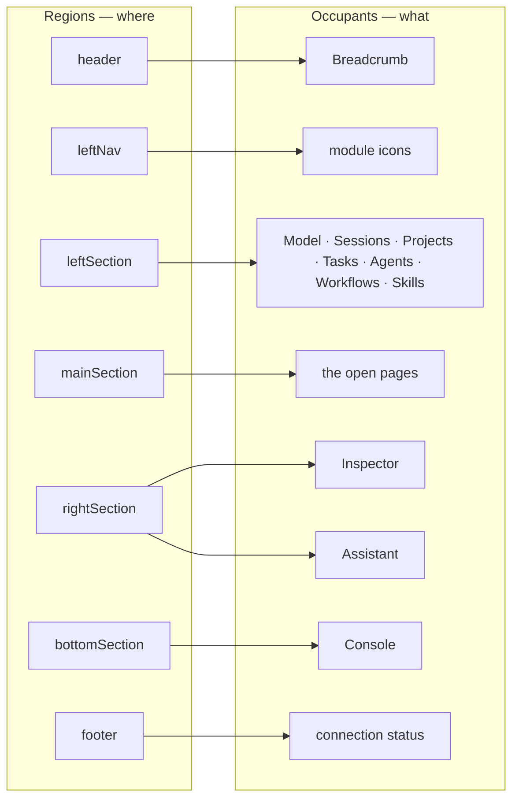
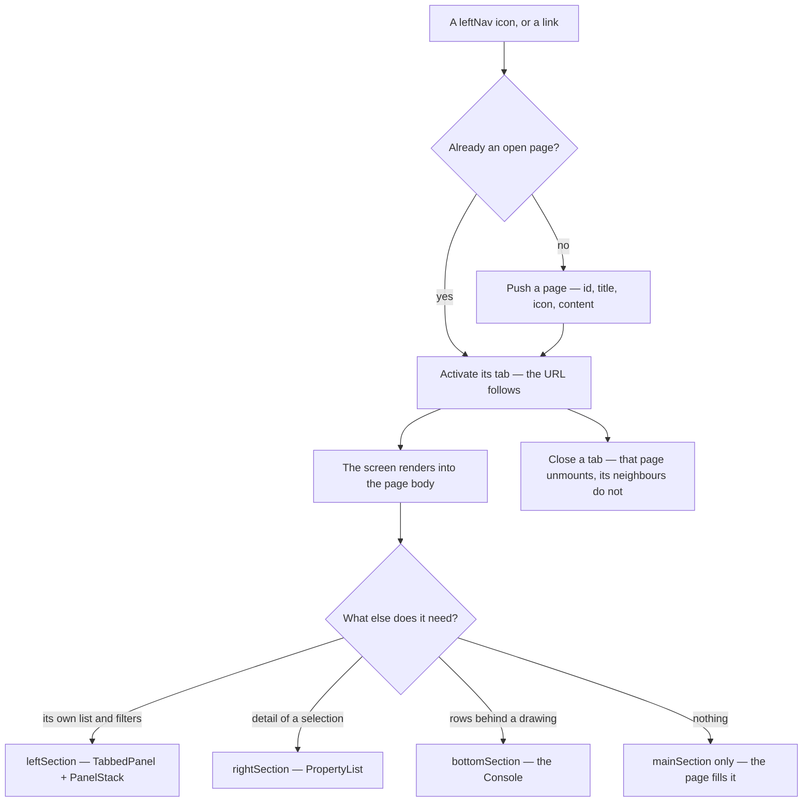

# The shell — one layout, every screen

> For the graph-scoped page this becomes concrete in
> [graph-detail-page.md](graph-detail-page.md) — one `GraphDetailPage`, ten feature modules,
> `leftNav` one icon per module, and the file map.

Studio has **one** shell. Every screen fills its regions; no screen builds a layout of its own
([DS12](../modules/platform/features/design-system.md)).

The reference is **`canvas-ui/apps/AppLayoutV2`** in the canvas Storybook
(`~/Projects/invana/canvas/apps/storybook/stories/canvas-ui/apps/AppLayoutV2.stories.tsx`). The
design-kit's `Themes/AppV2 › ExplorerShell` still defines what the *side* regions hold; the canvas
story supersedes it on **`mainSection`**, and that is the part that changes how every screen is
written.

## What the canvas story settles

`mainSection` is not a screen. It is **`BoardPagesViewPanel`** — a tab strip and the page bodies as
one column:

```tsx
mainSection: {
  content: (
    <BoardPagesViewPanel
      pages={pages}            // [{ id, title, icon, content }]
      activeId={activeId}
      onSelect={setActiveId}
      onAdd={addPage}
      pageMenuItems={[…]}      // rename · duplicate · remove, on the active tab's caret
      headerActions={[…]}      // the left-panel and inspector toggles, pinned right
      className="h-full"
    />
  ),
}
```

Three properties of it are the reason to adopt it, and each is a thing Studio would otherwise
hand-write per screen:

| Property | What it buys |
|---|---|
| **The strip and the bodies are one component** | The tab bar cannot drift from what it switches. Studio's `CanvasTabsBar` (269 lines) is a strip that owns no body, wired by hand to state that lives somewhere else |
| **`keepMounted` (default)** | Inactive pages are hidden, not destroyed. A canvas keeps its camera, layout and selection across a tab switch; a table keeps its scroll and its filters. This is the behaviour Studio's own `GraphDetail` workaround existed to protect, and it comes free |
| **`content` is any `ReactNode`** | It is not a canvas host. Review, Schedules, Agent stats — every screen is a page. One `mainSection`, one mechanism |

## The regions — and their names

`AppLayoutV2`'s prop names **are** the vocabulary. The kit is the lowest layer that can own a name,
and nothing depends back up (CLAUDE.md · *Three repos, one direction*) — so the same seven words
name a region in Studio's code, in these docs, on an artboard, in a URL and in an e2e locator.
Nothing else names a region.

```
┌───────────────────────────────────────────────────────────────────────────────┐
│ header                                                                        │
│   header.left ─────────── header.center ─────────── header.right              │
├─────────────────┬───────────────────┬──────────────────────┬──────────────────┤
│ leftNav         │ leftSection       │ mainSection          │                  │
│                 │                   │                      │ rightSection     │
│ .top            │                   │                      │                  │
│ .topNavItems    │                   │                      │                  │
│ .middle         │                   ├──────────────────────┤                  │
│ .bottom         │                   │ bottomSection        │                  │
│ .bottomNavItems │                   │                      │                  │
├─────────────────┴───────────────────┴──────────────────────┴──────────────────┤
│ footer                                                                        │
│   footer.left ─────────────────────────────────── footer.right                │
└───────────────────────────────────────────────────────────────────────────────┘
```

That is **`bottomSpan="main"`** — Studio's span, decided in
[the-console.md](../modules/explore/features/the-console.md) CO1. The `leftSection` panel and the
Inspector both *describe the selection*; the Console describes the **draw**, and a region that
changes neither must not shorten both. So it runs under `mainSection` only, and the two side columns
stay full height.

`leftNav` is always full height between `header` and `footer`. No span ever runs under it.

| `bottomSpan` | `bottomSection` runs under | Full height beside it | Who uses it |
|---|---|---|---|
| `main` | `mainSection` | `leftSection` + `rightSection` | **Studio** (the-console.md CO1) |
| `main-right` | `mainSection` + `rightSection` | `leftSection` | `canvas-ui`'s `GraphCanvasApp`, whose default it is — it has no `leftNav` and its right column is a data table, not an inspector |
| `left-main` | `leftSection` + `mainSection` | `rightSection` | nobody. It is the kit's default, which is why it is easy to draw by mistake |
| `full` | all three | none | nobody |

`bottomSection` is **not wired in Studio yet** — `GraphDetail` passes neither it nor `bottomSpan`,
so the kit's `left-main` default is what would apply today. Passing `bottomSpan="main"` is part of
landing the Console, not a later tidy-up.

### The seven words

| Region | Type | Sub-slots | What it holds in Studio |
|---|---|---|---|
| `header` | `NavHorizontalProps` | `left` · `center` · `right` (+ `*NavItems`) | wordmark · breadcrumb · the camera toolbar · the onboarding cap · theme · Assistant |
| `leftNav` | `NavVerticalProps` | `top` · `topNavItems` · `middle` · `bottom` · `bottomNavItems` | one icon per feature module, exactly one lit |
| `leftSection` | `SectionConfig` | — | the open panel — Model · Sessions · Projects · Tasks · Agents · Workflows · Skills · Settings. **Layers is not here**: it is a canvas control on the page strip ([graph-detail-page.md](graph-detail-page.md) G18) |
| `mainSection` | `MainSectionConfig` | — | `BoardPagesViewPanel` — the open pages |
| `rightSection` | `SectionConfig` | — | the Inspector, or the Assistant |
| `bottomSection` | `SectionConfig` | — | the Console |
| `footer` | `NavHorizontalProps` | `left` · `right` | connection status · counters · version |

A sub-slot is written with its region: `header.right`, `footer.left`, `leftNav.bottomNavItems`.
Never "the header's right side", never "the top-right".

### A region is a slot; an occupant is what fills it

This is the distinction the old names lost. `rightSection` is a place. The **Assistant** is a thing.
Saying "the drawer" names neither, so it names both.



| | Named by | Rule |
|---|---|---|
| **Region** | the seven props above | Fixed. A region is never renamed after what is currently inside it |
| **Occupant** | a product noun from [terminology.md](../terminology.md) | Free to move between regions without being renamed |

A component that is a whole region's content is `<Occupant>Panel` — `InspectorPanel`,
`AssistantPanel`, `ModelPanel`. **"Panel" means region content.** It is never a region, so
"the panel" alone says nothing; name the occupant or name the region.

### Words we retire

Each of these named a region. They are gone from code, docs, artboards and comments.

| Not this | Say | Was in |
|---|---|---|
| rail · left rail · `railItem` · activity bar · icon column | `leftNav` · **leftNav item** | Studio ×104, docs ×19, kit JSDoc |
| sidebar · `sidebar-panel` · left panel · docked panel | `leftSection` | kit panel id, Studio |
| editor · `editor-panel` · `editor-area` · main content · `mainContent` · canvas area · workspace | `mainSection` | kit panel ids |
| auxiliary · `auxiliary-panel` · right panel · **drawer** | `rightSection` | kit panel id, Studio ×46 |
| terminal · `terminal-panel` · bottom panel · console *(as a place)* | `bottomSection` — the **Console** is what fills it | kit panel id, Studio ×11 |
| status bar · `AppStatusBar` *(as a place)* | `footer` | Studio |
| top bar · app bar · nav bar | `header` | — |
| panel · section · pane, bare | name the region, or name the occupant | everywhere |

**`rail` is the worst of them**, because it already names two different regions in two repos:
Studio's `rail` is the `leftNav`, and `canvas-ui`'s "header rail" / "footer rail" are the `header`
and the `footer` (`GraphCanvasApp.tsx`, ×15). One word, three regions, and a reader cannot tell
which from the sentence. It goes everywhere.

The kit's internal `ResizablePanel` ids (`sidebar-panel`, `editor-panel`, `terminal-panel`,
`auxiliary-panel`) are the last holdouts and the reason the old words keep leaking. They rename to
`left-section` · `main-section` · `bottom-section` · `right-section` in design-kit, and Studio's e2e
locators follow.

### Where the names travel

One word per region, in five places:

| Place | Form | Example |
|---|---|---|
| Kit prop / Studio prop | `camelCase` | `leftSection={{ content: … }}` |
| Prose — docs, comments, commit messages | the bare prop name in backticks | "the panel docks into `leftSection`" |
| URL param | the region stem, lowercase | `?left=model` · `?main=explore` · `?right=assistant` · `?bottom=console` |
| DOM id / e2e locator | `kebab-case`, under `idPrefix` | `#graph-detail-left-section` |
| Artboard label on the board | the bare prop name | `leftNav` |

**The URL names regions too.** One param per region; the param is the region, the value is the
occupant ([graph-detail-page.md](graph-detail-page.md) G16):

| Param | Drives | Values | Today |
|---|---|---|---|
| `?left=` | `leftSection` | the open panel key | **`?panel=`**, with `?settings=` read as a legacy alias. A rename |
| `?main=` | `mainSection` | the active page id | **nothing.** `activePageId` is *derived* from four unrelated pieces of local state — `globalModelOpen`, `workKind`, `workCanvas`, `activeCanvasId` — and `selectPage` dispatches back into all four. Not a rename: a new single source of truth |
| `?right=` | `rightSection` | `assistant` · `inspector` · absent | ✅ **shipped** — `shell/useRightSection.ts` is the one owner. `?ai=` and `?inspector=open` are read as legacy aliases and normalised away on the next write |
| `?bottom=` | `bottomSection` | `console` · absent | nothing — the Console is not wired |

Only `?left=` is a rename. The other three are the point of doing this: naming the region forces
each one to have exactly one owner. `rightSection` had two and now has one; `mainSection` still has
four.

Old param names stay **readable** so bookmarks survive, and are never written — the one-way alias
`useSettingsPanel` already applies to `?settings=`.

### A region that opens takes its width from `mainSection`

Every screen is drawn at **1440**, so opening `rightSection` is a subtraction, never a widening:
`leftNav` 45 + `leftSection` 420 + `mainSection`, and the occupant's own width comes out of
`mainSection` alone.

| `rightSection` | `mainSection` |
|---|---|
| absent | **974** |
| the Assistant, or the Inspector (360) | **613** |

`leftSection` never gives. It is the panel you are working *from* — a list you are picking in, a
palette you are dragging from — and a region that narrowed when another opened would move the thing
the cursor was already on.

**`mainSection` narrowing is not a smaller drawing of the same screen.** Each part answers for
itself, and the rules are the same wherever a board is drawn:

| Part | At 613 |
|---|---|
| a **canvas** | **pans, never refits.** Scale is the user's and position is the app's: a refit on every panel toggle would move every node. It pans to the **selection**, because what must never end up behind the new edge is what you were working on |
| a **table** | keeps its key columns and scrolls the rest; it does not drop one silently |
| a **two-column region** | **stacks below 720**, in reading order, in one scroll. Nothing moves to another region |
| a **pagehead** | keeps the record's name (truncated, never wrapped), the reading switch and the one primary act; secondary acts fold into the `⋯`, and badges the body already states go |

Stated for the draft board as [DP13 · DP14](../modules/workflows/features/draft-a-plan.md#decisions),
drawn as `library.plans.detail.flow_canvas.edit` and `…edit.assistant`.

### What is actually wired today

Validated against `shell/GraphDetail.tsx` and `GraphDetailPage.tsx`, so the table above is read as
intent and this one as fact:

| Region | Wired | Occupant |
|---|---|---|
| `header` | ✅ | `useAppHeader` — `left` (wordmark · breadcrumb) · `center` (the camera toolbar) · `right` (`rightExtras` · `GitHubStars` · **the onboarding cap, graph-scoped only** · `ThemeMenu` · `FullscreenToggle` · `panelControls`) |
| `leftNav` | ✅ | `useGraphLeftNav` |
| `leftSection` | ✅ | the open panel, or `SettingsPanel` docked |
| `mainSection` | ✅ | `BoardPagesViewPanel`, with **`keepMounted={false}`** — only the active page's body is mounted, until each canvas owns its own engine |
| `rightSection` | ✅ | the `?right=` occupant, looked up in the page's `rightSections` registry — `assistant` → `AssistantPanel`, `inspector` → `InspectorPanel`. Absent → the region is not handed to the kit at all. Each entry carries its own size triple |
| `bottomSection` | ❌ | — |
| `footer` | ✅ | `left`: `ConnectionStatusBar` + metrics · `right`: extras + `AppVersion` |

`GraphDetail` passes no `bottomSpan`, so the kit's `left-main` default is what applies the moment a
`bottomSection` is handed to it. `bottomSpan="main"` goes in with the Console, not after it.

### The engine never names a region

Layout is Studio's. The engine names **things** — a graph, a model, a session, a dataset — and
Studio decides which region shows them. No response field, error payload or docstring says
`leftSection`, and none says "the panel" either; it says what the thing is.

The one word that crosses is `section`, and it does not mean layout there: `setup_state` sections
(`graph_info`, `instructions`) are **setup sections**, always qualified. Layout regions are always
the compound word — `leftSection`, never a bare `section`.

Panel toggles live on the strip's `headerActions`, not in the `header` — they belong to the thing
they open, and they disappear with it.

## The chrome type ladder

Chrome is ranked by **weight and case**, not by size. There are two content sizes in
`@invana/styling` — base and `text-meta` — and chrome uses base almost everywhere; a rung that wants
to read quieter says so with colour or weight, not with a smaller number.

| Rung | Where it lives | Size | Weight | Colour |
|---|---|---|---|---|
| App header breadcrumb | `components/header/useAppHeader.tsx` | base — inherited | `font-semibold` | trail muted; current segment `text-foreground` |
| Panel header title | `shared/ListPanel.tsx` → `PanelContent title` | base — inherited | `font-semibold` | trail muted; current crumb `text-foreground` |
| `PanelStack` section header | `@invana/ui` `PanelStack` | `text-meta` | `font-semibold uppercase tracking-wide` | muted |
| Eyebrow | `@invana/ui` `Eyebrow` | `text-meta` | `font-semibold uppercase tracking-wide` | muted · `foreground` · `accent` |
| Body text | anywhere | base — inherited | regular | foreground |
| Subordinate text — counts, timings, a row's subtitle | anywhere | `text-meta` | regular | muted |

| Rule | Detail |
|---|---|
| Chrome never declares `text-xs` | It is a compatibility alias for `text-meta`, kept so 300+ old call sites stay correct. New chrome declares no size and inherits base, or says `text-meta` when it is deliberately subordinate. |
| A section header is not the loudest thing in a panel | Uppercase carries ~40% more visual height than lowercase at the same size, so caps plus semibold plus tracking at `text-meta` out-shouts a base-size panel title. The panel title outranks it, and does so at base size. |
| The panel title is set once, in `ListPanelChrome` | Its title wrapper is `font-semibold` and declares no size. A panel passes a string or a `Breadcrumb`; it does not restate the type. |
| A breadcrumb trail is `font-semibold` throughout | `BreadcrumbList` carries the weight and the kit's `text-muted-foreground`; `BreadcrumbPage` restates `font-semibold` because the kit hard-codes `font-normal` on it. The trail and the current page separate by **colour**, not weight. |

## A screen's journey through it



## Tabs and routes are the same thing

The tab strip is what you have **open**; the URL names which one is **active**. They do not compete:

| | |
|---|---|
| `/u/:owner/:graph/<screen>` | the active page. Reload lands on it |
| The open set | session state, per graph. It survives a reload the way open editors do |
| `onSelect` | pushes a route; the router does not push a tab |
| `pageMenuItems` remove | closes a page and routes to its neighbour |

A screen is therefore still addressable and still linkable — [code-shape.md §5](code-shape.md) is
unchanged. What the strip adds is that opening a second screen does not throw the first one away.

## Seams to get right

| Seam | What must be true |
|---|---|
| **`keepMounted` and live data** | Ten open pages means ten mounted subtrees. A hidden page must not poll: TanStack Query's `refetchInterval` is paused when hidden, and an SSE stream is closed. A hidden page keeps its *state*, not its *traffic* |
| **A page that cannot exist** | Removing a graph, or a screen whose feature is 🔵, closes the page rather than rendering an error into the strip |
| **The empty strip** | The canvas story keeps one page always. Studio should not: closing the last page shows the graph's resting screen, not a locked tab |
| **What a member without access sees** | The page is not offered in `leftNav`, and a direct link renders `EmptyStateLock`, not a blank tab |

## What this replaces in Studio

| Studio | Goes |
|---|---|
| `GraphDetail.tsx`'s hand-built `ResizablePanelGroup` (~90 lines) | ✅ **done** — `AppLayoutV2`'s region props |
| the `?panel=` union as a page switch | → routes, one per screen ([code-shape.md §5](code-shape.md)), each a page in the strip |
| every screen's own layout | → the regions above |

## The Explorer's `mainSection` is a page host already — badly

`BoardPagesViewPanel` **is** the right answer for the Explorer, and an earlier draft of this
document argued the opposite on evidence that did not hold up. Two things settle it.

**One. `mainSection` is already a four-branch ternary**, and only one branch can be alive:

```tsx
mainSection: { content:
    workKind === "model" ? <ModelCanvas …/>
  : workCanvas          ? <WorkCanvasHeader …/> + workCanvas
  : activeSessionId     ? canvasContent
  :                       <the reason there is no canvas yet /> }
```

Those are four *kinds of page* fighting over one slot. Opening a model **already unmounts the
Explorer canvas entirely** — so the "one preserved engine" that made `keepMounted` look expensive
does not exist today across kinds. `keepMounted` is strictly better here, not a trade.

**Two. Nine pieces of per-canvas state are held at page level** — `canvasData`, `seedData`,
`styling`, `stylingOpen`, `selectedId`, `magnet`, `historyOpen`, plus the tab list and the active id
— in a component that hosts many canvases. That is the actual disease; the ternary is a symptom, and
the 2,245-line file is the bill.

### So the layout change is small and the state change is the work

| Step | What |
|---|---|
| 1 | Extract **`DataBoardPage`** — one component owning *one* board: its seed, styling, selection, magnet, autosave, history. The nine singular states become its own |
| 2 | `ModelPage` and `WorkPage` likewise — they are pages, not branches |
| 3 | `useOpenPages()` owns the open set, the active id and the cap; the URL names the active one |
| 4 | `mainSection` becomes `BoardPagesViewPanel` over those pages. `CanvasTabsBar` is deleted |
| 5 | Each page publishes its engine when active; the lifted `CanvasContext` provides the active one, so the header toolbar and inspector keep resolving *the* canvas |

What `ExplorerPage` keeps is what is genuinely cross-page: sessions, the assistant, `leftNav`, the
console. It should land near 300 lines.

### The one thing that needs deciding

`keepMounted` means one WebGPU context per open page, and the tab list is unbounded today. Browsers
cap contexts (~16 for WebGL), so the shell needs a **ceiling on open canvas pages** — closing the
least-recently-active when it is reached, the way an editor evicts tabs. Non-canvas pages (Review,
Schedules, a table) cost nothing and need no ceiling.

Eight is the suggested ceiling: comfortably under any browser limit, and more canvases than anyone
has been observed to keep open.

