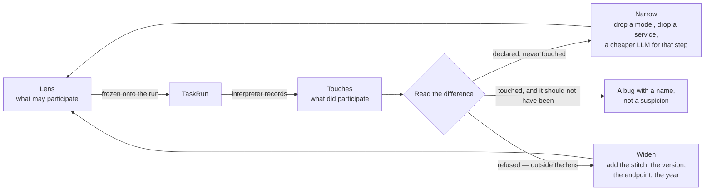

# Governance — what may participate, what did, and how a person tunes it

**Status: RFC, concluded — D1–D19 are settled and dispersal has begun.** Nothing here is built. This file maps one design space — *which things
are allowed to shape a decision, which ones actually did, and how someone changes that* — and states
the options rather than the answer. When a question below settles it moves into the feature file it
governs ([§12](#12-where-each-decision-lands)), in present tense, and the option table that produced
it is not kept. This file is then deleted.

> **As** someone accountable for an answer, **I want** to say which models, which slices of them,
> which LLMs and which outside systems may take part — and then see which ones actually did — **so
> that** I can narrow the lens until the decision is one I would defend, or widen it until the
> question can be answered at all.

| | |
|---|---|
| Governs | [operate](modules/operate/spec.md) · [ask](modules/ask/spec.md) · [agents](modules/agents/spec.md) · [connect-and-model](modules/connect-and-model/spec.md) · [graph-connectors](modules/graph-connectors/spec.md) · [explore](modules/explore/spec.md) |
| Depends on | [orchestration § 0](orchestration.md#0-the-records) — `Todo · TaskPlan · Task · TaskRun · Lens` |
| Drawn in | the `Task Plan & Task Run` design canvas — `QueryPlan` · `QueryRun` artboards |
| Slice | not assigned — this is design, not delivery |

**Auditing is the read half. Governing is the write half, and it is the reason to build the read half
at all.** A record of what a run touched, with no way to change what the next run may touch, is a
receipt. The two halves are one loop ([§1](#1-the-loop)), and the **lens** is where it closes.

---

## Contents

| § | | Settles |
|---|---|---|
| [0](#0-what-is-already-settled) | What is already settled | the nine things this RFC may not re-open |
| [1](#1-the-loop) | The loop | declare → run → read → retune, and why neither half stands alone |
| [2](#2-layers-sublayers-and-participants) | Layers, sublayers, participants | **five governed layers and one spine**, and the address that names one thing |
| [3](#3-the-lens-generalises) | The lens generalises | from *which graph data* to *which participants, of any layer* — allow, deny, and a selector |
| [4](#4-sub-worlds--narrowing-what-a-decision-may-rest-on) | Sub-worlds | three grains — type, property, record — and why modelling is a governing act |
| [5](#5-egress--what-leaves-the-curated-graph) | Egress | what is sent to which system — and why a hosted LLM is one |
| [6](#6-the-touch-record) | The touch record | the ledger that proves the lens held, and shows where to retune |
| [7](#7-bounds-narrow-never-widen) | Bounds narrow | allow intersects, deny accumulates, per layer |
| [8](#8-cost--what-was-spent-and-what-was-not) | Cost | spent, avoided, and by layer |
| [9](#9-one-continuous-flow) | One continuous flow | no wrap, no *continues below*, and bands that expand |
| [10](#10-the-detail-surface) | The detail surface | the step dashboard, and the bands it grows |
| [11](#11-plan-and-run-are-two-drawings) | Plan and run | the same layers, deliberately different ground |
| [12](#12-where-each-decision-lands) | Where each decision lands | question → feature file |
| [13](#13-what-this-adds-to-the-record) | What this adds | every new column and document, in one table |
| [14](#14-decisions-settled) | Decisions to make | D1–D16, ordered by blast radius, asked one at a time |
| — | [Not building](#not-building) | |

---

## 0. What is already settled

Where this RFC looks like it contradicts one of these, the conflict is named in
[§14](#14-decisions-settled) rather than resolved by silence.

| Settled | Where | What it means here |
|---|---|---|
| A **Lens** bounds what a run may **see**, as an envelope bounds what it may **do** | [terminology § 3](terminology.md) · [§0.9](orchestration.md#09-grounding-a-run--the-lens) | the lens is the governing surface. [§3](#3-the-lens-generalises) widens what *see* covers; it invents no second bound |
| Bounds narrow, never widen — `agent ∩ plan ∩ todo` | [§0.9](orchestration.md#09-grounding-a-run--the-lens) | unchanged, per layer. [§7](#7-bounds-narrow-never-widen) |
| *Outside the lens* is a distinct answer from *not in the graph* | [§0.9](orchestration.md#09-grounding-a-run--the-lens) | the **widen** signal, and the loop depends on it |
| **Subgraph** already means an emission | [terminology § 4](terminology.md) | a narrowed view of the graph is a **Lens**, never a "subgraph". [§4](#4-sub-worlds--narrowing-what-a-decision-may-rest-on) |
| Nothing executes outside the runtime | [SR23](modules/operate/features/see-what-ran.md) | a scrape, a cache probe and a provider ping are all TaskRuns or recorded on one. There is no ungoverned path |
| A run freezes the plan **and** the world | [SR11](modules/operate/features/see-what-ran.md) | `plan_snapshot` + `lens_snapshot`. A tuned lens does not rewrite what past runs meant |
| Every task run writes `result.json`, assembled by the interpreter | [SR17](modules/operate/features/see-what-ran.md) · [SR38](modules/operate/features/see-what-ran.md) | everything recorded here is a key in that document. No parallel store |
| A band with no record is **absent**, not zero | [SR34](modules/operate/features/see-what-ran.md) | an unrecorded participant draws nothing. Never `$0.00`, never *no layers touched* |
| The agent binds the provider; the composer never picks one | [PM1 · C8](modules/agents/features/providers-and-models.md) | [§3.2](#32-llm--providers-and-models) is a real tension with this and is written as one |
| Cost is derived at settle, absent when unpriced | [SR40](modules/operate/features/see-what-ran.md) · [OB4](modules/operate/features/observability.md) | [§8](#8-cost--what-was-spent-and-what-was-not) inherits it: never estimate silently |

---

## 1. The loop



| Half | Is | Without the other half |
|---|---|---|
| **Declare** — the lens | what may take part | a policy nobody can check. *Configured* is not *enforced* |
| **Record** — the touches | what did take part | a receipt. You read what happened and change nothing about what happens next |

**The diff between them is the product.** Declared-and-never-touched is waste you can cut.
Refused-as-outside-the-lens is the answer you are not getting, with the exact reason.
Touched-but-not-declared is impossible if enforcement works, which is what makes the record proof
rather than logging.

---

## 2. Layers, sublayers and participants

### Five governed layers and one spine

The test: *could a lens name the members of this, and would emptying it mean something other than
"nothing runs"?*

| Band | Members a lens could name | So it is |
|---|---|---|
| **graph data** | model versions, stitches, datasets — and slices of them | a **governed layer** |
| **llm** | providers, and the models under them | a **governed layer** |
| **third party** | apps, APIs, databases, other agentic systems | a **governed layer** |
| **cache** | the four caches, each with a freshness rule | a **governed layer** |
| **human** | who may be asked, and whether at all | a **governed layer** |
| **agent** | **no** — there is one runtime, and emptying it means *nothing runs* | **the spine** |

The agent is not a participant; it is the thing doing the participating — the line the flow runs
along, dispatching into the five layers and collecting what comes back. It is already bounded by the
**envelope** (what it may do) and the **budget** (what it may spend). The drawing keeps six bands,
because the flow visibly moving *between* the agent and everything else is the story; the governance
model has five entries.

### Three levels, and an address that names one thing

| Level | Is | Governed? |
|---|---|---|
| **Layer** | a class of participant | no — a category is not a thing you switch off |
| **Sublayer** | a grouping inside it | yes, as a prefix |
| **Participant** | one named member | **yes** — this is the leaf a lens names |

A participant has one **address**: `<layer slug>/<sublayer>/<name>`. The layer has a display name and
a slug, and the slug is what appears in an address.

| Layer | Slug | Sublayers | A participant |
|---|---|---|---|
| graph data | `graph_data` | `model` · `stitch` · `dataset` | `graph_data/model/Observations@v2` |
| llm | `llm` | one per **provider** | `llm/anthropic/claude-opus-5` |
| third party | `third_party` | `api` · `app` · `db` · `agent` | `third_party/api/clearbit.com/v2/companies` |
| cache | `cache` | — | `cache/answer` |
| human | `human` | `person` · `role` | `human/role/analyst` |
| agent | `agent` | — the spine | none |

**The sublayer is the touch record's `kind`, which already exists** ([§6](#6-the-touch-record)). It is
not a new concept — it is the grouping the ledger was already carrying, given a name and a place in
the drawing.

**And the address is what the whitelist matches on**, with globs, uniformly across every layer
([§3.1](#31-allow-deny-and-the-glob)). One mechanism instead of five shapes of rule.

### Why `graph data` and not `graph`

`Graph` is the container — the bounded domain and the reasoning boundary
([terminology § 2](terminology.md)) — and a layer called `graph` would collide with it in every
sentence. `graph data` is the records and models *inside* a Graph.

### Why `third party` and not `internet`

**The boundary is curation, not the network.** A read-only warehouse on the same private subnet is as
outside the Graph as a public API is: nobody curated it into a model, nothing stitched it, and an
answer that leans on it is grounded in something the Graph does not hold. `internet` named the wrong
property and excluded three of the four things that belong in the band.

| The band holds | Example |
|---|---|
| `api` | an enrichment endpoint, a rates feed |
| `app` | a SaaS system of record reached over its own API |
| `db` | a warehouse or an operational database, read directly |
| `agent` | another agentic system — the only participant with agency of its own |

**A peer agent stays in this band** ([D11](#14-decisions-settled)), addressed
`third_party/agent/<name>` and surfaced as its own row when the band expands
([§9](#9-one-continuous-flow)). It is the only participant that can itself ask a person, spawn runs
and spend money — but none of that is a **governance** difference: you permit it or deny it, `egress`
says what may be sent, the touch records what came back. What differs happens inside it, which is
past our boundary by definition, and a seventh band governing nothing new would sit empty on every
flow that calls no peer.

Two properties ride on the participant rather than the band, and both are recorded: its response is
**quoted as data, never executed**, and its own spend is **bounded before the call**.

### A layer is never dark because it was switched off

It is dark on a run because nothing in it was needed, or because every participant in it was outside
the lens. Those are different facts, and the drawing says which ([§6](#6-the-touch-record)).

### And `layer`, not `lane`

`lane` is taken: [terminology § 6](terminology.md) pins it to *one parallel element of a fan-out*, and
`task_runs.lane` is that integer. The collision is load-bearing — a `map_over` of 200 suppliers is 200
lanes inside one layer.

---

## 3. The lens generalises

**The lens governed one layer when this was written.** It was defined as *a narrowing of the global model*
([terminology § 3](terminology.md)) — model versions, stitches, datasets, `as_of`. That is
`graph data` and nothing else. Every other thing that shapes an answer is hard-coded, a plan property,
or a credential on an agent.

**The proposal is one shape: a list of rules over addresses, plus per-layer settings.**

```jsonc
Lens {
  key:  "eu-h1-2026-conservative",         // named and reusable, or null for one run
  kind: "world",                           // "guardrail" | "world" - see below
  rules: [
    { match: "graph_data/model/Observations@v2", allow: true,
      select: { time: {between: ["2026-01-01", "2026-06-30"]},
                geo:  {in: ["IE", "DE", "FR"]} } },
    { match: "graph_data/model/Publisher@*",     allow: true  },
    { match: "graph_data/stitch/*",              allow: false },   // answer without cross-model links
    { match: "llm/anthropic-prod/*",             allow: true,
      egress: { may_send: ["type_names", "the_question"] } },      // schema shape, never values
    { match: "llm/*/*-haiku-*",                  allow: false },   // not for this decision
    { match: "third_party/api/clearbit.com/**",  allow: true,
      egress: { may_send: ["entity_keys"] } },                     // a name, nothing else
    { match: "third_party/db/**",                allow: false },
    { match: "cache/answer",                     allow: false }    // walk it fresh
  ],
  cast:   { extract: "llm/anthropic/claude-haiku-4.5",
            decide:  "llm/anthropic/claude-opus-5" },
  as_of:  null,                            // transaction time - see §4
  cache:  { max_age_s: 300 },
  human:  { may_ask: true, max_rounds: 3 },
  egress: { may_send: [] }                 // the default for any crossing no rule spoke for
}
```

| Property this keeps | |
|---|---|
| **Today's lens is a set of `graph_data/*` rules** | a reshaping, not a redefinition. `lens_snapshot` still means *the world it ran against*, and a run frozen before the change still reads |
| **One surface to tune** | narrowing the data, the slice of it, and the model that reads it are the same act — *make this decision depend on less* — and splitting them across a lens editor, an agent panel and a plan file is how nobody does any of them |
| **One thing to freeze** | `lens_snapshot` already freezes onto the run. A replay is reconstructible across all five layers |
| **One vocabulary for the refusal** | *outside the lens* already exists as a distinct answer. A refused endpoint, a refused stitch and a refused year say the same sentence with a different noun |

### 3.0 `kind` — a guardrail and a world are one record

**A guardrail and a sub-world are the same object doing two jobs, so they are one table, one
enforcement path and one snapshot — separated by `kind`, not by a second record.**

| | `kind: guardrail` | `kind: world` |
|---|---|---|
| Set by | whoever is accountable, on the Graph or an agent | anyone who can act in the Graph |
| Meant to be | invisible after it is set | picked per question, named, compared |
| Where | its own settings surface | the **Worlds** drawer, fourth in the **Tasks** stack |
| In the Worlds list | **never** — so there is no delete control to block | yes |
| Composition | a world may only narrow a guardrail, never widen it ([§7](#7-bounds-narrow-never-widen)) | |

#### Where Worlds lives

**`Runs · Plans · Catalogue · Worlds` — a fourth drawer in the Tasks stack**
([D18](#14-decisions-settled)), not a `leftNav` icon of its own. A run is made of a plan, the
callables in it, **and the world it ran against**, so the stack already holds everything an execution
is composed from.

It is the same argument [SR12](modules/operate/features/see-what-ran.md) makes for Runs: *this run →
its world → retune → run again* stays in one column and never closes what you came from — which is
exactly what `Retune` on the run dashboard needs ([§10](#10-the-detail-surface)). A fifth icon would
also be the shape [SR7](modules/operate/features/see-what-ran.md) warns about, where an icon per kind
turned one journal into four panels.

**What this stretches:** the stack now means *what executes* **and** *what it may see*, and four
drawers is where a stack starts wanting a scroll.

#### Naming is sharing

**An unnamed lens is attached to its run and private to whoever ran it; naming one puts it in the
Graph's Worlds list** ([D17](#14-decisions-settled)). This is `Lens.key` used exactly as the record
already defines it — *null unless named and reusable* — so there is no ownership column and no share
action.

| | Unnamed | Named |
|---|---|---|
| Lives | on the runs that used it | in the Worlds list |
| Seen by | whoever ran it | everyone in the Graph |
| Is | the three narrowings you tried before one worked | the one worth reusing |

It also gives promotion a single ladder, each rung one edit and neither re-authoring anything:

```
unnamed lens  --name it-->  world  --kind--> guardrail
```

**What this costs, stated:** typing a name **is** publishing. The field says
`Name it to add it to Worlds`, never a bare input — otherwise someone labelling a past run for their
own memory has shared it without being told.

**Why one record and not two.** A world that proves itself becomes a standard by changing `kind`, not
by being re-authored into a different shape — and re-authoring is where two records drift. One record
also means one `lens_snapshot`, so *what was this run allowed to see* is one document rather than a
composition an auditor has to compute. Two records would need the narrowing rule implemented twice
and kept agreeing forever, and the gap between them is invisible until the day one is honoured and
the other is not.

**Why `kind` and not only a permission.** A guardrail that is merely a locked row in the Worlds list
still has a delete control to block and still has to be explained to an auditor as *a lens with a
flag*. A separate `kind` gets its own route, its own permission and its own page, so the bound is
legible as one object with one owner — which is what an external audit asks for.

#### What a guardrail expresses

It is the same grammar a world uses — the difference is who sets it and that it is always in force.
Six shapes, and **access is three of them**:

| Shape | Example | Governs |
|---|---|---|
| **Participant** | *no third party at all* · *only these two models* | what may take part |
| **Structural — type** | *Salary does not exist in this Graph's worlds* | what may be **read** |
| **Structural — property** | *`Deal.revenue` is excluded everywhere* | what may be **read** |
| **Extensional** | *EU regions only, always* | what may be **read** |
| **Egress** | *never put a property value in a prompt to a hosted model* | what may be **sent** |
| **Circumstance** | *never serve a cached answer older than 5 minutes* · *never interrupt a person on an unattended run* | how the run behaves |

**What this does not buy.** A guardrail is still a row an admin can edit. If a bound must be
*structurally* unreachable rather than permission-enforced, that is a second record, and this is not
it.

### 3.1 Allow, deny, and the glob

| | |
|---|---|
| `match` | an address, with `*` for one segment and `**` for the rest |
| `allow: false` | the blacklist. **Deny wins** over any allow, at any specificity |
| Nothing matched | the **default**, and the default is the widest: a Graph that sets no lens sees the whole global model, every configured provider, and every third party its agents are credentialed for |

**Deny winning regardless of specificity is deliberate.** The alternative — most-specific-rule-wins —
means a broad `third_party/** deny` can be punched through by a narrow allow written later, somewhere
else in the chain, by someone who did not know the deny existed. A rule that can be overridden by
being more precise is not a bound.

### 3.2 `llm` — providers and models

**The sublayer is the configured provider row, not the vendor.** `llm/anthropic-prod/claude-opus-5`
and `llm/anthropic-research/claude-opus-5` are different participants with different keys, which is
what lets one address name one credential without ambiguity.

**An agent binds no provider.** `agent.llm_provider_id` is dropped: the cast names the model, the
Graph resolves the credential from the provider row the address names, and an agent's ceiling on
models is a **lens rule** like every other layer — `deny llm/**` with two allows. The binding existed
because nothing else chose the model; once the cast does, it is a second bound on one thing, which is
what [§2](#2-layers-sublayers-and-participants) refuses everywhere else. [PM1](modules/agents/features/providers-and-models.md)
is rewritten accordingly, and its seams survive unchanged — a cast naming a model whose provider was
deleted is blocked before the run starts, naming the provider.

**Graph settings changes with it** ([D19](#14-decisions-settled)):

| Tab | Was | Is |
|---|---|---|
| **LLMs** | configure providers; one is the Graph default | configure providers. **`is_default` is dropped** — the cast is the answer to *which model when nobody said*, and two mechanisms picking a model is what D2 removed |
| **Agents** | the ceiling, and each agent's bound provider | the ceiling. The provider field is gone; an agent carries a **lens** instead |
| **Guardrails** | — | **not a settings tab.** Superseded by [GV17](modules/govern/spec.md): Govern is its own `leftNav` item and Guardrails is its second drawer, beside the Worlds it bounds |

**What this costs:** a Graph with providers configured and no cast can run nothing. So a **default
cast ships with the distribution** and has to be right — which is the trade for not keeping a second
model-picking mechanism alive to cover it.

**The llm layer is two levels: a provider row, and the models under it.** `llm/anthropic/claude-opus-5`
allows one model; `llm/anthropic/*` allows a provider; `llm/*/*-haiku-*` denies a family across every
provider that names it that way.

**And which model decides what is a governing decision, not a plan one.**

| | |
|---|---|
| The plan names a **role** | `role: extract` · `decide` · `judge` · `embed` — an intent, portable between Graphs |
| The lens `cast` binds **role → address** | `decide → llm/anthropic/claude-opus-5` |
| The **Graph** owns the credential | the address names a configured provider row, and the Graph resolves its key. An agent binds no provider ([D2](#14-decisions-settled)) |

*This answer was decided by a small model and I do not trust it* is then fixed by editing one line of
the lens and re-running — not by editing the plan, not by changing the agent's provider, and not by
anything that silently changes what other plans do.

| Why a **role**, not a tier or a model id, in the plan | |
|---|---|
| `model: "claude-opus-5"` | the plan picks the vendor. It stops being portable, and a Graph on Ollama cannot run it |
| `tier: frontier` | survives portability but not time — this year's *small* is last year's *frontier*, and the word stops meaning what the author meant |
| `role: decide` | says *how much this matters*, which stays true when the line-up moves. The lens says what that is worth today |

**The credential seam is settled** ([D2](#14-decisions-settled)): an agent binds no provider at all. The address
names the configured provider row and the Graph resolves its key.

### 3.3 `third party` — the allow-list and what goes with the call

`third_party/**` denied is a real and useful setting: *answer from the curated graph alone*. What may
go with a call that is allowed is [§5](#5-egress--what-leaves-the-curated-graph).

**A third party carries no selector** ([D9](#14-decisions-settled)). It is a participant you
permit or deny, and `egress.may_send` governs what goes with the call — nothing here claims to slice
a system nobody curated. A selector on a model is enforceable because we compose the predicate into a
query we generate against a schema we published; for an `api`, an `app` or a peer `agent` there is no
query to compose into, and for a `db` there is no declared axis to select on. Applying one to what
comes back would be post-filtering, which [§4](#4-sub-worlds--narrowing-what-a-decision-may-rest-on)
already calls a display filter wearing a bound's name.

**A third party you could slice is one you have effectively modelled** — and the answer then is to
bring it across as a model, where it gets the whole grammar, rather than leave it a half-governed
guest. Keeping the boundary at *curated vs not* is what makes this layer mean something.

**A refusal here is refused before dispatch**, like the envelope — nothing spent, nothing left. That
is the one difference from `graph_data`, where being outside the lens means a link does not resolve
and the run continues.

### 3.4 `cache` — whether a hit may be served

**The answer cache is a node in the plan; the other three are properties of the step they front**
([D4](#14-decisions-settled)). The rule is derivable rather than remembered: *a cache that
changes what happens next is a node; a cache that only changes what something costs is a property.*

| Cache | Sits | A hit skips | Recorded as |
|---|---|---|---|
| **Answer** | before the whole flow | every layer — the run ends | a catalogue entry with its own run row, branching the flow |
| Schema | before a catalogue read | graph data | `result.cache` on the step |
| Result | before a query execution | graph data | `result.cache` on the step |
| Prefix | inside the model call | nothing — the call is cheaper | `result.cache` on the step. **Not ours to order**: it happens inside the provider's call, which is why *every cache is a node* cannot be uniform |

Control flow belongs to the plan, and the answer cache is control flow — it is also the one place
where *answered with zero LLM calls* has a card to be drawn on, which is what makes
[§1](#1-the-loop)'s dark-band claim checkable rather than asserted.

A cache is governed for two reasons that have nothing to do with speed:

| | |
|---|---|
| **Freshness** | *this decision may not rest on an answer computed yesterday*. `max_age_s`, per cache |
| **Reproducibility** | a run under audit wants the flow actually walked, not a replayed answer. Denying `cache/**` forces every layer to be touched |

A cache error stays a miss, never a failure — the one layer whose unavailability must change a cost
and never an outcome.

### 3.5 `human` — whether a person may be interrupted

| Field | |
|---|---|
| `may_ask` | false turns a clarification into *cannot answer, needs input that may not be requested* — an unattended 3am run should not park for eight hours waiting for someone asleep |
| `who[]` · `max_rounds` | who may be asked, and how many times |

**`max_rounds` moves off the plan and into the lens** ([D10](#14-decisions-settled)). A 3am
scheduled run and an interactive question run the *same plan*, and its author cannot know which is
happening — so a number that must differ between them cannot live on the flow. It also keeps the two
halves of one decision together: `may_ask` was never a plan property, and a plan's `max 3` means
nothing on a run where the lens already said no.

**What this costs, stated:** reading a plan no longer tells you how many times it may come back to
you. That is read from the plan and the lens together, the same way *which model decides* now is.

---

## 4. Sub-worlds — narrowing what a decision may rest on

**A lens is used for two different reasons, and they are one record with two surfaces.**

| Use | Reads as | Wants |
|---|---|---|
| **A bound** — compliance | *this run may not see X* | enforcement, a refusal with a reason, an audit trail |
| **A world** — reasoning | *decide as if only these factors existed* | a name, a library, and the ability to run one question in two worlds and compare |

Same record, same enforcement, same freeze onto the run. The second is why `Lens.key` exists: a
sub-world is worth naming because you will use it again, and because the interesting act is running
the same question in two of them.

**Modelling is therefore a governing act.** What a model declares — its types, its properties, its
axes — is what a sub-world can be cut along. A property nobody modelled cannot be excluded from a
decision, and an axis nobody declared cannot be sliced. The model is not merely the thing being
governed; it is the vocabulary governance is written in.

### Three grains of narrowing

| Grain | Removes | The generating model is shown | *Cannot answer* reads |
|---|---|---|---|
| **Structural — type** | a model, a type, a relationship | never sees that it exists | *this world has no Publisher* |
| **Structural — property** | one property of a type | the type, without that field | *this world does not carry revenue* |
| **Extensional — records** | rows, by a composed predicate | the type and the field; the slice bounds what returns | *outside the slice — H1 2026 only* |

**Property-level is what makes "only certain factors" literal.** *Decide without seeing price* is a
structural narrowing of one property, and it is the difference between asking a model to ignore
something and making it unable to use it. An instruction not to consider price is a suggestion; a
schema with no price field is a bound.

### Each grain is enforced somewhere different

| Grain | Enforced by |
|---|---|
| **type** | the schema handed to the generating model, and the validator refusing a query that names an excluded type |
| **property** | the same, one level down; the validator rejects **any** reference to the property anywhere in the query; and the connector **rewrites a whole-node return** into a permitted projection ([D3](#14-decisions-settled)) |
| **records** | the predicate composed into the query by the connector |

**The whole-node return is the hole, and the query is what gives way.** A property excluded from the
schema but still present on the stored record arrives anyway if the query returns whole nodes. So
`run_query` **rewrites the projection** — a Cypher map projection, a Gremlin `valueMap` with keys —
into the permitted set, and the validator rejects any query that names an excluded property
explicitly. Both halves are needed: rewriting alone does not stop `avg(d.revenue)`, and rejection
alone does not stop `RETURN d`.

**Rewriting is deterministic, and that is the point.** Refusing the query and asking the generating
model to project explicitly would make the bound depend on a model complying after being told twice
— and a stubborn one burns the retry budget and fails a run that could have been answered. Stripping
the excluded keys from returned rows is weaker still: it leaks through any aggregate, where the value
arrives in a column named for the function and there is no key to strip.

**The rewrite is recorded, never silent.** The trace carries `query.generated` and `query.executed`
as two digests, so *the generated query, exactly as executed* stays true by showing both and saying
which ran.

### A selector, in full

```jsonc
{ match: "graph_data/model/Observations@v2", allow: true,
  properties: { exclude: ["revenue", "contract_value"] },   // structural, per property
  select: {                                                  // extensional, per record
    time: { between: ["2026-01-01", "2026-06-30"] },
    geo:  { in: ["IE", "DE", "FR"] },
    dims: { channel: {in: ["retail"]} }
  } }
```

### Only declared axes are selectable

**A model declares its axes; a lens may only select on what a model declared.** Without this rule a
selector is arbitrary property filtering, which is a query — and a lens that can express a query is a
second place to write one.

| Axis | The model declares | The lens selects with |
|---|---|---|
| `time` | which property carries **valid time** — when the fact was true | `between` · `since` · `at` |
| `geo` | which property carries the region, and its vocabulary (ISO-2, a region code) | `in` · `not_in` |
| `dims` | named properties marked selectable, with their type | `in` · `eq` · `range` |

**This is new on the model, and it is the real cost of this section.** Declaring an axis says *this
property is how people slice this entity*, and it belongs beside the model, not in every lens that
wants to use it.

### Valid time is not `as_of`

The lens already has `as_of`, and conflating the two would be the classic bug.

| | Is | Answers | Exists? |
|---|---|---|---|
| `as_of` | **transaction time** — the global model as it stood at a moment | *what did we know on 1 March* | yes, today |
| `select.time` | **valid time** — when the fact was true in the world | *what was true in H1* | new |

**They are not the same kind of thing, which is why they stay two fields**
([D7](#14-decisions-settled)). `as_of` sits on the **Lens** and resolves which published
versions and stitches are in view — lens-wide metadata resolution, and what makes a replay
reconstructible. `select.time` sits on a **rule** and composes a predicate into the query, only where
that model declared a valid-time axis. Nesting `as_of` under `select` for symmetry of shape would
imply two models could resolve at two different transaction times, which is a world that never
existed.

They compose, and the composition is the useful one: *what we knew on 1 March about what was true in
H1*. **A model with a declared valid-time axis is what makes a temporal sub-world possible at all** —
no declaration, no time selector, and a lens asking for one is refused naming the model rather than
silently ignored.

### Enforced by composition, never by filtering afterwards

| | Is | Governance? |
|---|---|---|
| **Compose** — the predicate is folded into the query the connector executes | the model literally cannot return a row outside the slice | **yes** |
| **Filter** — rows come back and are dropped | the counts, the aggregates and the schema the model saw are all outside the slice; only the display is inside it | **no** — a display filter wearing a bound's name |

**So a selector is a connector-contract concern**, not a Studio one: `run_query` composes the
effective predicate into the dialect it speaks
([the-connector-contract](modules/graph-connectors/features/the-connector-contract.md)). Both halves
are needed — the generating model is **told** the slice, so it does not write a query returning
nothing, and the runtime **composes** it anyway, so a model ignoring the instruction cannot escape.

### Outside the world is *cannot answer*, not a smaller number

If the world holds H1 2026 and the question asks about 2025, the honest answer is *outside the lens —
this run was grounded in Observations@v2, H1 2026 only*, recoverable by widening. Answering from H1
data and saying nothing would be the worst outcome of adding sub-worlds: a confident wrong number
produced by a setting nobody surfaced. This is
[§0.9](orchestration.md#09-grounding-a-run--the-lens)'s existing split, now reachable three more ways
— one per grain.

### A named lens is the sub-world, and `subgraph` stays taken

A lens with structural and extensional narrowing over a set of models **is** the persistent, named,
reusable world. `Lens.key` already exists for exactly that, so the product needs no new record — and
it must not grow a new word: **`subgraph` already means an emission**, one of the five things a step
produces ([terminology § 4](terminology.md)). A narrowed view of the graph is a **Lens**, named. A
temporal graph is a Lens whose `select.time` is set.

---

## 5. Egress — what leaves the curated graph

*What data is sent to which system* is not answered by an allow-list of systems. It needs the other
half: **what, of the Graph's data, may go with the call.**

### Reading a thing and sending it are different permissions

**They come apart, and the case where they do is the interesting one.** A query may need to filter on
`Deal.revenue` — so the graph reads it, ranks by it, returns the winners — while the number itself
must never appear in a prompt to a hosted model. The value is used to **compute**, not to **reason**.

| Question | Governed by | Denying it means |
|---|---|---|
| What may this run **read**? | allow/deny, `properties.exclude`, `select` ([§4](#4-sub-worlds--narrowing-what-a-decision-may-rest-on)) | the field does not exist in this world. Nothing can filter, sort or count on it |
| What may this run **send**, and to whom? | `egress.may_send`, **on the rule that matched the destination** | the field exists and is usable inside the deployment; it just never crosses |

Collapsing the two into one control would force a choice nobody should have to make: lose the ability
to rank by revenue, or put revenue in a third party's prompt.

### Egress is declared per destination, not per run

`may_send` sits **on the rule**, because the answer differs by who is receiving. An enrichment API may
get an entity name and nothing else; a local model may get everything, because nothing leaves; a
hosted model may get the schema's shape and the user's question but no values. A single run-wide
setting would have to be the strictest of the three, which in practice means the least useful one.

A crossing that no rule spoke for falls to the lens-level `egress.may_send`, and its default is
`[]` — **nothing**. An unmatched destination that is allowed to be called still sends nothing until
someone says what it may have.

### The classes, narrowest first

| Class | Example | Reasonable default |
|---|---|---|
| `nothing` | the call carries only its own parameters | |
| `type_names` | `Company`, `Publisher` — the shape, not the contents | |
| `entity_keys` | `"Acme Corp"`, an ISO code | ✅ for an enrichment API |
| `property_values` | `revenue: 4.2M` | |
| `record_payloads` | the whole node, every property | never by default |
| `the_question` | the user's own prose | ✅ for a hosted LLM, and **only** because that is what asking one means |

### A hosted LLM is a third-party system

**The part it would be convenient to forget.** `graph_data → llm` and `graph_data → third_party` are
the same boundary crossing when the model is hosted. A schema dump and 1,284 rows in a prompt have
left the curated graph exactly as much as a POST to an API has.

| | Leaves? | Governed by |
|---|---|---|
| A hosted provider — Anthropic, OpenAI, Google, Azure | **yes** | the `llm/<provider>/<model>` rules for *which*, `egress.may_send` for *what* |
| A local model — Ollama, a self-hosted endpoint | **no** | the rules alone. There is no egress to declare |

So the cast is not only a quality knob. **Choosing a local model for one step is a governing act**, and
the drawing can say *this step's decision never left the building*.

### What is recorded, on every crossing

| | |
|---|---|
| `sent.classes[]` | which of the classes above actually went |
| `sent.entity_count` · `sent.bytes` | the volume, as a fact |
| `sent.digest` | an address for the payload, never the payload |

**One question this makes answerable that nothing answers today:** *did anything about customer X ever
leave this deployment* — over every run in the Graph, with the runs listed.

---

## 6. The touch record

The lens declares. The touch record makes the declaration checkable, and it is the evidence a person
reads when they retune.

One ledger per task run, assembled by the interpreter at settle, exactly as `result.json` is
([SR38](modules/operate/features/see-what-ran.md)):

```jsonc
touches: [
  { "at": "graph_data/model/Observations@v2", "dir": "read", "volume": {"rows": 1284, "ms": 380},
    "select": {"time": {"between": ["2026-01-01","2026-06-30"]}, "geo": {"in": ["IE","DE","FR"]}},
    "query": "sha256:9f2c…" },

  { "at": "graph_data/stitch/publisher_sponsor", "dir": "refused",
    "why": "outside the lens - stitches denied" },

  { "at": "llm/anthropic/claude-opus-5", "dir": "call", "role": "decide",
    "volume": {"in": 19300, "out": 840, "cached_in": 18200},
    "sent":   {"classes": ["type_names", "the_question"], "bytes": 74210, "digest": "sha256:c4d1…"} },

  { "at": "cache/prefix", "dir": "hit", "volume": {"tokens": 18200} },

  { "at": "third_party/api/clearbit.com/v2/companies", "dir": "read", "volume": {"bytes": 4021},
    "sent": {"classes": ["entity_keys"], "entity_count": 1} },

  { "at": "human/role/analyst", "dir": "ask", "volume": {"rounds": 2}, "ref": "task_prompt:7c1e…" }
]
```

| Field | | |
|---|---|---|
| `at` | the participant's **address** — the same string the lens matches on | layer, sublayer and name in one field. What the drawing expands |
| `dir` | `read` · `write` · `call` · `hit` · `miss` · `ask` · `refused` | which way it went, and `refused` when the lens said no |
| `why` | refusals only | which rule refused it, in words a person can act on |
| `select` | `graph_data` touches only | the slice that was actually composed into the query |
| `role` | `llm` touches only | which cast entry resolved it |
| `volume` | the fact the layer reports | rows, tokens, bytes, rounds. Absent when it reports none |
| `sent` | boundary crossings only | [§5](#5-egress--what-leaves-the-curated-graph) |
| `query` · `ref` | an **address**, never a payload | a digest, a prompt id |

### Everything is recorded, including the spine

**All six layers record touches, and the `agent` band records every dispatch, binding, condition
evaluation and roll-up** ([D12](#14-decisions-settled)) — not only the decisions. *What data
was used by what decision* includes the interpreter's own: `until: confidence >= 0.90` evaluated
against `0.41` shaped the answer as much as any model call, and so did every dispatch that followed
from it.

**Completeness is a storage question, not a recording one.** A 200-lane fan-out with a loop in each
lane produces thousands of spine events, which is more than a settle-time document should carry — the
same argument [orchestration § 0.3](orchestration.md#03-the-names-this-pins) already makes for log
lines. So the volume goes where volume already goes:

| Record | Carries | Why there |
|---|---|---|
| **`TaskStream`** | the **complete** ledger — every touch, spine included, in `seq` order | it exists, it is already the resume cursor, and it is already the one record sized for per-event volume |
| **`result.json` → `touches[]`** | the five governed layers, plus the spine's **decisions** — `when` · `until` · `loop`, each with the expression and the value it resolved to | a readable projection of the stream, assembled at settle. Not a second record |

| Read | Default | |
|---|---|---|
| **Touches** band | the five governed layers | `agent` is a toggle — the same shape as the journal hiding interactive triggers until an audit turns them on ([SR24](modules/operate/features/see-what-ran.md)) |
| The stream | everything, always | nothing is filtered on write |

**Retention differs, because usage differs.** Spine frames are the fastest-growing and the least
often read; they age out on their own schedule without touching the five layers beside them.

### Three rules it has to keep

| Rule | Why |
|---|---|
| **`at` is an address and `query`/`ref` are addresses** | a trace row is not where a megabyte of prompt or 1,284 rows belongs. The same cut [SR42](modules/operate/features/see-what-ran.md) already makes for prompts |
| **The interpreter writes it, never a callable** | one writer means a new catalogue entry is governed by existing. A callable that reports its own touches can under-report them, invisibly |
| **A refusal is a touch** | `dir: refused` is how *this run wanted the Publisher link and the lens excluded it* becomes the widen signal instead of a shrug. Recording only successes makes the lens untunable |

### What a person does with it

| Reading | Act |
|---|---|
| A model version allowed, touched by nothing, across 40 runs | narrow — it is not carrying the answer |
| `refused` on the same stitch, 12 times | widen — or accept *cannot answer* deliberately |
| `select.time` clipping a query that wanted 2025 | widen the slice, or confirm the slice is the point |
| `role: decide` resolved to a small model on the step that wrote the number | retune the cast, re-run, compare |
| `sent.classes` includes `property_values` and nobody expected it | tighten `egress`, and the runs that did it are listed |
| Every llm touch names a hosted provider | move one role to a local model and watch the egress column empty |

**Each reading has an act attached, and the act is an edit to one document.** That is the line between
governance and telemetry.

---

## 7. Bounds narrow, never widen

[§0.9](orchestration.md#09-grounding-a-run--the-lens) says the effective lens is the intersection of
the agent's, the plan's and the Todo's. With rules over addresses that becomes two operations, and
both of them narrow:

```
effective.allow  = ∩ allow        every level must permit it
effective.deny   = ∪ deny         any level may forbid it
effective.select = the intersection of the slices, per model
effective.cache  = the strictest max_age
effective.human  = may_ask only if all three allow it; the smallest max_rounds
effective.cast   = innermost wins, then checked against effective.allow / deny
```

**`cast` is not a bound, so it does not need to intersect.** Once an agent's ceiling on models is a
lens rule ([D2](#14-decisions-settled)), the rules are what narrow and the cast is only a
pick within them ([D8](#14-decisions-settled)):

| | Is | Composes by |
|---|---|---|
| `rules` | the **bound** — which models may be called at all | allow intersects, deny accumulates |
| `cast` | a **resolution** — which permitted model this role uses | **innermost wins**: Todo over plan over agent |

A Todo binding `decide → haiku-4.5` is honoured when `llm/*/*haiku*` is allowed and **refused naming
the rule** when it is not. *Bounds narrow, never widen* is untouched, because the thing that narrows
is still the rules — and the total order over models that a ceiling would have needed is exactly the
`tier` concept [§3.2](#32-llm--providers-and-models) rejected.

| Rule that holds regardless | |
|---|---|
| **A Todo cannot widen its agent's lens**, in any layer | refused with the bound named, as every other ceiling is |
| **The default is the widest** | nothing changes for a Graph that never sets a lens, and no surface grows a required field |
| **A delegated child inherits ⊆ its parent's lens** | including `third_party` — a child cannot call a system its parent could not, and cannot widen a slice its parent narrowed |

---

## 8. Cost — what was spent, and what was not

### Spent

Settled: `task_runs.cost_usd`, derived at settle, `NULL` when unpriced
([SR40](modules/operate/features/see-what-ran.md)), drawn against its ceiling rather than as a total
([SR20](modules/operate/features/see-what-ran.md)). Unchanged.

### Not spent — where carelessness becomes dishonesty

"A cache hit costs less" is two claims and only one is a fact.

| Claim | Is | Drawn as a number? |
|---|---|---|
| The prefix was 18.2k tokens billed at 0.1× — **9.1k** were not billed | a **fact**; the provider reports cached and fresh input separately | yes |
| This answer-cache hit saved **$0.024** | a **counterfactual**; the run that did not happen has no cost | no — [OB4](modules/operate/features/observability.md) forbids estimating silently |

| Recorded | Kind | Drawn as |
|---|---|---|
| `tokens_cached_in` | fact, from the provider | `18.2k of 19.3k input served from cache` |
| `cost_usd` | fact, derived | `$0.017 of $2.00`, with a meter |
| answer-cache saving | **estimate**, from the plan's observed median | only on the **plan** drawing, inside the observed layer — never on a run, where it reads as something that happened |

#### Observed numbers are a layer, and it is off by default

A declared number (`timeout 8s`, `max 3 rounds`) is part of the definition and moves only when someone
edits the plan. An observed one (`hit rate 38%`, `p50 1.1s`) summarises a window of runs and moves on
its own. They are different objects, so they are not distinguished by a chip
([D14](#14-decisions-settled)) but by a **layer the reader switches on** — and when it is on,
the window and sample size are stated **once, at the top**, which is the thing a per-figure marker
could never carry.

Off by default, the plan reads as a definition. On, every observed figure — including the estimated
saving above — is visibly in the same layer, which is what keeps the one permitted counterfactual
from looking like a fact. **What this costs:** *declared 8s, observes 1.1s* is one of the most useful
readings of a plan, and it takes a toggle to get to.

### The governing figure

The tuning loop needs one number the product does not have: **spend by layer, then by participant.**
*The llm layer is 94% of the bill and the `extract` role is half of it* is what turns a dashboard into
an edit to the cast. It is a grouping of `cost_usd` by the address the touches already carry — no new
source ([OB1](modules/operate/features/observability.md)).

---

## 9. One continuous flow

**The flow is drawn as one continuous left-to-right strip. No wrap, no *continues below*.** A wrapped
flow asks the reader to reconstruct the order; a flow that continues below asks them to hold two
drawings in their head and asserts nothing about where the break falls.

**Across is time; down is the participant. A task is a bar, never a column heading**
([D20](#14-decisions-settled)). The strip *is* the Gantt: a task name written along the top cannot
say how long anything takes, and it forces one column per task whether or not the task engages
anything. What the axis counts is the drawing's tense —

| Tense | Surface | The axis counts | A bar is |
|---|---|---|---|
| **declared** | a plan ([LB17](modules/workflows/features/the-library.md)), a skill's Flow tab ([SK16](modules/skills/features/authoring-a-skill.md)) | `step` — the plan's own order, one unit per Task | what the plan **will** engage, and for how many steps it holds the participant |
| **touched** | a run ([D16](#14-decisions-settled)) | `elapsed` — the wall clock, from the run opening | what it **did** engage, drawn where it happened and as long as it took |

| Surface | Width | How |
|---|---|---|
| Design canvas artboard | as wide as the flow needs | one row, six bands, horizontal scroll on the canvas |
| Studio flow panel | the viewport | the layer labels freeze in a left column; the strip scrolls horizontally under them |

### A band expands into its sublayers

Collapsed, `graph data` is one band. Expanded, it is one row per model touched, and a step that read
three models draws in three rows. The same for `llm` — one row per provider, or per model.

**`graph data` and `llm` are expanded by default; the other four bands are collapsed**
([D5](#14-decisions-settled)) — about nine rows for a typical flow.

| State | Rows | For |
|---|---|---|
| Collapsed | 6 | every band the same height. Predictable, and it hides the participants |
| **Default** | 4 + the models + the llms | *which models and which LLMs is this decision resting on*, without opening anything |
| Expanded, all | one row per participant touched | the audit read, one click away |

They are the two bands where multiplicity is real; cache, human, third party and agent almost always
carry one participant or none, so expanding them buys a row of whitespace each. The asymmetry is
stated rather than derived, and it is the one place the six bands do not behave alike.

**The disclosure is a control, and a shut band keeps its tasks**
([D21](#14-decisions-settled)). Folding a band takes its participant rows away and drops every task
it spends onto the band's own line, so the shut strip is **six lines with every task still placed in
time** — the overview a reader opens with. `collapse all` does it to every band that has
participants to fold. Nothing is hidden either way: folding moves a task up a row, it never drops
it, so a band's count and the bars on its line always agree.

| Reading | Answers |
|---|---|
| folded | *what is this busy with, and when* |
| open | *which participant each task spends* — the list a world is checked against |
| hovering a task | both, for that one task — the participant, when it runs and for how long, and the rule that refused it |

**A task carries a hover card, so a bar can stay a bar.** The participant a row
truncates or a fold took away is one hover from any task, which is what makes folding safe rather
than lossy; the alternative is a second line on every bar for every fact somebody might want.

**A band caps its rows and shows `+ n more`.** Without a cap a 200-lane fan-out turns `graph data`
into 200 rows and the strip stops being a drawing.

The plan drawing expands to the participants the lens **permits**; the run drawing expands to the
ones it **touched**, with refusals drawn as struck rows in place.

**A row nothing spent is muted, never dropped** ([D22](#14-decisions-settled)). A band no task
touched recedes to the muted ground with its chip and its note, and so does a participant row under
an open band: `role: extract`, declared and never reached, reads as *this run did not get that far*
rather than as an ordinary empty row. Dropping the row would say nothing at all — and *this plan
never reaches for a cache* is a finding, not an absence.

**Refused is not unspent.** A row whose only task was refused keeps its full weight. Being stopped
from reaching a participant and never reaching for one are the two facts this drawing exists to
separate, so the mute follows *nothing happened here* and never *something was denied here*.

### The strip is the run dashboard's default

**The dashboard opens on the six bands**, `graph data` and `llm` expanded
([D16](#14-decisions-settled)). The unrolled tree, the nesting and the sequence are **toggles over
the same trace** — no second fetch, no second spec
([SR30](modules/operate/features/see-what-ran.md)). The Gantt is not among them: the strip is one
([D20](#14-decisions-settled)), so there is no second drawing of duration to keep in step.

Nothing is lost by demoting the Gantt here: [SR13](modules/operate/features/see-what-ran.md) already
splits the surfaces — *the drawer is an overview, the dashboard is the detail* — and the Gantt is the
drawer's overview, so *where did the time go* is answered before this page is opened. The question
this page now answers is *what was this grounded in, what did it touch, and what was refused*.

### A replan is a divider, not a second strip

**One strip, with a vertical rule at the frontier** ([D15](#14-decisions-settled)), labelled
with the revision and what triggered it. Steps from the superseded revision that never ran draw as
outlines rather than disappearing, and the bands run unbroken so a participant can be tracked across
the boundary.

It matches the record: a replan appends a revision to one `plan_snapshot` and may never alter a
settled node ([§0.11](orchestration.md#011-replan--changing-the-plan-under-a-live-run)), so there is
one run, one `seq` and one set of touches. Two strips would draw two runs where the record has one,
restart the bands, and turn *what had it already touched when it changed course* into a manual diff
between two pictures — which is the question a replanned run is opened to answer.

### Nothing is encoded as height

The vertical axis inside a band is spent on participants, so a card's height carries no meaning
([D6](#14-decisions-settled)). What the row does not say, the card badges:

| Drawing | The llm band's rows are | The card badges |
|---|---|---|
| `task_plan` | **roles** — `extract` · `decide` · `judge`, which is what a plan names | nothing; the cast has not resolved yet |
| `task_run` | **models** — `haiku-4.5` · `opus-5`, which is what resolved | the **role**, which the row does not carry |

This is [§11](#11-plan-and-run-are-two-drawings)'s *plan names roles, a run names what resolved them*,
drawn — the two drawings differ in exactly the way the record differs, and in no other way.

### This contradicts SR32, and the contradiction is the decision

[SR32](modules/operate/features/see-what-ran.md) says `TaskFlowPanel` wraps steps into rows. That was
written for a flow with no vertical axis — wrapping was the only way to use the width. With bands the
vertical axis is spent, and expansion needs all of it.

### The unification worth noticing

**They share a mechanic, not a shape.** `TaskGantt` has time on x and a task per row; the layer flow
has `seq` on x and a band or participant per row. Both scroll horizontally under a frozen label
column and both take the trace unchanged — but the Gantt's rows *are* its data, while the flow's rows
**group** its data, expanding, collapsing and capping at `+ n more`; and a step sits in exactly one
Gantt row while lighting several flow rows.

So they are **two components over one primitive** ([D13](#14-decisions-settled)): the
frozen-label-column scroller moves into `@invana/ui`, and `TaskGantt` and `TaskLayerFlow` are built
on it. Each keeps one row model, one expansion behaviour and one meaning for clicking a row — and
`TaskGantt`, which three surfaces already depend on ([SR21](modules/operate/features/see-what-ran.md)),
is not widened to carry the newest drawing in the product.

---

## 10. The detail surface

**Clicking a step opens `task_run:<step_id>`, breadcrumbed under its run.** That address exists
([SR36](modules/operate/features/see-what-ran.md)) and the shell is already one per kind
([SR18](modules/operate/features/see-what-ran.md)). This RFC adds bands; it adds no surface.

| Band | Renders | Absent when |
|---|---|---|
| **Touches** | the ledger, grouped by layer then sublayer; each row an address, a direction, a volume; refusals in line with their reason | nothing recorded |
| **Slice** | the selector actually composed into the query, and the query digest | not a `graph_data` step |
| **Egress** | what crossed the boundary, to which system, in which classes | nothing left |
| **Attempts** | one row per attempt — started, duration, error, wait before the next, which one stuck | one attempt, the common case |
| **Model** | provider · model · role · temperature · max_tokens · input split fresh/cached · output | not an llm step |
| **Cache** | key digest · hit or miss · ttl · what it skipped | no cache fronts this step |

Every one obeys [SR34](modules/operate/features/see-what-ran.md).

### Two bands at run level

| Band | Renders |
|---|---|
| **Layers touched** | six chips, lit or dark, each expanding to the participants under it |
| **This run's lens** | the rules as frozen, each with *allowed · touched · refused* counts, the slices in force, and **Retune** opening the lens editor |

**`Retune` is where the loop closes in the UI.** Everything else on the page is read-only
([SR8](modules/operate/features/see-what-ran.md)); this control does not change the run, it changes
what the next one may do.

---

## 11. Plan and run are two drawings

| Aspect | `task_plan` | `task_run` |
|---|---|---|
| Answers | what will happen, and under what rules | what did happen, and when |
| Ground | cool grid paper — reads as a document | warm plain — reads as a live surface |
| Colour means | **category** — llm, tool, human, control. No status hue at all | **status**. Category demotes to a chip |
| Layers | the same six bands | the same six bands |
| Participants | what the lens **permits**, and the plan's **roles** | what **resolved** — `claude-opus-5`, `Observations@v2` sliced to H1 |
| Loops | drawn once, with the criterion and the bound | unrolled — one column per iteration taken |
| Fan-out | one templated node, `× n subtasks` | n real lanes, each with its own state, model and cost |
| Time | budgets — timeout, backoff, ceiling | actuals — duration, waits, spend |
| Failure | a retry *policy* and an escalation route | the *attempts*, and which route was taken |
| Numbers | `obs` aggregates across runs | this run's figures |
| Motion | **none, ever.** If it moves, people read it as running | only while a node or edge is genuinely live |

**Plan names roles; a run names what resolved them.** That row is what makes the pair governable: the
plan stays portable, and the lens is visibly what turned `decide` into `opus-5` and `Observations` into
`Observations@v2, H1 2026, IE·DE·FR` on this particular run.

---

## 12. Where each decision lands

| § | Question | Lands in |
|---|---|---|
| [2](#2-layers-sublayers-and-participants) | five layers and a spine; sublayers; the address; `third party` not `internet`; `layer` not `lane` | [terminology](terminology.md) §3 and §6 |
| [3](#3-the-lens-generalises) | the lens is rules over addresses, across five layers | [orchestration § 0.9](orchestration.md#09-grounding-a-run--the-lens) + [terminology § 3](terminology.md) — the **Lens** definition is rewritten |
| [3.2](#32-llm--providers-and-models) | role in the plan, cast in the lens | [providers-and-models](modules/agents/features/providers-and-models.md) + [the-catalogue](modules/workflows/features/the-catalogue.md) |
| [4](#4-sub-worlds--narrowing-what-a-decision-may-rest-on) | declared axes on a model | [domain-models](modules/connect-and-model/features/domain-models.md) — an axis is modelling, not lensing |
| [4](#4-sub-worlds--narrowing-what-a-decision-may-rest-on) | composition, not post-filtering | [the-connector-contract](modules/graph-connectors/features/the-connector-contract.md) |
| [4](#4-sub-worlds--narrowing-what-a-decision-may-rest-on) | a named lens is the subgraph; `subgraph` stays an emission | [terminology](terminology.md) §3 and §8 |
| [5](#5-egress--what-leaves-the-curated-graph) | egress classes; a hosted LLM as third party | [providers-and-models](modules/agents/features/providers-and-models.md) + [audit-and-activity](modules/operate/features/audit-and-activity.md) |
| [6](#6-the-touch-record) | the touch record | [see-what-ran](modules/operate/features/see-what-ran.md), beside SR38 |
| [7](#7-bounds-narrow-never-widen) | allow intersects, deny accumulates, cast ? | [agents/spec.md](modules/agents/spec.md), where *bounds nest* lives |
| [8](#8-cost--what-was-spent-and-what-was-not) | cost by layer and participant; the `obs` marker | [observability](modules/operate/features/observability.md), beside OB4 |
| [9](#9-one-continuous-flow) | one strip, expanding bands, superseding SR32 | [see-what-ran](modules/operate/features/see-what-ran.md) — SR32 is rewritten |
| [10](#10-the-detail-surface) | the new bands, and `Retune` | [see-what-ran](modules/operate/features/see-what-ran.md), beside SR31 |
| [11](#11-plan-and-run-are-two-drawings) | the two drawing languages | [canvases](modules/explore/features/boards.md) + [the-screens](the-screens.md) |
| — | the lens editor | a **new feature** — a row in [README](README.md) and its own file, before any code |

---

## 13. What this adds to the record

| Added | Where | Kind | Notes |
|---|---|---|---|
| `layer` · `sublayer` | nowhere — **derived** from the address | — | no column |
| `Lens.rules[]` | `Lens`, and `lens_snapshot` | JSONB | `{match, allow, select}` — today's lens becomes `graph_data/*` rules |
| `Lens.cast` · `cache` · `human` · `egress` | same | JSONB | the per-layer settings that are not address rules |
| Declared axes — `time` · `geo` · `dims` | the **model**, on a published version | model metadata | the real cost of [§4](#4-sub-worlds--narrowing-what-a-decision-may-rest-on). An axis is a modelling act |
| Predicate composition | the connector contract | `run_query` | composed into the dialect, never filtered after |
| `role` | `Task` | text | what the plan names; the cast resolves it |
| `touches[]` | `result.json`, by the interpreter | document key | addresses, directions, slices, refusals |
| `sent` | on boundary-crossing touches | document key | [§5](#5-egress--what-leaves-the-curated-graph) |
| `tokens_cached_in` | `result.json` → `tokens` | int, a fact | never an estimate |
| Cost by layer and participant | `GET …/metrics/cost` | a grouping | no new source |
| `Touches` · `Slice` · `Egress` · `Attempts` · `Model` · `Cache` bands | `stepDashboardSpec` | spec composition | pure functions of the trace ([SR30](modules/operate/features/see-what-ran.md)) |
| `Layers touched` · `This run's lens` bands | `runDashboardSpec` | spec composition | `Retune` is the only non-read control |
| Layer-banded, expandable flow strip | `TaskFlowPanel` | component change | replaces the wrap |
| The lens editor | a new Studio surface | new feature | rules, slices, cast, egress |

**No new table.** Every fact is a key in a document the interpreter already writes, a field on a record
that already exists, or a composition of the trace. The one genuinely new thing is a **declared axis
on a model**, and it is new because it is modelling, not governance.

---

## 14. Decisions, settled

**Settled by the conversation that produced this file**, and not re-opened here: the five layers and
the spine · the address · `third party` over `internet` · `layer` over `lane` · `graph data` over
`graph` · a lens narrows **structurally and extensionally**, at three grains
([§4](#4-sub-worlds--narrowing-what-a-decision-may-rest-on)) · a named lens is the sub-world and
`subgraph` stays an emission · modelling is a governing act, so an axis is declared on the model ·
**D22 — a row nothing spent is muted, never dropped**
([§9](#9-one-continuous-flow)). A band no task touched recedes with its chip and its note, and so
does a participant row under an open band — *declared and never reached* is a finding, and a row
that is not drawn says nothing at all. The mute follows *nothing happened here*: a row whose only
task was **refused** keeps its full weight, because being stopped from reaching a participant and
never reaching for one are the two facts the strip exists to separate ·
**D21 — a band folds, and its tasks come with it onto one line**
([§9](#9-one-continuous-flow)). The expansion in [D5](#14-decisions-settled) is a **control**, not
only a default: every band with participants carries a disclosure and the header carries
`collapse all`. A shut band does not hide its work — the tasks drop onto the band's line, which is
the overview the drawing otherwise cannot give: six lines, every task still placed in time. The
alternative, dropping the tasks with the rows, would make *folded* mean *not shown* and cost the
reader the one thing folding is for ·
**D20 — time is the x axis, a participant is the row, and a task is a bar**
([§9](#9-one-continuous-flow)). Task names were the columns once and are not: a name along the top
cannot say how long anything takes, and it forces a column per task whether or not it engages
anything. A plan's time is its order and a run's is the wall clock, so the strip absorbs the Gantt
toggle ([D16](#14-decisions-settled)) instead of standing beside it, and *declared versus touched*
stays a comparison rather than two vocabularies ·
**D19 — `is_default` is dropped from providers** and the Agents tab's provider field becomes a lens
([§3.2](#32-llm--providers-and-models)). *Its guardrails-as-a-settings-tab half is superseded by*
[GV17](modules/govern/spec.md) *and* [G41](building-studio/graph-detail-page.md) *— Govern is its own
nav item, and `LLMs` moved to Agents rather than staying in settings* ·
**D18 — Worlds is the fourth drawer of the Tasks stack**, not a `leftNav` icon
([§3.0](#30-kind--a-guardrail-and-a-world-are-one-record)) ·
**D17 — naming is sharing**: an unnamed lens is private to its run, a named one is the Graph's
([§3.0](#30-kind--a-guardrail-and-a-world-are-one-record)) ·
**D16 — the layer strip is the run dashboard's default**, the other drawings toggles over one trace
([§9](#9-one-continuous-flow)) ·
**D15 — a replan is a revision divider inside one strip**, never a second strip
([§9](#9-one-continuous-flow)) ·
**D14 — observed numbers are a switchable layer on the plan drawing**, off by default, stating their
window and sample once ([§8](#8-cost--what-was-spent-and-what-was-not)) ·
**D13 — two components over one shared primitive**: the frozen-label scroller moves into
`@invana/ui`, and `TaskGantt` is not widened ([§9](#9-one-continuous-flow)) ·
**D12 — everything is recorded, spine included** — the complete ledger on `TaskStream`, a readable
projection in `result.json`, and `agent` a toggle on the Touches band
([§6](#6-the-touch-record)) ·
**D11 — a peer agent stays inside `third party`** as `kind: agent`, not a seventh band
([§2](#2-layers-sublayers-and-participants)) ·
**D10 — `max_rounds` is a lens property, beside `may_ask`**, not a plan one
([§3.5](#35-human--whether-a-person-may-be-interrupted)) ·
**D9 — a third party carries no selector**; it is permitted or denied, and `egress` governs the call
([§3.3](#33-third-party--the-allow-list-and-what-goes-with-the-call)) ·
**D8 — the cast is a resolution, not a bound**: innermost wins, and the resolved address is checked
against the effective rules ([§7](#7-bounds-narrow-never-widen)) ·
**D7 — `as_of` and `select.time` stay two fields**, lens-level and rule-level
([§4](#4-sub-worlds--narrowing-what-a-decision-may-rest-on)) ·
**D6 — nothing is encoded as height**; the plan's llm rows are roles, the run's are models, and the
card badges the other ([§9](#9-one-continuous-flow)) ·
**D5 — `graph data` and `llm` expand by default, the other four bands collapse**, and a band caps
its rows ([§9](#9-one-continuous-flow)) ·
**D4 — the answer cache is a node, the other three are properties of the step they front**
([§3.4](#34-cache--whether-a-hit-may-be-served)) ·
**D3 — the connector rewrites a whole-node return into the permitted projection**, and the trace
records the generated and executed queries separately
([§4](#4-sub-worlds--narrowing-what-a-decision-may-rest-on)) ·
**D2 — the Graph resolves the credential and an agent binds no provider**; the llm sublayer is the
configured provider row, not the vendor ([§3.2](#32-llm--providers-and-models)) ·
**D1 — a guardrail and a world are one `Lens` record separated by `kind`**, one enforcement path and
one snapshot, the guardrail on its own surface and never in the Worlds list
([§3.0](#30-kind--a-guardrail-and-a-world-are-one-record)).

**Every decision D1–D19 is settled**, and the first act of dispersal is done:
[modules/govern/](modules/govern/spec.md) now holds the module spec, [worlds](modules/govern/features/worlds.md)
and [guardrails](modules/govern/features/guardrails.md), with the journeys as sequence diagrams and
GV1–GV16 · WO1–WO6 · GR1–GR7 in present tense. What remains is not a decision but an act: each one is written into the feature file that owns it
([§12](#12-where-each-decision-lands)), in present tense, and this file is deleted. Two of them
rewrite text that is present tense today, and D19 touches a third:
[SR32](modules/operate/features/see-what-ran.md) (the flow wraps into rows),
[PM1](modules/agents/features/providers-and-models.md) (an agent binds one provider) and
[PM4](modules/agents/features/providers-and-models.md) (at most one default per Graph, enforced by a
partial unique index — **the index is dropped with the column**). Those are rewrites, not additions,
and the third carries a migration.

---

## Not building

| Not building | Because |
|---|---|
| A second record for governing | every fact is a key in `result.json` or a field on the Lens. A parallel store can disagree with the trace it governs |
| Payloads in the touch ledger or the egress record | `at`, `query`, `ref` and `digest` are addresses. Rows, prompts and pages live where they already live |
| A new word for a narrowed view of the graph | it is a named **Lens**. `subgraph` already means an emission ([terminology § 4](terminology.md)), and a second meaning would make both unreadable |
| Selectors on undeclared properties | that is a query, and the product has one place to write a query. An axis is declared on the model or it is not selectable |
| Post-filtering as a way to honour a selector | the schema the model saw, the counts and the aggregates would all be outside the slice. A filter that only reaches the display is not a bound ([§4](#4-sub-worlds--narrowing-what-a-decision-may-rest-on)) |
| Most-specific-rule-wins | a deny that a narrower allow can punch through is not a bound ([§3.1](#31-allow-deny-and-the-glob)) |
| A reason recorded for every layer a step did **not** touch | untouched is the complement of touched. The prose belongs on the plan, authored once |
| Estimated savings on a run drawing | a counterfactual drawn as a figure reads as something that happened ([OB4](modules/operate/features/observability.md)) |
| Automatic model downgrade to save money | a silent switch changes what produced an answer — the same reason [providers-and-models](modules/agents/features/providers-and-models.md) refuses failover. Retuning the cast is deliberate, recorded, and a person's act |
| Redaction or masking of what leaves | the egress classes govern **whether** data may go, not a transformation of it. A masked value that still identifies someone is a false promise, and one nobody could check |
| A lens per step | the lens is the run's circumstances. Per-step narrowing is the plan's job, and two places to narrow means neither is authoritative |
| A DAG editor over the layer flow | the flow draws a record and a validated plan, never a hand-authored graph |
| Alerting when a layer lights unexpectedly | this is a product surface, not a monitoring platform ([Operate § 8](modules/operate/spec.md)) |
