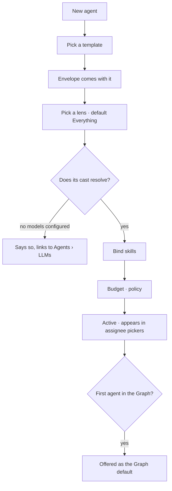

# Author an agent

Every agent in the Graph, what it carries, and what it is doing right now. Authoring one is picking a
template, picking the lens it works in, offering it skills, and setting what it may spend.

**An agent binds no provider.** It carries three bounds — an **envelope** (what it may do), a
**budget** (what it may spend) and a **lens** (what it may see, use and send). The lens's `cast`
names the model and the Graph resolves the credential from the provider row the address names
([PM1](providers-and-models.md) · [GV10](../../govern/spec.md)).

| | |
|---|---|
| Index | [5.2](../../../README.md#5--agents) · Slice **S12c** |
| Module | [Agents](../spec.md) |
| API / CLI / Studio | ✅ / — / ✅ |
| Related | [envelope-and-budget](envelope-and-budget.md) · [lifecycle](lifecycle.md) · [bindings](../../skills/features/bindings.md) |

> **As** someone running work through agents, **I want** to see them all with what each can do, **so
> that** assigning a task is a choice and not a guess.

## Capabilities

| # | Capability | Notes |
|---|---|---|
| C1 | Author an agent from a template | The template brings an envelope; there is no unbounded agent |
| C2 | Pick the lens it works in | The third bound. Null reads *Everything*, inside the guardrails — never a blank |
| C3 | Offer it skills | From the Graph's set, by binding |
| C4 | Set budget and policy | What it may spend, and what happens at the ceiling |
| C5 | One Graph default | The agent a session or a task uses when none is named |
| C6 | Kinds are visible | Authored · seeded · spawned, each with its own row treatment |
| C7 | Current state at a glance | Active · paused · retired, with what it is running |
| C8 | Filter by kind, status, ephemeral | The list stays readable as it grows |
| C9 | Read its cast, resolved | `role → model address → why this one`, read **through** the lens, not stored on the agent |
| C10 | Spend against its ceiling, on the row | `$1.84 of $40.00 this month` — before the ceiling is reached, not after |
| C11 | See how the bounds nest | `effective = agent ∩ plan ∩ todo`, stated on the panel so a refusal is predictable |

## Journey

## Seams

| Seam | What the user sees |
|---|---|
| No provider configured at all | Named, with the link to `Agents › LLMs`; the agent saves and says its cast resolves to nothing |
| Its lens's cast names a deleted model | Blocked **before the run starts**, naming the model and the world |
| Its lens is deleted | Refused — `agents.lens_id` is `ON DELETE RESTRICT`, the same seam as a schedule's ([WO6](../../govern/features/worlds.md)) |
| A bound skill deleted | The binding drops; the agent keeps working |
| Retiring the Graph default | Refused until another is made default |
| A spawned agent in the list | Nested under its parent, marked ephemeral |
| Name already used | Refused, naming the existing agent |
| Budget approaching its ceiling | The meter on the row, before it is reached |

## Surfaces

| Surface | Shape | Components |
|---|---|---|
| `Agents` drawer | One list; `+` in the header; each row's actions on the row. A row carries its kind, its **lens chip** and its **spend meter** | `Item` · `AgentChip` · **`LensChip`** · `MetricTile` with `meter` |
| Agent panel | *The three bounds* — envelope · budget · lens — then the cast, then *where this agent has been*; actions in the content | `SectionHeader` · `PropertyList` · **`CastTable`** · **`BoundChip`** |
| *Bounds nest* | `agent ∩ plan ∩ todo` stated as three rows, so a refusal is predictable before it happens | `PropertyList` |
| Assignee picker | Staffed agents first, then the rest | `RichSelect` |

Components in **bold** do not exist yet and are built in `design-kit` first, with a story —
[building-studio/govern-and-agents-panels.md § 3](../../../building-studio/govern-and-agents-panels.md).

## Engine

Full schema: [building-engine/govern-and-agents-data-model.md](../../../building-engine/govern-and-agents-data-model.md).

| Thing | Shape |
|---|---|
| `agents` | `graph_id` · `name` · `description` · `kind` · `status` · `lifetime` · `parent_agent_id?` · `spawned_in_run_id?` · `instructions` · `budget` · `policy` · **`lens_id`** |
| **Dropped** | `llm_config_id` — an agent binds no provider ([PM1](providers-and-models.md)) |
| `lens_id` | FK `lenses` **`ON DELETE RESTRICT`**, nullable. Null = *Everything*, inside the guardrails |
| The cast | read **through** `lens_id`, never stored on the agent. Resolution: [govern § 2](../../govern/spec.md) |
| Spend this month | `SUM(task_runs.cost_usd)` over the **calendar month**, on `ix_task_runs_agent_started` — not a counter column. It reads as `AgentListResponse.spend_this_month`, a `{agent_id: usd}` sidecar: one grouped read for the whole list, and an agent with no **priced** run is absent rather than zero ([AG11](#decisions)) |
| Default | one per Graph, enforced |
| Routes | `…/agents*` · `POST …/graphs/{id}/default-agent` |
| The bound, over HTTP | `AgentRead.lens_id` + **`lens_name`**; `AgentCreate.lens_id`; `AgentUpdate.lens_id`, read by *set-ness* — null is *Everything*, chosen |
| In force | the agent's world is a contributor to `freeze_lens` on every run it opens, beside the guardrails ([GV6](../../govern/spec.md)) |
| Events | `agent.create` · `agent.update` · `agent.set_default` · **`agent.lens_set`** |

## Decisions

| # | Decision |
|---|---|
| AG1 | Every agent is authored from a template, and every template carries an envelope. |
| AG2 | **An agent carries three bounds and no provider: an envelope, a budget and a lens.** The lens's `cast` names the model; the Graph resolves the credential from the provider row the address names. What an agent may call is a **lens rule**, like every other layer — not a foreign key on the agent ([PM1](providers-and-models.md) · [GV10](../../govern/spec.md)). |
| AG3 | One default agent per Graph, always set. |
| AG4 | Skills reach an agent only through a binding. |
| AG5 | **A missing lens reads *Everything*, never blank.** *Nothing set* and *nothing permitted* must never look alike ([GR6](../../govern/features/guardrails.md)), and the widest state is still inside the Graph's guardrails. |
| AG6 | **The three bounds are read together, on one panel.** They are what a refusal will name, so reading them apart is reading two-thirds of the reason a run was turned away. |
| AG7 | **A bound that is not composed is not a bound.** The agent's world goes into the effective lens of every run it opens, whether or not the asker picked one — for the same reason the guardrails do. A world that held only on the runs somebody remembered to pick it for would narrow nothing, and a child inherits it ([DG9](delegation.md)), so the narrowing travels down the tree with no second mechanism. |
| AG8 | **The name rides with the id.** `AgentRead` carries `lens_name` beside `lens_id`, because the row draws a chip and a list that has to resolve four ids to four names draws none of them. |
| AG9 | **On update, omitted and null are different things.** Null is *put this agent back in Everything* — a bound somebody chose — so the write is read by set-ness, and an edit to a description can never widen an agent on the way past. Moving it emits `agent.lens_set` of its own: widening is the line of the audit somebody comes looking for. |
| AG11 | **On the meter, absent is not zero.** An agent whose runs carry no `cost_usd` is left out of `spend_this_month` entirely, and the row says nothing rather than `$0.00`: a subscription endpoint is not metered per token, so *nothing spent* and *nothing known* are different facts ([OB4](../../operate/features/observability.md)). The window is the calendar month, because that is the one `max_cost_usd_month` names — a rolling thirty days would draw a different number from the ceiling beside it. |
| AG10 | **A guardrail is refused as an agent's bound.** It is already in force on every run this agent opens ([GR1](../../govern/features/guardrails.md)), so binding one here would read as a second bound that changes nothing. The refusal names the guardrail and says to pick a world. |
| AG12 | **The word is *agents*, and *roster* is retired.** A drawer is named for the rows it holds, and the rows are agents — the same rule that makes `Projects` › `Projects` and `Skills` › `Skills` read straight ([G33](../../../building-studio/graph-detail-page.md)). *Roster* named the table an agent lands in, and a table's name is not what a person reads, so it is gone from the label, from the drawer id (`?drawer=agents`), from this file's own slug, and from the engine and Studio comments that carried it. An old `?drawer=roster` link still lands here: an unknown drawer falls to the first one, and this is the first one. Where *roster* meant the skills an agent carries, the word is **bindings** ([BN8](../../skills/features/bindings.md)) — one word was doing two jobs. |

## Not building

| Not building | Because |
|---|---|
| Agent personas or avatars | an agent is a bounded principal, not a character |
| Cloning an agent with its history | authoring from the same template is the honest path |
| Cross-Graph agents | the Graph is the reasoning boundary |
