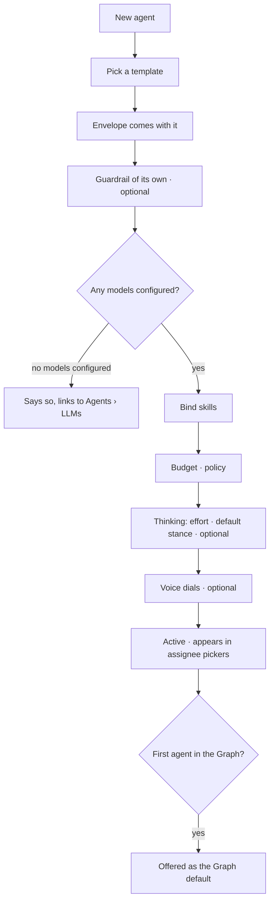

# Author an agent

Every agent in the Graph, what it carries, and what it is doing right now. Authoring one is picking a
template, offering it skills, setting its standing limits, and — if anyone wants to — its thinking
and its voice.

**An agent binds no provider and no world.** It carries **standing limits** — an **envelope** (what it
may run), **effort**, a **budget** and **reach** — and optionally a **guardrail** of its own. The world
— what a piece of work may see, use and send, whose `cast` names the model — comes with the work: the
session, the Todo, the schedule ([AG24](#decisions) · [PM1](providers-and-models.md) ·
[GV10](../../govern/spec.md)).

| | |
|---|---|
| Index | [5.2](../../../README.md#5--agents) · Slice **S12c** |
| Module | [Agents](../spec.md) |
| API / CLI / Studio | ✅ / — / ✅ |
| Related | [envelope-and-budget](envelope-and-budget.md) · [lifecycle](lifecycle.md) · [bindings](../../skills/features/bindings.md) |

> **As** someone running work through agents, **I want** to see them all with what each can do, **so
> that** assigning a task is a choice and not a guess.

## Capabilities

| # | Capability | Notes |
|---|---|---|
| C1 | Author an agent from a template | The template brings an envelope; there is no unbounded agent |
| C2 | Give it a guardrail of its own | Optional. A restriction that holds whoever asks — *nothing leaves*. A guardrail scoped `agent:<id>` ([AG10](#decisions)) |
| C3 | Offer it skills | From the Graph's set, by binding |
| C4 | Set budget and policy | What it may spend, and what happens at the ceiling |
| C5 | One Graph default | The agent a session or a task uses when none is named |
| C6 | Kinds are visible | Authored · seeded · spawned, each with its own row treatment |
| C7 | Current state at a glance | Active · paused · retired, with what it is running |
| C8 | Filter by kind, status, ephemeral | The list stays readable as it grows |
| C9 | Read the cast a run would use | `role → model address → why this one`, resolved from the work's world, the guardrails' casts and the shipped default — never stored on the agent |
| C10 | Spend against its ceiling, on the row | `$1.84 of $40.00 this month` — before the ceiling is reached, not after |
| C11 | See how the bounds nest | `effective = agent ∩ plan ∩ todo`, stated on the panel so a refusal is predictable |
| C12 | **What this agent can do, as two linked tables** | Its **skills** (how it approaches work) and its **callables** (what its envelope lets it run), each row naming the other — [below](#what-this-agent-can-do) |
| C14 | **How it thinks: effort and a default stance** | Two settings, not one — *how much* it tries and *which way*. Neither is the soul — [below](#how-it-thinks) |
| C13 | **Voice dials** | Humour · formality · emoji · greeting, picked from a list rather than written out. Part of the [soul](soul.md): they reach the same steps and no others — [below](#voice-dials) |

## Journey

```mermaid
flowchart TD
    A[New agent] --> B[Pick a template]
    B --> C[Envelope comes with it]
    C --> D[Guardrail of its own · optional]
    D --> E{Any models configured?}
    E -->|no models configured| F[Says so, links to Agents › LLMs]
    E -->|yes| G[Bind skills]
    G --> H[Budget · policy]
    H --> TH[Thinking: effort · default stance · optional]
    TH --> V[Voice dials · optional]
    V --> I[Active · appears in assignee pickers]
    I --> J{First agent in the Graph?}
    J -->|yes| K[Offered as the Graph default]
```

## What this agent can do

An agent is customised for a purpose by four levers, and none of them is a new object: a **template**
(the starting envelope), the **skills** bound to it, the **callables** its envelope allows, and the
**world** it works in. The agent panel draws the middle two as one section, because they depend on
each other — a skill's plan names callables, and a skill whose plan needs a callable the envelope
lacks cannot do its job ([BN5](../../skills/features/bindings.md#decisions)).

**Skills — how it approaches work**

| Column | Holds |
|---|---|
| Skill | name, linked to the skill |
| Version | the current one — a binding does not pin ([BN6](../../skills/features/bindings.md#decisions)) |
| When to use | the skill's trigger, as written |
| Needs | the callables the current version's plan names, `uses` inlined — derived, never typed ([AG15](#decisions)) |
| Offered / applied | from [usage](../../skills/features/usage.md), per version; *too few to read* below the threshold |

**Callables — what it may run (the envelope)**

| Column | Holds |
|---|---|
| Callable | `step_key` from the catalogue — `run_query` · `search_web` · `fetch_source` · `delegate` … |
| Bound | the one bound it spends, as a `BoundChip` |
| Pinned arguments | the arguments fixed for this agent, or `—` ([envelope § A pinned argument](envelope-and-budget.md#a-pinned-argument)) |
| Needed by | the bound skills whose plan names it, and the base plans the Graph runs asks with |

| Reading | What the user sees |
|---|---|
| A skill needs a callable the envelope lacks | The **Needs** cell marks it, naming the callable — before any run is refused |
| A callable nothing needs | **Needed by** reads *nothing bound* — allowed, and a candidate for tightening ([EB5](envelope-and-budget.md#decisions)) |
| No skills bound | The skills table says the agent runs on the Graph's base plans alone |

## How it thinks

Two settings shape how an agent works a question, and they vary independently: **effort** is how
much it does ([EB9](envelope-and-budget.md#decisions)), a **stance** is which way it goes about it
([act as](../../ask/features/act-as.md)). A low / medium / high knob can say *tries harder*; it
cannot say *questions its premises* against *acts on the likely reading* ([AG21](#decisions)).

| | **Low effort** — `max_clarifications 1` · `max_replans 0` | **High effort** — `max_clarifications 5` · `max_replans 3` |
|---|---|---|
| **First-principles stance** | breaks the ask into its claims and questions the premises, but gets one question and one pass — the rest become declared assumptions | breaks it down, asks until each premise is settled, replans when evidence contradicts one |
| **Decisive stance** | takes the likely reading and answers in one pass | still acts without asking, but replans and verifies more before it commits |

| Setting | Decides | Where it bites |
|---|---|---|
| `effort.max_clarifications` | the **ceiling** — how many questions it *may* ask | `understand`, enforced |
| The stance | **whether an ambiguity is worth a question at all** — and the method, stated as assumptions | `understand` · `plan` · `project` · the ledger in `verify` ([act as § 2](../../ask/features/act-as.md#2-where-a-stance-bites--and-where-it-must-be-inert)) |

A stance is needed only when the **method** differs. Two agents that differ only in *asks a lot* and
*never asks* differ in effort alone.

### A worked pair

| Layer | **Questioner** | **Decider** |
|---|---|---|
| Effort | `max_clarifications 5` · `max_replans 3` · `max_steps 32` | `max_clarifications 0` · `max_replans 1` · `max_steps 12` |
| Default stance | *First principles* — reduce the ask to the claims it rests on; question each premise; ask when two readings reach different records | *Decisive* — take the most likely reading, declare it as an assumption, act; ask only when a wrong reading would change the records |
| Soul · dials | curious, probing · `humour: off` | crisp, confident · `formality: casual` |
| Instructions | the domain it works in — the same for both | |

The Decider never guesses silently: with `max_clarifications 0`, every reading it picks is a declared
assumption in the ledger, shown before the answer ([AA4](../../ask/features/act-as.md#decisions)).

## Voice dials

Four settings a person picks rather than writes. They are the [soul](soul.md) in structured form:
they reach only the steps whose words a person reads, and they cannot change a query, a plan, a lens or
a refusal ([SO2](soul.md#decisions)).

| Dial | Values | Default — Invana's voice |
|---|---|---|
| `humour` | `off` · `light` · `playful` | `light` |
| `formality` | `casual` · `neutral` · `formal` | `neutral` |
| `emoji` | `off` · `on` | `off` |
| `greeting` | `off` · `on` | `off` |

Anything the dials cannot say — *end with a crop pun*, *call the reader "farmer friend"* — is written in
the soul's Markdown, which is read after the dials and wins where they disagree ([AG16](#decisions)).

## Seams

| Seam | What the user sees |
|---|---|
| No provider configured at all | Named, with the link to `Agents › LLMs`; the agent saves and says its cast resolves to nothing |
| A run's cast names a deleted model | Blocked **before the run starts**, naming the model and the world or guardrail that cast it |
| Its guardrail is deleted | The restriction lifts from the next run; deleting a guardrail needs the guardrail permission ([GR5](../../govern/features/guardrails.md)) |
| A bound skill deleted | The binding drops; the agent keeps working |
| Retiring the Graph default | Refused until another is made default |
| A spawned agent in the list | Nested under its parent, marked ephemeral |
| Name already used | Refused, naming the existing agent |
| Budget approaching its ceiling | The meter on the row, before it is reached |
| A bound skill needs a callable the envelope lacks | Marked on the skill's row, naming the callable, with *Edit envelope* |
| A refusal, an error, a budget pause | Spoken with `humour` at `off`, whatever the dial says ([AG17](#decisions)) |
| No dial touched | The defaults — Invana's voice; the tab says so, like an empty soul does |
| No default stance | *No stance* on the page — the un-stanced path, exactly as today ([AA7](../../ask/features/act-as.md#decisions)) |
| The asker picks another stance, or none | That run uses it; the agent's default is untouched ([AA9](../../ask/features/act-as.md#decisions)) |
| Its default stance is deleted | Refused — `agents.stance_id` is `ON DELETE RESTRICT`, naming the agents, like a lens ([AG20](#decisions)) |

## Surfaces

| Surface | Shape | Components |
|---|---|---|
| `Agents` drawer | One list; `+` in the header; each row's actions on the row. A row carries its kind, a shield when it has a guardrail of its own, and its **spend meter** | `Item` · `AgentChip` · `MetricTile` with `meter` |
| Agent page | One page, five tabs ([AG23](#decisions)): **Overview** (who · focus · thinking · always in force · policy · skills) · **Skills & callables** · **Thinking** · **Soul** · **Activity** (meters with the limits that cap them). Pause and Retire in the header; a tab that edits puts Discard · Save there | `Tabs` · `SectionHeader` · `PropertyList` · **`CastTable`** · **`BoundChip`** |
| *Bounds nest* | `agent ∩ work ∩ guardrails` stated as three rows, so a refusal is predictable before it happens | `PropertyList` |
| *What this agent can do* | The two tables, skills above callables, on the *Skills & callables* tab | `SectionHeader` · `DataTable` · `BoundChip` |
| *Thinking* | The effort numbers and the default stance, together on the *Thinking* tab — the stance by name, with its assumptions one click away | `PropertyList` · `RichSelect` |
| Voice dials | A row of four controls above the soul editor, on the **Soul** tab; a change redraws the preview ([SO7](soul.md#decisions)) | `SegmentedControl` · `PropertyList` |
| Assignee picker | Staffed agents first, then the rest | `RichSelect` |

Components in **bold** do not exist yet and are built in `design-kit` first, with a story —
[building-studio/govern-and-agents-panels.md § 3](../../../building-studio/govern-and-agents-panels.md).

## Engine

Full schema: [building-engine/govern-and-agents-data-model.md](../../../building-engine/govern-and-agents-data-model.md).

| Thing | Shape |
|---|---|
| `agents` | `graph_id` · `name` · `description` · `kind` · `status` · `lifetime` · `parent_agent_id?` · `spawned_in_run_id?` · `instructions` · **`soul`** · **`soul_traits`** · `budget` · **`effort`** · **`stance_id`** · `policy` |
| `stance_id` | FK `stances` **`ON DELETE RESTRICT`**, nullable. Null = no default stance. Read at run open like the lens; the run records `task_runs.stance_id` · `stance_version` whichever way it was chosen |
| `soul_traits` | `JSON`, default `{}`. Keys `humour` · `formality` · `emoji` · `greeting`, each one of the values above; a missing key is its default. An unknown key or value is refused at write, naming it |
| Voice in the prompt | `render_traits(soul_traits)` then `soul or DEFAULT_VOICE`, prepended to the same steps as the soul ([soul § Engine](soul.md#engine)); `RunVars.soul` carries both |
| What it can do, over HTTP | `GET …/agents/{id}/skills-and-callables` → `{skills: [{skill_id, version, when_to_use, needs: [step_key], offered, applied}], callables: [{step_key, bound, pinned, needed_by: [skill_id \| plan_ref]}]}` — one read for both tables |
| **Dropped** | `llm_config_id` — an agent binds no provider ([PM1](providers-and-models.md)) |
| Its guardrail | a `lenses` row, `kind = guardrail`, `scope = agent:<id>` — Govern's table, Govern's routes ([GR5](../../govern/features/guardrails.md)). The agent holds no pointer to it |
| The cast | resolved per run from the effective lens — the work's world, then the guardrails' casts, then the shipped default. Resolution: [govern § 2](../../govern/spec.md) |
| Spend this month | `SUM(task_runs.cost_usd)` over the **calendar month**, on `ix_task_runs_agent_started` — not a counter column. It reads as `AgentListResponse.spend_this_month`, a `{agent_id: usd}` sidecar: one grouped read for the whole list, and an agent with no **priced** run is absent rather than zero ([AG11](#decisions)) |
| Default | one per Graph, enforced |
| Routes | `…/agents*` · `POST …/graphs/{id}/default-agent` |
| Over HTTP | `AgentRead.guardrail_id` + `guardrail_name`, read from `lenses` by scope, so the row draws its shield without a second fetch |
| In force | the agent's guardrail is a contributor to `freeze_lens` on every run it opens, beside the Graph's ([AG7](#decisions) · [GV6](../../govern/spec.md)) |
| Events | `agent.create` · `agent.update` · `agent.set_default` · `agent.soul_set` (the dials included) · `agent.stance_set` |

## Decisions

| # | Decision |
|---|---|
| AG1 | Every agent is authored from a template, and every template carries an envelope. |
| AG2 | **An agent binds no provider and no world.** It carries **standing limits** — an envelope, effort, a budget, reach — and optionally a guardrail of its own. What a run may see, use and send, and the `cast` that names its models, come with the work that starts it ([AG24](#decisions) · [PM1](providers-and-models.md) · [GV10](../../govern/spec.md)). |
| AG3 | One default agent per Graph, always set. |
| AG4 | Skills reach an agent only through a binding. |
| AG5 | **Work that names no world runs in *Everything*, never in a blank.** *Nothing set* and *nothing permitted* must never look alike ([GR6](../../govern/features/guardrails.md)), and the widest state is still inside the guardrails — the Graph's and the agent's own. |
| AG6 | **A refusal names which side bound it** — the agent's standing limits, the work's world, or a guardrail. Effective bounds are the three intersected, so a refusal that named only the result would not say whom to ask. |
| AG7 | **A standing restriction is composed into every run the agent opens, whoever starts it.** The agent's guardrail joins the Graph's in `freeze_lens` on a session's ask, a Todo, a schedule and a delegated child alike — a restriction that held only when somebody remembered it would restrict nothing. |
| AG11 | **On the meter, absent is not zero.** An agent whose runs carry no `cost_usd` is left out of `spend_this_month` entirely, and the row says nothing rather than `$0.00`: a subscription endpoint is not metered per token, so *nothing spent* and *nothing known* are different facts ([OB4](../../operate/features/observability.md)). The window is the calendar month, because that is the one `max_cost_usd_month` names — a rolling thirty days would draw a different number from the ceiling beside it. |
| AG10 | **An agent's own restriction is a guardrail scoped to it, never a world.** `lenses.kind = guardrail`, `scope = agent:<id>`, edited on the agent's Overview by a member who may edit guardrails ([GR5](../../govern/features/guardrails.md)). A world is picked by the work, and binding one to an agent would make the same Analyst unable to look at the US for the next question. |
| AG12 | **The word is *agents*, and *roster* is retired.** A drawer is named for the rows it holds, and the rows are agents — the same rule that makes `Projects` › `Projects` and `Skills` › `Skills` read straight ([G33](../../../building-studio/graph-detail-page.md)). *Roster* named the table an agent lands in, and a table's name is not what a person reads, so it is gone from the label, from the drawer id (`?drawer=agents`), from this file's own slug, and from the engine and Studio comments that carried it. An old `?drawer=roster` link still lands here: an unknown drawer falls to the first one, and this is the first one. Where *roster* meant the skills an agent carries, the word is **bindings** ([BN8](../../skills/features/bindings.md)) — one word was doing two jobs. |
| AG13 | **An agent's `instructions` reach its prompts, after the Graph's.** Understand and Translate read `graphs.instructions` and then the agent's own, so one agent can be told *EU carriers only* without the Graph being told. Who the agent *is* is its [soul](soul.md), a separate field that never reaches Translate ([SO5](soul.md#decisions)). |

| AG14 | **What an agent may run is a callable, and the word is *callable*.** The envelope's allowed set is callables from the catalogue ([terminology](../../../terminology.md)); *capability* stays the name of a feature file's section, so one word does not do two jobs. |
| AG15 | **A skill's needs are derived from its plan, never declared beside it.** Every skill version has exactly one plan ([SK13](../../skills/features/authoring-a-skill.md#decisions)), and that plan already names its callables; a hand-typed list would drift from it on the next publish. |
| AG16 | **Voice dials are the soul in structured form, stored beside it.** `soul_traits` reaches exactly the steps `soul` reaches, is versioned with the agent, and is read before the Markdown so a sentence can override a dial. They are not a second persona and not a stance — a dial changes wording only. |
| AG17 | **Humour is off wherever something went wrong.** A refusal, a cannot-answer, an error and a budget pause are spoken with `humour: off`, whatever the dial says — a joke next to *I can't answer that* reads as not taking the reader seriously ([SO4](soul.md#decisions)). |
| AG18 | **No length dial.** How long an answer runs is the answer's shape ([3.12](../../ask/features/the-answer-in-words.md)), not the agent's character. |
| AG19 | **A template brings an envelope and suggests skills; it binds none.** A template that bound skills would have to track their versions and would bind them without the bind-time check. Its suggested skills are offered in the bind picker, first. |
| AG20 | **An agent may carry a default stance.** Its author picks it; the asker can swap it or clear it for one run. The stance stays a method with declared assumptions — carried by an agent, it acquires none of the agent's bounds ([AA1](../../ask/features/act-as.md#decisions)). |
| AG21 | **Effort and stance are two settings, because they vary independently.** Effort is how much, enforced; a stance is which way, visible in the plan and the ledger. Collapsing them into one low / medium / high knob would lose the four cells of the table above. |
| AG23 | **The agent is one page with five tabs: Overview · Skills & callables · Thinking · Soul · Activity.** *Overview* reads the agent whole and carries its guardrail and its two policy switches; *Skills & callables* is what it can do; *Thinking* is focus, effort and the default stance; *Soul* is its voice; *Activity* is what it has done, with the spend, concurrency and delegation limits set beside the meters they cap. There is no Bounds tab — the world comes with the work ([AG24](#decisions)), and every standing limit sits where it is read. Lineage is a section of Activity. Drawn on [The Agent Page](https://claude.ai/artifact/1wpT5nPzJ9QKCFrtK16Lza). |
| AG24 | **Bounds come in two kinds: standing, on the agent, and situational, on the work.** Standing limits answer *what may this agent ever do, whoever asks* — callables, effort, spend per month, runs at once, delegation, its own guardrail. Situational bounds answer *what may this piece of work see and spend* — the world and the spend per run — and come from what opens the run: a session, a Todo, a schedule, a parent run. Standing limits stay on the agent because much of the work has no person in it; a schedule at 02:00 and a Coordinator's child still run inside them ([EB1](envelope-and-budget.md#decisions)). |
| AG25 | **The run freezes the bounds, and its tasks read the frozen copy.** At open, `freeze_lens` composes the work's world, the agent's standing limits and every guardrail into one effective lens and budget on the run; each task reads that, never the session live, and a delegated child inherits it and may only narrow. Changing a session's world mid-run changes the next run, not this one. |
| AG26 | **An agent has no world column; its narrowing is its guardrail.** The migration gives each agent that carried a world an agent-scoped guardrail with that world's rules and cast, so nothing an agent could reach widens on the way. |
| AG22 | **There is no persona section in `instructions`.** Instructions reach Understand and Translate and miss Plan and Verify, so a thinking style written there shapes the query and not the method, and nothing checks it did anything. Thinking is effort plus a stance; voice is the soul; focus is instructions. |

## Not building

| Not building | Because |
|---|---|
| Agent avatars | an agent's character is its [soul](soul.md) — how it writes, not a face |
| Cloning an agent with its history | authoring from the same template is the honest path |
| Per-user voice dials | the agent is the same colleague for everyone who asks it ([soul § Not building](soul.md#not-building)) |
| Free-form dials | a dial that takes any value is the soul's Markdown with a worse editor |
| Cross-Graph agents | the Graph is the reasoning boundary |
