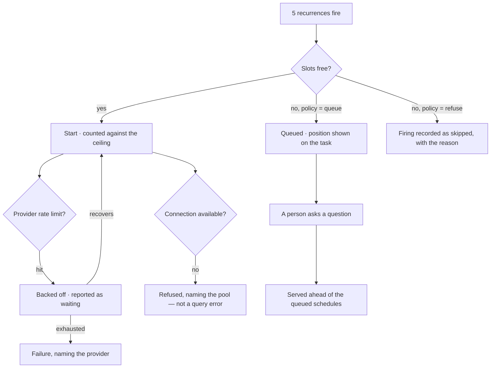

# How many run at once

How many agents may be working at once in a Graph, and what happens when they want the same things.
The outermost bound in the same family as an envelope and a budget — one level up, and per Graph.

| | |
|---|---|
| Index | [5.7](../../../README.md#5--agents) · Slice **S12e** |
| Module | [Agents](../spec.md) |
| API / CLI / Studio | ✅ / — / ✅ |
| Related | [envelope-and-budget](envelope-and-budget.md) · [delegation](delegation.md) · [schedules](../../operate/features/schedules.md) · [runtime-and-adapters](../../ask/features/runtime-and-adapters.md) |

> **As** someone with five recurrences firing at 08:00, **I want** the Graph to run what it can and
> say what is waiting, **so that** Monday morning is a queue I can read rather than a rate-limit
> error and an empty database connection pool.

## The problem it answers

A budget bounds one agent. Nothing bounds the Graph. Ten agents, each inside its own ceiling, are
still ten concurrent query loads, ten claims on one provider's rate limit, and ten connections from a
pool that has fewer.

## Capabilities

| # | Capability | Notes |
|---|---|---|
| C1 | A ceiling on simultaneous task_runs, per Graph | Configured, with a default that suits one machine |
| C2 | A policy at the ceiling | `queue` · `refuse` — stated on the Graph, not guessed per caller |
| C3 | A person outranks a schedule | An ad-hoc question is served before a scheduled run waiting for the same slot |
| C4 | Delegated children consume slots | A parent's fan-out already bounds them; the Graph ceiling bounds the total |
| C5 | Queued runs say so | Position and what they are waiting behind — never a silent pause |
| C6 | Provider rate limits are a bound, not a failure | Backed off and reported as waiting; a failure only when the wait is exhausted |
| C7 | The database pool is a real limit | A run refused for want of a connection says that, naming the pool |
| C8 | Contention is visible | What is running, what is queued, and why, on the Graph |

## Journey — Monday at 08:00

## Seams

| Seam | What the user sees |
|---|---|
| Everything queued | The Graph says how many are running and what is waiting; no task looks stalled |
| A queued task cancelled | Leaves the queue; the others move up |
| Ceiling lowered while runs are in flight | Running work finishes; nothing new starts until the count is under |
| A delegation that would exceed the ceiling | Refused like any other bound, naming the ceiling and the parent |
| One agent starving the Graph | Visible in what is running; the fix is that agent's budget, not a hidden fair-share rule |

## Surfaces

| Surface | Shape |
|---|---|
| Graph settings | The ceiling and its policy, beside the connection — **and the pools beneath them**, busy or quiet, because contention has to be visible where the number that causes it is set (C8). `agents/PoolsTable.tsx`, rendered by `ConcurrencyFields`; A5 is not a page of its own |
| The Graph's activity | Running · queued · waiting on a provider, with counts |
| A queued task | Its position and what it waits behind |

## Engine

| Thing | Shape |
|---|---|
| Ceiling | `graphs.max_concurrent_runs` + `graphs.concurrency_policy` — **both already exist** |
| Pools | `graphs.pools` JSON — `{"llm": 20, "graphdb": 50, "heavy": 4}`. New ([data model § 5.3](../../../building-engine/govern-and-agents-data-model.md)) |
| Accounting | a slot per run, including delegated children. **A lane takes a pool slot, not a step** |
| The live queue | **not stored** ([CC7](#decisions)) — `GET …/u/{username}/{graphSlug}/contention` reads the runtime process and returns what is running, what is queued, each waiter's position and why, plus every **configured** pool with its `size` and `in_use` |
| Precedence | user-triggered before schedule-triggered; otherwise first in, first served |
| Backpressure | provider rate limits and connection-pool exhaustion reported as bounds |
| Events | `run.queued · started · refused_ceiling · waiting_on_provider` |

### Every ceiling in force, in one place

| Ceiling | Default | What it protects |
|---|---|---|
| Graph · max concurrent runs | `4` | the contended thing is the deployment |
| Agent · `max_concurrent_runs` | `3` | per agent, across every run it is working |
| Pool · `llm` | `20` | a lane takes a slot, not a step |
| Pool · `graphdb` | `50` | the connection pool, named when it refuses |
| Pool · `heavy` | `4` | graph algorithms — CPU and memory bound |

**A waiting run is not a running run.** It holds no slot, draws no pool capacity and costs nothing —
so a queue is a queue, not a fleet of processes parked on a machine.

## Decisions

| # | Decision |
|---|---|
| CC1 | The ceiling is per Graph. A per-agent budget bounds spend, not simultaneity. |
| CC2 | The policy at the ceiling is stated on the Graph: queue, or refuse with a reason. |
| CC3 | A person's question is served before a scheduled run. |
| CC4 | Delegated children consume slots. |
| CC5 | Queued and rate-limited are visible states, never silent pauses. |
| CC6 | A refusal names the bound: the ceiling, the provider, or the pool. |
| CC7 | The queue lives in the process that owns the runtime, not in a table. A restart fails what was mid-flight and drops what was waiting — the same story in-flight runs already have, rather than a second, quieter one. |
| CC8 | **Pools are named and configured on the Graph, and a refusal names the pool.** `llm` · `graphdb` · `heavy` — three, because they are three different scarce things and a single number would have to be the smallest of them. A run refused for want of a connection says *the `graphdb` pool*, never *a query error*. |
| CC9 | **A queued run states why it is where it is**, not just its position — *a person is waiting*, *delegated — counts as a slot*, *schedule*. A number with no reason is a number nobody can argue with, and CC3's precedence is exactly the thing people will want to check. |
| CC10 | **Delegation never manufactures capacity.** A child draws on the same Graph ceiling and the same pools as its parent. Spawning three children to get three more slots is the loophole this rule exists to close. |
| CC11 | **An agent at its own ceiling is refused, never queued** — and checked *before* the Graph's, so it is told about its own bound rather than waiting behind one it was never going to reach. `queue` · `refuse` is a policy stated on the Graph about the **Graph's** ceiling (CC2); an agent has no such column, and a second queue with its own precedence would make *why am I waiting* two answers instead of one. |
| CC12 | **A pool slot is held across one crossing, not one run**, and taken *after* the lens has spoken. A run waiting five seconds on a model must not also hold a database connection it is not using, and a call this world refuses must not first consume a slot somebody else could have used. Given back when the crossing closes, and swept when the run settles — a crossing that raises between its two halves would leak one, and a pool that only ever shrinks is worse than no pool at all. |
| CC13 | **A configured pool is listed whether or not it is busy.** `GET …/graphs/{id}/concurrency` returns every pool the Graph configures with its size and what is in it — a pool that appeared only once it was full would make *is this Graph stalled on connections?* unanswerable in exactly the case where the answer is *no*. |
| CC8 | The ceiling is a group in the Graph's settings form, with the live counts under the fields. Contention is set and read in one place, because a number you cannot see the effect of is a number nobody tunes. |
| CC9 | The default is **4 at once, queue**. It suits one machine, which is what a default is for. |

## Not building

| Not building | Because |
|---|---|
| Per-agent priority weights | a weight nobody can explain produces an order nobody can predict |
| Preemption of a running run | a half-run agent leaves work no one can account for |
| Fair-share scheduling across agents | that is an orchestrator's job, and the adapter is where an orchestrator plugs in |
| A per-project ceiling | the Graph is the boundary that owns the database connection |
