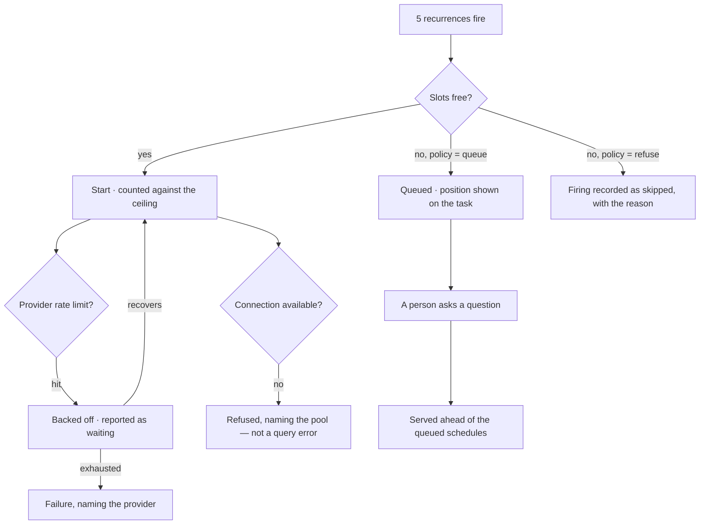

# How many run at once

How many agents may be working at once in a Graph, and what happens when they want the same things.
The outermost bound in the same family as an envelope and a budget — one level up, and per Graph.

| | |
|---|---|
| Index | [5.7](../../../README.md#5--agents) · Slice **S12e** |
| Module | [Agents](../spec.md) |
| API / CLI / Studio | ✅ / — / ✅ |
| Related | [envelope-and-budget](envelope-and-budget.md) · [delegation](delegation.md) · [schedules](../../operate/features/schedules.md) · [runtime-and-adapters](../../ask/features/runtime-and-adapters.md) |

> **As** someone with five recurrences firing at 08:00, **I want** the Graph to run what it can and
> say what is waiting, **so that** Monday morning is a queue I can read rather than a rate-limit
> error and an empty database connection pool.

## The problem it answers

A budget bounds one agent. Nothing bounds the Graph. Ten agents, each inside its own ceiling, are
still ten concurrent query loads, ten claims on one provider's rate limit, and ten connections from a
pool that has fewer.

## Capabilities

| # | Capability | Notes |
|---|---|---|
| C1 | A ceiling on simultaneous task_runs, per Graph | Configured, with a default that suits one machine |
| C2 | A policy at the ceiling | `queue` · `refuse` — stated on the Graph, not guessed per caller |
| C3 | A person outranks a schedule | An ad-hoc question is served before a scheduled run waiting for the same slot |
| C4 | Delegated children consume slots | A parent's fan-out already bounds them; the Graph ceiling bounds the total |
| C5 | Queued runs say so | Position and what they are waiting behind — never a silent pause |
| C6 | Provider rate limits are a bound, not a failure | Backed off and reported as waiting; a failure only when the wait is exhausted |
| C7 | The database pool is a real limit | A run refused for want of a connection says that, naming the pool |
| C8 | Contention is visible | What is running, what is queued, and why, on the Graph |

## Journey — Monday at 08:00

## Seams

| Seam | What the user sees |
|---|---|
| Everything queued | The Graph says how many are running and what is waiting; no task looks stalled |
| A queued task cancelled | Leaves the queue; the others move up |
| Ceiling lowered while runs are in flight | Running work finishes; nothing new starts until the count is under |
| A delegation that would exceed the ceiling | Refused like any other bound, naming the ceiling and the parent |
| One agent starving the Graph | Visible in what is running; the fix is that agent's budget, not a hidden fair-share rule |

## Surfaces

| Surface | Shape |
|---|---|
| Graph settings | The ceiling and its policy, beside the connection |
| The Graph's activity | Running · queued · waiting on a provider, with counts |
| A queued task | Its position and what it waits behind |

## Engine

| Thing | Shape |
|---|---|
| Ceiling | per Graph: maximum simultaneous task_runs, with a policy at the limit |
| Accounting | a slot per run, including delegated children |
| Precedence | user-triggered before schedule-triggered; otherwise first in, first served |
| Backpressure | provider rate limits and connection-pool exhaustion reported as bounds |
| Events | `run.queued · started · refused_ceiling · waiting_on_provider` |

## Decisions

| # | Decision |
|---|---|
| CC1 | The ceiling is per Graph. A per-agent budget bounds spend, not simultaneity. |
| CC2 | The policy at the ceiling is stated on the Graph: queue, or refuse with a reason. |
| CC3 | A person's question is served before a scheduled run. |
| CC4 | Delegated children consume slots. |
| CC5 | Queued and rate-limited are visible states, never silent pauses. |
| CC6 | A refusal names the bound: the ceiling, the provider, or the pool. |
| CC7 | The queue lives in the process that owns the runtime, not in a table. A restart fails what was mid-flight and drops what was waiting — the same story in-flight runs already have, rather than a second, quieter one. |
| CC8 | The ceiling is a group in the Graph's settings form, with the live counts under the fields. Contention is set and read in one place, because a number you cannot see the effect of is a number nobody tunes. |
| CC9 | The default is **4 at once, queue**. It suits one machine, which is what a default is for. |

## Not building

| Not building | Because |
|---|---|
| Per-agent priority weights | a weight nobody can explain produces an order nobody can predict |
| Preemption of a running run | a half-run agent leaves work no one can account for |
| Fair-share scheduling across agents | that is an orchestrator's job, and the adapter is where an orchestrator plugs in |
| A per-project ceiling | the Graph is the boundary that owns the database connection |
