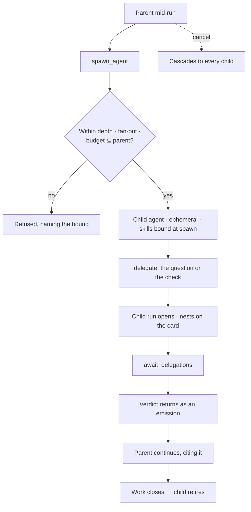

# Delegation

An agent may spawn an agent and hand it work — bounded by depth, fan-out, and a budget that is a
subset of its own. The child's run nests inside the parent's.

> ⚠ **Rewritten for [orchestration § 0](../../../orchestration.md#0-the-records)** — `Todo` · `TaskPlan` ·
> `Task` · `TaskRun` · `Lens`. The words *Thought*, *Thinking* and *Step-as-a-record* are retired, and
> **`Task` now names a node inside a plan**, never a thing a user authored. Migration:
> [task-model-migration.md](../../../building-engine/task-model-migration.md).

| | |
|---|---|
| Index | [5.4](../../../README.md#5--agents) · Slice **S12d** |
| Module | [Agents](../spec.md) |
| API / CLI / Studio | ✅ / — / ✅ |
| Related | [envelope-and-budget](envelope-and-budget.md) · [lineage](lineage.md) · [lifecycle](lifecycle.md) |

> **As** an analyst agent about to recommend something, **I want** a second agent to check it under
> its own skills, **so that** the recommendation carries a verdict rather than my own confidence.

## Capabilities

| # | Capability | Notes |
|---|---|---|
| C1 | `spawn_agent` as an envelope-gated step | Not a background capability — a step in the plan |
| C2 | `delegate` and `await_delegations` | Hand over work, then wait for the verdicts |
| C3 | Bounded three ways | Depth, fan-out, and budget ⊆ the parent's |
| C4 | Ephemeral by default | The child retires when the work closes; the row stays |
| C5 | The child's steps nest | On the card and in the trace, under the step that spawned it |
| C6 | The verdict returns as an emission | Not as prose in the parent's answer |
| C7 | Cancellation cascades | Cancelling the parent cancels the children |
| C8 | `create_task` is separate | Delegation is within a run; creating a task is work for later |

## Journey

## Seams

| Seam | What the user sees |
|---|---|
| Fan-out exceeded | Refused at the third spawn, naming the bound and the count |
| Child fails | Its failure is the parent's evidence, not a silent gap |
| Child asks a clarification | It surfaces on the parent's task, attributed to the child |
| Parent finishes first | `await_delegations` is what prevents it; without that step the plan is refused |
| Budget exhausted in a child | The child stops; the parent sees the reason |

## Surfaces

| Surface | Shape |
|---|---|
| Task card | Child steps nested under the spawning step, collapsed by default |
| Trace | The child's full trace, expandable in place |
| Lineage canvas | Who spawned whom, on which run |

## Engine

| Thing | Shape |
|---|---|
| Steps | `spawn_agent · delegate · await_delegations`, all envelope-gated |
| Child agent | `parent_agent_id` · `spawned_in_run_id` · `lifetime = ephemeral` |
| Nesting | `parent_run_id` on the child's run |
| Events | `agent.spawned · delegated · delegation_returned · retired` |

## Decisions

| # | Decision |
|---|---|
| DG1 | Spawning and delegating are steps, gated by the envelope. |
| DG2 | Depth, fan-out and budget bound every delegation; a child's budget is a subset. |
| DG3 | Children are ephemeral by default and retire with the work. |
| DG4 | A verdict returns as an emission, and the parent cites it. |
| DG5 | Cancellation cascades. |
| DG6 | Exactly one seeded agent may delegate — **Coordinator** — and it is not the Graph default. Delegation is the expensive shape (one question becoming four), so allowing it is a choice somebody makes, not the state everything starts in. |
| DG7 | Its bounds ship with it: depth 2, three children per run, and every child's allow-list, skills, budget and LLM ⊆ its parent's. Enforced by the interpreter, never by the prompt. |
| DG8 | A child's trace nests **inside the parent's**, under the step that spawned it, collapsed and loaded on open. The parent's run is the subject; the child is a detail of one of its steps. |
| DG9 | **A child inherits its parent's lens**, and that is how *LLM ⊆ its parent's* ([DG7](#decisions)) survives the provider split. An agent binds no provider ([PM1](providers-and-models.md)), so there is no model column to copy down: what the parent thinks with is what its lens casts, and the child carries the same `lens_id`. It is also the narrowing a child was always owed — a spawned agent that inherited an envelope and a budget but not a world would have been *wider* than the agent that spawned it, in the one dimension nobody was checking. |
| DG10 | **`can_rebind_llm` is retired.** It named a column that no longer exists. Giving a child a different model is giving it a different lens, which is the same act as every other narrowing and goes through `lens_id` — one mechanism, and one place a reviewer reads to learn what a child may think with. |

## Not building

| Not building | Because |
|---|---|
| Agents spawning across Graphs | the Graph is the reasoning boundary |
| Persistent children by default | an agent that outlives its reason accumulates silently |
| Peer-to-peer messaging between agents | delegation is a step with a verdict, not a chat |
