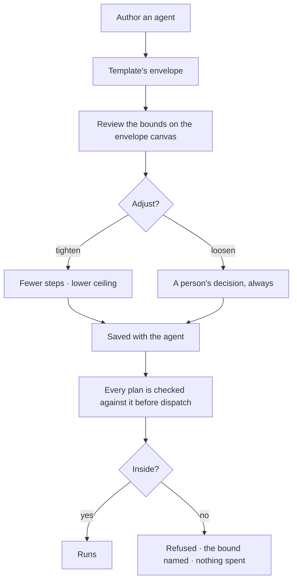

# Set what an agent may run

What an agent may run, with what arguments, at what cost. Static, authored, and checked **before**
anything is dispatched — so a plan outside the bounds costs nothing.

| | |
|---|---|
| Index | [5.3](../../../README.md#5--agents) · Slice **S12c** |
| Module | [Agents](../spec.md) |
| API / CLI / Studio | ✅ / — / ✅ |
| Related | [envelope-validation](../../workflows/features/envelope-validation.md) (the check) · [delegation](delegation.md) |

> **As** someone letting an agent act, **I want** hard limits it cannot argue with, **so that** I can
> let it run without watching it.

## Capabilities

| # | Capability | Notes |
|---|---|---|
| C1 | Allowed steps | An explicit set; anything else is refused |
| C2 | Pinned arguments | A step may be allowed only with certain arguments fixed |
| C3 | Cost ceiling | Per run, and per window |
| C4 | Depth and fan-out | How deep delegation may go and how wide |
| C5 | Policy at the ceiling | Stop · ask · block — stated, not implicit |
| C6 | Envelopes come from templates | Authoring picks one; editing is deliberate |
| C7 | Drawn as a canvas | `kind = envelope` — the bounds are readable, not a JSON blob |
| C8 | Tightening is proposable, loosening is not | An agent may propose narrowing its own bounds only |

## Journey

## Seams

| Seam | What the user sees |
|---|---|
| Budget approaching | Shown on the agent before it is reached, not after |
| Budget exhausted mid-run | Policy decides: stop with a diagnosis, or ask a person |
| A step removed from the envelope | Plans that used it refuse from the next run; running ones finish |
| A spawned child | Its budget is a subset of the parent's, computed at spawn |
| Empty allowed set | Refused at save — an agent that may run nothing is a mistake, not a config |

## Surfaces

| Surface | Shape |
|---|---|
| Agent panel → Envelope | The bounds as a section; the canvas for the full picture |
| Envelope canvas | Steps allowed, arguments pinned, ceilings — drawn |
| Budget strip | Spend against ceiling, per window |

## Engine

| Thing | Shape |
|---|---|
| Envelope | on the agent: allowed step keys, pinned arguments, ceilings, depth, fan-out |
| Budget | per-run and per-window ceilings, with the policy at each |
| Validation | performed by [envelope-validation](../../workflows/features/envelope-validation.md) before dispatch |
| Events | `agent.envelope_updated · budget_updated · budget_exhausted` |

## Decisions

| # | Decision |
|---|---|
| EB1 | There is no unbounded agent. |
| EB2 | The envelope is static and checked before dispatch, never during. |
| EB3 | A refusal names the bound: the step, the argument, or the ceiling. |
| EB4 | A child's budget is a subset of its parent's. |
| EB5 | An agent may propose tightening its own bounds, never loosening them. |

## Not building

| Not building | Because |
|---|---|
| Runtime negotiation of bounds | a bound that can be argued with is not one |
| Per-task envelopes | the agent carries the bounds; the task carries the goal |
| Soft warnings instead of refusals | a warning at dispatch time has already spent the money |
