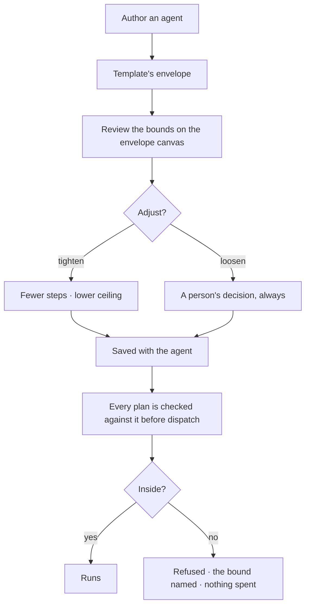

# Set what an agent may run

What an agent may run, with what arguments, at what cost. Static, authored, and checked **before**
anything is dispatched — so a plan outside the bounds costs nothing.

| | |
|---|---|
| Index | [5.3](../../../README.md#5--agents) · Slice **S12c** |
| Module | [Agents](../spec.md) |
| API / CLI / Studio | 🟡 / — / 🟡 |
| Related | [envelope-validation](../../workflows/features/envelope-validation.md) (the check) · [delegation](delegation.md) |

> **As** someone letting an agent act, **I want** hard limits it cannot argue with, **so that** I can
> let it run without watching it.

## Capabilities

| # | Capability | Notes |
|---|---|---|
| C1 | Allowed steps | An explicit set; anything else is refused |
| C2 | Pinned arguments | A step may be allowed only with certain arguments fixed |
| C3 | Cost ceiling | Per run, and per window |
| C3a | **Effort** | How hard it tries before it stops — steps, replans, clarifications. A bound of its own, not money and not character ([EB9](#decisions)) |
| C4 | Depth and fan-out | How deep delegation may go and how wide |
| C5 | Policy at the ceiling | Stop · ask · block — stated, not implicit |
| C6 | Envelopes come from templates | Authoring picks one; editing is deliberate |
| C7 | Drawn as a canvas | `kind = envelope` — the bounds are readable, not a JSON blob |
| C8 | Tightening is proposable, loosening is not | An agent may propose narrowing its own bounds only |

## Journey

```mermaid
flowchart TD
    A[Author an agent] --> B[Template's envelope]
    B --> C[Review the bounds on the envelope canvas]
    C --> D{Adjust?}
    D -->|tighten| E[Fewer steps · lower ceiling]
    D -->|loosen| F[A person's decision, always]
    E --> G[Saved with the agent]
    F --> G
    G --> H[Every plan is checked against it before dispatch]
    H --> I{Inside?}
    I -->|yes| J[Runs]
    I -->|no| K[Refused · the bound named · nothing spent]
```

## Seams

| Seam | What the user sees |
|---|---|
| Budget approaching | Shown on the agent before it is reached, not after |
| Budget exhausted mid-run | Policy decides: stop with a diagnosis, or ask a person |
| A step removed from the envelope | Plans that used it refuse from the next run; running ones finish |
| A spawned child | Its budget is a subset of the parent's, computed at spawn |
| Empty allowed set | Refused at save — an agent that may run nothing is a mistake, not a config |

## Surfaces

| Surface | Shape | Components |
|---|---|---|
| Agent page › *Skills & callables* › Callables | `6 of 25 callables`, each with its bound, its pinned arguments and what needs it; *Edit envelope* opens the allow-list against the whole catalogue, and pins, order and plans as JSON | `DataTable` · `BoundChip` |
| The picker | Grouped by bound, with what is already allowed checked | `DataTable` · `Checkbox` · `BoundChip` |
| Ceilings | value · what it bounds · **whether anything enforces it** (EB7), as tables by group — Budget and Reach on the agent's *Activity* tab beside the meters they cap, Effort on its *Thinking* tab ([AG23](author-an-agent.md#decisions)) — not a form of ten inputs. `agents/CeilingsTable.tsx`, one table per group — empty is *the default applies*, never zero, and an empty Effort cell shows the number a run reads ([EB12](#decisions)) | `DataTable` |
| Budget strip | Spend against ceiling, per window | `MetricTile` with `meter` |
| A refused plan | *`nl-sweep@2` names `delegate`, which Analyst's envelope does not carry* — with `Open the plan` and `Hand to Coordinator` | `CannotAnswerCard` |

## Engine

| Thing | Shape |
|---|---|
| Envelope | `agents.envelope` JSON: `allow` (callable keys) · `pins` · `plans` (the reusable plans a Plan step may pick) · `entry` · `steps` for a fixed-step agent. Versioned with the agent, never a table. The ceilings are not in it — they are `budget` and `effort` |
| Budget | per-run and per-window ceilings, with the policy at each |
| Effort | `agents.effort` JSON — `max_steps` · `max_replans` · `max_clarifications`; a missing key is the Graph's default. Moved out of both `workflow_spec` and `budget`, each read as a fallback for one release |
| Validation | performed by [envelope-validation](../../workflows/features/envelope-validation.md) before dispatch |
| Events | `agent.envelope_updated · budget_updated · effort_updated · budget_exhausted` |

### The ceilings, in full

Three groups, by what a number limits: **Budget** — what it may spend · **Effort** — how hard it tries
before it stops · **Reach** — how wide it may spread. Budget and Reach are `agents.budget` JSON; Effort
is `agents.effort` JSON ([EB9](#decisions)). [Data model § 5.1](../../../building-engine/govern-and-agents-data-model.md).

**Budget** — `agents.budget`

| Key | Value | What it bounds | Enforced |
|---|---|---|---|
| `max_cost_usd_month` | `$40.00` | the agent's own spend ceiling. **Renamed from `max_cost_usd`**; both read for one release ([EB8](#decisions)) | declared · drawn against |
| `max_cost_usd_run` | `$2.00` | per run. A plan may set less, never more | declared · drawn against ([EB7](#decisions)) |
| `max_tokens` | | per run | unchanged |

**Effort** — `agents.effort`

| Key | Value | What it bounds | Enforced |
|---|---|---|---|
| `max_steps` | `16` | steps in one plan | ✅ at validation |
| `max_replans` | `1` | a `verify` cannot loop forever | ✅ the interpreter |
| `max_clarifications` | `3` | per run — `understand` stops asking. **`0` means it never asks**: an ambiguity is resolved by a declared assumption, never a silent one ([AA4](../../ask/features/act-as.md#decisions)) | ✅ `understand` |

**Reach** — `agents.budget`

| Key | Value | What it bounds | Enforced |
|---|---|---|---|
| `max_fanout` | `200` lanes | a `map_over` beyond it is refused **at validation**, not mid-run | declared — nothing dispatches a fanned-out node yet |
| `max_concurrent_runs` | `3` | across every run this agent is working. The **Graph's** ceiling is separate ([concurrency](concurrency-and-contention.md)) | ✅ at admission, refused by name ([CC11](concurrency-and-contention.md)) |
| `max_children` · `max_depth` | `3` · `2` | delegation ([delegation](delegation.md)) | ✅ |

### A pinned argument

An allowed callable may be allowed **only with certain arguments fixed** — `judge` with `role`
pinned to `judge`, `create_task` with `project` pinned to `Intraday`. The pin is part of the
envelope, checked at dispatch against the plan, and it is why *what may this agent run* and *with
what* are one question and not two.

**The picker groups callables by their bound**, not alphabetically — the nine values of `BoundChip`
are a closed vocabulary, so *this agent may read the graph but not write it* is readable without
opening a row.

## Decisions

| # | Decision |
|---|---|
| EB1 | There is no unbounded agent. |
| EB2 | The envelope is static and checked before dispatch, never during. |
| EB3 | A refusal names the bound: the step, the argument, or the ceiling. |
| EB4 | A child's budget is a subset of its parent's. |
| EB5 | An agent may propose tightening its own bounds, never loosening them. |
| EB6 | **A ceiling the wire does not carry is one no screen can draw.** Every key of `effective_budget` rides `GET …/runs/{id}/trace`, not the two the first dashboard happened to need. |
| EB7 | **Declared is not the same as enforced, and the table says which.** `max_concurrent_runs` is enforced at admission and refuses naming the agent ([CC11](concurrency-and-contention.md)). `max_cost_usd_run` and `max_cost_usd_month` are declared and drawn against — stopping on a spend ceiling is EB2's *never during* and [orchestration § 0.10](../../../orchestration.md)'s budget approval. `max_fanout` is declared and unread until something dispatches a `map_over`. |
| EB10 | **The column is `envelope`, and its plan list is `plans`.** `workflow_spec` named a workflow where the thing is a bound, and `templates` named library plans with a word the product uses for projection templates. Both old names are read for one release, and the API answers both, so a reader that has not moved keeps working. |
| EB9 | **Effort is its own bound, neither budget nor character.** Steps, replans and clarifications are not money, so they do not sit under a word that means money; and they decide what runs, so they cannot sit in the [soul](soul.md), which only chooses words ([SO2](soul.md#decisions)). They read like temperament and are enforced like a ceiling — a soul can make an agent *sound* persistent, only Effort makes it retry. No preset: three numbers set once, read on the Ceilings table. |
| EB11 | **Effort is read by presence, from `effort` first, then `workflow_spec`, then `budget`.** `max_clarifications: 0` is an agent that never asks, never a fall-through to the default three. The migration copies each agent's numbers into `effort` without removing them, the seeded agents carry `effort` of their own, and a delegated child's effort is its parent's, narrowed key by key like its budget. |
| EB12 | **An empty effort cell shows what a run reads.** Its placeholder is `effective_effort` — the default, or a number still carried on `workflow_spec` or `budget` (EB11) — never a dash, so an agent that inherits `max_clarifications 3` does not read as unbounded and one that never asks reads `0`. |
| EB8 | **`max_cost_usd` is read as `max_cost_usd_month` for one release**, and answered back under its old name, so neither a row configured today nor a reader that has not moved yet loses its number on the rename. The release after this one drops both lines. |

## Not building

| Not building | Because |
|---|---|
| Runtime negotiation of bounds | a bound that can be argued with is not one |
| Per-task envelopes | the agent carries the bounds; the task carries the goal |
| Soft warnings instead of refusals | a warning at dispatch time has already spent the money |
