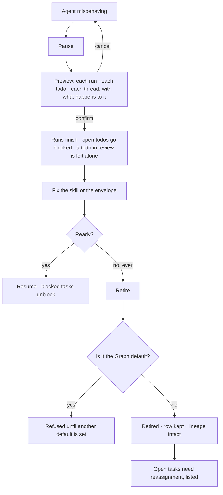

# Pause, resume, retire

Pause, resume, retire. Nothing is deleted — a retired agent's row stays so its lineage, its traces and
its work still resolve.

| | |
|---|---|
| Index | [5.5](../../../README.md#5--agents) · Slice **S12c** |
| Module | [Agents](../spec.md) |
| API / CLI / Studio | ✅ / — / ✅ |
| Related | [author-an-agent](author-an-agent.md) · [lineage](lineage.md) · [delegation](delegation.md) |

> **As** someone whose agent is behaving badly, **I want** to stop it now without losing what it did,
> **so that** I can fix the skill and turn it back on.

## Capabilities

| # | Capability | Notes |
|---|---|---|
| C1 | Pause | No new task_runs open; running ones finish |
| C2 | Resume | Picks up assignment again; nothing is replayed |
| C3 | Retire | Permanent; the agent is never assigned again |
| C4 | The row survives retirement | Lineage, traces and past work stay resolvable |
| C5 | Open work is shown before you act | **Both acts** — the same list, item by item, with the effect *that* act would have on each ([LC8](#decisions)) |
| C6 | Paused agents block their tasks | The task goes `blocked` with the agent named |
| C7 | Ephemeral agents retire themselves | When the work they were spawned for closes |
| C8 | The Graph default cannot be retired | Not until another is made default |

## Journey

## Seams

| Seam | What the user sees |
|---|---|
| Pausing mid-run | The run finishes; the next one does not start |
| Retiring with open tasks | The list, with reassign offered for each |
| A retired agent in a trace | Rendered normally, marked retired |
| Resuming after a long pause | No replay — assignments resume from now |
| An ephemeral child whose parent was cancelled | Retires with the cascade |

## Surfaces

| Surface | Shape | Components |
|---|---|---|
| Agent row | Status, and the actions on the row | `Item` · `StatusDot` |
| Agent panel | The action row in the content: `Save · Pause · Retire…` | `ButtonGroup` |
| Preview dialog | **What the act would do to its open work, item by item — never a count alone.** One dialog for both acts, titled by the act: each run in flight *finishes — never killed*; each open todo *blocked, with the agent named*; a todo **in review** *untouched* under a pause and *blocked* under a retire; each thread bound to the agent *refuses its next ask, naming the state*. The list is the same; the effects are what differ ([LC8 · LC9](#decisions)) | `AlertDialog` · `DataTable` |
| Pause, from the row or the footer | Opens the same dialog, never acting on the click. **Resume does not** — nothing it does needs previewing ([LC10](#decisions)) | `Button` · `AlertDialog` |

### The three states, stated

| State | Takes | In flight | Reversible |
|---|---|---|---|
| `running` | Todos, schedules, delegations | — | — |
| `paused` | nothing new | **finishes — never killed** | one click, and the reason is recorded |
| `retired` | nothing, ever | finishes | no. The row stays so every past run, trace and lineage edge resolves |

**A pause never kills work in flight.** Cancelling a run and pausing an agent are different acts with
different consequences, and a control that did both would be the wrong one to reach for at 3am.

**Retirement does not free the name.** A reused name makes two histories one.

## Engine

| Thing | Shape |
|---|---|
| `agents.status` | `active · paused · retired` |
| Assignment guard | a paused or retired agent cannot receive a new run — `require_available`, which is what makes a bound thread's next ask a 409 rather than a silent switch |
| Task effect | open tasks go `blocked` with the agent named. A pause leaves a task in **`review`** alone; a retire does not |
| In-flight runs | untouched by either act. A queued run still starts: pausing takes nothing **new**, and a run already queued is not new |
| `LifecyclePreview` | `{agent_id, act, items: [{kind, id, title, effect, note}]}` — one shape, two acts ([LC8](#decisions)). `kind` is `run · task · session`; `effect` is `finishes · blocked · unchanged · refused` ([LC9](#decisions)) |
| Routes | `POST …/agents/{id}/{pause,resume,retire}` · `GET …/agents/{id}/{pause,retire}` for the preview |
| Events | `agent.paused · resumed · retired` |

## Decisions

| # | Decision |
|---|---|
| LC1 | Retire never deletes. |
| LC2 | Pausing stops new runs and finishes current ones. |
| LC3 | A paused agent's tasks are blocked with the agent named, never silently stalled. |
| LC4 | The Graph default cannot be retired without a replacement. |
| LC5 | Ephemeral agents retire themselves when their work closes. |
| LC6 | **The pause preview names each piece of open work and what happens to it**, before the confirm. A count tells you how much you are about to disturb; it does not tell you whether the one that matters is a run that will finish or a schedule that will silently not fire. |
| LC7 | **Retiring does not free the name.** A reused name makes two agents' histories read as one, in every trace and every lineage edge that already resolved to it. |
| LC8 | **One preview, two acts.** `GET …/agents/{id}/pause` and `GET …/agents/{id}/retire` return the same `LifecyclePreview`, carrying the act it was asked for. Two shapes would describe one list of work in two vocabularies, and the reader comparing *pause* with *retire* would be comparing the wording rather than the consequence. What differs between the acts is the `effect` on each item — which is exactly what [LC6](#decisions) says a count cannot carry. |
| LC9 | **The effects are a closed vocabulary**, because a sentence per row is a sentence nobody can compare: `finishes` (a run in flight, under either act — nothing kills a run), `blocked` (an open todo, with the agent named in `blocked_reason`), `unchanged` (a todo in **review** under a pause — the one item the two acts disagree about, and the one a count could never show), `refused` (a thread bound to this agent: its next ask is a 409 naming the state, never a silent switch to another mind). |
| LC10 | **Pause asks before it acts, and resume does not.** Pause was one click on the row and one in the footer, and it blocks the same todos a retire blocks — a control that disturbs open work earns the same confirm as the one beside it. Resume takes nothing away, so it stays one click. |

## Not building

| Not building | Because |
|---|---|
| Deleting an agent | traces and lineage must resolve forever |
| Auto-pause on cost | the budget policy already decides what happens at a ceiling |
| Scheduled pause windows | a schedule that stops work is a policy engine |
