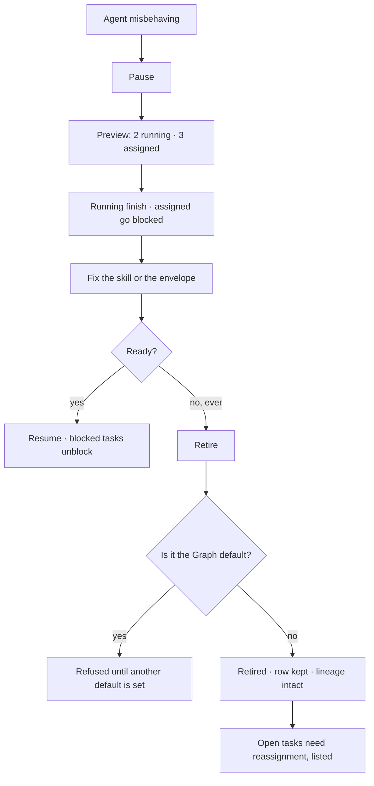

# Pause, resume, retire

Pause, resume, retire. Nothing is deleted — a retired agent's row stays so its lineage, its traces and
its work still resolve.

| | |
|---|---|
| Index | [5.5](../../../README.md#5--agents) · Slice **S12c** |
| Module | [Agents](../spec.md) |
| API / CLI / Studio | ✅ / — / ✅ |
| Related | [the-roster](the-roster.md) · [lineage](lineage.md) · [delegation](delegation.md) |

> **As** someone whose agent is behaving badly, **I want** to stop it now without losing what it did,
> **so that** I can fix the skill and turn it back on.

## Capabilities

| # | Capability | Notes |
|---|---|---|
| C1 | Pause | No new task_runs open; running ones finish |
| C2 | Resume | Picks up assignment again; nothing is replayed |
| C3 | Retire | Permanent; the agent is never assigned again |
| C4 | The row survives retirement | Lineage, traces and past work stay resolvable |
| C5 | Open work is shown before you act | How many tasks, and what happens to each |
| C6 | Paused agents block their tasks | The task goes `blocked` with the agent named |
| C7 | Ephemeral agents retire themselves | When the work they were spawned for closes |
| C8 | The Graph default cannot be retired | Not until another is made default |

## Journey

## Seams

| Seam | What the user sees |
|---|---|
| Pausing mid-run | The run finishes; the next one does not start |
| Retiring with open tasks | The list, with reassign offered for each |
| A retired agent in a trace | Rendered normally, marked retired |
| Resuming after a long pause | No replay — assignments resume from now |
| An ephemeral child whose parent was cancelled | Retires with the cascade |

## Surfaces

| Surface | Shape |
|---|---|
| Roster row | Status, and the actions on the row |
| Agent panel | The action row in the content: `Save · Pause · Retire…` |
| Preview dialog | What pausing or retiring will do, counted |

## Engine

| Thing | Shape |
|---|---|
| `agents.status` | `active · paused · retired` |
| Assignment guard | a paused or retired agent cannot receive a new run |
| Task effect | assigned tasks go `blocked` with the reason |
| Routes | `POST …/agents/{id}/{pause,resume,retire}` |
| Events | `agent.paused · resumed · retired` |

## Decisions

| # | Decision |
|---|---|
| LC1 | Retire never deletes. |
| LC2 | Pausing stops new runs and finishes current ones. |
| LC3 | A paused agent's tasks are blocked with the agent named, never silently stalled. |
| LC4 | The Graph default cannot be retired without a replacement. |
| LC5 | Ephemeral agents retire themselves when their work closes. |

## Not building

| Not building | Because |
|---|---|
| Deleting an agent | traces and lineage must resolve forever |
| Auto-pause on cost | the budget policy already decides what happens at a ceiling |
| Scheduled pause windows | a schedule that stops work is a policy engine |
