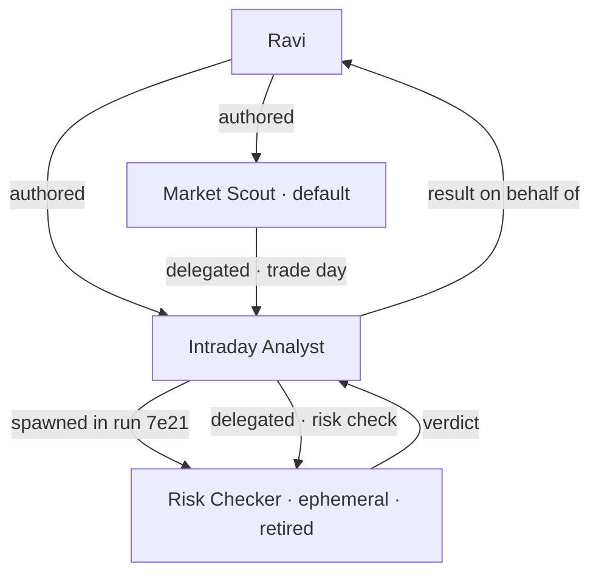

# Who spawned whom

Who authored whom, who spawned whom, and on which run. Drawn as a canvas, because the question is
structural: *where did this agent come from, and what did it do on whose behalf?*

| | |
|---|---|
| Index | [5.6](../../../README.md#5--agents) · Slice **S12c** |
| Module | [Agents](../spec.md) |
| API / CLI / Studio | ✅ / — / ✅ |
| Related | [delegation](delegation.md) · [audit-and-activity](../../operate/features/audit-and-activity.md) |

> **As** someone auditing a recommendation, **I want** to see which agent produced it and who created
> that agent, **so that** accountability has a chain rather than a name.

## Capabilities

| # | Capability | Notes |
|---|---|---|
| C1 | Authored edges | Person → agent, with when |
| C2 | Spawned edges | Agent → agent, with the run it happened in |
| C3 | Delegation edges | Which run handed work to which child |
| C4 | On-behalf-of is shown | An agent acting for a person is drawn as such |
| C5 | Retired agents stay drawn | Marked retired, never removed |
| C6 | Time-boxed | Last 7 days, 30 days, or all — lineage grows |
| C7 | Selecting a node states the fact | The panel: what it is, its bounds, what it ran |

## Journey

## Seams

| Seam | What the user sees |
|---|---|
| A very old graph | Time-boxed by default, with a control to widen |
| A retired agent | Drawn, marked, still selectable |
| An agent with no lineage | Authored directly — a root, drawn as one |
| Many ephemeral children | Collapsed under the parent with a count, expandable |

## Surfaces

| Surface | Shape |
|---|---|
| Lineage canvas | `kind = lineage`; the roster's main area |
| Panel | The selected agent: bounds, status, what it ran |
| Roster row | "spawned by X" as context on the row |

## Engine

| Thing | Shape |
|---|---|
| Edges | `parent_agent_id`, `spawned_in_run_id`, and delegation events |
| On-behalf-of | from the event record, not from the agent |
| Routes | `GET …/agents/lineage` with a window |

## Decisions

| # | Decision |
|---|---|
| LN1 | Lineage is drawn, not listed — the question is structural. |
| LN2 | Retirement keeps the node; lineage must always resolve. |
| LN3 | Spawn edges carry the run they happened in. |
| LN4 | On-behalf-of comes from the record, so it cannot be restated wrongly. |

## Not building

| Not building | Because |
|---|---|
| Editing lineage | it is derived from what happened |
| Cross-Graph lineage | agents do not cross the boundary |
| An org-chart view | lineage is causal, not hierarchical |
