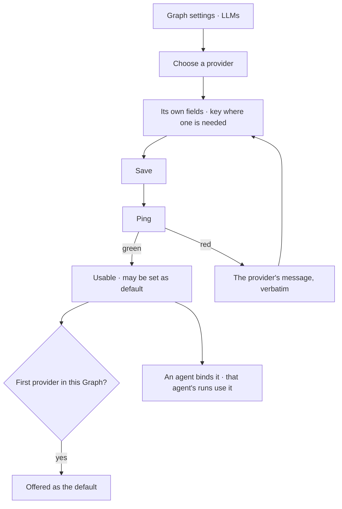

# Providers and models

An LLM endpoint configured per Graph — Anthropic, OpenAI, Google, Azure, Ollama, a local model, or the
Claude Agent SDK. An agent binds one; nothing else in the product picks a provider.

| | |
|---|---|
| Index | [5.1](../../../README.md#5--agents) · Slice **S5** |
| Module | [Agents](../spec.md) |
| API / CLI / Studio | ✅ / — / ✅ |
| Related | [the-roster](the-roster.md) · [envelope-and-budget](envelope-and-budget.md) |

> **As** someone setting a Graph up, **I want** to point it at the model I pay for and know the key
> works before anything depends on it, **so that** the first question does not fail on configuration.

## Capabilities

| # | Capability | Notes |
|---|---|---|
| C1 | Several providers per Graph | Anthropic · OpenAI · Google · Azure · Ollama · local · Claude Agent SDK |
| C2 | Provider-driven form | The fields follow the provider; nothing generic is asked for |
| C3 | Save first, then ping | Saving stores it; ping proves it, and shows green or red with the provider's own message |
| C4 | Keys are masked and encrypted | A blank field on edit means "keep", never "clear" |
| C5 | One default per Graph | Enforced; an agent without an explicit provider uses it |
| C6 | Credentials without a key | The Claude Agent SDK may use a local login rather than an API key |
| C7 | Hard delete, cascading from the Graph | No orphaned credentials |
| C8 | Bound by the **lens**, not the agent | An agent carries a lens whose `cast` maps a role to a model address; the composer never picks one ([GV10](../../govern/spec.md)) |

## Journey

## Seams

| Seam | What the user sees |
|---|---|
| Key rotated elsewhere | Ping fails with the provider's message; nothing silently degrades |
| Deleting the default | Refused until another is default, or the last one goes with its agents named |
| A local model not running | Ping fails naming the endpoint, not the credential |
| An agent whose provider was deleted | Blocked, naming the provider, before a run starts |
| Rate limited | Surfaced as a failure with the provider named — never a cannot-answer |

## Surfaces

| Surface | Shape |
|---|---|
| Agents › `LLMs` | The second drawer of the Agents stack. The trail — `LLM Providers`, `› Add`, `› <provider>` — is in the tab body; a row opens the provider, set-default and delete stay on it |
| Agents › `LLMs` drawer | The providers, their models, and which cast role names each ([GV18](../../govern/spec.md)) |
| Failure | The provider named in the diagnosis, with its own message |

## Engine

| Thing | Shape |
|---|---|
| `llm_providers` | `graph_id` · `name` (unique per Graph — it is the address segment, `llm/<name>/<model>`) · kind · endpoint · encrypted credentials. **No `is_default`** ([PM4](#decisions)) |
| Credential kinds | an API key, or a local login where the provider supports it |
| Routes | `…/llm*` · `POST …/llm/{id}/ping`. **No `set-default`** |
| Events | `llm_provider.created · updated · pinged · default_set · deleted` |

## Decisions

| # | Decision |
|---|---|
| PM1 | **A provider is configured per Graph, and the Graph resolves its credential.** An agent binds no provider: a plan names a **role**, the lens `cast` maps that role to an address, and the address names the configured provider row the key belongs to ([GV9 · GV10](../../govern/spec.md)). `agent.llm_provider_id` does not exist. An agent's ceiling on models is a **lens rule** — `deny llm/**` with the allows it is given — which is how every other layer is bounded. |
| PM2 | Save first, ping second — a provider is stored before it is proven. |
| PM3 | **The ping is a TaskRun.** `POST …/llm/{id}/ping` dispatches a one-callable plan over `test_connection` (bound `network`) rather than calling the provider inline ([orchestration § 4.1a](../../../orchestration.md#41a-nothing-executes-outside-the-runtime)). It costs a run row and buys the audit answer — *who proved this provider worked, when, and what did it say* — plus the same timeout, retry and refusal behaviour every other call gets. It is an **interactive run**: `trigger = system`, hidden from the journal by default ([§ 4.1b](../../../orchestration.md#41b-interactive-runs)). |
| PM3 | A blank credential on edit means unchanged. |
| PM4 | **There is no default provider.** `is_default` is dropped with its partial unique index: a default was only ever the answer to *which model when nobody said*, and the `cast` is that answer now — two mechanisms picking a model is the duplication [GV10](../../govern/spec.md) removes. A Graph with providers and no cast runs the **default cast that ships with the distribution**. |
| PM5 | A provider's own error message is shown verbatim, never reworded. |
| PM6 | **LLM Providers is the `LLMs` drawer of the Agents panel** ([GV18](../../govern/spec.md)) — a provider is what an agent's cast resolves against, so it is read where agents are. It was the `LLMs` tab of the settings panel ([G23 · G29](../../../building-studio/graph-detail-page.md)), not a rail icon of its own: a provider is the Graph's configuration the same way the connection is. It keeps its list → detail shape inside the tab — the breadcrumb (`LLM Providers › Add`, `› <provider>`) and **Add** sit in the tab body, since a panel has one tab strip and no second header under it. |
| PM7 | Add sits on the tab's own rule line, beside the sentence that governs the tab — never a full-size button stacked over the list it opens. |
| PM8 | A row opens the provider; set-default and delete stay on the row, revealed on hover. |

## Not building

| Not building | Because |
|---|---|
| A provider picker in the composer | the lens `cast` resolves the model; two places to choose is one too many |
| Automatic failover between providers | a silent switch changes what produced an answer |
| Usage quotas per provider | budgets belong to the agent, where they can be reasoned about |
| A default provider | the cast answers *which model*, and a second mechanism would disagree with it ([PM4](#decisions)) |
| Model catalogues fetched from the provider | a typed model name is enough, and does not break when a catalogue moves |
