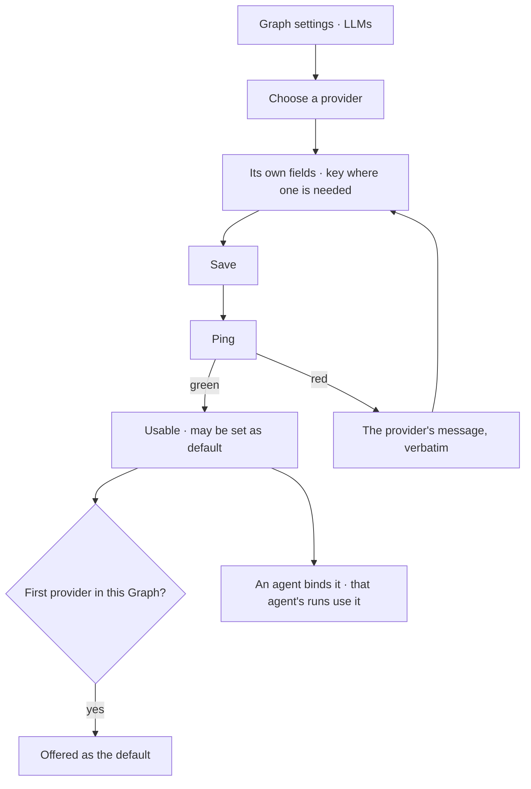

# Providers and models

An LLM endpoint configured per Graph — Anthropic, OpenAI, Google, Azure, Ollama, a local model, or the
Claude Agent SDK. **A provider row is a participant**, addressed `llm/<name>/<model>`, and it holds
the models it offers. Nothing binds one: a plan names a role, a lens's `cast` resolves it to an
address, and the address names the row whose credential is used.

| | |
|---|---|
| Index | [5.1](../../../README.md#5--agents) · Slice **S5** |
| Module | [Agents](../spec.md) |
| API / CLI / Studio | ✅ / — / ✅ |
| Related | [author-an-agent](author-an-agent.md) · [envelope-and-budget](envelope-and-budget.md) |

> **As** someone setting a Graph up, **I want** to point it at the model I pay for and know the key
> works before anything depends on it, **so that** the first question does not fail on configuration.

## Capabilities

| # | Capability | Notes |
|---|---|---|
| C1 | Several providers per Graph | Anthropic · OpenAI · Google · Azure · Ollama · local · Claude Agent SDK |
| C2 | Provider-driven form | The fields follow the provider; nothing generic is asked for |
| C3 | Save first, then ping | Saving stores it; ping proves it, and shows green or red with the provider's own message |
| C4 | Keys are masked and encrypted | A blank field on edit means "keep", never "clear" |
| C5 | **No default** | `is_default` is dropped ([PM4](#decisions)). A default was only ever the answer to *which model when nobody said*, and the cast is that answer now |
| C5a | A provider holds many models | One row = one configured endpoint + credential; its models are rows under it, and the model is the address's last segment |
| C5b | A model says who names it | *`claude-sonnet-5` — named by nothing, safe to remove.* Removing one a cast names is refused, naming the worlds |
| C6 | Credentials without a key | The Claude Agent SDK may use a local login rather than an API key |
| C7 | Hard delete, cascading from the Graph | No orphaned credentials |
| C8 | Bound by the **lens**, not the agent | An agent carries a lens whose `cast` maps a role to a model address; the composer never picks one ([GV10](../../govern/spec.md)) |

## Journey

## Seams

| Seam | What the user sees |
|---|---|
| Key rotated elsewhere | Ping fails with the provider's message; nothing silently degrades |
| Deleting the default | Refused until another is default, or the last one goes with its agents named |
| A local model not running | Ping fails naming the endpoint, not the credential |
| An agent whose provider was deleted | Blocked, naming the provider, before a run starts |
| Rate limited | Surfaced as a failure with the provider named — never a cannot-answer |
| **Renaming an endpoint** | Refused while a world or a guardrail names anything under it, and the refusal lists them ([PM18](#decisions)). The `name` *is* the address segment ([PM10](#decisions)), so a rename moves `llm/<name>/*` in one write — and a rule or a cast left naming the old address points at a participant that no longer exists. The edit form says so before the save: *renaming moves every address under this endpoint*. The recourse is to retune those worlds, or to configure a second endpoint under the new name |

## Surfaces

| Surface | Shape | Components |
|---|---|---|
| Agents › `LLMs` | The second drawer of the Agents stack. Each provider is a group; its models are the rows under it, each showing the cast role that names it | `Item` · `StatusDot` · **`AddressChip`** |
| A provider's detail | kind · endpoint · credential (*blank on edit means keep*) · **address prefix** `llm/anthropic-prod/*` · scope; `Ping` with its result | `RecordHeader` · `PropertyList` · `Field` · `PasswordInput` |
| *Who names it* | model → the cast roles and worlds that name it, or *named by nothing — safe to remove* | `DataTable` |
| Failure | The provider named in the diagnosis, with its own message | `DiagnosisCard` |

## Engine

Full schema and the backfill: [building-engine/govern-and-agents-data-model.md § 5.2](../../../building-engine/govern-and-agents-data-model.md).

| Thing | Shape |
|---|---|
| `llm_providers` | `graph_id` · **`name`** (unique per Graph — it is the address segment, `llm/<name>/<model>`, `^[a-z0-9][a-z0-9_-]*$` ([PM19](#decisions))) · `provider` · `base_url` · encrypted credentials · `last_ping_*`. **No `model_id`, no `is_default`** ([PM4](#decisions) · [PM9](#decisions)) |
| `llm_models` | `provider_id` · `model_id` (the vendor's id, and the address's last segment) · `display_name?` · `capabilities` · `pricing` · `status`. UNIQUE `(provider_id, model_id)` |
| `capabilities` | `{context_window, supports_tools, embedding, cost_rank, power_rank, local}` — what the **shipped default cast** resolves against when a Graph names no model ([PM12](#decisions)) |
| `LLMEndpoint` | A provider row **and one of its models**, resolved together. The unit every call in the engine takes, and the only thing that can answer *which model, on whose credential* ([PM13](#decisions)) |
| Credential kinds | an API key, or a local login where the provider supports it. One credential per provider row, which is what makes the address name the key ([GV9](../../govern/spec.md)) |
| Who names a model | a read over every `lenses.cast` in the Graph. `0` names ⟹ removable; `> 0` ⟹ refused, listing the worlds |
| Who names an **endpoint** | the same read, widened to `llm/<name>` and anything under it, and to a lens's `rules` as well as its `cast` — a pattern names no single address and would stop matching all the same. `> 0` ⟹ the rename is refused ([PM18](#decisions)) |
| Migration | `000000000053`, **breaking**: each existing row becomes one provider plus one model, and a Graph's old default seeds a `cast` so nothing silently changes which model answers |
| Routes | `PATCH …/llm/{id}` refuses a **rename** a named lens still names ([PM18](#decisions)) · `GET · POST · PATCH · DELETE …/llm-providers` · `GET · POST · DELETE …/llm-providers/{id}/models` · `POST …/llm-providers/{id}/ping`. **No `set-default`** |
| Events | `llm_provider.created · updated · pinged · deleted` · `llm_model.added · removed`. **`default_set` is retired** |

## Decisions

| # | Decision |
|---|---|
| PM1 | **A provider is configured per Graph, and the Graph resolves its credential.** An agent binds no provider: a plan names a **role**, the lens `cast` maps that role to an address, and the address names the configured provider row the key belongs to ([GV9 · GV10](../../govern/spec.md)). `agent.llm_provider_id` does not exist. An agent's ceiling on models is a **lens rule** — `deny llm/**` with the allows it is given — which is how every other layer is bounded. |
| PM2 | Save first, ping second — a provider is stored before it is proven. |
| PM3 | **The ping is a TaskRun.** `POST …/llm/{id}/ping` dispatches a one-callable plan over `test_connection` (bound `network`) rather than calling the provider inline ([orchestration § 4.1a](../../../orchestration.md#41a-nothing-executes-outside-the-runtime)). It costs a run row and buys the audit answer — *who proved this provider worked, when, and what did it say* — plus the same timeout, retry and refusal behaviour every other call gets. It is an **interactive run**: `trigger = system`, hidden from the journal by default ([§ 4.1b](../../../orchestration.md#41b-interactive-runs)). |
| PM3 | A blank credential on edit means unchanged. |
| PM4 | **There is no default provider.** `is_default` is dropped with its partial unique index: a default was only ever the answer to *which model when nobody said*, and the `cast` is that answer now — two mechanisms picking a model is the duplication [GV10](../../govern/spec.md) removes. A Graph with providers and no cast runs the **default cast that ships with the distribution**. |
| PM5 | A provider's own error message is shown verbatim, never reworded. |
| PM6 | **LLM Providers is the `LLMs` drawer of the Agents panel** ([GV18](../../govern/spec.md)) — a provider is what an agent's cast resolves against, so it is read where agents are. It was the `LLMs` tab of the settings panel ([G23 · G29](../../../building-studio/graph-detail-page.md)), not a rail icon of its own: a provider is the Graph's configuration the same way the connection is. It keeps its list → detail shape inside the tab — the breadcrumb (`LLM Providers › Add`, `› <provider>`) and **Add** sit in the tab body, since a panel has one tab strip and no second header under it. |
| PM7 | Add sits on the tab's own rule line, beside the sentence that governs the tab — never a full-size button stacked over the list it opens. |
| PM8 | A row opens the provider; delete stays on the row, revealed on hover. |
| PM9 | **A provider row is a configured endpoint, not a model.** `llm_providers` splits: the row holds the name, the kind and the one credential; `llm_models` holds what it offers. The address `llm/anthropic-prod/claude-opus-5` has a provider segment and a model segment, and one table cannot be both — which is also what lets `anthropic-prod` and `anthropic-research` be two participants with two keys ([GV9](../../govern/spec.md)). |
| PM10 | **The `name` is the address segment, and it is chosen by a person.** Not the vendor, not a uuid — `llm/anthropic-prod/*` is what a rule and a ledger line both carry, so it has to be a word somebody picked and can read back in a refusal. |
| PM11 | **Removing a model a cast names is refused, naming the worlds.** The same shape of refusal as everywhere else: the bound is named, and the recourse is to retune those worlds first. A model nothing names says so on the row, so the safe case is visibly safe. |
| PM12 | **`capabilities` carries what the resolver reads, and nothing it does not.** `{context_window, supports_tools, embedding, cost_rank, power_rank, local}` — the last three exist because `shipped_cast` is the only thing that reads the column and it asks *cheapest that can read*, *most capable*, *local where one exists*. A column holding only what a vendor states would leave the shipped cast re-deriving a ranking at resolve time, from a price list that is corrected by a release: the ranking would move under a Graph that changed nothing. Ranks are seeded from `apps/llm/pricing.py` at the backfill and are editable per row, because a Graph on a negotiated rate knows its own order. |
| PM13 | **The unit of a call is an endpoint, not a provider.** `LLMEndpoint` is a provider row plus exactly one of its models, resolved together and passed as one value. Nothing in the call path holds a bare `llm_providers` row after the split: the row alone cannot say which model, and a model alone cannot say on whose credential. It is what `llm/<provider name>/<model id>` names, so the address, the ledger line and the argument to the client are one thing in three notations. |
| PM14 | **The cast resolves the endpoint, at run open, once.** With `is_default` and `agents.llm_config_id` both gone, a run picks its model exactly one way: compose the effective lens, resolve the `decide` role against it, and look the address up in `llm_models`. Where the lens casts nothing, the **shipped cast** over the Graph's models answers; where the Graph has no models at all, it is the 422 that routes a person to `Agents › LLMs`. The resolution happens beside `freeze_lens` and is frozen with it, so *which model answered* is a fact about the run rather than a re-read of rows that have since moved ([GV8](../../govern/spec.md)). |
| PM15 | **A run carries `params.llm_model_id`.** The `llm_models` row resolves both address segments; the provider row id resolves neither. `llm_provider_id` is read for one release, resolving to that provider's first active model, so a queued run written before the split still dispatches — the same one-release dual read [PM4](#decisions)'s sibling decision gives `max_cost_usd`. |
| PM16 | **Setup's Answering gate waits on the endpoint the cast resolves**, not on a row flagged default. The gate asked *is the default provider proven* because the default was what an agent without one used; the cast is that now, so the gate resolves the shipped-or-cast `decide` endpoint and reads **that provider's** `last_ping_ok`. A Graph with three providers and a cast naming the unproven one is not ready, and a Graph with one unpinged spare is. |

| PM17 | **A model is ranked when it is offered, by the thing that reads the ranks.** `cost_rank` and `power_rank` are seeded from the published rate at add — the same derivation the backfill used — so a model offered today sorts against one backfilled yesterday rather than beside it at the middle. A Graph on a negotiated rate states its own and they are never derived over ([PM12](#decisions)); a model nobody publishes a rate for is neither cheap nor capable, and the middle is what says so. It happens in `LLMEndpointManager`, not on the provider row: `shipped_cast` is the ranks' only reader, so what a rank means belongs beside it. **A subscription endpoint ranks at the middle**, every model of it: a `claude setup-token` call is not metered per token, so there is no published rate to read and the middle is the honest answer — the same reason its touches carry no `cost_usd` ([OB4](../../operate/features/observability.md)). |
| PM18 | **Renaming an endpoint is refused while a lens names it, and the refusal names them.** The `name` is the address's middle segment ([PM10](#decisions)), so a rename moves every address under the endpoint at once — `llm/anthropic-prod/claude-opus-5` and the `deny llm/anthropic-prod/**` that bounds it both stop resolving, and a bound that matches nothing bounds nothing. It is [PM11](#decisions)'s question asked of the whole row, so it is answered the same way: the check reads every **named** lens in the Graph — its `cast` values and, structurally, every string in its `rules` — and refuses with the worlds listed. Migration `53` rewrote addresses once rather than allow the widening; rewriting on every rename would make a person's typo edit rules they did not open, and making `name` immutable would cost a typo a new endpoint. It lives in `LLMEndpointManager`, beside the removal it generalises. Nothing else on the row is addressed, so the credential, the base URL and the guardrails edit without a question. |
| PM19 | **The name accepts what the address grammar accepts.** `^[a-z0-9][a-z0-9_-]*$` — lowercase words, digits, hyphens and **underscores**. Migration `53` named every backfilled endpoint after its vendor kind, so `claude_agent_sdk` is a real name in a real Graph, and the address `llm/claude_agent_sdk/claude-opus-5` resolves and is written into rules. A stricter input pattern did not make that name illegal, it only made the row uneditable: the edit form sends `name` on every save, so changing the base URL of a backfilled endpoint was refused for the name it had just displayed. An address that exists has to be nameable. |
| PM20 | **A migration moves an address in whichever direction it is run.** `53` rewrites every rule and cast from the interim address to the real one on the way up, and back to the interim one on the way down — the second half because `name` goes with the column, so `llm/anthropic-2/**` stops resolving exactly as `llm/anthropic-3f9c2b17/**` did. Keeping the guardrail row while its addresses name nothing is not preserving the bound, it is removing it with the evidence left in place, which is the widening the up path exists to avoid. The down path is otherwise lossy and says so: a provider that grew a second model keeps its first, an endpoint offering nothing takes the empty string. Both directions run against a scratch database in `tests/golden/test_provider_split.py`, because a down path nobody has executed is a comment. |

## Not building

| Not building | Because |
|---|---|
| A provider picker in the composer | the lens `cast` resolves the model; two places to choose is one too many |
| Automatic failover between providers | a silent switch changes what produced an answer |
| Usage quotas per provider | budgets belong to the agent, where they can be reasoned about |
| A default provider | the cast answers *which model*, and a second mechanism would disagree with it ([PM4](#decisions)) |
| Model catalogues fetched from the provider | a typed model name is enough, and does not break when a catalogue moves |
