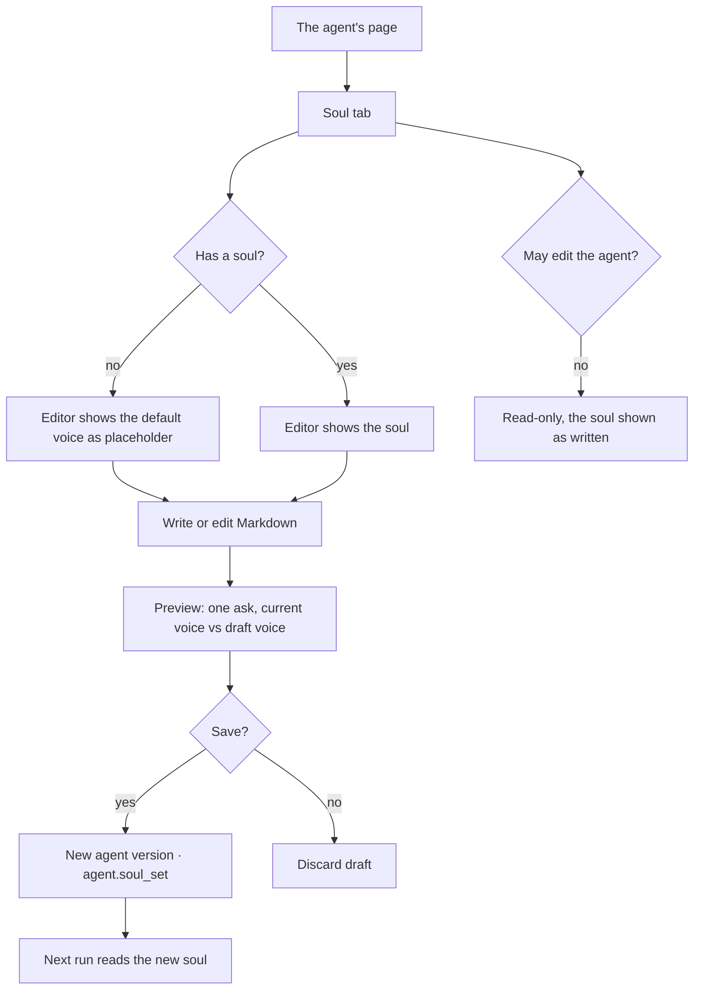

# Give an agent a soul

An agent's soul is who it is and how it speaks — a Markdown document on the agent, read by every step
whose words a person reads, and by none that decides what runs. Governance bounds what an agent may
do; the soul is why it does not sound like a robot while doing it.

| | |
|---|---|
| Index | [5.8](../../../README.md#5--agents) · Slice **S-TBD** |
| Module | [Agents](../spec.md) |
| API / CLI / Studio | 🔵 / — / 🔵 |
| Related | [author-an-agent](author-an-agent.md) · [the answer, in words](../../ask/features/the-answer-in-words.md) · [ask in natural language](../../ask/features/ask-in-natural-language.md) · [act as](../../ask/features/act-as.md) |

> **As** someone who works with an agent every day, **I want** it to have a character — warm, curious,
> a little funny if I want it to be — **so that** asking it things feels like talking to a colleague
> who knows the graph, not reading a diagnostic.

## Capabilities

| # | Capability | Notes |
|---|---|---|
| C1 | Write an agent's soul | Markdown on the agent: character, tone, what it enjoys, how it greets |
| C2 | A soul by default | An agent with no soul speaks in Invana's **default voice** — warm, plain, brief — never in a flat register |
| C3 | Voice, never power | The soul reaches only the steps whose output a person reads. It cannot change a query, a plan, a lens or a refusal |
| C4 | Versioned with the agent | Editing the soul is an agent edit: a new version, in the audit |
| C5 | Preview before saving | One sample reply in the draft voice, to the same ask, beside the current one |
| C6 | Instructions stay separate | `instructions` say *what* to do and reach Understand and Translate; the soul says *who* and never reaches Translate |

## What reads the soul

| Step | Reads the soul | Why |
|---|---|---|
| Understand — its `question`, `reason` and `converse` reply | ✅ | a person reads each |
| Answer ([3.12](../../ask/features/the-answer-in-words.md)) | ✅ | the prose emission is the reply |
| Plan | ✗ | what runs is not a matter of character |
| Translate · Validate · Execute | ✗ | a persona that can shape a query is a permission boundary with a personality ([AA3](../../ask/features/act-as.md#decisions)) |
| Verify · Project | ✗ | no model prose |

## Journey

## Seams

| Seam | What the user sees |
|---|---|
| No soul written | The default voice, named as such on the tab: *Speaking in Invana's default voice* |
| A soul asking for what governance forbids ("always search the web") | Saved — a soul is words, not permissions. The run still refuses what the lens refuses, in the soul's voice |
| A soul that would soften a refusal ("never say you can't") | The refusal still happens and still names what is missing ([CA3](../../ask/features/when-it-cannot-answer.md#decisions)); only its wording is the soul's |
| A very long soul | Allowed; the tab says what it costs in characters in every ask, like bindings do ([BN15](../../skills/features/bindings.md#decisions)) |
| A spawned child | Inherits its parent's soul unless the spawn names another |
| A run already in flight when the soul changes | Keeps the soul it opened with; the next run reads the new one |
| Member without edit rights | Reads the soul; no editor |

## Surfaces

| Surface | Shape | Components |
|---|---|---|
| The agent's page › **Soul** tab | A tab beside Overview · Envelope · Lineage: Markdown editor, default voice as placeholder, character count, *version · edited by* under it; Discard · Preview · Save soul in the page header | `@invana/ui` Markdown editor · `SectionHeader` · `Eyebrow` |
| Preview | The draft beside an editable sample ask, answered twice — current voice above, draft below | `EmissionCard` with a `prose` body, twice |
| Agents drawer row | Nothing new — a soul is not a status | — |

## Engine

| Thing | Shape |
|---|---|
| `agents.soul` | `Text`, default `""`. Empty means the default voice |
| Default voice | One constant in `apps/llm/voice.py`, owned by the product |
| Prompt assembly | `soul or DEFAULT_VOICE` is prepended to the system prompt of every step in *What reads the soul*; `RunVars.soul` carries it; Translate has no parameter for it |
| Agent instructions | `agents.instructions` layered after `graphs.instructions` into Understand and Translate |
| Versioning | An edit bumps `agents.version`; `task_runs.agent_version` records which soul a run spoke with |
| Routes | `AgentRead.soul` · `AgentUpdate.soul` (read by set-ness) · `POST …/agents/{id}/soul/preview` with `{soul, ask}` → the reply in the current and the draft voice |
| Events | `agent.soul_set` |

## Decisions

| # | Decision |
|---|---|
| SO1 | **A soul is a Markdown field on the agent, not a skill and not a stance.** A skill is offered where it is bound and reported as applied — character is neither optional nor a claim to cite. A stance is a method whose value is its declared assumptions ([AA5](../../ask/features/act-as.md#decisions)). The soul is who the agent is, so it lives on the agent. |
| SO2 | **The soul is structurally absent from Plan, Translate, Validate and Execute.** Not ignored there — not passed there. Governance bounds what runs; the soul only shapes the words a person reads, so no soul can reach a record the ask did not ask for. |
| SO3 | **An empty soul is the default voice, never no voice.** The default is warm, plain, brief, first person, and ends with something the reader can do next. *Nothing set* reads as Invana, not as a diagnostic. |
| SO4 | **A soul never changes what is true.** A refusal still refuses and names what is missing, a citation still cites, a third-party fact is still badged ([BG3](../../ask/features/beyond-the-graph.md#decisions)). The soul chooses the words around them. |
| SO5 | **`instructions` and `soul` are two fields because they reach different steps.** Instructions say what to do and reach Understand and Translate, layered after the Graph's own; the soul says who is speaking and reaches only prose. One field would carry a character into query writing. |
| SO6 | **A run speaks with the soul it opened with.** The soul is read at run open, like the lens ([GV26](../../govern/spec.md#4-cross-feature-decisions)); `agent_version` on the run says which. |
| SO7 | **The soul is a tab on the agent's page, not a field on its form.** It sits beside Overview · Envelope · Lineage because it is authored and versioned on its own, and a paragraph of Markdown does not fit a form row. The preview answers a sample ask the author can change, since a voice is judged on the questions this agent actually gets. |

## Not building

| Not building | Because |
|---|---|
| Avatars, names-as-characters, voice audio | the soul is how the agent writes; a face adds nothing a reader can check |
| A soul marketplace or shared soul library | a soul is part of one agent; copy the Markdown if two should sound alike |
| Per-user souls | the agent is the same colleague for everyone who asks it |
| A soul that grants or asks for permissions | permissions are the lens's, and only the lens's |
