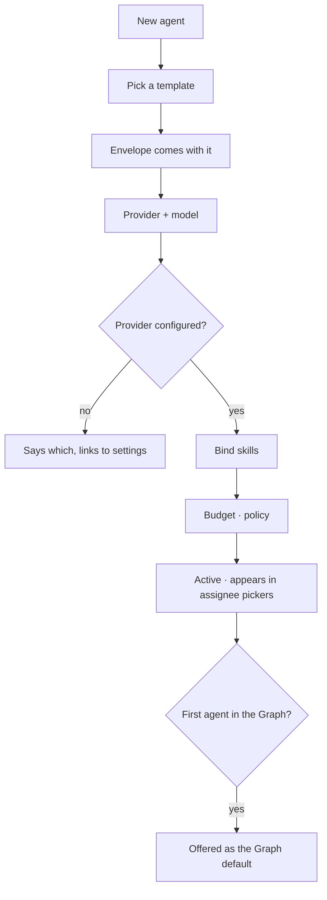

# Author an agent

Every agent in the Graph, what it carries, and what it is doing right now. Authoring one is picking a
template, binding a provider and model, offering it skills, and setting what it may spend.

| | |
|---|---|
| Index | [5.2](../../../README.md#5--agents) · Slice **S12c** |
| Module | [Agents](../spec.md) |
| API / CLI / Studio | ✅ / — / ✅ |
| Related | [envelope-and-budget](envelope-and-budget.md) · [lifecycle](lifecycle.md) · [bindings](../../skills/features/bindings.md) |

> **As** someone running work through agents, **I want** to see them all with what each can do, **so
> that** assigning a task is a choice and not a guess.

## Capabilities

| # | Capability | Notes |
|---|---|---|
| C1 | Author an agent from a template | The template brings an envelope; there is no unbounded agent |
| C2 | Bind a provider and model | The agent carries them; the composer never picks |
| C3 | Offer it skills | From the Graph's set, by binding |
| C4 | Set budget and policy | What it may spend, and what happens at the ceiling |
| C5 | One Graph default | The agent a session or a task uses when none is named |
| C6 | Kinds are visible | Authored · seeded · spawned, each with its own row treatment |
| C7 | Current state at a glance | Active · paused · retired, with what it is running |
| C8 | Filter by kind, status, ephemeral | The roster stays readable as it grows |

## Journey

## Seams

| Seam | What the user sees |
|---|---|
| No provider configured | Named, with the link; the agent saves as draft |
| A bound skill deleted | The binding drops; the agent keeps working |
| Retiring the Graph default | Refused until another is made default |
| A spawned agent in the list | Nested under its parent, marked ephemeral |
| Name already used | Refused, naming the existing agent |

## Surfaces

| Surface | Shape |
|---|---|
| Roster | One list; `+` in the header; each row's actions on the row |
| Agent panel | Brief · Envelope · Recent plans as stacked sections; actions in the content |
| Assignee picker | Staffed agents first, then the rest |

## Engine

| Thing | Shape |
|---|---|
| `agents` | `graph_id` · `name` · `description` · `kind` · `status` · `lifetime` · `parent_agent_id?` · `spawned_in_run_id?` · `instructions` · `budget` · `policy` |
| Default | one per Graph, enforced |
| Routes | `…/agents*` · `POST …/graphs/{id}/default-agent` |
| Events | `agent.created · updated · default_set` |

## Decisions

| # | Decision |
|---|---|
| RO1 | Every agent is authored from a template, and every template carries an envelope. |
| RO2 | The agent carries provider and model. |
| RO3 | One default agent per Graph, always set. |
| RO4 | Skills reach an agent only through a binding. |

## Not building

| Not building | Because |
|---|---|
| Agent personas or avatars | an agent is a bounded principal, not a character |
| Cloning an agent with its history | authoring from the same template is the honest path |
| Cross-Graph agents | the Graph is the reasoning boundary |
