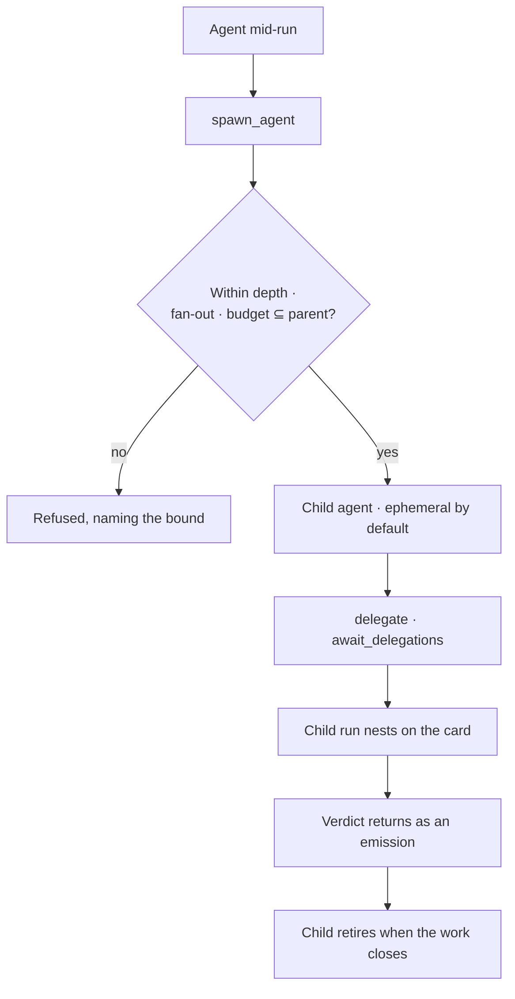

# Agents — module spec

What an agent is and what bounds it. An agent is the principal that runs work: it binds
[skills](../skills/spec.md), runs [workflows](../workflows/spec.md), and is held inside three bounds
— an **envelope** (what it may do), a **budget** (what it may spend) and a **lens** (what it may see,
use and send). Those are authored separately and reused separately — this spec owns the agent and
the bounds; **the composition happens at run time and is drawn in [Ask](../ask/spec.md)**.

> ⚠ **Rewritten for [orchestration § 0](../../orchestration.md#0-the-records)** — `Todo` · `TaskPlan` ·
> `Task` · `TaskRun` · `Lens`. The words *Thought*, *Thinking* and *Step-as-a-record* are retired, and
> **`Task` now names a node inside a plan**, never a thing a user authored. Migration:
> [task-model-migration.md](../../building-engine/task-model-migration.md).

| | |
|---|---|
| Index | [§5 · Agents](../../README.md#5--agents) |
| Features | [providers-and-models](features/providers-and-models.md) · [author-an-agent](features/author-an-agent.md) · [envelope-and-budget](features/envelope-and-budget.md) · [delegation](features/delegation.md) · [lifecycle](features/lifecycle.md) · [lineage](features/lineage.md) · [concurrency-and-contention](features/concurrency-and-contention.md) |
| Depends on | [Skills](../skills/spec.md) (what it may be offered) · [Workflows](../workflows/spec.md) (what it may run) · Ask (an agent runs a run) |
| Depended on by | [Work](../work/spec.md) (an agent is an assignee) · Ask (a session asks through an agent) |

## 1. Vocabulary

Product-wide words: [terminology.md](../../terminology.md). What this module adds:

| Noun | Is | Is not |
|---|---|---|
| **Agent** | a principal that can be assigned work, carrying bindings, an envelope, a budget and a lens | a prompt, or a persona |
| **Provider** | a configured LLM endpoint on the Graph — a **participant**, addressed `llm/<name>/*`, holding the models it offers | the model name, and not something an agent binds |
| **Cast** | the lens's map from a plan's **role** to a model address. It is what names the model an agent uses | a field on the agent |
| **Envelope** | the static bounds: which callables, which pinned arguments, which ceilings | a runtime check |
| **Budget** | the cost ceiling a run may spend. **At the ceiling a run pauses and asks** — it does not fail ([orchestration § 0.10](../../orchestration.md#010-budget--the-ceiling-that-pauses-instead-of-failing)) | a quota · a hard stop |
| **Lifetime** | `persistent` or `ephemeral` — whether the agent outlives the work it was spawned for | status |
| **Lineage** | who authored whom, who spawned whom, on what run | an org chart |

## 2. Where the agent sits

An agent is authored here; what it may be offered is [Skills](../skills/spec.md), what it may run is
[Workflows](../workflows/spec.md), and how the three come together at run time is drawn in
[Ask § 3](../ask/spec.md). This spec owns the agent and its bounds — nothing else.

| This module answers | Answered elsewhere |
|---|---|
| What does this agent carry? | What is a skill? → Skills |
| What may it run, at what cost? | Which plan runs? → Workflows |
| Who spawned it, and what happens when it retires? | What did it produce? → Ask |
| How many may run at once, and what gives when they contend? | When does a job run? → the runtime adapter |

This module is where the orchestration lives: [Work](../work/spec.md) says what needs doing, and the
agent an assignment names is what turns it into a run.

**Bounds nest.** An envelope bounds what one agent may run; a **lens** bounds what it may see; a budget bounds what it may spend;
delegation bounds depth and fan-out; and a Graph ceiling bounds how many run at once. Each is stated,
each refuses with the bound named, and none of them is negotiable at run time.

## 3. What this module owns

| Owns | Shape |
|---|---|
| `agents` | `graph_id` · `name` · `description` · `kind` · `status` · `lifetime` · `parent_agent_id?` · `spawned_in_run_id?` · `instructions` · `budget` · `policy` · **`lens_id`** |
| `agent_skills` | the bindings this agent carries — authored in [Skills](../skills/spec.md) |
| Envelope · budget | on the agent: allowed callable keys, pinned arguments, cost · fan-out · clarification · replan · concurrency ceilings |
| Lineage | `parent_agent_id` + `spawned_in_run_id` — retirement keeps the row so lineage resolves |
| `llm_providers` + `llm_models` | one configured endpoint holding many models — the two segments of `llm/<provider>/<model>` ([PM9](features/providers-and-models.md)) |
| **Not owned** | the lens itself, and the cast in it — those are [Govern](../govern/spec.md)'s. This module owns the *pointer* |
| **Dropped** | `agents.llm_config_id` · `llm_providers.is_default` · `llm_providers.model_id` — all three gone in migration `000000000053` |

Schema, ER diagram and migration order:
[building-engine/govern-and-agents-data-model.md](../../building-engine/govern-and-agents-data-model.md).

## 4. Flows

### F1 — Author an agent

Seams: no provider configured at all → the form says so and links to `Agents › LLMs` · the lens's
cast names a deleted model → blocked before a run starts, naming the model and the world · a skill
bound then deleted → the binding drops and the agent keeps working · no default agent on the Graph →
the first authored agent is offered as one.

### F2 — Delegate, bounded

Cancelling the parent cascades. A retired agent keeps its row.

## 5. Surfaces

**Agents is a `leftNav` item holding two drawers** — `Agents` and `LLMs`
([GV18](../govern/spec.md)). A provider is what an agent's cast resolves against, so it is read where
agents are read, not in a settings tab reached from elsewhere.

| Surface | Region | Shape |
|---|---|---|
| Agents | first drawer of the **Agents** stack | one list; `+ New agent` in the header; a row carries its kind, its **lens chip** and its **spend meter** |
| Agent panel | the drill-in | *the three bounds* — envelope · budget · lens — then the cast resolved from the lens, then *bounds nest*, then *where this agent has been* |
| `LLMs` | second drawer of the same stack | the providers, the models under each, and the cast role that names each one |
| Lineage | a page | who authored whom, who spawned whom, on what run — with the depth marked and the floor's refusal drawn |
| Concurrency | a page, or the drawer's footer | running · queued with positions and reasons · every ceiling in force |

Components, routes and build order:
[building-studio/govern-and-agents-panels.md](../../building-studio/govern-and-agents-panels.md).

## 6. Cross-feature decisions

| # | Decision |
|---|---|
| A1 | **An agent binds no provider.** It carries three bounds — envelope, budget and **lens** — and the lens's `cast` names the model, which the Graph resolves to a configured provider row and its credential. The composer never picks one, and neither does the agent ([PM1](features/providers-and-models.md) · [GV10](../govern/spec.md)). |
| A2 | Every agent has an envelope. There is no unbounded agent. |
| A3 | A spawned agent's budget is a subset of its parent's, and it is ephemeral by default. |
| A4 | Retire never deletes — lineage must stay resolvable, and the name is never freed. |
| A5 | **The three bounds are read together.** They are what a refusal names, so a panel that shows two of them explains two-thirds of why a run was turned away. |
| A6 | **Ceilings are stated as a table of value → what it bounds, not a form of eight inputs.** Six of them are numbers a person sets once and reads often; the reading is the common case. |

## 7. Deliberately absent

| Not built | Because |
|---|---|
| Agent memory across task_runs | learning goes into the graph as records an agent queries, or into skills a person edits |
| Agents accepting their own work | the acceptance seam belongs to [Work](../work/spec.md) |
| Cross-Graph agents | the Graph is the reasoning boundary |
