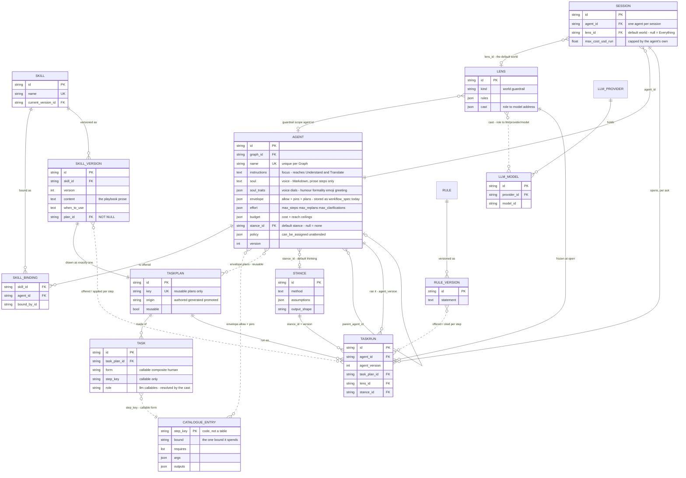
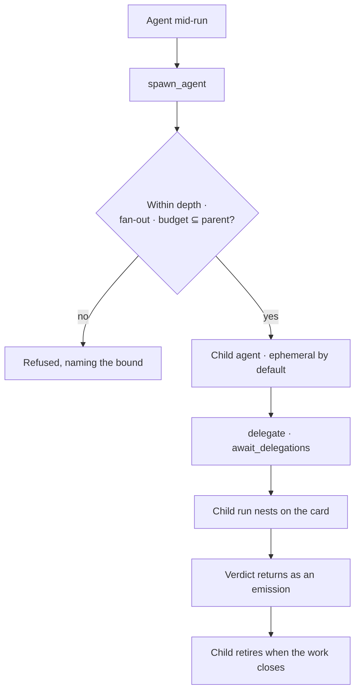

# Agents — module spec

What an agent is and what bounds it. An agent is the principal that runs work: it binds
[skills](../skills/spec.md), runs [workflows](../workflows/spec.md), and carries **standing limits**
— an **envelope** (what it may run), **effort**, a **budget** and **reach** — and optionally a
**guardrail** of its own. The **world** (what a run may see, use and send) is not the agent's: it comes
with the work that opens the run — a session, a Todo, a schedule, a parent run
([AG24](features/author-an-agent.md#decisions)). This spec owns the agent and its limits; **the
composition happens at run open and is drawn in [Ask](../ask/spec.md)**.

> ⚠ **Rewritten for [orchestration § 0](../../orchestration.md#0-the-records)** — `Todo` · `TaskPlan` ·
> `Task` · `TaskRun` · `Lens`. The words *Thought*, *Thinking* and *Step-as-a-record* are retired, and
> **`Task` now names a node inside a plan**, never a thing a user authored. Migration:
> [task-model-migration.md](../../building-engine/task-model-migration.md).

| | |
|---|---|
| Index | [§5 · Agents](../../README.md#5--agents) |
| Features | [providers-and-models](features/providers-and-models.md) · [author-an-agent](features/author-an-agent.md) · [envelope-and-budget](features/envelope-and-budget.md) · [delegation](features/delegation.md) · [lifecycle](features/lifecycle.md) · [lineage](features/lineage.md) · [concurrency-and-contention](features/concurrency-and-contention.md) · [soul](features/soul.md) |
| Depends on | [Skills](../skills/spec.md) (what it may be offered) · [Workflows](../workflows/spec.md) (what it may run) · Ask (an agent runs a run) |
| Depended on by | [Work](../work/spec.md) (an agent is an assignee) · Ask (a session asks through an agent) |

## 1. Vocabulary

Product-wide words: [terminology.md](../../terminology.md). What this module adds:

| Noun | Is | Is not |
|---|---|---|
| **Agent** | a principal that can be assigned work, carrying bindings and standing limits, thinking with effort and a stance, and speaking with a soul | a prompt · a world |
| **Soul** | who an agent is and how it speaks — Markdown on the agent, read only by the steps whose words a person reads ([5.8](features/soul.md)) | a permission · a stance |
| **Voice dials** | the soul in structured form — `humour` · `formality` · `emoji` · `greeting`, picked rather than written ([AG16](features/author-an-agent.md#decisions)) | a persona · a length setting |
| **Callable** | one catalogue entry an agent's envelope allows it to run — `run_query` · `search_web` · `fetch_source` ([AG14](features/author-an-agent.md#decisions)) | a *capability* — that word names a feature file's section |
| **Provider** | a configured LLM endpoint on the Graph — a **participant**, addressed `llm/<name>/*`, holding the models it offers | the model name, and not something an agent binds |
| **Standing limits** | what an agent may ever do, whoever asks — envelope, effort, budget, reach, its own guardrail | the world a run works in, which comes with the work |
| **Cast** | the lens's map from a plan's **role** to a model address. It is what names the model a run uses | a field on the agent |
| **Envelope** | the static bounds: which callables, which pinned arguments, which ceilings | a runtime check |
| **Effort** | how hard an agent tries before it stops — steps, replans, clarifications. Enforced like a ceiling ([EB9](features/envelope-and-budget.md#decisions)) | character · budget |
| **Budget** | the cost ceiling a run may spend. **At the ceiling a run pauses and asks** — it does not fail ([orchestration § 0.10](../../orchestration.md#010-budget--the-ceiling-that-pauses-instead-of-failing)) | a quota · a hard stop |
| **Lifetime** | `persistent` or `ephemeral` — whether the agent outlives the work it was spawned for | status |
| **Lineage** | who authored whom, who spawned whom, on what run | an org chart |

## 2. Where the agent sits

An agent is authored here; what it may be offered is [Skills](../skills/spec.md), what it may run is
[Workflows](../workflows/spec.md), and how the three come together at run time is drawn in
[Ask § 3](../ask/spec.md). This spec owns the agent and its bounds — nothing else.

| This module answers | Answered elsewhere |
|---|---|
| What does this agent carry? | What is a skill? → Skills |
| What may it run, at what cost? | Which plan runs? → Workflows |
| Who spawned it, and what happens when it retires? | What did it produce? → Ask |
| How many may run at once, and what gives when they contend? | When does a job run? → the runtime adapter |

This module is where the orchestration lives: [Work](../work/spec.md) says what needs doing, and the
agent an assignment names is what turns it into a run.

**Bounds nest.** An envelope bounds what one agent may run; the **work's world** and the **guardrails** bound what a run may see; a budget bounds what it may spend;
delegation bounds depth and fan-out; and a Graph ceiling bounds how many run at once. Each is stated,
each refuses with the bound named, and none of them is negotiable at run time.

## 3. What this module owns

| Owns | Shape |
|---|---|
| `agents` | `graph_id` · `name` · `description` · `kind` · `status` · `lifetime` · `parent_agent_id?` · `spawned_in_run_id?` · `instructions` · `soul` · `soul_traits` · `budget` · `effort` · `stance_id` · `policy` |
| `agent_skills` | the bindings this agent carries — authored in [Skills](../skills/spec.md) |
| Envelope · budget · effort | on the agent: allowed callable keys and pinned arguments · cost, fan-out and concurrency ceilings · steps, replans and clarifications |
| Lineage | `parent_agent_id` + `spawned_in_run_id` — retirement keeps the row so lineage resolves |
| `llm_providers` + `llm_models` | one configured endpoint holding many models — the two segments of `llm/<provider>/<model>` ([PM9](features/providers-and-models.md)) |
| **Not owned** | worlds, guardrails and their casts — [Govern](../govern/spec.md)'s. An agent's own guardrail is a `lenses` row scoped `agent:<id>`; the agent holds no pointer ([AG10](features/author-an-agent.md#decisions)) |
| **Dropped** | `agents.llm_config_id` · `llm_providers.is_default` · `llm_providers.model_id` — all three gone in migration `000000000053` |

Schema, ER diagram and migration order:
[building-engine/govern-and-agents-data-model.md](../../building-engine/govern-and-agents-data-model.md).

## 3a. How an agent is composed

An agent is five groups of settings, and only two of them are tables of their own — the rest is
columns on `agents` or a pointer to something another module owns.

| Group | Is | Stored as | Owned by |
|---|---|---|---|
| **Who** | how it sounds | `soul` · `soul_traits` | this module ([5.8](features/soul.md)) |
| **Focus** | what it works on | `instructions` | this module ([AG13](features/author-an-agent.md#decisions)) |
| **Thinking** | how much it tries, and which way | `effort` · `stance_id` | this module · the stance is [Ask](../ask/features/act-as.md)'s |
| **Can do** | how it approaches work, and what it may run | `skill_bindings` · `envelope.allow` · `pins` · `plans` | [Skills](../skills/spec.md) · this module |
| **Limits** | what it may ever spend and reach, and never see | `budget` · `policy` · its guardrail | this module · [Govern](../govern/spec.md) |
| *The work* | what one run may see and spend | the session's, Todo's or schedule's world · spend per run | [Ask](../ask/spec.md) · [Work](../work/spec.md) · [Govern](../govern/spec.md) |

Solid lines are foreign keys; dashed lines are references held in JSON or derived — the catalogue is
code, not a table, and the envelope names it by `step_key`.

```mermaid
erDiagram
    AGENT         ||--o{ SKILL_BINDING   : "is offered"
    SKILL         ||--o{ SKILL_BINDING   : "bound as"
    SKILL         ||--o{ SKILL_VERSION   : "versioned as"
    SKILL_VERSION ||--|| TASKPLAN        : "drawn as exactly one"
    TASKPLAN      ||--o{ TASK            : "made of"
    TASK          }o..|| CATALOGUE_ENTRY : "step_key - callable form"

    AGENT         }o..o{ CATALOGUE_ENTRY : "envelope.allow + pins"
    AGENT         }o..o{ TASKPLAN        : "envelope.plans - reusable"
    AGENT         }o--o| STANCE          : "stance_id - default thinking"
    LENS          }o--o| AGENT           : "guardrail scope agent:id"
    SESSION       }o--o| LENS            : "lens_id - the default world"
    SESSION       }o--|| AGENT           : "agent_id"
    SESSION       ||--o{ TASKRUN         : "opens, per ask"
    AGENT         }o--o| AGENT           : "parent_agent_id"

    LENS          }o..o{ LLM_MODEL       : "cast - role to llm/provider/model"
    LLM_PROVIDER  ||--o{ LLM_MODEL       : holds
    RULE          ||--o{ RULE_VERSION    : "versioned as"

    AGENT         ||--o{ TASKRUN         : "ran it - agent_version"
    TASKPLAN      ||--o{ TASKRUN         : "run as"
    LENS          ||--o{ TASKRUN         : "frozen at open"
    STANCE        ||--o{ TASKRUN         : "stance_id + version"
    SKILL_VERSION }o..o{ TASKRUN         : "offered / applied per step"
    RULE_VERSION  }o..o{ TASKRUN         : "offered / cited per step"

    AGENT {
        string id           PK
        string graph_id     FK
        string name         UK "unique per Graph"
        text   instructions    "focus - reaches Understand and Translate"
        text   soul            "voice - Markdown, prose steps only"
        json   soul_traits     "voice dials - humour formality emoji greeting"
        json   envelope        "allow + pins + plans - stored as workflow_spec today"
        json   effort          "max_steps max_replans max_clarifications"
        json   budget          "cost + reach ceilings"
        string stance_id    FK "default stance - null = none"
        json   policy          "can_be_assigned unattended"
        int    version
    }
    SKILL_BINDING {
        string skill_id     FK
        string agent_id     FK
        string bound_by_id
    }
    SKILL {
        string id                 PK
        string name               UK
        string current_version_id FK
    }
    SKILL_VERSION {
        string id          PK
        string skill_id    FK
        int    version
        text   content        "the playbook prose"
        text   when_to_use
        string plan_id     FK "NOT NULL"
    }
    TASKPLAN {
        string id       PK
        string key      UK "reusable plans only"
        string origin      "authored generated promoted"
        bool   reusable
    }
    TASK {
        string id           PK
        string task_plan_id FK
        string form            "callable composite human"
        string step_key        "callable only"
        string role            "llm callables - resolved by the cast"
    }
    CATALOGUE_ENTRY {
        string step_key PK "code, not a table"
        string bound       "the one bound it spends"
        list   requires
        json   args
        json   outputs
    }
    STANCE {
        string id           PK
        text   method
        json   assumptions
        string output_shape
    }
    LENS {
        string id    PK
        string kind     "world guardrail"
        json   rules
        json   cast     "role to model address"
    }
    LLM_MODEL {
        string id          PK
        string provider_id FK
        string model_id
    }
    RULE_VERSION {
        string id        PK
        text   statement
    }
    SESSION {
        string id               PK
        string agent_id         FK "one agent per session"
        string lens_id          FK "default world - null = Everything"
        float  max_cost_usd_run    "capped by the agent's own"
    }
    TASKRUN {
        string id             PK
        string agent_id       FK
        int    agent_version
        string task_plan_id   FK
        string lens_id        FK
        string stance_id      FK
    }
```

**The one derived check.** A skill's *needs* are the `step_key`s of the tasks in its current
version's plan; they must sit inside the agent's `envelope.allow`, or the bind is refused naming the
callable ([BN5](../skills/features/bindings.md#decisions) · [AG15](features/author-an-agent.md#decisions)).

## 4. Flows

### F1 — Author an agent

```mermaid
flowchart LR
    A[New agent] --> B[Pick a template<br/>envelope comes with it]
    B --> C[Guardrail of its own<br/>optional]
    C --> D[Offer skills<br/>from the Graph's set]
    D --> E[Set budget and policy]
    E --> F[Active · appears in assignee pickers]
```

Seams: no provider configured at all → the form says so and links to `Agents › LLMs` · a run's
cast names a deleted model → blocked before the run starts, naming the model and the world or guardrail that cast it · a skill
bound then deleted → the binding drops and the agent keeps working · no default agent on the Graph →
the first authored agent is offered as one.

### F2 — Delegate, bounded

```mermaid
flowchart TD
    A[Agent mid-run] --> S[spawn_agent]
    S --> B{Within depth ·<br/>fan-out · budget ⊆ parent?}
    B -->|no| REF[Refused, naming the bound]
    B -->|yes| C[Child agent · ephemeral by default]
    C --> D[delegate · await_delegations]
    D --> E[Child run nests on the card]
    E --> F[Verdict returns as an emission]
    F --> G[Child retires when the work closes]
```

Cancelling the parent cascades. A retired agent keeps its row.

## 5. Surfaces

**Agents is a `leftNav` item holding two drawers** — `Agents` and `LLMs`
([GV18](../govern/spec.md)). A provider is what an agent's cast resolves against, so it is read where
agents are read, not in a settings tab reached from elsewhere.

| Surface | Region | Shape |
|---|---|---|
| Agents | first drawer of the **Agents** stack | one list; `+ New agent` in the header; a row carries its kind, a shield when it has a guardrail of its own, and its **spend meter** |
| Agent page | the drill-in | five tabs — Overview · Skills & callables · Thinking · Soul · Activity ([AG23](features/author-an-agent.md#decisions)) |
| `LLMs` | second drawer of the same stack | the providers, the models under each, and the cast role that names each one |
| Lineage | a page | who authored whom, who spawned whom, on what run — with the depth marked and the floor's refusal drawn |
| Concurrency | a page, or the drawer's footer | running · queued with positions and reasons · every ceiling in force |

Components, routes and build order:
[building-studio/govern-and-agents-panels.md](../../building-studio/govern-and-agents-panels.md).

## 5a. The drawn states

Hi-fi, at 1440×900, on the **Agents › Soul — 5.8** page of *The Assistant Speaks* canvas — `https://claude.ai/artifact/HdXWfPfwoES9CKTCpQtH5J`.

| Artboard | Feature | Shows |
|---|---|---|
| `agents.agents.detail.soul` | [soul](features/soul.md) | the Soul tab on the agent's page: a Markdown editor, the character cost in every ask, Discard · Preview · Save soul |
| `agents.agents.detail.soul.default` | [soul](features/soul.md) | no soul yet: *Speaking in Invana's default voice*, the default voice as placeholder |
| `agents.agents.detail.soul.preview` | [soul](features/soul.md) | the draft beside one sample ask answered twice — in the current voice and in the draft |
| `agents.agents.detail.soul.read_only` | [soul](features/soul.md) | the soul rendered, no editor, and why: editing needs edit rights on the agent |

## 6. Cross-feature decisions

| # | Decision |
|---|---|
| A1 | **An agent binds no provider and no world.** It carries standing limits; the world comes with the work, and the effective lens's `cast` names the model, which the Graph resolves to a configured provider row and its credential. The composer never picks a model, and neither does the agent ([AG24](features/author-an-agent.md#decisions) · [PM1](features/providers-and-models.md) · [GV10](../govern/spec.md)). |
| A2 | Every agent has an envelope. There is no unbounded agent. |
| A3 | A spawned agent's budget is a subset of its parent's, and it is ephemeral by default. |
| A4 | Retire never deletes — lineage must stay resolvable, and the name is never freed. |
| A5 | **A refusal names which side bound it** — the agent's standing limits, the work's world, or a guardrail ([AG6](features/author-an-agent.md#decisions)). |
| A6 | **Ceilings are stated as a table of value → what it bounds, not a form of eight inputs.** Six of them are numbers a person sets once and reads often; the reading is the common case. |

## 7. Deliberately absent

| Not built | Because |
|---|---|
| Agent memory across task_runs | learning goes into the graph as records an agent queries, or into skills a person edits |
| Agents accepting their own work | the acceptance seam belongs to [Work](../work/spec.md) |
| Cross-Graph agents | the Graph is the reasoning boundary |
