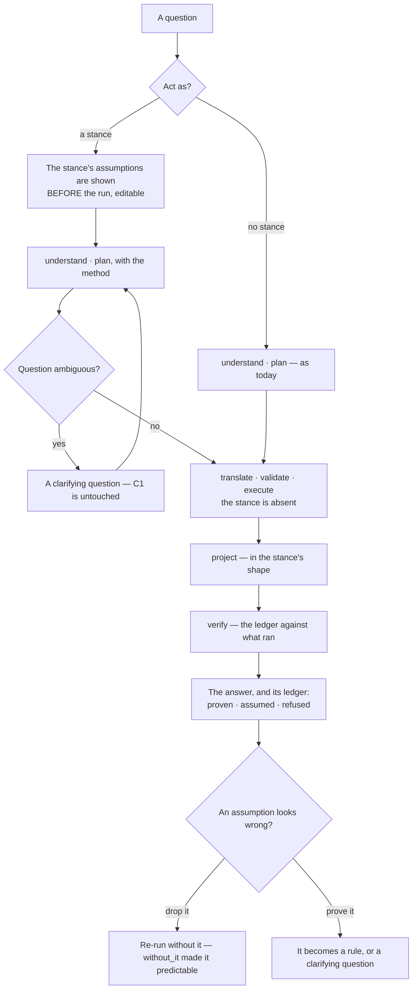

# Act as

A named **stance** — a method and the assumptions it brings — applied to one run. *Act as a
scientist* does not change who is answering; it changes how the question is approached, and it makes
the assumptions that approach carries **visible before the answer, not buried inside it**.

| | |
|---|---|
| Index | [3.11](../../../README.md#3--ask) · Slice **TBD** |
| Module | [Ask](../spec.md) |
| API / CLI / Studio | 🔵 / — / 🔵 |
| Related | [ask-in-natural-language](ask-in-natural-language.md) · [clarifying-questions](clarifying-questions.md) · [reasoning-trace](reasoning-trace.md) · [when-it-cannot-answer](when-it-cannot-answer.md) · [authoring-a-skill](../../skills/features/authoring-a-skill.md) · [rules](../../skills/features/rules.md) · [envelope-and-budget](../../agents/features/envelope-and-budget.md) |

> **As** someone asking a graph a question I do not fully know how to frame, **I want** to ask it the
> way a scientist, a designer or an analyst would, **so that** I get their method — and can see the
> assumptions that method brings, instead of inheriting them silently.

## 1. What a stance is, and is not

| | |
|---|---|
| It is | a **method** · a **declared assumption set** · an **output shape**. Three fields, authored once, reusable |
| It is | **Reasoning** — graph-level, shared, inert. Any agent may be offered any stance, and a stance does nothing on its own ([SU23](../../platform/features/setup.md#decisions)) |
| It is not | an **Agent**. An agent is *someone*: it has a provider, an envelope, a budget, a concurrency slot and lineage. A stance has none of those and never acquires them ([AA1](#decisions)) |
| It is not | a voice. If swapping the stance changes only the prose, the stance did nothing ([AA5](#decisions)) |
| It is not | a permission. A stance can never widen what runs ([AA3](#decisions)) |

### Why it is not just an agent

The roster already carries persona — *"bind a provider, model and skills"*. The difference is
lifetime and weight:

| | Agent | Stance |
|---|---|---|
| Lifetime | durable; authored, versioned, paused, retired | per-run; chosen at ask time, swappable mid-session |
| Carries | provider · skills · envelope · budget · lineage | method · assumptions · output shape |
| Costs | a concurrency slot ([5.7](../../agents/features/concurrency-and-contention.md)) | nothing |
| Answers "who?" | yes | **no** — the agent is still the actor |

*Act as a skeptic for this one question* should not require authoring an actor, giving it a budget
and retiring it afterwards. That is the gap. A stance composes **with** the agent that runs the
run; it does not replace it.

## 2. Where a stance bites — and where it must be inert

A run's steps are `understand · plan · translate · validate · execute · project · verify`. A
stance is offered to three of them and is **structurally absent from the rest** ([AA3](#decisions)).

| Step | Stance | Why |
|---|---|---|
| `understand` | **yes** | what the question is taken to be asking, and what counts as relevant to it |
| `plan` | **yes** | the method — a scientist states a hypothesis and looks for what would disconfirm it; a designer looks for the actor and the journey; an analyst looks for the distribution before the mean |
| `translate` | **no** | the query is written from the model, never from a persona. A stance that could rewrite a query is a stance that can reach records the question never asked for |
| `validate` | **no** | the envelope is the agent's, and a stance is not an actor. Nothing about *act as* may be an input to a bounds check |
| `execute` | **no** | — |
| `project` | **yes** | the shape of the answer — a hypothesis and its test, a journey, a distribution, a critique |
| `verify` | **the ledger only** | it checks the assumption ledger against what the run actually did (§3) |

That split is the safety property. **Reasoning may change how an answer is reached and shaped; it may
never change what may be run** — which is [SU23](../../platform/features/setup.md#decisions) applied
one level down.

## 3. First principles — the assumption ledger

Today an answer is **grounded or refused**. First-principles thinking makes the middle visible: the
things the answer rests on that the graph did *not* prove.

| State | Means |
|---|---|
| **proven** | a record, or a model constraint, or a [rule](../../skills/features/rules.md) says so. Citable ([3.7](reasoning-trace.md)) |
| **assumed** | the answer rests on it and the graph cannot check it. **Named, sourced, and challengeable** |
| **refused** | the graph does not hold what the question needs, and says so ([3.8](when-it-cannot-answer.md)) |

Every answer run under a stance carries a **ledger** — a structured emission, not prose:

| Column | Holds |
|---|---|
| `claim` | the assumption, in one sentence |
| `source` | `stance` · `question` · `model` · `rule` — where it entered |
| `checked` | whether the graph could test it, and the query that did |
| `without_it` | what the answer becomes if it does not hold |

`without_it` is the column that earns the feature. A named assumption you cannot act on is
decoration; an assumption that says *"drop this and the ranking inverts"* is a finding. It is also
what makes a stance **testable**: swap the stance, and the ledger must change ([AA5](#decisions)).

## 4. The collision with "never an assumption", and how it resolves

[Clarifying questions](clarifying-questions.md) C1 is emphatic: *"Ambiguity produces a question,
never an assumption — guessing is the failure this prevents."* [NL4](ask-in-natural-language.md) says
it again. This feature must not quietly undo that.

It does not, because the two words are not the same thing ([AA4](#decisions)):

| | C1's assumption | A stance's assumption |
|---|---|---|
| About | **what the question means** | **the method used to answer it** |
| Made by | the model, silently | the stance, in writing, before the run |
| Visible | no — that is the failure | yes — it is the deliverable |
| Reversible | no | yes — drop it and `without_it` says what changes |

C1 stands untouched: an ambiguous *question* still produces a clarifying question. What a stance
declares is a *method's* premises, which is the opposite of guessing — it is the guess that was always
being made, written down where it can be argued with.

## 5. Journey

### The unhappy paths

| Path | What happens |
|---|---|
| The stance's method needs data the graph lacks | **cannot-answer wins.** A stance may never soften the refusal path ([AA6](#decisions)) — *"as a scientist I'd estimate…"* over thin data is the exact failure the product exists to refuse |
| Two stances are asked for at once | Refused. One run, one stance — a blend has no statable assumption set |
| A stance is swapped mid-session | The next run uses it; prior answers keep the stance they ran under, in their trace |
| A stance's assumption contradicts a rule | The **rule** wins and the assumption is dropped from the ledger, saying which rule dropped it |
| No stance is chosen | Nothing changes from today, and no ledger is emitted. A stance is opt-in ([AA7](#decisions)) |

## 6. Surfaces

| Surface | Where | Shape |
|---|---|---|
| **The picker** | the composer, beside the ask mode | *Act as* — a `RichSelect` of stances, none by default |
| **The pre-run card** | above the composer once a stance is chosen | its assumptions, each one removable before asking. This is the feature's whole point: they are read **before** the answer exists |
| **The ledger** | an emission in the answer ([3.3](the-answer-surface.md)) | a table — claim · source · checked · without_it — with *drop and re-run* per row |
| **Authoring** | `?panel=skills` | beside skills and rules: the same shape of thing, authored the same way ([AA2](#decisions)) |
| **The trace** | [3.7](reasoning-trace.md) | the stance and its ledger are part of the run's record, so an answer can always say which method produced it |

## 7. Engine

| Thing | Shape |
|---|---|
| `stances` | graph-scoped: `name · when_to_use · method · assumptions[] · output_shape`. Versioned like a skill |
| On a run | `task_runs.stance_id` and `stance_version`, so a replay is honest about which method ran |
| Offered, not obeyed | a stance reaches `understand`, `plan` and `project` as offered context, exactly as a skill does ([6.3](../../skills/features/usage.md)) — *offered* and *applied* stay distinct |
| The ledger | rows on the run, emitted as one `assumption_ledger` emission; `without_it` is authored text on the assumption, not generated at answer time |
| Never in the envelope | no stance field is an input to [envelope validation](../../workflows/features/envelope-validation.md). The check must be identical with and without one ([AA3](#decisions)) |
| Events | `stance.published` · `run.stance_applied` · `assumption.dropped` |

## Decisions

| # | Decision |
|---|---|
| AA1 | **A stance is not an actor.** The agent is still who acts, keeps the envelope, the budget and the slot. A stance has no bounds of its own because it can do nothing of its own |
| AA2 | **A stance is authored where skills are authored.** Same shape — named, described, with a *when to use*, offered to a step, reusable by n agents — so it lives beside them rather than inventing a second authoring surface |
| AA3 | **A stance is structurally absent from `translate`, `validate` and `execute`.** Not "ignored there" — not passed there. A persona that can influence what runs is a permission boundary with a personality, and the envelope check must be byte-identical with and without one |
| AA4 | **A declared assumption is the cure for the one C1 forbids.** C1 bans an assumption the model invents about *what the question means*. A stance declares the premises of a *method*, in writing, before the run, each one droppable. Ambiguity still produces a clarifying question |
| AA5 | **A stance that changes only the prose has not been applied.** Its effect must be observable in the plan and in the ledger. This is assertable: swap the stance on a fixed question and fixed data, and the plan or the ledger must differ, or the stance is theatre |
| AA6 | **A stance never softens cannot-answer.** If the method needs what the graph does not hold, the answer is a refusal with a diagnosis — never an estimate in a confident register. Personas are where grounded products go to start hallucinating politely |
| AA7 | **No stance is the default.** Opt-in, and the un-stanced path is exactly today's path with no ledger. A product that always answers "as" someone has a voice it never chose |
| AA8 | **One run, one stance.** Blending two has no statable assumption set, and the assumption set is the deliverable |

## Not building

| Not built | Because |
|---|---|
| Stances that carry their own tools, keys or permissions | that is an Agent ([AA1](#decisions)) |
| A generated persona ("act as a 19th-century botanist") | a stance's value is its *declared* assumptions; one invented at ask time declares nothing and cannot be argued with |
| Personality, tone or character settings | the register belongs to the product, not to a costume |
| Blended stances | [AA8](#decisions) |
| A stance that can add a step to the plan catalogue | the catalogue is the runtime's ([3.9](runtime-and-adapters.md)); a method chooses among steps, it does not invent them |
| Auto-applied stances by question type | it would make the method invisible again, which is the thing this feature exists to fix |
