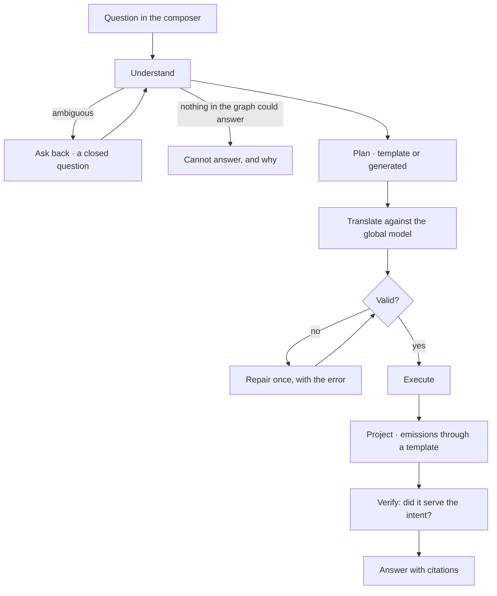

# Ask in natural language

A question in your own words becomes a run: understood, planned, translated against the global
model, validated, executed, projected — and answered only from what the graph holds.

| | |
|---|---|
| Index | [3.2](../../../README.md#3--ask) · Slice **S9b** |
| Module | [Ask](../spec.md) |
| API / CLI / Studio | ✅ / — / ✅ |
| Related | [clarifying-questions](clarifying-questions.md) · [streaming-and-the-workflow](streaming-and-the-workflow.md) · [when-it-cannot-answer](when-it-cannot-answer.md) |

> **As** someone who knows the domain but not the query language, **I want** to ask plainly and get an
> answer I can check, **so that** I trust it enough to act on it.

## Capabilities

| # | Capability | Notes |
|---|---|---|
| C1 | Ask in plain language | The composer offers only the ask-kind toggle; the agent carries provider and model |
| C2 | Grounded in the global model | Translation names only types the model has |
| C3 | Every answer cites | The query that produced it and the records behind it |
| C4 | It asks back rather than guessing | An ambiguous question becomes a closed question, not an assumption |
| C5 | It says when it cannot | The graph not holding something is an answer |
| C6 | The run is visible while it runs | Steps and emissions stream |
| C7 | A session is a thread of runs | Follow-ups keep the thread; each is its own run |

## Journey

## Seams

| Seam | What the user sees |
|---|---|
| No LLM provider configured | Named, with a link to configure one; the QL path still works |
| The graph is empty | Cannot-answer that says so, not a zero-row table |
| Question spans models with no link | Says which two, and that a link is not declared |
| Repair fails twice | Stops, showing both attempts and the errors |
| Cancelled mid-run | Steps completed stay in the thread; nothing partial is presented as an answer |

## Surfaces

| Surface | Shape |
|---|---|
| Composer | One field, ask-kind toggle, the agent named |
| Thread | Question → steps → emissions → citations, in order |
| Canvas | Subgraph emissions draw onto the current data canvas |

## Engine

| Thing | Shape |
|---|---|
| `todos` · `task_runs` · `task_runs` | one run per question, `triggered_by = user` |
| Translation | intent → query, against the global model version in force |
| Routes | `POST …/runs` · `GET …/task_runs/{id}` (stream) |
| Events | `todo.created` · `run.*` · `query.executed` |

## Decisions

| # | Decision |
|---|---|
| NL1 | One question, one run. |
| NL2 | The agent carries provider and model; the composer never picks one. |
| NL3 | Translation is grounded in the global model, and validation enforces it. |
| NL4 | Ambiguity produces a question, not an assumption. |
| NL5 | Every answer carries its query and its records. |
| NL6 | **The read-only guard matches write clauses as words, never as substrings, and never inside a literal.** `offset`, `dataset` and `asset` all end in the letters *set*, and a query saying any of them was refused as a write; so was every read-only `CALL { … }` subquery, and any question containing the word *merge* in quotes. Word boundaries also close the other side — `CREATE(n)` written without a space used to pass. A subquery that writes is caught by the `CREATE` or `SET` inside it, so the brace is not a marker of its own. |
| NL7 | **A refused query is a policy refusal, not a model failure.** The model answered; Invana declined the answer. It settles as `query_not_read_only` carrying the query as evidence — the same cause `validate_query` raises — rather than `llm_failed`, which told the reader *the model could not produce an answer* and sent them to check the LLM provider, the one part of the chain that was working. The guard stays the outermost of four: the connection's read-only flag, the envelope's pin on `execute_graph_query` and the `validate_query` step each check again closer to the database. |

## Not building

| Not building | Because |
|---|---|
| Answers blended with the model's own knowledge | the claim is grounding, and blending breaks it |
| Conversational memory inside one run | context is assembled per run, from rules, skills and the graph |
| Automatic follow-up questions | a follow-up is the user's move |
