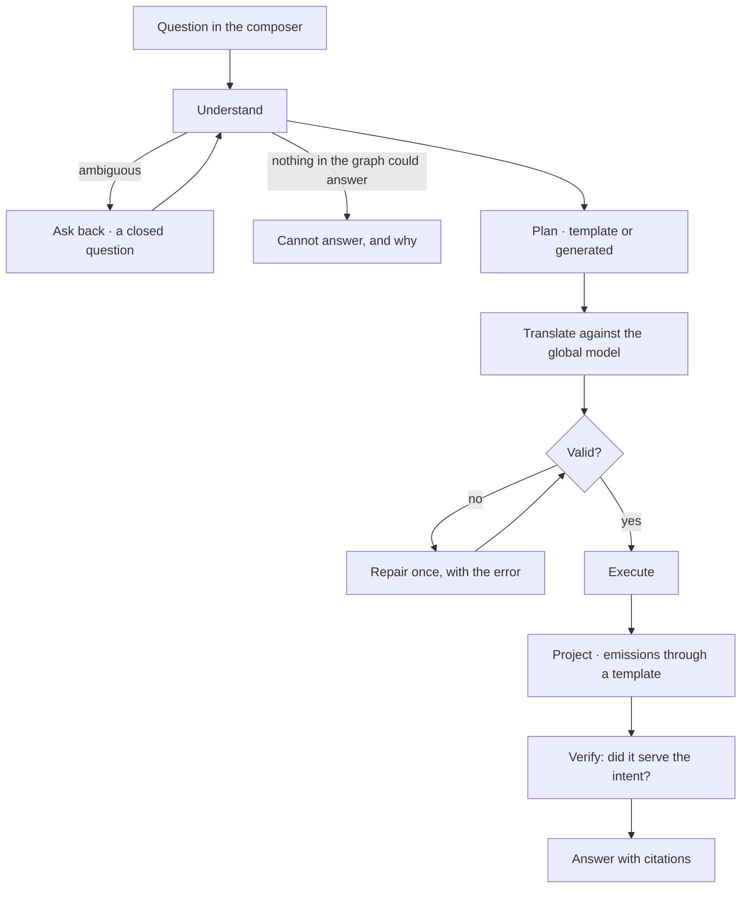

# Ask in natural language

A question in your own words becomes a run: understood, planned, translated against the global
model, validated, executed, projected — and answered only from what the graph holds.

| | |
|---|---|
| Index | [3.2](../../../README.md#3--ask) · Slice **S9b** |
| Module | [Ask](../spec.md) |
| API / CLI / Studio | ✅ / — / ✅ |
| Related | [clarifying-questions](clarifying-questions.md) · [streaming-and-the-workflow](streaming-and-the-workflow.md) · [when-it-cannot-answer](when-it-cannot-answer.md) |

> **As** someone who knows the domain but not the query language, **I want** to ask plainly and get an
> answer I can check, **so that** I trust it enough to act on it.

## Capabilities

| # | Capability | Notes |
|---|---|---|
| C1 | Ask in plain language | The composer offers only the ask-kind toggle; the **world chip** in `header.right` carries the circumstances, and its cast names the model |
| C2 | Grounded in the global model | Translation names only types the model has |
| C3 | Every answer cites | The query that produced it and the records behind it |
| C4 | It asks back rather than guessing | An ambiguous question becomes a closed question, not an assumption |
| C5 | It says when it cannot | The graph not holding something is an answer |
| C6 | The run is visible while it runs | Steps and emissions stream |
| C7 | A session is a thread of runs | Follow-ups keep the thread; each is its own run |

## Journey

```mermaid
flowchart TD
    A[Question in the composer] --> B[Understand]
    B -->|ambiguous| C[Ask back · a closed question]
    C --> B
    B -->|nothing in the graph could answer| D[Cannot answer, and why]
    B --> E[Plan · template or generated]
    E --> F[Translate against the global model]
    F --> G{Valid?}
    G -->|no| H[Repair once, with the error]
    H --> G
    G -->|yes| I[Execute]
    I --> J[Project · emissions through a template]
    J --> K[Verify: did it serve the intent?]
    K --> L[Answer with citations]
```

## Seams

| Seam | What the user sees |
|---|---|
| No LLM provider configured | Named, with a link to configure one; the QL path still works |
| The graph is empty | Cannot-answer that says so, not a zero-row table |
| Question spans models with no link | Says which two, and that a link is not declared |
| Repair fails twice | Stops, showing both attempts and the errors |
| Cancelled mid-run | Steps completed stay in the thread; nothing partial is presented as an answer |
| The world does not send property names | The ask is read against labels and stitches alone; the step's touch names `property_names` as cut, so a cannot-answer caused by the cut is traceable to it |

## Surfaces

| Surface | Shape |
|---|---|
| Composer | One field, ask-kind toggle, the agent named |
| Thread | Question → steps → emissions → citations, in order |
| Canvas | Subgraph emissions draw onto the current data canvas |

## Engine

| Thing | Shape |
|---|---|
| `todos` · `task_runs` · `task_runs` | one run per question, `triggered_by = user` |
| Translation | intent → query, against the global model version in force |
| Grounding block | `render_model_context(global_model, lens, may_send)` — one block, used unchanged by Understand, Translate and Propose |
| Routes | `POST …/runs` · `GET …/task_runs/{id}` (stream) |
| Events | `todo.created` · `run.*` · `query.executed` |

### The grounding block

What every LLM step is told about the graph ([NL8](#decisions)–[NL10](#decisions)). Each part is
cut by the egress class that governs it ([GV31](../../govern/spec.md#4-cross-feature-decisions)),
and a type or property the run's lens excludes is never described.

| Part | Rendered as | Source | Crosses only with |
|---|---|---|---|
| Node type | `(:airport)  — An airport, with its codes and where it is.` | Each authored model's active version | `type_names` |
| Edge type | `[:route] (airport)->(airport)  — description` | Each authored model's active version | `type_names` |
| Property | `longest:integer (Longest runway, in feet.)` inside the type's `{…}` | The type's property mappings | `property_names` |
| Anchor stitch | `Country.iso_code ≡ country.code  — same entity` | `model_links`, `kind = anchor`, `status = active` | `type_names`; the join keys also need `property_names`, else `Country ≡ country` |
| Relationship stitch | `(Route)-[:ARRIVES_AT]->(airport) where Route.destination_code = airport.code` | `model_links`, `kind = relationship`, `status = active` | `type_names`; the `where` clause also needs `property_names` |
| Header | `Node types (label and properties)` or `(label only — this world does not send property names)` | The crossing's egress | always |

| Graph state | What the block says |
|---|---|
| Authored models, active versions | The global model: the union of the authored models plus the active stitches |
| Only the introspected mirror | The mirror, headed *introspected, not described* — labels and properties, no descriptions, no stitches |
| Nothing at all | `No graph model is available — …` |
| `type_names` cut | `This run's world does not permit the graph's schema to accompany the call — …` |

## Decisions

| # | Decision |
|---|---|
| NL1 | One question, one run. |
| NL2 | **The lens names the model, not the agent and never the composer.** A plan names a role, the lens's `cast` resolves it to a model address, and the address names the configured provider whose credential is used ([GV10](../../govern/spec.md) · [PM1](../../agents/features/providers-and-models.md)). What the composer offers is the ask-kind toggle; what carries the circumstances is the world chip in `header.right` ([WO5](../../govern/features/worlds.md)). |
| NL3 | Translation is grounded in the global model, and validation enforces it. |
| NL4 | Ambiguity produces a question, not an assumption. |
| NL5 | Every answer carries its query and its records. |
| NL6 | **The read-only guard matches write clauses as words, never as substrings, and never inside a literal.** `offset`, `dataset` and `asset` all end in the letters *set*, and a query saying any of them was refused as a write; so was every read-only `CALL { … }` subquery, and any question containing the word *merge* in quotes. Word boundaries also close the other side — `CREATE(n)` written without a space used to pass. A subquery that writes is caught by the `CREATE` or `SET` inside it, so the brace is not a marker of its own. |
| NL7 | **A refused query is a policy refusal, not a model failure.** The model answered; Invana declined the answer. It settles as `query_not_read_only` carrying the query as evidence — the same cause `validate_query` raises — rather than `llm_failed`, which told the reader *the model could not produce an answer* and sent them to check the LLM provider, the one part of the chain that was working. The guard stays the outermost of four: the connection's read-only flag, the envelope's pin on `execute_graph_query` and the `validate_query` step each check again closer to the database. |
| NL8 | **The prompt describes the global model, not the mirror.** The grounding block is built from the authored models' active versions plus the active stitches ([CM3](../../connect-and-model/spec.md#6-cross-feature-decisions)) — that is where a type's description, a property's description and a stitch are authored, and they are what let the model map *length* to `longest` or read *which country* across two models. The introspected mirror carries none of them, and its `_inv_*` bookkeeping properties are not the domain. The mirror is still the version a run **engages** and the `QueryLens` is built from ([GV33](../../govern/spec.md#4-cross-feature-decisions)): what the model is told and what the lens bounds are different roles, and neither is traded for the other. A Graph with no authored model is grounded on the mirror, headed as undescribed, because labels alone beat no grounding. |
| NL9 | **The grounding block is cut by the lens as well as by egress.** A type the run's `QueryLens` does not allow is not listed, a property it excludes is not listed on its type, and a stitch naming either is not listed. Telling the model about something the lens will refuse turns a clean *cannot answer* into a refused query. Descriptions travel with the thing they describe and under its class — a type's under `type_names`, a property's under `property_names` — so the closed egress set gains no class. |
| NL10 | **Every LLM step records its exchange, whatever it concluded.** A *cannot answer* or a clarification from Understand keeps `prompt` and `completion` on `output` like an answer does ([SR42](../../operate/features/see-what-ran.md#decisions)). The prompt is the evidence for the judgement: without it, *the graph holds no runway length* cannot be told apart from *the prompt never mentioned `longest`*. |

## Not building

| Not building | Because |
|---|---|
| Answers blended with the model's own knowledge | the claim is grounding, and blending breaks it |
| Conversational memory inside one run | context is assembled per run, from rules, skills and the graph |
| Automatic follow-up questions | a follow-up is the user's move |
