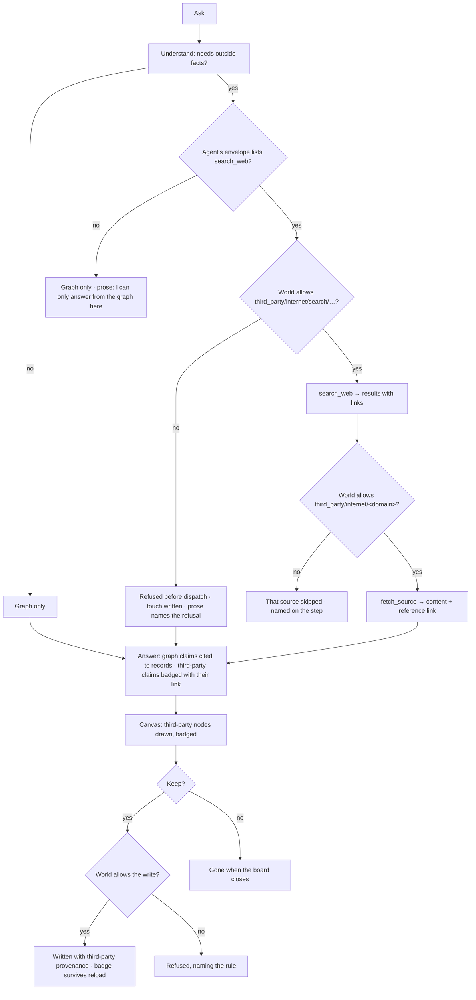

# Beyond the graph

When the world allows it, an agent may reach past the Graph — to the internet, to any other third-party
source the Graph connects, or to what its model already knows. Everything that comes back is
**third-party**: badged wherever it appears, in words or on the canvas, and carrying the reference it
came from. Nothing third-party is ever mistaken for the Graph. The internet is the first third-party
source this feature connects; every source connected after it follows the same contract.

| | |
|---|---|
| Index | [3.13](../../../README.md#3--ask) · Slice **S-TBD** |
| Module | [Ask](../spec.md) |
| API / CLI / Studio | 🔵 / — / 🔵 |
| Related | [the answer, in words](the-answer-in-words.md) · [soul](../../agents/features/soul.md) · [guardrails](../../govern/features/guardrails.md) · [worlds](../../govern/features/worlds.md) · [selection and the panel](../../explore/features/selection-and-the-panel.md) |

> **As** someone asking about my graph, **I want** the agent to fill in what the graph does not hold —
> *why* that runway is so long — from the web or from what it knows, **so that** I get the whole
> picture, while always seeing which part is my data and which part came from somewhere else, and
> where.

## Capabilities

| # | Capability | Notes |
|---|---|---|
| C1 | Search the internet | `search_web` through the Graph's configured search provider |
| C2 | Read a page, document or file | `fetch_source` for a URL the search returned or the ask named |
| C3 | Use the model's own knowledge | A claim the model adds from what it already knows, where the world allows it |
| C4 | Badge everything third-party | `third-party · <source>` — `internet`, `api`, `app`, `db`, `agent`, or `model` — in prose, on the canvas, in the panel |
| C5 | Keep the reference | Every third-party item carries where it came from — for the internet, the link, title, source kind and when it was fetched |
| C6 | Governed per world | Off unless a rule allows it; deny wins at any specificity ([GV5](../../govern/spec.md#4-cross-feature-decisions)) |
| C7 | Draw on the canvas, keep on purpose | A third-party node is drawn on the board only; **Keep** writes it into the Graph, still stamped third-party |
| C8 | Say when it could not look | A refused search is part of the answer, in the agent's voice: *I'm not allowed to look that up here* |

## The sources

| Source | Badge | Reference kept | Governed by |
|---|---|---|---|
| **Internet** | `third-party · internet` | `url` · `title` · `source_kind` (`website · document · file`) · `domain` · `fetched_at` · `run_id` | `third_party/internet/search/<provider>` for the search, `third_party/internet/<domain>` for each fetch |
| **Any other connected source** — `api` · `app` · `db` · `agent` | `third-party · <sublayer>` | the source's locator — endpoint URL, app record link, table, or agent name — · `fetched_at` · `run_id` | `third_party/<sublayer>/<name>`, like every third-party participant ([GV4](../../govern/spec.md#4-cross-feature-decisions)) — each arrives with the feature that connects it |
| **Model** | `third-party · model` | `model` (the `llm/…` address) · `run_id` | the `own_knowledge` option on the matching `llm/…` rule |

## Journey

## Seams

| Seam | What the user sees |
|---|---|
| A provider whose last ping failed | Its row is marked, and a run that reaches it fails the Search step, named, and answers from the graph |
| No search provider configured | *No search provider on this Graph* with the link to configure one; the answer is graph-only |
| The guardrail denies `third_party/**` | Refused before dispatch, the rule named on the step; a world cannot lift it ([GV5](../../govern/spec.md#4-cross-feature-decisions)) |
| A domain denied | That source is skipped and named; the others are used |
| A page that will not load | Named on the step with its URL; not cited |
| `own_knowledge` off | The model states only graph and internet claims; the trace records nothing was asked of it |
| Waiting on a search | The step reads *Searching the web · provider* while graph steps' results already show |
| A link that has since died | The badge keeps the link and the `fetched_at`; the panel says *as fetched on …* |
| A kept third-party node on reload | Still badged — the badge comes from the stored provenance, not the session |
| A member who may not write | **Keep** is shown disabled with the reason |

## Surfaces

| Surface | Shape | Components |
|---|---|---|
| Prose claim | Inline `third-party · <source>` badge with its reference — the link for `internet`, the model for `model` | `ThirdPartyBadge` (new, `ui-extended`) |
| Canvas node | Badge on the node; the reference in its tooltip | `@invana/canvas` node badge |
| Panel › provenance | *Third-party · <source>* → the reference (a link opens in a new tab), title, kind, fetched at, run | `PropertyList` · `ThirdPartyBadge` |
| Keep | On the canvas toolbar for a selection holding third-party nodes, and in the Inspector's footer for one; shown disabled with its reason to a member who may not write | `@invana/canvas-ui` toolbar action · Inspector footer |
| Settings › Search providers | A drawer beside Basic and Graph: one row per provider with its ping state; the detail shows its address and **the rules that name it**; adding one pings it before it saves | the providers pattern ([5.1](../../agents/features/providers-and-models.md)) |
| Guardrails / Worlds | Rules on `third_party/internet/**` and `own_knowledge` on `llm/**` rules | existing rule editor |

## Engine

| Thing | Shape |
|---|---|
| `search_providers` | `graph_id` · `name` · `kind` (`brave · tavily · searxng`) · `base_url?` · `api_key_encrypted?` — addressed `third_party/internet/search/<name>` |
| Entries | `search_web` and `fetch_source`, bound `third_party`; an agent uses them only if its envelope lists them |
| Intent | `Intent.needs_outside: bool` from Understand |
| A third-party claim | `{text, third_party: {source: internet \| api \| app \| db \| agent \| model, reference, title?, source_kind?, domain?, fetched_at?, model?, run_id}}` — `reference` is the link or locator |
| A third-party node | a `Source` drawn with the provenance object and an `ABOUT` edge to its element; not in the graph until kept ([BG10](#decisions)) |
| Kept provenance | `_inv_origin = "third_party"` · `_inv_source` (the sublayer, or `model`) · `_inv_reference` (link or locator) · `_inv_source_title` · `_inv_source_kind` · `_inv_fetched_at` · `_inv_model` · `_inv_run_id` · `_inv_kept_by` · `_inv_kept_at` |
| Govern option | `own_knowledge: bool` on an `llm/…` rule, default `false` |
| Egress | search terms from the ask are `the_question`; terms carrying record values are `property_values` |
| Events | `third_party.fetched` · `third_party.kept` |

## Decisions

| # | Decision |
|---|---|
| BG1 | **Anything not from the Graph is third-party, whatever brought it.** The internet, any other connected third-party source and the model's own knowledge are sources of one kind, and all are badged. A fact's origin is what matters to the reader, not the mechanism that produced it. |
| BG2 | **The badge names the source: `third-party · <sublayer>`, or `third-party · model`.** The sublayer is the one in the address — `internet`, `api`, `app`, `db`, `agent` — so the badge and the rule that allowed it use the same word. One word says *not your data*; the second says where to look to check it. |
| BG3 | **Every third-party item carries its reference.** From the internet: URL, title, source kind (`website · document · file`), domain and `fetched_at`. From any other source: its locator and `fetched_at`. From the model: the model's address and the run. Captured when it arrives and never recomputed. A claim or node without its reference is not shown — an unsourced third-party fact is a hallucination with a badge. |
| BG4 | **Off unless a rule allows it.** `third_party/internet/**` is a third-party participant like any other, and the model's own knowledge is the `own_knowledge` option on an `llm/…` rule, default `false`. Promise #2 — every answer grounded in the Graph — holds for any world that does not opt in. |
| BG5 | **The envelope is how an agent is told it may look.** `search_web` and `fetch_source` are catalogue entries; an agent whose envelope does not list them never plans them, whatever the world allows. The soul and instructions may say *when* to look — never *whether*. |
| BG6 | **A refusal is part of the answer.** A search the lens refuses is refused before dispatch and recorded ([GV29](../../govern/spec.md#4-cross-feature-decisions)); the run goes on from the graph, and the prose says it could not look, in the agent's voice. |
| BG7 | **A third-party node is drawn first and written only on Keep.** The board shows it, badged; **Keep** is a governed write ([GV35](../../govern/spec.md#4-cross-feature-decisions)) that stores the provenance on the element, so the badge survives reload and a query can tell kept third-party data from loaded data. |
| BG8 | **Search providers are configured rows, never a model vendor's built-in search.** The same search works with every model, and the provider is an addressable participant a rule can name. |
| BG9 | **The internet is one third-party source, not a special one.** It sits beside `api · app · db · agent` in the third-party layer ([GV38](../../govern/spec.md#4-cross-feature-decisions)), and any source the Graph connects later reaches a run through the same three things: an address a rule can name, a badge, and a reference. A source that cannot give a reference for what it returns is not connected. |
| BG10 | **A kept third-party node is a `Source`, linked `ABOUT` what it describes.** The node is the page, document, file or record it came from — `Source {reference, title, source, source_kind, fetched_at, excerpt}`, the excerpt being what the source says that the answer used — and an `ABOUT` edge to the graph element the fact concerns. It needs no model change and lands in no authored type, so Keep can never put outside data into a curated model by the back door; a fact that belongs in a model is brought across as a dataset. |
| BG11 | **Outside facts are served by their own plan, `nl-outside`.** When Understand says an ask needs outside facts and the envelope lists `search_web`, Plan picks `nl-outside` — Translate · Validate · Execute · Search · Fetch · Project · Verify · Answer — rather than splicing steps into `nl-single`, so the step list a reader sees says up front that the run looked outside. |
| BG12 | **Search providers live in Settings, not beside the LLMs.** An LLM provider is who an agent thinks with; a search provider is a third party the Graph lets it reach, so it sits with the Graph's own configuration. Its detail lists the rules that name its address, because *is this allowed here?* is the first question about a provider. A provider is pinged before it is saved. |

## Not building

| Not building | Because |
|---|---|
| Crawling or scheduled scraping | a search serves one ask; collecting the web is a dataset, and datasets are [loaded](../../bring-data-in/spec.md) |
| Unbadged third-party facts, anywhere | the badge is the promise |
| Mixing third-party claims into graph citations | a citation resolves to a record; a reference link resolves to a source — two different checks |
| Connecting `api · app · db · agent` sources here | each is its own feature when it is added, and inherits BG1–BG3 and BG9 |
| A model vendor's built-in web search | ties the Graph's search to one vendor, and is not a participant a rule can name ([BG8](#decisions)) |
