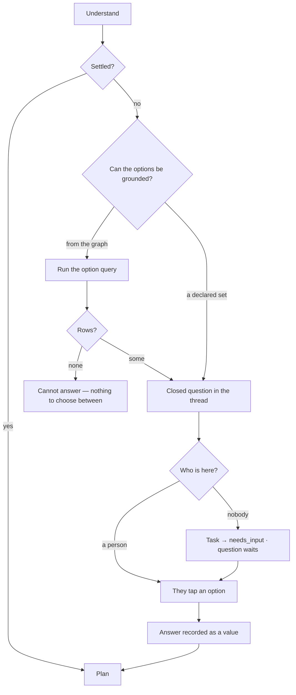

# Clarifying questions

When *Understand* cannot settle what is being asked, it asks back — as a closed question with grounded
options, not a request for another paragraph.

> ⚠ **Rewritten for [orchestration § 0](../../../orchestration.md#0-the-records)** — `Todo` · `TaskPlan` ·
> `Task` · `TaskRun` · `Lens`. The words *Thought*, *Thinking* and *Step-as-a-record* are retired, and
> **`Task` now names a node inside a plan**, never a thing a user authored. Migration:
> [task-model-migration.md](../../../building-engine/task-model-migration.md).

| | |
|---|---|
| Index | [3.6](../../../README.md#3--ask) · Slice **S9c** |
| Module | [Ask](../spec.md) |
| API / CLI / Studio | ✅ / — / ✅ |
| Related | [projections](projections.md) (how it is asked) · [when-it-cannot-answer](when-it-cannot-answer.md) |

> **As** someone who asked something ambiguous, **I want** to be asked a specific question I can
> answer with one tap, **so that** I get the answer I meant rather than a confident answer to a
> different question.

## Capabilities

| # | Capability | Notes |
|---|---|---|
| C1 | Ambiguity produces a question, never an assumption | Guessing is the failure this prevents |
| C2 | The question is closed | Choice, multi-choice or yes/no — rendered by a prompt projection |
| C3 | Options are grounded | A declared list, or the rows of a query — never invented |
| C4 | The answer is a value | Stored as an option id, so it replays and parameterises |
| C5 | A task-triggered run parks | The task goes `needs_input`; nobody has to be watching |
| C6 | Answering resumes the same run | Not a new run — the context is intact |
| C7 | No options means cannot-answer | An empty picker is never shown |

## Journey

## Seams

| Seam | What the user sees |
|---|---|
| Nobody answers | The task sits in `needs_input`; the question stays open, not expired |
| The run is cancelled | The question closes as unanswered and says so |
| Asked on a schedule | Each firing's answer stacks into the timeline; none overwrites another |
| Answered by an agent | Not permitted — a clarification is for a person |
| Ambiguous twice in one run | Allowed; each question is its own step in the trace |

## Surfaces

| Surface | Shape |
|---|---|
| Thread | The question card, then the answered state with who chose and when |
| Task | `needs_input` with the question on the task itself |
| Review | Questions sit first in the queue — they block a run |

## Engine

| Thing | Shape |
|---|---|
| `task_prompts` | `run_id` · `step_seq` · `template_id` · `value` · `answered_by` |
| Parking | the run suspends with its context; answering resumes it |
| Routes | `POST …/task_runs/{id}/answer` |
| Events | `clarification.requested · answered` |

## Decisions

| # | Decision |
|---|---|
| CQ1 | Understand asks back rather than assuming. |
| CQ2 | The question is closed, and its options are grounded. |
| CQ3 | An unanswered question parks the run; it does not fail it. |
| CQ4 | Answering resumes the same run. |
| CQ5 | Only a person answers a clarification. |
| CQ6 | A parked question appears in the thread where it was asked and in Review; answering in either resumes the same run. |
| CQ7 | A parked run reads as waiting, not as failed: the step list stops at `understand`, and nothing below it is drawn. |
| CQ8 | **Understanding is a loop, not one question.** `understand` runs under `loop: {until: understood, max_iterations: n}` — it may ask, be answered, and ask again when the answer opened a new ambiguity. Every round is an **iteration of the same run**, not a new run and not a new Task: the thread reads as one exchange and the trace stays one row with three iterations under it ([orchestration § 6](../../../orchestration.md#6-three-kinds-of-repetition-and-they-nest)). |
| CQ9 | **The loop is bounded by the envelope, and the bound is `max_clarifications`.** Hitting it is not a failure: the run states what it still does not know and answers on the reading it can defend, or parks for a person ([when-it-cannot-answer](when-it-cannot-answer.md)). An unbounded clarifier is a way to spend a person's attention without a ceiling. |
| CQ10 | **Every answer is carried forward.** Round *n* sees rounds 1…*n−1*; the planner never re-asks something already answered, and the answers are on the run, so a rethink starts from them rather than from the original question. |
| CQ11 | **The options are read under the run's lens.** When the model grounds its choices in the graph, the `options_query` it wrote crosses `graph_data` like any other read the run makes — the run's own lens is composed into it and the read is recorded as a touch — so a world that excludes a carrier never offers it as a choice. A refusal, a lens violation or a failed query falls back to the fixed options: the question still stands, its choices are only less grounded. |

## Not building

| Not building | Because |
|---|---|
| Free-text clarification as the default | a closed answer stores a value, prose stores a guess |
| An agent answering on the user's behalf | that is assuming, with extra steps |
| Expiry of unanswered questions | the task shows it is waiting; a silent timeout hides work |
