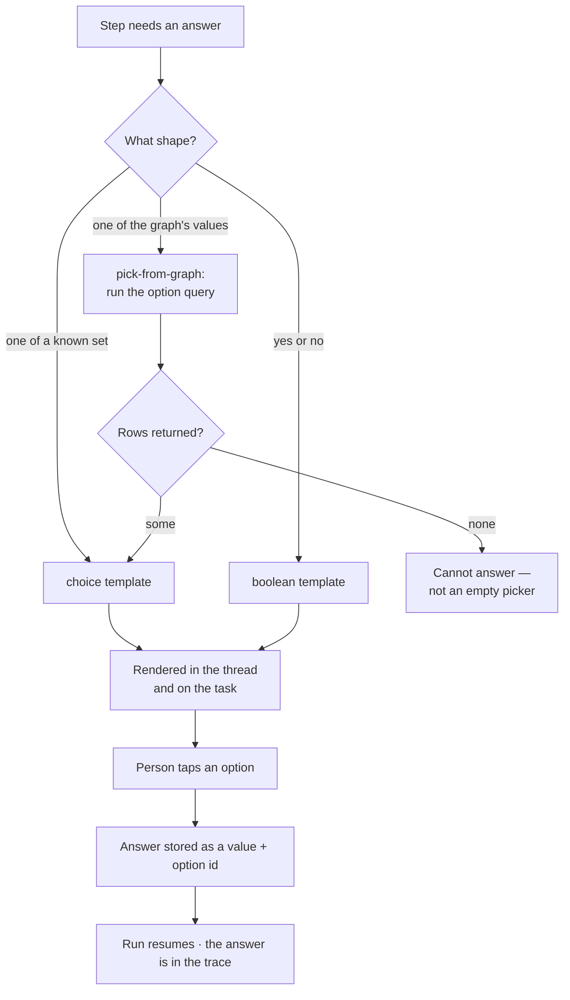
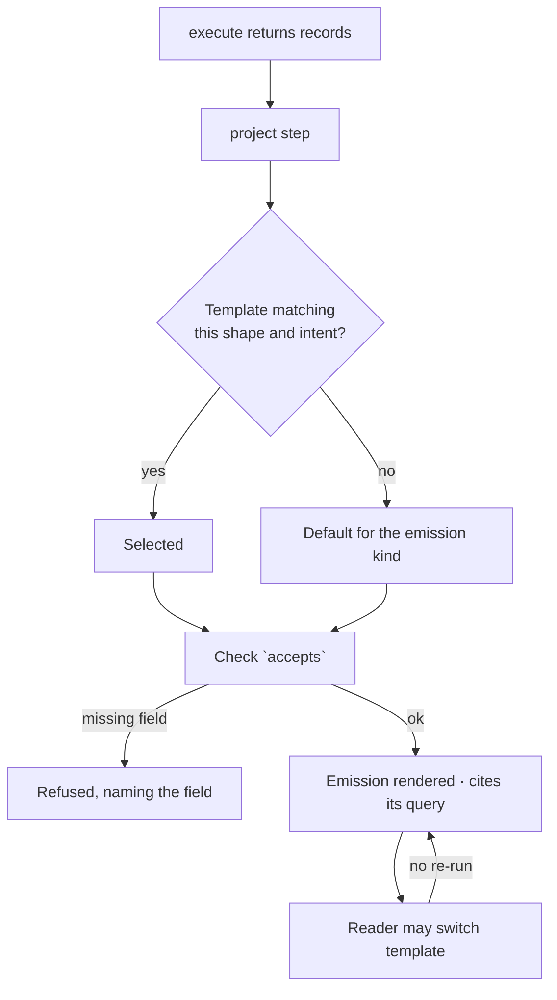
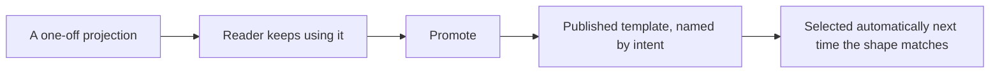

# Projections

A **projection** is a declared mapping from a shape to a surface. It runs in both directions: how a
question is *put to a person*, and how records are *shown to a person*. Both are chosen from
templates, so neither the wording of a choice nor the markup of a table is authored by the model at
run time.

| | |
|---|---|
| Index | [3.4](../../../README.md#3--ask) · Slice **S9b → S9d** |
| Module | [Ask](../spec.md) |
| API / CLI / Studio | ✅ / — / ✅ |
| Related | [the-answer-surface](the-answer-surface.md) (the emission kinds) · [clarifying-questions](clarifying-questions.md) (when a step asks) · [the-library](../../workflows/features/the-library.md) (the same promote-what-served pattern) |

> **As** someone asking a question, **I want** to answer with a tap and read the result in the form
> that suits it, **so that** I am not typing sentences at a machine or squinting at raw rows.

## 1. Two directions

| Direction | Called | Renders as |
|---|---|---|
| A step needs something from a person | **prompt projection** | `choice` (pick one) · `multi-choice` (pick many) · `boolean` (yes / no) · `pick-from-graph` (options are rows) · `value` (one short field) · `confirm` (a stated action) |
| Records need reading by a person | **result projection** | `table` · `metric` · `chart` · `subgraph` · `markdown` · `html` |

Both are the same mechanism: a template declares the shape it accepts and the surface it produces; the
step supplies values.

## 2. Capabilities

| # | Capability | Notes |
|---|---|---|
| C1 | A step can ask a **closed** question | Choice, multi-choice or yes/no — the answer is a value, not a sentence |
| C2 | Options are **grounded** | Either a literal list declared in the template, or the rows of a query. Never invented at run time |
| C3 | An answer is stored structured | The chosen option's id, not its label — so it replays, parameterises and is diffable |
| C4 | Results render through a chosen template | Picked by the emission's shape and the question's intent |
| C5 | The reader can switch template | Table ↔ chart ↔ subgraph on the same emission, **without re-running the query** |
| C6 | An `html` template is sandboxed | No script, no network, no external assets; tokens come only from the emission |
| C7 | Templates are versioned and promotable | A projection that read well is promoted, exactly like a workflow that served |
| C8 | Every projection cites its source | The emission it rendered, and the query and records behind that |
| C9 | Falling back is explicit | No template fits → the default for that emission kind, and the answer says which was used |
| C10 | A projection never adds a fact | It maps fields that exist. A column with no field is an error at save, not a blank at run time |

## 3. A template

| Field | Means |
|---|---|
| `name` · `kind` | `prompt` or `result` |
| `surface` | `choice · multi-choice · boolean · pick-from-graph · value · confirm · table · metric · chart · subgraph · markdown · html` |
| `accepts` | the shape it can render: required fields and their types |
| `spec` | the surface's own definition — columns and formats for a table, axes for a chart, the markup for html, the option source for a choice |
| `intent` | what it is for, so `project` can select it the way `plan` selects a workflow |
| `version` · `status` | `draft · published`; published versions are read-only |

Two rules keep this safe:

| Rule | Why |
|---|---|
| **The template owns the markup; the step supplies values** | A model that can emit arbitrary HTML can emit anything. This is the same reason plans are validated against an envelope. |
| **`accepts` is checked before render** | A template whose required field is missing is refused with the field named, not rendered half-empty. |

## 4. Flows

### F1 — A step asks a closed question

Seams: nobody answers → the task sits in `needs_input`, unchanged · the run is cancelled → the
question closes as unanswered, and says so · the same question re-asked on a schedule → answers stack
into a timeline rather than overwriting.

### F2 — Records become something readable

### F3 — Promote a projection that read well

## 5. Surfaces

| Surface | Shape |
|---|---|
| Ask card in the thread | the question, then options as chips (`choice`), a pair of buttons (`boolean`), or a searchable list (`pick-from-graph`) |
| Answered card | the chosen option, who chose it, when — never re-editable in place; re-asking is a new question |
| Emission header | the template in use, with a switcher listing the others that accept this shape |
| Templates page | list per Graph; `+` in the header; a template's usage shows every emission that used it |

## 6. Engine

| Thing | Shape |
|---|---|
| `projection_templates` | `graph_id` · `name` · `kind` · `surface` · `accepts` jsonb · `spec` jsonb · `intent` · `version` · `status` |
| `task_prompts` | `run_id` · `step_seq` · `template_id` · `answered_by_kind/id` · `value` jsonb · `answered_at` |
| `emissions.template_id` | which template rendered it; null means the kind's default |
| Routes | `…/projection-templates*` · `…/task_runs/{id}/answers` · `…/emissions/{id}/render?template=` |
| Events | `projection_template.*` · `prompt.asked` · `prompt.answered` |

## 7. Decisions

| # | Decision |
|---|---|
| P1 | A projection is a template plus values. The model never authors markup. |
| P2 | Choice options are grounded — a declared list or query rows, never generated. |
| P3 | An answer is stored as a value and an option id, not as prose. |
| P4 | `accepts` is validated before render; a missing field is refused with the field named. |
| P5 | Switching template re-renders from the same records; it never re-runs the query. |
| P6 | `html` renders sandboxed: no script, no network, no external assets. |
| P7 | Templates are promoted from use, the same way workflows are. |
| P8 | A prompt with no available options is a cannot-answer, not an empty control. |
| P9 | The template in use is named on the emission header, and switching it is a control there — not a setting elsewhere. |
| P10 | A template that cannot accept the shape is offered disabled, with the reason it cannot — never hidden. |
| P11 | Five result templates ship with the distribution — `records-table` · `single-value` · `category-bars` · `graph-subgraph` · `nothing-held` — as ordinary rows with no Graph, so a Graph's own template competes with them on the same terms. |
| P12 | Between eligible templates, **intent first, then the most specific shape constraint**. A constraint that narrows the shape (`single_value`, `categorical`, `empty`) outranks one that barely does (`min_rows`), so a one-cell result reads as a number rather than as a one-row table. |

## 8. Deliberately absent

| Not built | Because |
|---|---|
| Free-text prompts as the default ask | closed questions store structured answers; prose is the fallback, not the shape |
| Model-authored HTML or JS | the template owns the markup — the same reason a plan is checked against an envelope |
| Per-answer styling | a template is chosen, not restyled |
| Editing an answer in place | re-asking is a new question, so the trace stays honest |
| Conditional multi-step forms | a wizard is a workflow, not a projection |

## 9. Open

| # | Question |
|---|---|
| Q2 | Does a `pick-from-graph` option list refresh on re-ask, or freeze at first ask? |

Two of these are settled by what shipped. **Q1**: a switch is a write on the emission — it is the
emission's rendering, not a per-viewer preference, so everyone who opens that answer sees the template
the reader chose. **Q3**: templates are Graph-scoped, plus the ones shipped with the distribution;
portability is [1.5](../../connect-and-model/features/share-a-model.md)'s path, and nothing asks for
it here yet.

## Where the code lives

| | |
|---|---|
| Studio | `src/pages/graphs-detail/features/ask/projections/` — `TemplatesDrawer` (the section) over `TemplatesPanel` (the body). **Templates is Library's third drawer, not a `leftNav` item** ([G38](../../../building-studio/graph-detail-page.md)): a template is to an answer what a plan is to a run, so it sits beside `Plans` and `Catalogue`. The drawer owns the header — label, the `11 · 5 result` count, search, the `kind`/`surface` filter and the `+` that authors one; `&template=` drills into one, read end to end, inside the drawer |
| The word | A **template** here is the versioned, person-authored thing this feature describes. Nothing else in Studio may take the name — see [code-shape.md](../../../building-studio/code-shape.md) §4.1b |
