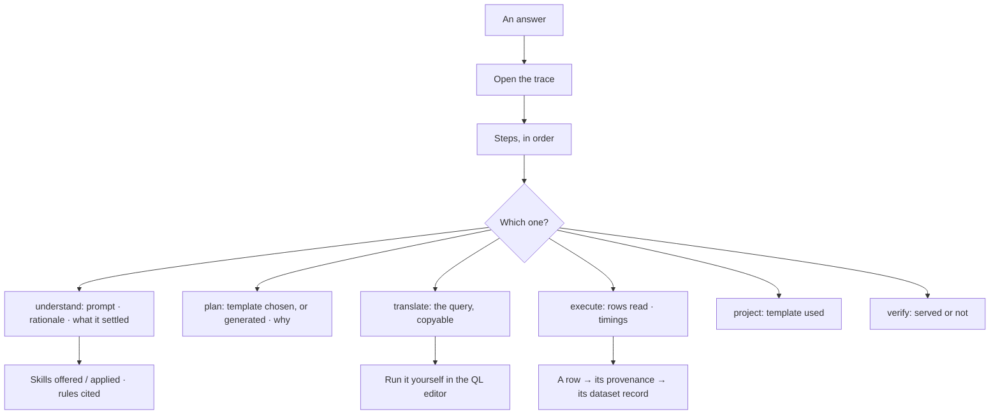

# Reasoning trace

The whole run, after the fact: every step with its prompt, its rationale, the query it generated, the
records it read, what it cost, and which skills and rules it was offered.

> ⚠ **Rewritten for [orchestration § 0](../../../orchestration.md#0-the-records)** — `Todo` · `TaskPlan` ·
> `Task` · `TaskRun` · `Lens`. The words *Thought*, *Thinking* and *Step-as-a-record* are retired, and
> **`Task` now names a node inside a plan**, never a thing a user authored. Migration:
> [task-model-migration.md](../../../building-engine/task-model-migration.md).

| | |
|---|---|
| Index | [3.7](../../../README.md#3--ask) · Slice **S9c** |
| Module | [Ask](../spec.md) |
| API / CLI / Studio | ✅ / — / ✅ |
| Related | [streaming-and-the-workflow](streaming-and-the-workflow.md) (while it runs) · [evidence](../../memory/features/evidence.md) |

> **As** someone deciding whether to act on an answer, **I want** to see how it was reached, **so
> that** I am trusting a chain I can check rather than a tone of voice.

## Capabilities

| # | Capability | Notes |
|---|---|---|
| C1 | Every step, in order | With state, duration, tokens and cost |
| C2 | The prompt and the rationale | What was sent, and what the model said about its choice |
| C3 | The generated query | Exactly as executed, copyable |
| C4 | The records read | Counts, and the rows themselves |
| C5 | Skills offered and reported applied | The gap is visible per step |
| C6 | Rules cited | Which statement the step says it followed |
| C7 | The plan's origin | Selected template and version, or generated |
| C8 | Nested runs | A delegated child's trace nests under the step that spawned it |

## Journey

## Seams

| Seam | What the user sees |
|---|---|
| A repaired step | Both attempts, with the validation error between them |
| A refused plan | The bound that refused it, in place of a dispatch |
| A purged window | The step rows remain with counts; payloads say they were purged |
| A nested delegation | Collapsed by default, expandable, with the child agent named |
| A very long prompt | Truncated with a full view on demand |

## Surfaces

| Surface | Shape |
|---|---|
| Thread | Any step row expands into its trace |
| Task | The same trace, reached from the task that triggered the run |
| Trace panel | Steps stacked; the selected step's detail beside them |

## Engine

| Thing | Shape |
|---|---|
| `task_runs` | prompt, rationale, generated query, counts, timings, tokens, `skills_offered`, `skills_applied`, `rules_cited`, `plan_origin` |
| Nesting | `parent_run_id` for delegated runs |
| Routes | `GET …/task_runs/{id}/trace` |
| Retention | payloads purge with their window; step rows and counts survive |

## Decisions

| # | Decision |
|---|---|
| RT1 | The trace is part of the answer, not an admin view. |
| RT2 | The generated query is shown verbatim and can be re-run by hand. |
| RT3 | Offered and applied are recorded separately, always. |
| RT4 | A delegated run nests under the step that spawned it. |
| RT5 | Purging removes payloads, never the shape of what happened. |
| RT6 | The trace opens from an emission's own citation. "Where did this number come from" is a question about that number, so the answer opens from its header rather than from a menu elsewhere. |
| RT7 | Offered and applied are shown as two counts with what each one means beside it. One number would be a claim we cannot make. |

## Not building

| Not building | Because |
|---|---|
| Editing a trace | it is a record |
| Hiding prompts from members | if you can see the answer you can see how it was reached |
| Model-internal reasoning tokens | we record what the step reported, not what we cannot verify |
