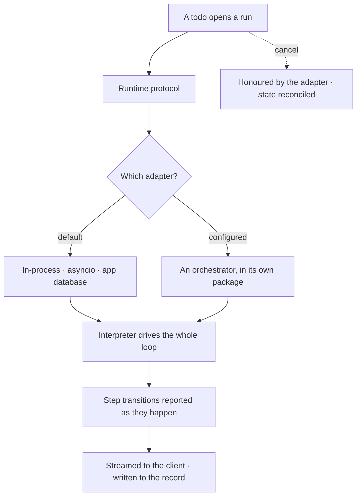

# The runtime

**Invana runs its own work.** One asyncio task per run, in-process, persisting to the app
database — no queue, no broker, no external scheduler. It sits behind a protocol so a deployment could
swap in a scheduler it already operates, but nothing has been written against that protocol yet, and
the in-process runtime is the only one there is.

> ⚠ **Rewritten for [orchestration § 0](../../../orchestration.md#0-the-records)** — `Todo` · `TaskPlan` ·
> `Task` · `TaskRun` · `Lens`. The words *Thought*, *Thinking* and *Step-as-a-record* are retired, and
> **`Task` now names a node inside a plan**, never a thing a user authored. Migration:
> [task-model-migration.md](../../../building-engine/task-model-migration.md).

| | |
|---|---|
| Index | [3.9](../../../README.md#3--ask) · Slice **S9b** |
| Module | [Ask](../spec.md) |
| API / CLI / Studio | ✅ / — / — |
| Related | [streaming-and-the-workflow](streaming-and-the-workflow.md) · [the-connector-contract](../../graph-connectors/features/the-connector-contract.md) |

> **As** someone installing this, **I want** it to run work without standing up a broker or a
> scheduler first, **so that** the first question works the day I install it.

## Capabilities

| # | Capability | Notes |
|---|---|---|
| C1 | A runtime protocol | What a run is, what it reports, how it cancels — owned by Invana |
| C2 | The in-process runtime | One asyncio task per run; persists runs and steps to the app database; zero external dependencies. **This is what ships** |
| C3 | Room for another | The protocol is the seam an external scheduler would implement, as its own package. None exists |
| C4 | One run is one unit of work | The interpreter runs inside it and reports step transitions as it goes |
| C5 | Retries and concurrency are the runtime's | Today that means Invana's own: backoff on a step, and the Graph ceiling for simultaneity |
| C6 | Cancellation is part of the contract | A runtime that cannot cancel is a failed runtime, not a limitation |
| C7 | The protocol is versioned | A runtime states which version it speaks; a mismatch is refused at startup |
| C8 | Swappable in principle | Nothing above the runtime depends on which one is behind the protocol |

## Journey

## Seams

| Seam | What you see |
|---|---|
| No orchestrator installed | The bundled adapter runs everything; nothing is degraded |
| Adapter package missing but configured | Refused at startup, naming the package |
| Protocol version mismatch | Refused at startup, naming both versions |
| A worker dies mid-run | The run is reconciled to a stale state and reported, not left running forever |
| Cancel during a step | The step finishes or aborts per the adapter, and the run is marked cancelled either way |

## Engine

| Thing | Shape |
|---|---|
| Protocol | submit · report · cancel · reconcile, with a stated version |
| The runtime | in-process, asyncio, one task per run, persisting runs and steps to the app database |
| A second runtime | would be its own distribution, declaring the protocol version it speaks. None exists |
| Reconciler | finds runs whose worker vanished and marks them |

## Decisions

| # | Decision |
|---|---|
| RA1 | Invana owns the contract — what runs, what it produces, how it reports. Never scheduling mechanics. |
| RA2 | The in-process runtime is what ships, and it needs no external infrastructure. |
| RA3 | An external scheduler, if one is ever wanted, is a package implementing the protocol — not a rewrite. |
| RA4 | Until then, retries and simultaneity are Invana's own: step backoff, and the Graph ceiling. |
| RA5 | Cancellation is part of the protocol. |
| RA6 | The protocol is versioned and mismatches are refused at startup. |

## Today

There is one runtime and it is Invana's. No broker, no worker pool, no external scheduler, and no
adapter package — the protocol exists as a seam, not as a shipped integration. The honest description
of what this product does today is: **it orchestrates agents, and it runs them itself.**

## Not building

| Not building | Because |
|---|---|
| Queues, brokers, backfills, fair-share | a scheduler's job; if a deployment needs one, it implements the protocol |
| Requiring an orchestrator to start | it would kill "install it and ask a question" |
| Running one run across several adapters | attribution and cancellation both become unanswerable |
