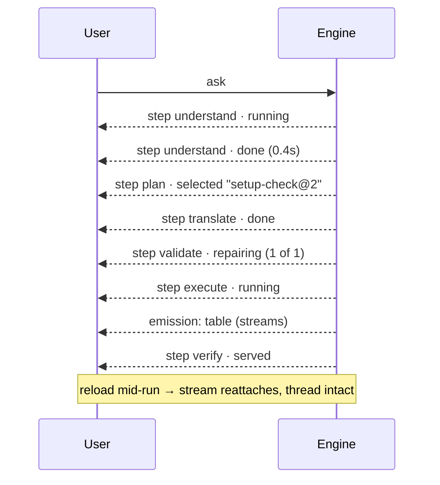

# Streaming and the workflow

The steps are the interface. You watch `understand · plan · translate · validate · execute · project ·
verify` happen, with their emissions appearing as they are produced — never a spinner followed by
everything at once.

> ⚠ **Rewritten for [orchestration § 0](../../../orchestration.md#0-the-records)** — `Todo` · `TaskPlan` ·
> `Task` · `TaskRun` · `Lens`. The words *Thought*, *Thinking* and *Step-as-a-record* are retired, and
> **`Task` now names a node inside a plan**, never a thing a user authored. Migration:
> [task-model-migration.md](../../../building-engine/task-model-migration.md).

| | |
|---|---|
| Index | [3.5](../../../README.md#3--ask) · Slice **S9b → S9d** |
| Module | [Ask](../spec.md) |
| API / CLI / Studio | ✅ / — / ✅ |
| Related | [reasoning-trace](reasoning-trace.md) (after the fact) · [plan-selection](../../workflows/features/plan-selection.md) |

> **As** someone waiting on an answer, **I want** to see what it is doing and stop it if it is going
> the wrong way, **so that** I am not staring at a spinner deciding whether to reload.

## Capabilities

| # | Capability | Notes |
|---|---|---|
| C1 | Steps appear as they start | With their state: running · done · failed · retrying · repairing |
| C2 | Emissions stream into the thread | A table paints while the next step runs |
| C3 | Retries are visible | `retrying 2/3` — never a silent pause |
| C4 | Cancel at any point | Completed steps stay; nothing partial is presented as an answer |
| C5 | Resume after a reload | The stream reattaches; the thread is not lost |
| C6 | The plan is shown once chosen | Which template, or that it was generated |
| C7 | Timings and cost per step | Visible while running, kept afterwards |

## Journey

## Seams

| Seam | What the user sees |
|---|---|
| Connection drops | Reattaches on its own; if it cannot, it says so and offers reload |
| A very slow step | Elapsed time and cancel, not a frozen row |
| Cancelled | The run is marked cancelled at the step it reached |
| Failure mid-stream | The step turns failed and the diagnosis appears in place |
| Two tabs open | Both stream the same run; neither drives it |

## Surfaces

| Surface | Shape |
|---|---|
| Thread | A row per step, expanding to its detail; emissions between them |
| Step row | Name · state · duration · tokens · skills offered / applied |
| Header | Cancel while running; the agent and the plan named |

## Engine

| Thing | Shape |
|---|---|
| Stream | server-sent events per run: step transitions and emissions |
| `task_runs` | one row per step with state, timings, tokens |
| Resume | the stream replays from the last delivered sequence |
| Routes | `GET …/task_runs/{id}/stream` · `POST …/task_runs/{id}/cancel` |

## Decisions

| # | Decision |
|---|---|
| SW1 | Steps stream. Nothing waits for the end of the run to appear. |
| SW2 | A retry is shown, with its attempt number. |
| SW3 | Cancel keeps what completed and presents nothing partial as an answer. |
| SW4 | The stream resumes after a reload from the last sequence delivered. |

## Not building

| Not building | Because |
|---|---|
| Token-by-token text streaming | emissions are structured; a half-rendered table is not useful |
| Pausing and resuming a run | cancel and re-ask is honest; a paused agent holding state is not |
| Editing a step mid-run | the plan is validated before dispatch, deliberately |
