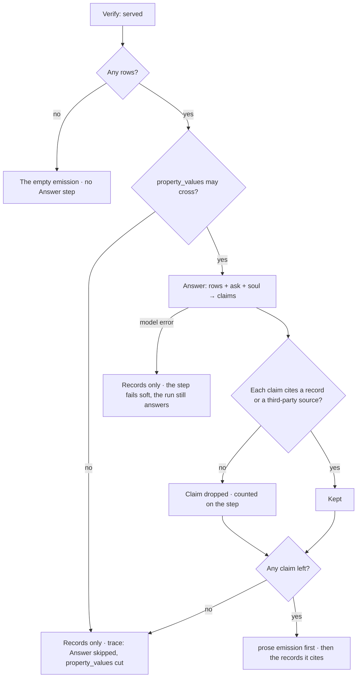

# The answer, in words

After the records are read, the agent says what they mean — a few sentences in its own voice, every
claim cited to the record behind it. The table and the subgraph are still there; the words come first.

| | |
|---|---|
| Index | [3.12](../../../README.md#3--ask) · Slice **S-TBD** |
| Module | [Ask](../spec.md) |
| API / CLI / Studio | 🔵 / — / 🔵 |
| Related | [what an answer is made of](the-answer-surface.md) · [soul](../../agents/features/soul.md) · [beyond the graph](beyond-the-graph.md) · [ask in natural language](ask-in-natural-language.md) |

> **As** someone asking *tell me a fun fact about the longest airport*, **I want** to be told —
> *"Qamdo Bangda in China has the longest runway in your graph: 18,045 ft, at 14,219 ft up"* —
> **so that** I get an answer, not a table I have to read one to.

## Capabilities

| # | Capability | Notes |
|---|---|---|
| C1 | One to three sentences over the rows | Written by the **Answer** step, after Verify, as a `prose` emission ([AS1](the-answer-surface.md#decisions)) |
| C2 | Every claim cites | A sentence cites the records it rests on; a claim with no record is dropped before it ships ([AS4](the-answer-surface.md#decisions)) |
| C3 | In the agent's voice | The soul, or the default voice ([SO3](../../agents/features/soul.md#decisions)) |
| C4 | Words lead, records follow | The prose emission is first in the reading order; the table or subgraph it cites follows |
| C5 | Beyond-the-graph facts are badged | Where the world allows them, a claim from the internet or the model is marked `third-party` with its source ([3.13](beyond-the-graph.md)) |
| C6 | Governed like any model call | The rows are `property_values`; a world that does not send them gets the records without the words, and the trace says why |

## Journey

## Seams

| Seam | What the user sees |
|---|---|
| Waiting | The table paints as soon as Project emits; the prose card streams in above it with *Writing the answer…* |
| Zero rows | The empty emission ([AS7](the-answer-surface.md#decisions)); no prose is attempted |
| `property_values` cut | The records, and on the step: *Answer skipped — this world does not send record values to a model* |
| Every claim dropped as uncited | The records alone; the step says *0 of 3 claims could be cited* |
| Model error or timeout | The records alone; the Answer step is marked failed, the run is still answered |
| Thousands of rows | The step reads the first 50 and says so; the prose states it spoke from a sample |
| Reload | The prose emission is a record ([AS10](the-answer-surface.md#decisions)); nothing re-runs |
| Clicking a citation | Scrolls to and highlights the cited rows in the emission below |

## Surfaces

| Surface | Shape | Components |
|---|---|---|
| Prose emission | `ProseBody`: sentences with inline citation markers, third-party claims badged | `EmissionCard` · `ProseBody` · citation chip · `ThirdPartyBadge` ([3.13](beyond-the-graph.md)) |
| Trace | The Answer step with its exchange ([SR42](../../operate/features/see-what-ran.md#decisions)), claims kept and dropped | `TraceDialog` |

## Engine

| Thing | Shape |
|---|---|
| Entry | `answer_in_words`, bound `llm`, after `verify_result` in every `nl-*` plan |
| Inputs | the ask · the intent summary · up to 50 rows with their record ids · the soul |
| Tool output | `claims: [{text, cites: [record_id…]} \| {text, third_party: {source, reference, …}}]` — the third-party shape is [3.13](beyond-the-graph.md#engine)'s |
| Emission | `prose` · payload `{claims}` · citation = union of cited record ids |
| Egress | `the_question` + `property_values`; without `property_values` the step is skipped, not failed |
| Order | the prose emission's `seq` precedes the emissions it cites |
| Events | `emission.produced` |

## Decisions

| # | Decision |
|---|---|
| AW1 | **The Answer step is how a `prose` emission is made.** It is one more step in every natural-language plan, after Verify, bound `llm`; nothing else writes prose. Adding it is a new version of each seeded `nl-*` plan, and seeding upgrades a Graph that holds the old one — a plan is versioned, so the step reaches existing Graphs as a version, never as an edit in place. |
| AW2 | **A claim ships only with a citation.** Each claim names the records it rests on, or is a third-party claim with its source ([BG3](beyond-the-graph.md#decisions)); any other claim is dropped before the emission is written, and the step counts what it dropped. The model's words are never trusted to be grounded — the structure is. |
| AW3 | **The Answer step fails soft.** It adds words to an answer that already exists; a model error, a timeout, a cut or zero kept claims leaves the records as the answer and marks the step, never the run. The mechanism is `optional` on the plan step: an optional step that fails is recorded failed and the interpreter goes on, which is the only step kind that may. |
| AW4 | **Words lead.** The prose emission is first in the reading order and the records it cites follow, because a person reads the sentence and checks the table, not the other way round. Reading order is `seq`, so Project reserves the first `seq` for the prose it precedes; when no prose is written the gap stays, and a gap orders nothing wrongly. |
| AW5 | **It reads a sample, and says so.** Past 50 rows the step reads the first 50 and the prose states it spoke from a sample; a sentence about *all* the rows from part of them is a claim nobody can check. |

## Not building

| Not building | Because |
|---|---|
| Prose over an answer without records | there is nothing to cite; that is [converse](ask-in-natural-language.md#decisions) or a cannot-answer |
| A second model call to check the prose | the citations are the check, and they are structural |
| Rich formatting from the model | rendering belongs to `ProseBody` ([AS5](the-answer-surface.md#decisions)) |
