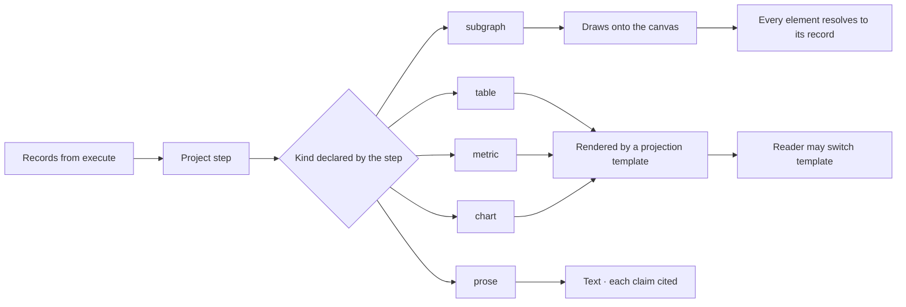

# What an answer is made of

An answer is a sequence of **emissions** — subgraph, table, metric, chart, prose — each of a declared
kind, each citing what produced it. Not a paragraph with numbers in it.

| | |
|---|---|
| Index | [3.3](../../../README.md#3--ask) · Slice **S9b** |
| Module | [Ask](../spec.md) |
| API / CLI / Studio | ✅ / — / ✅ |
| Related | [projections](projections.md) (how each is rendered) · [reasoning-trace](reasoning-trace.md) |

> **As** someone reading an answer, **I want** the shape to match the question — a number when I asked
> for a number, a graph when I asked what connects — **so that** I can see the answer instead of
> parsing it.

## Capabilities

| # | Capability | Notes |
|---|---|---|
| C1 | Five emission kinds | `subgraph · table · metric · chart · prose` |
| C2 | An answer may hold several | Ordered, each standing on its own |
| C3 | Every emission cites | The query and the records behind it, one click away |
| C4 | Kind is declared by the step | Not guessed from the payload at render time |
| C5 | Rendering comes from a template | [Projections](projections.md) chooses; the model never authors markup |
| C6 | Subgraphs draw onto the canvas | They add to what is there rather than replacing it |
| C7 | Empty is a first-class emission | Zero rows renders as "the graph does not hold this", not a blank table |

## The kinds

| Kind | For | Renders as |
|---|---|---|
| `subgraph` | what connects to what | nodes and edges on the data canvas |
| `table` | rows of records | a table, columns from the projection |
| `metric` | one number that answers the question | a stat with its unit and comparison |
| `chart` | a shape over time or across categories | the chart the projection declares |
| `prose` | a statement grounded in the records | text with inline citations |

## Journey

## Seams

| Seam | What the user sees |
|---|---|
| Zero rows | The empty emission, worded as an answer |
| Thousands of rows | Counted, paged, and the cap stated |
| A chart with one point | Falls back to a metric rather than drawing a dot |
| Prose with an uncitable claim | Refused at emission — a claim without a record does not ship |
| Mixed kinds | Ordered as the steps produced them; nothing is merged into a summary |
| A reload | Everything comes back: the ask, its steps and its emissions are all records |

## Surfaces

| Surface | Shape | Studio |
|---|---|---|
| Thread | Emissions in order under the question | `explorer/components/emissions/EmissionList` |
| Emission | One card: the header over a body chosen by kind | `EmissionCard` |
| Emission header | The kind, the template in use, and the citation | `EmissionCard` — 24px, `kind · template@version · cite · N records` |
| Bodies | One per kind, plus the empty one | `TableBody · MetricBody · ChartBody · SubgraphBody · ProseBody · EmptyBody` |
| Canvas | Where subgraph emissions land | the subgraph body offers it; the canvas owns the paint |

The engine produces the emissions; Studio reads them. `GET …/task_runs/{id}/emissions` returns them in
order with their citation and the templates that would render the same records. The derived path
survives as the fallback for a reply with no run (AS12) — it names no template, because none
chose the rendering.

## Engine

| Thing | Shape |
|---|---|
| `emissions` | `run_id` · `seq` · `kind` · payload · `template_id?` · citation |
| Citation | query id plus record ids, resolvable to provenance |
| Routes | `GET …/task_runs/{id}/emissions` |
| Events | `emission.produced` |

## Decisions

| # | Decision |
|---|---|
| AS1 | An answer is a sequence of typed emissions, not a text blob. |
| AS2 | The producing step declares the kind. |
| AS3 | Every emission cites its query and records. |
| AS4 | Prose may state only what a record supports. |
| AS5 | A subgraph adds to the canvas; it never replaces it. |
| AS6 | Every emission carries a header: its kind, the template rendering it, and the link to its citation. |
| AS7 | An empty emission is a sentence in the reading order — "the graph does not hold this" — never an empty table or a zeroed chart. |
| AS8 | Every kind renders inside the emission card. A kind is a body within the card, never a block beside it. |
| AS9 | The header names a template only when one chose the rendering. It is never filled with a default so the row looks complete. |
| AS10 | An emission is a record, not page state. The `project` step writes it, and an answer survives a reload. |
| AS11 | The chosen template's **surface** is the emission's kind. Switching template re-renders the same records and the kind follows — which is how one result can be read as a table and then as a chart without either being a lie about what the step produced. |
| AS12 | A reply whose run was never recorded — an older row, or one whose run was pruned — still renders, by folding one emission out of the query result it carries. It names no template, because none chose the rendering (AS9). |
| AS13 | **A reload renders the record; nothing re-runs on load.** Opening a session, switching a tab and refreshing the page all read what is stored — the reply's emissions and the board's snapshot — and ask the graph nothing. Freshness is a user action (AS14), never a side effect of arriving on a page: a query that re-runs itself spends against the graph on every refresh and can quietly answer differently from the answer on screen, with nothing saying so. |
| AS14 | **A re-run is a new run, and it leaves the prior record intact.** Re-running writes a new run with its own emissions rather than reopening the reply's — so a re-run that fails shows a failure *next to* the answer it was re-checking, instead of erasing it. The emission header carries when its records were read and the re-run that reads them again. |

> ⚠ **AS14 is half-built.** A re-run today writes a new run but re-points the
> reply at it, so the prior emissions are orphaned and a failed re-run leaves the
> reply looking empty. Making a re-run additive — and putting *as of* and the
> re-run affordance on the emission header — is the remaining work.

## Not building

| Not building | Because |
|---|---|
| A summary paragraph over the emissions | it would restate without citing, which is the failure mode we are avoiding |
| Freeform markup from the model | rendering belongs to a template |
| Cross-answer aggregation | comparing runs is what a schedule's timeline is for |

## Where the code lives

| | |
|---|---|
| Studio | `src/pages/graphs-detail/features/ask/answer-surface/` — `EmissionCard` · `EmissionBodies` · `emissions.ts` · `ResultBlock` · `ResultsTable` |
| Rendering inside a reply | `NotAnAnswer` ([when-it-cannot-answer](when-it-cannot-answer.md)) and `TraceDialog` ([reasoning-trace](reasoning-trace.md)) sit here too — they are how a reply reads, not surfaces of their own |
| Not | `templates/`. **Template** is [projections](projections.md)' word for a versioned, person-authored projection template; these render an emission, they are not templates |
