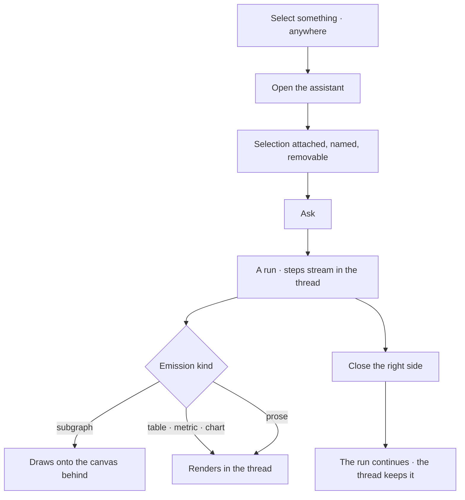

# The assistant

One assistant, reachable from every surface, taking the right side of the page with the current
selection already in hand. Not a page you navigate to and re-explain yourself on.

| | |
|---|---|
| Index | [3.10](../../../README.md#3--ask) · Slice **S12** |
| Module | [Ask](../spec.md) |
| API / CLI / Studio | ✅ / — / ✅ |
| Related | [ask-in-natural-language](ask-in-natural-language.md) · [the-answer-surface](the-answer-surface.md) · [selection-and-the-panel](../../explore/features/selection-and-the-panel.md) |

> **As** someone looking at something, **I want** to ask about *this*, **so that** I do not describe
> what is already on my screen.

## Capabilities

| # | Capability | Notes |
|---|---|---|
| C1 | One assistant, everywhere | Explorer, Model, Projects, Tasks, Agents, Workflows — the same surface on every left panel |
| C2 | Opens with the selection attached | Named, and removable before asking |
| C3 | Knows which panel is open | The active left panel is the context: a canvas, a model, a task, an agent |
| C4 | Its answers land where you are | A subgraph draws onto the open canvas, not into the thread |
| C5 | Threaded | A session per subject; reopening resumes it |
| C6 | Asks through an agent | The Graph's default unless the surface names another |
| C7 | Closing does not cancel | A run continues and can be watched from the thread |

## Journey

## Seams

| Seam | What the user sees |
|---|---|
| Nothing selected | It opens plain; the question stands on its own |
| Selection removed by the user | Asked without it, and the thread records that |
| Opened on a task | The task is the subject; answers attach to it |
| No canvas behind it | Subgraph emissions offer to open one |
| Reopened later | The thread as it was, with the run's outcome |

## Surfaces

| Surface | Shape |
|---|---|
| Region | `rightSection` with `?right=assistant`; the page stays visible and usable beside it |
| Header | `Ask Assistant` on the list; `Ask Assistant › <session title>` inside a thread, the first crumb being the way back (AD14) |
| Attachment chip | What is attached, with a remove — **in the composer**, directly above the input (AD10) |
| Thread | Question · steps · emissions, exactly as the main ask surface |

## Engine

| Thing | Shape |
|---|---|
| Sessions | one per subject; it resumes rather than starting fresh |
| Attachment | the selection passed as context on the todo |
| Routes | the ordinary ask routes; the assistant is a surface, not an API |

## Decisions

| # | Decision |
|---|---|
| AD1 | One assistant surface for the whole product. |
| AD12 | **It is a graph-page feature, not an Explore one.** It belongs to [Ask](../spec.md), the module that owns asking — its composer, emissions and trace already live there. Explore's stake is only *where* it sits (the right side, [E7](../../explore/spec.md)) and *what* it inherits (the canvas selection). Filing it under Explore made the one surface look like one panel's affordance, and put its code in `features/explore/`. |
| AD14 | **The panel is called `Ask Assistant`.** The header named the contents — `Sessions` — which stopped being true when it moved: the region holds the assistant, and sessions are what the assistant holds. `Ask` qualifies it because it is [Ask](../spec.md)'s surface, and because "Assistant" alone is the product-wide noun for the thing rather than the name of this panel. Inside it everything is still **sessions**: the list, `Search sessions`, `Refresh sessions`. |
| AD13 | **The active left panel is the context.** Asking from Model asks about the model, from Tasks about the task, from Agents about the agent — the assistant does not change, what it carries does. This is C3 read as a rule: the panel supplies the subject the way the canvas supplies the selection. |
| AD2 | It opens with the selection attached, and the attachment is visible and removable. |
| AD3 | Answers land where the user is working, not only in the thread. |
| AD4 | Closing it never cancels a run. |
| AD5 | It uses the ordinary ask runtime — no second path. |
| AD6 | It is the Sessions panel, moved, and renamed **`AssistantPanel`** for the occupant it is rather than the contents it holds. Nothing inside it is redesigned: it already switches between the list and the open thread, and its composer already names the bound agent. **What is inside stays sessions** — a session belongs to the graph, not to the assistant, so `Session*` components and `useSessions` keep their names. |
| AD7 | It is the `assistant` value of `?right=`, independent of the left panel's `?panel=`, so opening it costs nothing else on screen. The region is the param and the occupant is the value ([graph-detail-page.md](../../../building-studio/graph-detail-page.md) G16); `?ai=` is read as a legacy alias and never written. |
| AD8 | The attachment goes into the ask **in words**. What the thread records is what was asked — a hidden context field would make the transcript a partial account. |
| AD9 | Sessions has no left-rail entry. The right side is where it lives, the header's Assistant control is the one door, and a stale `?panel=sessions` link opens the assistant instead. A panel on the right whose collapse control folded the left column was the proof it was still keyed to the wrong side. |
| AD10 | **The attachment chip belongs to the composer, not to a wrapper around the panel.** AD2 says it rides above the composer; a shell that renders it above the *whole panel* pins it to the top of the region, a list's length away from the ask it qualifies. `SessionComposer` owns it, and the assistant has no shell component of its own — the occupant of `rightSection` is `AssistantPanel` itself. |
| AD11 | **The right side has no memory.** Opening the assistant replaces the inspector and closing it closes the region, rather than restoring what was there before. Restoring needs a second piece of state to hold the previous occupant, which is what one param per region exists to remove. |

## Not building

| Not building | Because |
|---|---|
| A separate chat page | one surface, or people learn two |
| The assistant writing to the graph | it asks; writes have their own paths |
| Per-surface assistants with their own memory | one assistant, one thread per subject |
| The open thread in the URL | `?right=` names the region's occupant; which session is open is panel state. A per-thread link is its own feature, not a value of a region param |

## The word

It is **not a drawer**. A drawer overlays what is behind it; this is `rightSection` — docked,
resizable, and it moves the canvas over rather than covering it. `terminology.md` bans the word for
exactly that reason: it names neither the place (`rightSection`) nor the thing (the Assistant). The
file was `explore/features/the-assistant-drawer.md`; the decisions keep their `AD` prefix, which
now reads *assistant decision*.

## Where the code lives

| | |
|---|---|
| Studio | `src/pages/graphs-detail/features/ask/assistant/` — `AssistantPanel` and its `Session*` parts |
| The region | `src/pages/graphs-detail/shell/useRightSection.ts` — who holds `rightSection`, which is the shell's question, not the assistant's |
| Siblings | `features/ask/answer-surface/` (what a reply renders) and `features/ask/projections/` (the Templates panel). One module, one sub-folder per feature |
| Not | `features/explore/` — it was there, and that was the filing mistake AD12 names |
