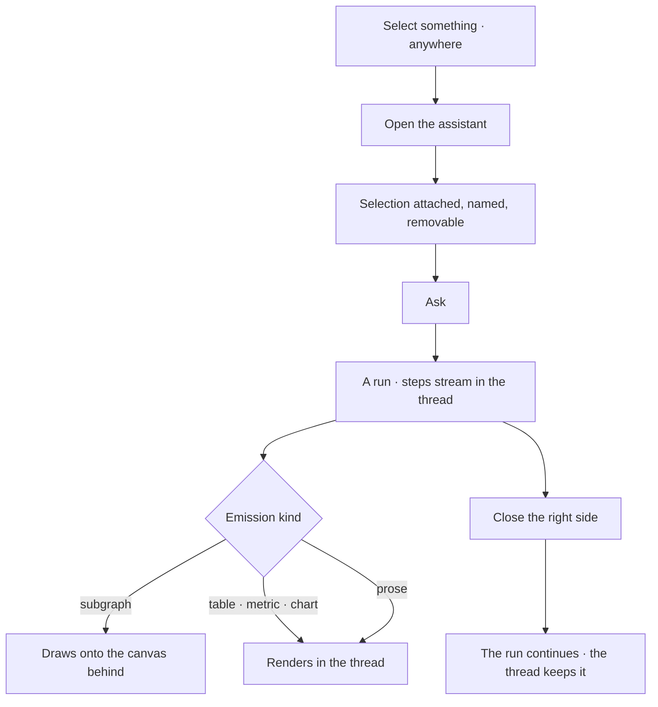
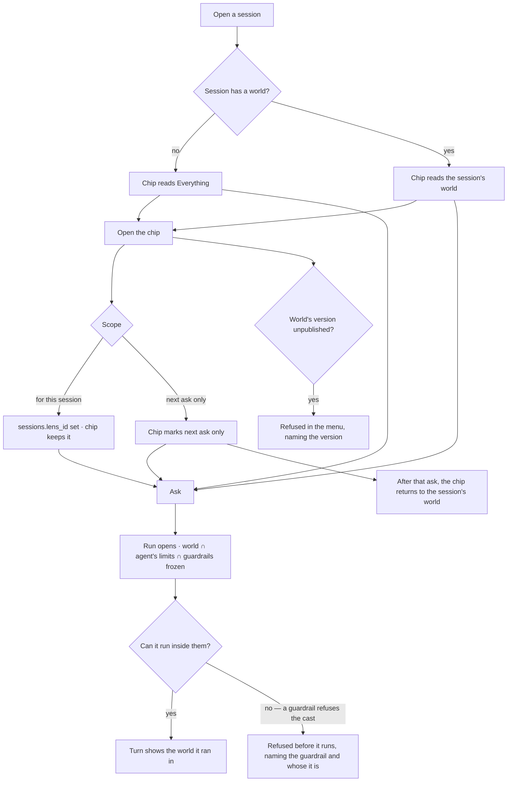

# The assistant

One assistant, reachable from every surface, taking the right side of the page with the current
selection already in hand. Not a page you navigate to and re-explain yourself on.

| | |
|---|---|
| Index | [3.10](../../../README.md#3--ask) · Slice **S12** |
| Module | [Ask](../spec.md) |
| API / CLI / Studio | ✅ / — / ✅ |
| Related | [ask-in-natural-language](ask-in-natural-language.md) · [the-answer-surface](the-answer-surface.md) · [selection-and-the-panel](../../explore/features/selection-and-the-panel.md) |

> **As** someone looking at something, **I want** to ask about *this*, **so that** I do not describe
> what is already on my screen.

## Capabilities

| # | Capability | Notes |
|---|---|---|
| C1 | One assistant, everywhere | Explorer, Model, Projects, Tasks, Agents, Workflows — the same surface on every left panel |
| C2 | Opens with the selection attached | Named, and removable before asking |
| C3 | Knows which panel is open | The active left panel is the context: a canvas, a model, a task, an agent |
| C4 | Its answers land where you are | A subgraph draws onto the open canvas, not into the thread |
| C5 | Threaded | A session per subject; reopening resumes it |
| C6 | Asks through an agent | The Graph's default unless the surface names another |
| C7 | Closing does not cancel | A run continues and can be watched from the thread |
| C8 | **The session remembers its world** | The world chip in the composer, beside the ask kind, reads the open session's world; picking one sets it for every ask in the thread, or for the next ask only ([AS5](../spec.md#7b-a-session-executes-through-plans-always)) |
| C9 | **Each turn says what it ran in** | A turn shows the world it was frozen with, so a thread that moved between worlds reads honestly |
| C10 | **A spend per run for the thread** | In the session's settings, opened from the thread header; capped by the agent's own `max_cost_usd_run` |

## Journey

```mermaid
flowchart TD
    A[Select something · anywhere] --> B[Open the assistant]
    B --> C[Selection attached, named, removable]
    C --> D[Ask]
    D --> E[A run · steps stream in the thread]
    E --> F{Emission kind}
    F -->|subgraph| G[Draws onto the canvas behind]
    F -->|table · metric · chart| H[Renders in the thread]
    F -->|prose| H
    E --> I[Close the right side]
    I --> J[The run continues · the thread keeps it]
```

### The session's world

```mermaid
flowchart TD
    O[Open a session] --> R{Session has a world?}
    R -->|no| E[Chip reads Everything]
    R -->|yes| W[Chip reads the session's world]
    E --> P[Open the chip]
    W --> P
    P --> S{Scope}
    S -->|for this session| SS[sessions.lens_id set · chip keeps it]
    S -->|next ask only| NA[Chip marks next ask only]
    SS --> A[Ask]
    NA --> A
    W --> A
    E --> A
    A --> F[Run opens · world ∩ agent's limits ∩ guardrails frozen]
    F --> T{Can it run inside them?}
    T -->|yes| TT[Turn shows the world it ran in]
    T -->|no — a guardrail refuses the cast| RF[Refused before it runs, naming the guardrail and whose it is]
    NA --> BK[After that ask, the chip returns to the session's world]
    P --> V{World's version unpublished?}
    V -->|yes| X[Refused in the menu, naming the version]
```

## Seams

| Seam | What the user sees |
|---|---|
| Nothing selected | It opens plain; the question stands on its own |
| Selection removed by the user | Asked without it, and the thread records that |
| Opened on a task | The task is the subject; answers attach to it |
| No canvas behind it | Subgraph emissions offer to open one |
| Reopened later | The thread as it was, with the run's outcome |
| Switching to another session | The chip follows: it reads that session's world |
| A new session | Starts in *Everything*, never inheriting the last thread's world |
| Next ask only | The chip is marked for the one ask; after it runs, it returns to the session's world |
| The agent's guardrail forbids what the world casts | Refused before the run opens, naming the guardrail and that it is the agent's ([AG6](../../agents/features/author-an-agent.md#decisions)) |
| The session's world is deleted | The chip reads *Everything* and says the world is gone; earlier turns keep the name they ran in |
| Spend per run above the agent's | Clamped to the agent's, and the settings say so |

## Surfaces

| Surface | Shape |
|---|---|
| Region | `rightSection` with `?right=assistant`; the page stays visible and usable beside it |
| Header | `Ask Assistant` on the list; `Ask Assistant › <session title>` inside a thread, the first crumb being the way back (AD14) |
| Attachment chip | What is attached, with a remove — **in the composer**, directly above the input (AD10) |
| Thread | Question · steps · emissions, exactly as the main ask surface; each turn carries a small world tag |
| World picker | In the composer, between the ask kind and the agent ([WO5](../../govern/features/worlds.md#decisions)) — an inline **`RichSelect`** like every other composer control ([AD18](#decisions)). Opens upward: *Ask in* · Everything and each world with its description, a stale one disabled with its reason · ☐ *Next ask only* · *Manage worlds…* |
| Session settings | A popover from the thread header's settings button: the spend per run, with the agent's cap beside it | `Popover` · `Field` |

## Engine

| Thing | Shape |
|---|---|
| Sessions | one per subject; it resumes rather than starting fresh · `lens_id?` and `max_cost_usd_run?` are its defaults ([AS5](../spec.md#7b-a-session-executes-through-plans-always)) |
| Attachment | the selection passed as context on the todo |
| Routes | the ordinary ask routes; the assistant is a surface, not an API |

## Decisions

| # | Decision |
|---|---|
| AD1 | One assistant surface for the whole product. |
| AD12 | **It is a graph-page feature, not an Explore one.** It belongs to [Ask](../spec.md), the module that owns asking — its composer, emissions and trace already live there. Explore's stake is only *where* it sits (the right side, [E7](../../explore/spec.md)) and *what* it inherits (the canvas selection). Filing it under Explore made the one surface look like one panel's affordance, and put its code in `features/explore/`. |
| AD14 | **The panel is called `Ask Assistant`.** The header named the contents — `Sessions` — which stopped being true when it moved: the region holds the assistant, and sessions are what the assistant holds. `Ask` qualifies it because it is [Ask](../spec.md)'s surface, and because "Assistant" alone is the product-wide noun for the thing rather than the name of this panel. Inside it everything is still **sessions**: the list, `Search sessions`, `Refresh sessions`. |
| AD13 | **The active left panel is the context.** Asking from Model asks about the model, from Tasks about the task, from Agents about the agent — the assistant does not change, what it carries does. This is C3 read as a rule: the panel supplies the subject the way the canvas supplies the selection. |
| AD2 | It opens with the selection attached, and the attachment is visible and removable. |
| AD3 | Answers land where the user is working, not only in the thread. |
| AD4 | Closing it never cancels a run. |
| AD5 | It uses the ordinary ask runtime — no second path. |
| AD6 | It is the Sessions panel, moved, and renamed **`AssistantViewPanel`** for the occupant it is rather than the contents it holds. Nothing inside it is redesigned: it already switches between the list and the open thread, and its composer already names the bound agent. **What is inside stays sessions** — a session belongs to the graph, not to the assistant, so `Session*` components and `useSessions` keep their names. |
| AD7 | It is the `assistant` value of `?right=`, independent of the left panel's `?panel=`, so opening it costs nothing else on screen. The region is the param and the occupant is the value ([graph-detail-page.md](../../../building-studio/graph-detail-page.md) G16); `?ai=` is read as a legacy alias and never written. |
| AD8 | The attachment goes into the ask **in words**. What the thread records is what was asked — a hidden context field would make the transcript a partial account. |
| AD9 | Sessions has no left-rail entry. The right side is where it lives, the header's Assistant control is the one door, and a stale `?panel=sessions` link opens the assistant instead. A panel on the right whose collapse control folded the left column was the proof it was still keyed to the wrong side. |
| AD10 | **The attachment chip belongs to the composer, not to a wrapper around the panel.** AD2 says it rides above the composer; a shell that renders it above the *whole panel* pins it to the top of the region, a list's length away from the ask it qualifies. `SessionComposer` owns it, and the assistant has no shell component of its own — the occupant of `rightSection` is `AssistantViewPanel` itself. |
| AD11 | **The right side has no memory.** Opening the assistant replaces the inspector and closing it closes the region, rather than restoring what was there before. Restoring needs a second piece of state to hold the previous occupant, which is what one param per region exists to remove. |
| AD15 | **The world chip sits in the composer, between the ask kind and the agent.** The world belongs to the session, so it is set where that session asks; the header belongs to the page, and a chip there would show a world nothing is asking in whenever the assistant is closed or on another thread. The agent stays last — it is who answers; the world is where it looks. |
| AD16 | **Next ask only is a checkbox in the world picker, not a second chip.** One control sets the world; the checkbox scopes it to one ask and the trigger carries a *next ask only* tag until that ask is sent. Two chips would make *which one applies* a question the reader has to answer. |
| AD17 | **A turn is tagged with the world it ran in**, read from `task_runs.lens_id`. A thread may move between worlds, and a reader scrolling back must not assume the chip's current value applied to every answer above it. |
| AD18 | **Every composer control is one component: `RichSelect`, inline.** Ask kind, query language, world and timeout share one trigger and one menu — a radio group of items with an optional description and disabled reason, then optional checkbox and action items. It is the kit's `RichSelect` with `appearance="inline"` — already a `DropdownMenu`, extended with toggles and actions rather than duplicated — not `Select`, because the world menu carries a checkbox and an action, which a form control cannot hold. A number input belongs in no dropdown, so the spend per run lives in the session's settings. |
| AD19 | **An ask that omits `lens_id` runs in the session's world; one that sends `null` runs in *Everything* for that ask only.** Set-ness, not None-ness, on `SendMessage` and on `PATCH …/sessions/{id}` alike: null is a world somebody chose, and *Next ask only* has to be able to choose it. |
| AD20 | **`sessions.lens_id` has no foreign key.** A deleted world leaves its id behind, so the summary answers `lens_missing` and the chip says the world is gone, while the next ask runs in *Everything*. A `SET NULL` would make *deleted* and *never picked* look alike. A turn's world name is read from its run's frozen contributors, so it survives the delete too. |
| AD21 | **The spend per run is clamped on write and frozen on the run.** `PATCH` stores `min(asked, agent's max_cost_usd_run)`; `open_turn` freezes the same `min` into `task_runs.params.max_cost_usd_run`. The summary carries `agent_max_cost_usd_run` so the settings popover can say the value was clamped. |

## Not building

| Not building | Because |
|---|---|
| A separate chat page | one surface, or people learn two |
| The assistant writing to the graph | it asks; writes have their own paths |
| Per-surface assistants with their own memory | one assistant, one thread per subject |
| The open thread in the URL | `?right=` names the region's occupant; which session is open is panel state. A per-thread link is its own feature, not a value of a region param |

## The word

It is **not a drawer**. A drawer overlays what is behind it; this is `rightSection` — docked,
resizable, and it moves the canvas over rather than covering it. `terminology.md` bans the word for
exactly that reason: it names neither the place (`rightSection`) nor the thing (the Assistant). The
file was `explore/features/the-assistant-drawer.md`; the decisions keep their `AD` prefix, which
now reads *assistant decision*.

## Where the code lives

| | |
|---|---|
| Studio | `src/pages/graphs-detail/features/ask/assistant/` — `AssistantViewPanel` and its `Session*` parts |
| The region | `src/pages/graphs-detail/shell/useRightSection.ts` — who holds `rightSection`, which is the shell's question, not the assistant's |
| Siblings | `features/ask/answer-surface/` (what a reply renders) and `features/ask/projections/` (the Templates panel). One module, one sub-folder per feature |
| Not | `features/explore/` — it was there, and that was the filing mistake AD12 names |
