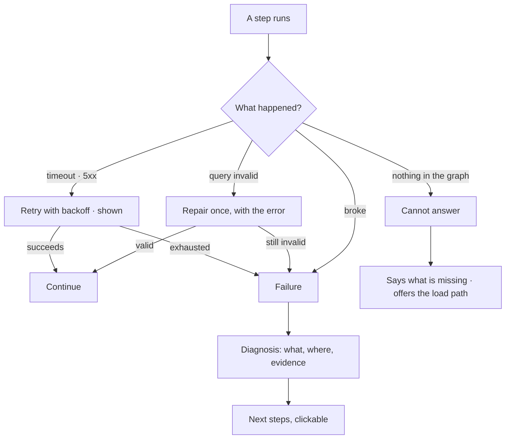

# When it cannot answer

Four outcomes that are not an answer, and they are not the same thing: a **retry**, a **repair**, a
**cannot-answer**, and a **failure with a diagnosis**. Each looks different, on purpose.

| | |
|---|---|
| Index | [3.8](../../../README.md#3--ask) · Slice **S9b → S9f** |
| Module | [Ask](../spec.md) |
| API / CLI / Studio | ✅ / — / ✅ |
| Related | [streaming-and-the-workflow](streaming-and-the-workflow.md) · [reasoning-trace](reasoning-trace.md) |

> **As** someone who asked and did not get an answer, **I want** to know which kind of nothing this
> is, **so that** I either wait, rephrase, load data, or fix something.

## The four

| Outcome | Means | What the user does |
|---|---|---|
| **Retry** | transient — the database or provider did not respond | nothing; it is already retrying, visibly |
| **Repair** | the generated query did not validate | nothing; it goes back once with the error |
| **Cannot answer** | the graph does not hold what was asked | load data, or ask something the graph can answer |
| **Failure** | something broke, and it is named | follow the diagnosis' next step |

## Capabilities

| # | Capability | Notes |
|---|---|---|
| C1 | Retries use backoff with jitter | Shown as `retrying 2/3`, never a silent pause |
| C2 | A repair happens **once** | The invalid query goes back with the validation error; a second failure stops |
| C3 | Cannot-answer is not answer-shaped | Different surface, so it is never mistaken for a result |
| C4 | Cannot-answer says what is missing | Which type, which model, or that nothing is loaded |
| C5 | A diagnosis is built from evidence | The error, the step, the query — never an invented cause |
| C6 | A diagnosis offers next steps | Clickable: open the trace, check the connection, load a dataset |
| C7 | Each outcome is recorded distinctly | So evidence can count them separately |

## Journey

## Seams

| Seam | What the user sees |
|---|---|
| Zero rows from a valid query | Cannot-answer, worded as an answer to the question asked |
| Provider rate limit | Retry, then a failure naming the provider and the limit |
| Model has the type, graph has no data | Cannot-answer that distinguishes the two: modelled but empty |
| Repeated failures across runs | The diagnosis is the same; evidence counts it, and a proposal may follow |

## Surfaces

| Surface | Shape |
|---|---|
| Thread | The outcome in place of an answer, styled unlike one |
| Step row | Retrying and repairing shown on the step, not as a banner |
| Diagnosis card | What happened · the evidence · next steps |

## Engine

| Thing | Shape |
|---|---|
| Retry policy | attempts, backoff, jitter, per step kind |
| Repair | one attempt, carrying the validation error into the prompt |
| Outcome kinds | recorded on the run: `answered · cannot_answer · failed · cancelled` |
| Diagnosis | assembled from the step, the error and the query; never generated free-form |

## Decisions

| # | Decision |
|---|---|
| CA1 | Cannot-answer, failure, retry and repair are four distinct outcomes, and never share a surface. |
| CA2 | A query is repaired once. |
| CA3 | Cannot-answer names what is missing. |
| CA4 | A diagnosis is built from evidence and offers next steps. |
| CA5 | Nothing partial is presented as an answer. |
| CA6 | A diagnosis is drawn unlike an answer — no emission header, no citation strip — and carries its next step as its only action. |
| CA7 | Retry and repair are shown where they happened, on the step, and never as a message in the thread. |
| CA8 | The run records `outcome` — `answered · cannot_answer · failed · cancelled` — beside its `status`. A run that finished cleanly having found nothing is *succeeded* and *cannot_answer*, and those are not the same claim. |
| CA9 | A cannot-answer is drawn calmly: dashed border, no colour of alarm. A diagnosis is drawn as a fault, with its evidence foldable underneath. Their shapes differ before a word is read. |

## Not building

| Not building | Because |
|---|---|
| Endless repair loops | two invalid attempts means the intent is wrong, not the syntax |
| A generic "something went wrong" | it teaches nothing and hides the evidence |
| Falling back to the model's own knowledge | that is the failure this product exists to avoid |
