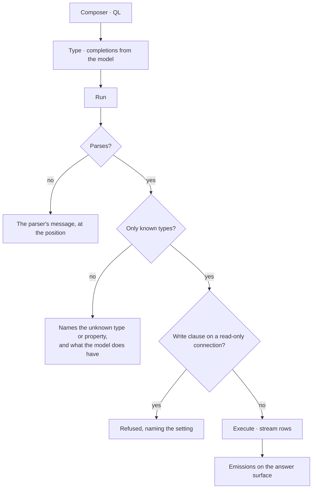

# Write queries

Cypher or Gremlin, written directly, with the Graph's model in scope. The path for people who already
know what they want to ask.

| | |
|---|---|
| Index | [3.1](../../../README.md#3--ask) · Slice **S9a** |
| Module | [Ask](../spec.md) |
| API / CLI / Studio | ✅ / — / ✅ |
| Related | [ask-in-natural-language](ask-in-natural-language.md) · [the-answer-surface](the-answer-surface.md) |

> **As** someone fluent in the query language, **I want** to write it myself with the schema at hand,
> **so that** I am not negotiating with a translator for a query I could type.

## Capabilities

| # | Capability | Notes |
|---|---|---|
| C1 | An editor per query language | The one the connector speaks; no dialect switching mid-Graph |
| C2 | The model is in scope | Types, edge types and property keys complete as you type |
| C3 | Validation before execution | Parses, and only names things the model has |
| C4 | Results land on the answer surface | Same emissions as any other ask — table, subgraph, metric |
| C5 | A query is a Todo | It runs as a run, so it traces, streams and cancels like the rest |
| C6 | Read-only is enforced | A write clause against a read-only connection is refused before dispatch |
| C7 | History is the session | Past queries and their results stay in the thread |

## Journey

## Seams

| Seam | What the user sees |
|---|---|
| Zero rows | "The graph does not hold this" — an answer, not an error |
| A very large result | Counted first, streamed, and capped with the cap stated |
| Slow query | Elapsed time while it runs, and cancel |
| Model changed since the query was written | Validation names what no longer exists |

## Surfaces

| Surface | Shape |
|---|---|
| Composer | Editor with the ask-kind toggle set to QL |
| Thread | The query, then its emissions, in order |
| Schema panel | What is available to name, beside the editor |

## Engine

| Thing | Shape |
|---|---|
| Validation | parse plus model check, before dispatch |
| Execution | connector-native, streamed, cancellable |
| Routes | `POST …/query/validate` · `POST …/query/execute` |
| Events | `query.executed` with timings and row counts |

## Decisions

| # | Decision |
|---|---|
| WQ1 | A hand-written query is a Todo and uses the same runtime as an asked one. |
| WQ2 | Validation runs before execution and names what is wrong in the model's terms. |
| WQ3 | Read-only connections refuse write clauses before dispatch. |
| WQ4 | Results render through the same answer surface as any other ask. |

## Not building

| Not building | Because |
|---|---|
| A saved-query library | a session keeps them, and a schedule makes one recurring |
| Query formatting or linting beyond validation | the editor is for asking, not for authoring code |
| Cross-language translation | the connector speaks one language; so does the editor |
