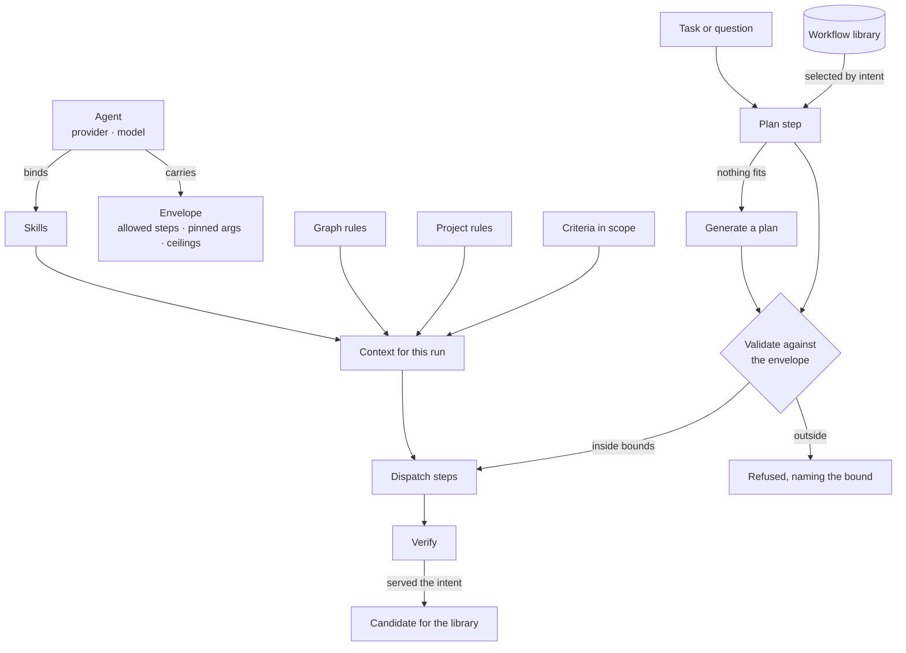

# Ask — module spec

A question becomes a run, the run becomes steps, and the steps produce things a person can read.
Everything here is grounded: an answer states only what the graph holds, and says so when it holds
nothing.

> ⚠ **Rewritten for [orchestration § 0](../../orchestration.md#0-the-records)** — `Todo` · `TaskPlan` ·
> `Task` · `TaskRun` · `Lens`. The words *Thought*, *Thinking* and *Step-as-a-record* are retired, and
> **`Task` now names a node inside a plan**, never a thing a user authored. Migration:
> [task-model-migration.md](../../building-engine/task-model-migration.md).

| | |
|---|---|
| Index | [§3 · Ask](../../README.md#3--ask) |
| Features | [write-queries](features/write-queries.md) · [ask-in-natural-language](features/ask-in-natural-language.md) · [the-answer-surface](features/the-answer-surface.md) · [projections](features/projections.md) · [streaming-and-the-workflow](features/streaming-and-the-workflow.md) · [clarifying-questions](features/clarifying-questions.md) · [reasoning-trace](features/reasoning-trace.md) · [when-it-cannot-answer](features/when-it-cannot-answer.md) · [the-assistant](features/the-assistant.md) · [runtime-and-adapters](features/runtime-and-adapters.md) |
| Depends on | [Agents](../agents/spec.md) (a run is executed through an agent) · Connect and model (the global model is the grounding context) |
| Depended on by | [Work](../work/spec.md) (a task runs as a run) · Explore · Operate |
| Owns the surface | [the-assistant](features/the-assistant.md) — the one place a question is asked, on every left panel of the graph page. It is Ask's surface, not Explore's |

## 1. Vocabulary

Product-wide words: [terminology.md](../../terminology.md). What this module adds:

| Noun | Is | Is not |
|---|---|---|
| **Ask-kind** | how the question was posed: `NL` or `QL` | a mode the user configures per session |
| **Emission** | one thing a step produced, of a declared kind | the answer |
| **Projection** | the declared mapping from a shape to a surface — in either direction | styling |

## 2. The pipeline

```
understand → plan → translate → validate → execute → project → verify
```

| Step | Does | Can end the run |
|---|---|---|
| `understand` | settles what is being asked; asks back when it cannot | yes — cannot answer |
| `plan` | selects a template by intent, or generates a plan inside the envelope | yes — refused by the envelope |
| `translate` | intent → query, against the global model | |
| `validate` | the query parses and only names things the model has | yes — repair once, then stop |
| `execute` | runs it on the graph database | yes — failure with a diagnosis |
| `project` | records → emissions, through a projection | |
| `verify` | did this serve the intent? | records the verdict |

Every step streams: the user sees the step, its state and its emissions as they arrive, never a spinner
followed by everything at once.

## 3. How a run assembles

Three separately authored things meet here for the first time: the **agent** that runs, the **skills
and rules** it is offered, and the **workflow** it plans from.



**The agent decides what is possible, the library decides what is tried, the rules and skills decide
what it knows, and the envelope is checked before anything runs.**

## 4. Grounding rules

| Rule | Detail |
|---|---|
| An answer states only what the records hold | No summarising beyond them, no filling gaps from the model's own knowledge |
| Empty is an answer | Zero rows is "the graph does not hold this", not a guess |
| Every emission cites its source | The query that produced it, and the records behind it |
| Cannot-answer is not answer-shaped | It looks different, so it is never mistaken for a result |
| A failure is not a cannot-answer | One is "something broke", the other is "the graph does not know" |

## 5. What this module owns

| Owns | Shape |
|---|---|
| `todos` | `kind (nl\|ql\|import\|stitch\|enrich)` — `nl` and `ql` are both *ask* to a reader · the intent · who asked · on behalf of whom |
| `task_runs` | one run of a todo · `triggered_by (user\|task\|schedule\|delegation)` · `parent_run_id?` · `task_id?` · agent · plan · status · outcome |
| `task_runs` | step key · state · timings · tokens · skills offered / reported · rules cited |
| `emissions` | `run_id` · `seq` · `kind` · payload · `template_id?` · source citation |
| `projection_templates` · `task_prompts` | [projections](features/projections.md) |

Ask owns these tables; it does not own the journal over them. Every run in the Graph is listed by **Runs** ([10.5](../operate/features/see-what-ran.md)), and Imports is that journal filtered to `kind in (import, bulk)`.

## 6. The runtime shape

| Rule | Detail |
|---|---|
| One run is one flow | The interpreter runs inside it and drives the whole loop, reporting step transitions as it goes |
| Not one dispatch per step | Driving task-by-task from the engine would multiply latency by the step count and put loop state on the wire |
| Step granularity is reported, not orchestrated | The worker says what happened; the orchestrator sees one unit of work |
| Composition stays in data | A plan is data validated against an envelope, never a hand-authored graph of jobs |
| Connections are long-lived | The connection manager is a stateful service, not a per-call open |
| The runtime is Invana's | It runs the work in process, one asyncio task per run, and is swappable in principle rather than swapped in practice |

**No external infrastructure, at all.** The in-process runtime is what ships and the only one that
exists. The protocol around it is the seam where a deployment could put a scheduler it already
operates — that has not been written, and nothing waits on it.

| Rule | Detail |
|---|---|
| Invana owns the contract, not the scheduling | What a run is, what it produces, and how it reports — never retries, queues or backfills |
| One runtime exists | In-process, persisting to the app database; zero external dependencies |
| Another would be a package | It would bring its own retries and concurrency; today those are Invana's |
| Cancellation is defined by the contract | An adapter must honour it; a run that cannot be cancelled is a failed adapter, not a feature |
| The protocol is versioned | An adapter states which version it speaks |

Every step receives one context, and what goes where is fixed:

| Kind of argument | Where it goes |
|---|---|
| Genuine inputs — a query, a prompt, a page size | the step's typed input |
| Ambient dependencies — database, connector, model, provider | `resources` |
| Identity of the work — run, todo, graph, actor | `task_run` |
| Anything a person should see | `emit` |


## 7. Cross-feature decisions

| # | Decision |
|---|---|
| K1 | One question opens exactly one root run. A session is a thread of them, not a run. |
| K2 | The agent carries provider and model; the composer offers only the ask-kind toggle. |
| K3 | Steps stream. Nothing waits for the end of the run to appear. |
| K4 | Validation failure is repaired **once**, with the error, then reported. |
| K5 | A structured question gets a structured answer — a value, not prose ([projections](features/projections.md)). |
| K6 | An emission's rendering is chosen by a projection template, never authored by the model. |
| K7 | The four reader-facing states — the answer surface, the projection switch, the clarification, the diagnosis — are drawn before they are built. They are the one place Studio leads the engine, because [13.1](../platform/features/design-system.md) blocks on the components they name. |
| K8 | An emission header — kind · template · citation — is the same component wherever an emission appears: the thread, a task result, a scheduled answer. |
| K9 | A stream frame is not an emission. The stream carries **todo frames** — `step.*`, `diagnosis`, an emission arriving; an **emission** is the produced answer part a reader sees. Both sides of the wire use the two words that way. |

## 7a. The drawn states

Hi-fi, at 1440×900, on the **Hi-fi · finance** page of the *Agents at Work Wireframes* canvas —
`claude.ai/code/artifact/58f2e380-ef59-41cd-8c96-d3dc7ddd06e4`.

| Artboard | Feature | Shows |
|---|---|---|
| Explorer · one answer, five kinds | [the-answer-surface](features/the-answer-surface.md) | `metric · table · chart · subgraph · prose` in one answer, each with its header; the empty emission; the subgraph landing on the canvas |
| Explorer · the same records, another projection | [projections](features/projections.md) | the template picker on the emission header; incompatible templates refused with the reason |
| Explorer · Understand asks back | [clarifying-questions](features/clarifying-questions.md) | the closed question in the thread, the parked run, the same run resuming |
| Four ways a run ends · states sheet | [when-it-cannot-answer](features/when-it-cannot-answer.md) | retry · repair · cannot-answer · diagnosis, four surfaces that never share a shape |

### 7b. A session executes through plans, always

| # | Decision |
|---|---|
| AS1 | **Nothing in a chat reaches a provider, a database or the graph except through a TaskPlan.** A message that asks for something opens a TaskRun; the session records the thread ([orchestration § 4.2](../../orchestration.md#42-a-session-is-not-a-task)). There is no chat-only execution path, which is what makes an answer auditable and an envelope enforceable ([§ 4.1a](../../orchestration.md#41a-nothing-executes-outside-the-runtime)). |
| AS2 | **Selection order is: a matched reusable plan · an expert plan authored for chat · a generated plan.** All three are `TaskPlan` rows; `plan_origin` says which served. An expert plan is an ordinary authored plan with an `intent` that matches ([7.2](../workflows/features/plan-selection.md) · [7.7](../workflows/features/draft-a-plan.md)) — writing one is how a badly-answered question gets answered well, permanently. |
| AS3 | **Understanding is a bounded loop** ([clarifying-questions](features/clarifying-questions.md) CQ8–CQ10): several rounds of clarification are iterations of one run, and the thread shows one exchange. |
| AS4 | **The session is not the unit of governance; the run is.** Budget, lens, envelope and approval all attach to the run — so two asks in one thread can be grounded differently and billed separately, and neither inherits the other's spend. |

## 8. Deliberately absent

| Not built | Because |
|---|---|
| Free-form model-authored markup | rendering is a template's job; the model supplies values |
| Answers that mix graph facts with model knowledge | the whole claim is that answers are grounded |
| A second run UI for imports | an import run is a run and uses this one |
| Multi-turn memory inside a run | context is assembled per run, from rules, skills and the graph |
