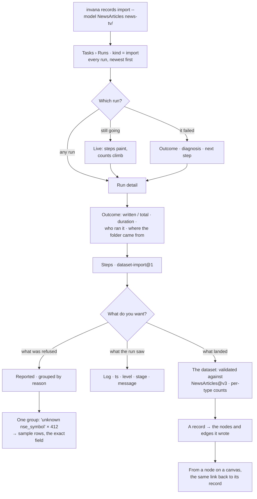

# Inspect what landed

Every load leaves a run, a report and provenance. Studio reads all three, so "where did this number
come from" ends at a record and not at a shrug.

> ⚠ **Rewritten for [orchestration § 0](../../../orchestration.md#0-the-records)** — `Todo` · `TaskPlan` ·
> `Task` · `TaskRun` · `Lens`. The words *Thought*, *Thinking* and *Step-as-a-record* are retired, and
> **`Task` now names a node inside a plan**, never a thing a user authored. Migration:
> [task-model-migration.md](../../../building-engine/task-model-migration.md).

| | |
|---|---|
| Index | [2.2](../../../README.md#2--bring-data-in) · Slice **S6** |
| Module | [Bring data in](../spec.md) |
| API / CLI / Studio | ✅ / — / ✅ |
| Related | [load-data](load-data.md) · [reasoning-trace](../../ask/features/reasoning-trace.md) · [see-what-ran](../../operate/features/see-what-ran.md) |

> **As** someone who just imported, **I want** to see what was accepted, what was rejected and why,
> **so that** I fix the extractor rather than guessing at the graph.

## Capabilities

| # | Capability | Notes |
|---|---|---|
| C1 | The journal — every run, newest first | Across every dataset in the Graph, not one dataset at a time |
| C2 | The validation report | Every rejected record with its field and its reason |
| C3 | Accepted records | Browsable, with what each one wrote |
| C4 | Provenance both ways | From a node to its record, and from a record to what it created |
| C5 | Rejections grouped by reason | So one bad column is one line, not four thousand |
| C6 | The run's trace | Same step view as any run |
| C7 | Read-only | Nothing here writes to the graph |
| C8 | The run's log | `ts · level · stage · message`, filterable by level |
| C9 | Who ran it | The principal, and the invocation the run came from |
| C10 | What landed, from the run | The model version and per-type counts, reached from the run that wrote them |
| C11b | Imports is the [Runs](../../operate/features/see-what-ran.md) journal with `kind in (import, bulk)` preselected | The import columns and the report and provenance blocks are what this filter adds; the row, the step view and the chain are the journal's |
| C11 | Bulk loads, marked as such | `invana loader --graph …` lands in the journal as `bulk` — counts, log, no report, no provenance |

## Journey

## Seams

| Seam | What the user sees |
|---|---|
| No runs yet | What an import is, and the command to run one — the journal is empty because nothing has been loaded, not because something is broken |
| A run in flight | Its row is live: steps paint and counts climb from the run's own events |
| A very large report | Grouped by reason with counts; samples on demand |
| A very long log | Level filter and the tail first; the run's outcome never scrolls away |
| Records purged by retention | The run stays with its counts; the rows say they were purged |
| A failed run | Its diagnosis and next step, in the same place as its counts |
| A bulk load | The row says `bulk load`, and where the steps would be it says what the fast path did not do. Run without `--graph`, the command prints that the load was not journaled |

## Surfaces

| Surface | Shape |
|---|---|
| **Imports** — a filter, not a panel | [Runs](../../operate/features/see-what-ran.md) (the **Tasks** stack's first drawer) with `kind in (import, bulk)` preselected. **No `leftNav` item of its own** ([SR7](../../operate/features/see-what-ran.md) · [G30](../../../building-studio/graph-detail-page.md)): one row per run — status, dataset, `model@v3`, `written / total`, duration, when. Filters: status · dataset · model · time. Status bar: run count, reported count, *import is CLI and API* |
| Run detail | Five blocks, in the order the audit reads: **Outcome** · **Steps** (`dataset-import@1`; for a `bulk` run, what the fast path did not do) · **Reported** · **Log** · **What landed**. Actions: `Open trace · Open dataset`. No cancel: this surface never writes (IW3), and a run is stopped where it was started |
| Dataset detail | Reached from a run's *What landed* — *Validated against*, per-type counts, provenance. Not a list of its own |
| Node inspector | `news-tv · nodes/Article.json · record #12,377 · run 9c1e` — dataset, file, record, run, in that order |

## Engine

| Thing | Shape |
|---|---|
| `todos` · `task_runs` · `task_runs` | the run, filtered to `kind in (import, bulk)`; read-only here |
| `validation_reports` | written by the load; read-only here |
| `run_logs` | the structured lines the load wrote; read back per run, level-filtered server-side ([13.8 §17](../../platform/features/runtime.md)) |
| Principal and invocation | recorded on the run — who ran it, and the command it came from |
| Provenance lookups | node → record, record → written elements |
| Routes | `GET …/imports` — an alias of `GET …/task_runs?kind=import` (graph-wide, newest first, filterable) · `GET …/imports/{id}` · `GET …/imports/{id}/report` · `GET …/records/{id}/wrote` |

## Decisions

| # | Decision |
|---|---|
| IW1 | Every written element resolves to the record that created it. The Inspector reads the stamps off the element it already has — `_inv_model_id` · `_inv_record_id` · `_inv_file` · `_inv_run_id` — so the block needs no request. **The model is what a record belongs to** ([BD16](../spec.md)); there is no second record between a model and its data, so the line names the model, the file and the record, and the run beneath it. An element with no stamps was written by `invana loader`, which validates nothing and stamps nothing, and the block says so rather than showing an empty table. |
| IW2 | Rejections group by reason; the count is the headline, the rows are the detail. |
| IW3 | This surface never writes. |
| IW4 | A purged window keeps its run and counts, and says the rows are gone. |
| IW5 | A dataset states the model **and version** it was validated against, next to what landed. A count with no version behind it is a number nobody can check. |
| IW6 | The run's trace is the step card an answer uses. There is no second run UI. |
| IW7 | Studio's surface is the **Tasks** stack's `Runs` drawer with `kind in (import, bulk)` preselected — the Graph's one journal ([10.5](../../operate/features/see-what-ran.md)), across every dataset, newest first. One implementation, one filter, **and no icon of its own**: *Imports* is the name of a filter, reached from the kind chip, from a Todo, or from a saved filter. A dataset is reached from the run that wrote it; it is not a list of its own. What a person wants after a load is what happened, in time order. |
| IW8 | The word on every surface is **run**. Not "job", not "ingestion": `terminology.md` retires the first, and the second claims a pull Invana does not do. **The engine has no `import_jobs` table to except from the rule** — a load is a run like any other ([spec BD12](../spec.md)), so the word is the same from the screen down to the row. |
| IW9 | A run shows its log. The steps say what the run did; the log says what it saw, and an audit journal needs both. |
| IW10 | A run names its principal and its invocation. A journal that cannot say who ran what is a status page. |
| IW11 | `invana loader --graph <ref>` opens a run of kind `bulk` — `bulk-load@1`, one step, `bulk_write` — with counts, a trace and who ran it, and no claim of an audit: nothing it wrote was validated and nothing carries provenance. A load that wrote fifty thousand nodes is not invisible to the person who has to account for them; what it cannot do is pretend it was checked. Describing the database on the command line instead keeps the direct path and is not journaled — replaying such a run would need credentials, and credentials never ride a run's `params` ([LD10](load-data.md)). The command says so where it can still be acted on. |
| IW13 | Imports adds columns and two blocks to the journal — `written / total`, the dataset, `model@v3`, **Reported** and **What landed**. It does not add a second journal, a second row component or a second step view. |
| IW12 | The journal pages by keyset, not offset. Runs arrive while a person is reading, and an offset would show them a row twice or skip one. |

## Not building

| Not building | Because |
|---|---|
| Editing records in Studio | data is imported, not typed |
| Re-running a rejected subset from the UI | the extractor owns retries; the CLI re-imports |
| A data browser over the whole graph | that is the Explorer's job |
| A journal across Graphs | everything is Graph-scoped; a cross-Graph audit is a different product |
| Log search across every run | the journal filters runs; a run's log is read inside that run |
